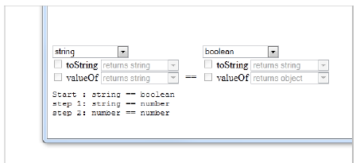

The Basics
-----------
### Objectives

This chapter provides the basics that make up the JavaScript language. The Variables and
Types topic explains the dynamic nature of JavaScript variables, how to determine the
variable type and basic operations with Numbers, Strings and Boolean variables. The
Operators topic starts with basic arithmetic and then explores how conversion between
types can lead to unexpected results. See the Comparisons topic to learn about
"truthiness" and the sometimes unexpected rules of type coercion. Use the information on
comparisons to branch and loop in the Control Structures topic.

### Variables and Types

Variables are declared in JavaScript using the var keyword. There is nothing in the
declaration that tells JavaScript what type the variable is. Type is inferred automatically
based on the data assigned to the variable. JavaScript base types are number, string,
boolean, function, object, null or undefined.

```javascript
var pizza = "deep dish";
var count = 2;
var isEnoughPizza = false;
```

It's best practice to combine all your variable declarations under a single var at the top of
your code (more on why in the Scope topic).

```javascript
var pizza, count, isEnoughPizza;
pizza = "deep dish";
count = 2;
isEnoughPizza = false;
```

Each of these primitive types has a corresponding "wrapper" object, complete with it's
own methods and properties. Wrapper objects are created automatically by JavaScript
when methods are called.

```javascript
var messyString, cleanString;
messyString = " thiS iS a meSsy sTring ";
cleanString = messyString.trim().toLowerCase().replace("messy", "clean");
console.log(cleanString); // "this is a clean string"
```

JavaScript includes the global property undefined and the null object. 'undefined'
indicates that a variable hasn't been assigned and 'null' tells us that a variable is
assigned but empty.


### Determining Variable Type

To find a variable's type at runtime, pass the variable to the typeof operator. typeof will
return one of the following: "string", "number", "boolean", "object", "undefined" or "null".
That's all you get from typeof. If you need to know about an object, use the instanceof
operator to compare to a particular type. Any object, including the built-in Array, Date,
Error and RegExp all return true when using instanceof against Object. Take a careful
look through the variable declarations, assignments and output in the example below.

```javascript
var pizza = "deep dish",
count = 2,
isEnoughPizza = false,
expirationDate = new Date(),
sizes = ["Medium", "Large", "Family"],
Order = {
type: "Combination",
side: "House Salad",
drink: "Coke"
};
console.log(typeof (pizza) === "string"); // true
console.log(typeof (count) === "number"); // true
console.log(typeof (isEnoughPizza) === "boolean"); // true
console.log(typeof (expirationDate) === "object"); // true
console.log(expirationDate instanceof Object); // true
console.log(expirationDate instanceof Date); // true
console.log(sizes instanceof Array); // true
console.log(Order instanceof Object); // true
```

### Numbers

There is a single, one-size-fits-all, numeric type in JavaScript. Numbers can be notated to
fit your needs, that is, a number can be assigned an integer value, a floating point number,
hexadecimal and scientific notation.

```javascript
var myInt = 123;
var myFloating = 123.456;
var myHex = 0x123456;
var myScientific = 123e4;
console.log(myInt); // outputs 123
console.log(myFloating); // outputs 123.456
console.log(myHex); // outputs 1193046
console.log(myScientific); // 1230000
```

JavaScript rounding and numeric calculations are subject to error because numbers are
stored as IEEE-754 Double, floating point numbers. Numbers stored this way are not
always exact. For example, 0.1 or 1/10 when converted to binary results in a repeating
sequence of digits. This may not be apparent until you use the number in a calculation. The
snippet below adds .1 to .2 and doesn't end up as .3.

```javascript
var unexpectedResult = 0.1 + 0.2;
console.log(unexpectedResult); // 0.30000000000000004
```

You can use the built-in Math object's round() method to minimize some of these errors.
You can bump the size of the number up, round the number and then scale it back down.

```javascript
var myNum = Math.round((0.1 + 0.2) * 100) / 100;
console.log(myNum); // .3
```

### Not a Number and Infinity

JavaScript also includes special-purpose, global numeric properties:
NaN is a global property that indicates "Not A Number". You might expect to see this
value returned if a Math function fails. You can use the global isNaN() method to test
for this condition -- don't try to use an equality operator.

```javascript
console.log(isNaN(123)); // false
console.log(isNaN(NaN)); // true
// don't use equality operators
console.log(NaN === NaN); // false
```

Infinity is a number that is greater than all other numbers. You can use the isFinite()
method to check for infinity.

```javascript
console.log(Infinity > 123456); // true
```

### Strings

Strings are series of characters placed between matching double or single quotes. There's
no specific 'Character' type, other than a string that contains a single element. String
literals are declared by surrounding characters with single or double quotes.

```javascript
var version = '1.2.1.34';
```

Use the concatenation operator "+" to glue string fragments together:

```javascript
var major = '1',
minor = '2',
revision = '1',
build = '34',
version;
version = major + '.' + minor + '.' + revision + '.' + build;
console.log(version); // outputs 1.2.1.34
```

### Booleans

A variable becomes a boolean type when assigned true or false. The example below works
as you might expect, where the "loggedIn" variable is a boolean type and evaluates to
true.

```javascript
var loggedIn, authenticated, hasPermissions;
authenticated = true;
hasPermissions = true;
loggedIn = authenticated && hasPermissions;
console.log(typeof(loggedIn)); // outputs "boolean"
if (loggedIn){
console.log("Logged in...");
}
```

For now, you can safely assign true or false values directly to the variable, but be
aware that automatic coercion between types can output some dicey results if you're
not aware of the rules. The example below assigns the string "false". Used in an "if"
statement, the string variable is true if it contains any characters and false if it does
not. Please see the Comparisons topic for a thorough discussion of these issues.

```javascript
var loggedIn;
loggedIn = "false";
console.log(typeof(loggedIn)); // outputs "string"
if (loggedIn){
console.log("Logged in..."); // still runs this code
}
loggedIn = "";
if (loggedIn){
console.log("blank loggedIn"); // never runs this
}
```

## Operators

### Arithmetic

While the arithmetic operations are conceptually easy to understand, conversion between
types and the meaning of the operators can lead to unexpected results. For example, an
expression 1 + 1 + 1 may return 3, 21, 73 or 111 depending on relatively small differences.

### Addition

The "+" operator performs addition unless strings are involved, in which case "+" becomes
the concatenation operator (concatenation joins strings together). Once a string is
encountered, all operands from then on are treated as strings. Look at the first example
below where the first operand before the operator is "1". The remaining operands are
treated as strings. The second example performs addition on 1+2+4=7, encounters the "3"
and concatenates to return "73". If you have numeric data stored in string form, use
parseInt(value) or parseFloat(value) to force conversion to the Number type.

```javascript
// "1" is a string, the rest are concatenated
console.log("1" + 2 + 4 + "3"); // 1243
// addition performed on first three operands
console.log(1 + 2 + 4 + "3"); // 73
// pure addition
console.log(1 + 2 + 4 + parseInt("3")); // 10
```

You may need to convert between decimal and hexadecimal numbers, particularly when
dealing with hexadecimal color strings. parseInt() takes a second parameter to specify the
parsed string's base. To convert from a hex string to a decimal, pass 16 as the base. To
reverse the process, call the number's toString() method and pass the base to convert to.

```javascript
// 255 - hex to decimal
console.log(parseInt("ff", 16));
// "ff" - decimal to hex
console.log((255).toString(16));
// 65280 - hex "green" to decimal
console.log(parseInt("00ff00", 16));
// "ff00" - decimal to hex
console.log((65280).toString(16));
```

Numbers preceded with a zero are considered octal. This form is deprecated and
will be flagged by code quality tools such as JSLint.

### Subtraction

The subtraction operator "-" does not have a second meaning. Instead, if any operand is a
not a number, JavaScript attempts to convert the operand to a number. You can expect the
same results from both 7-4=3 and '7'-4=3. Again, watch out for fractions that can't be
represented accurately. The last two examples show how .7-.4 does not result in .3. To
ensure an accurate result, scale the operands up to remove the decimal point, have your
fun, then scale the result back.

```javascript
console.log(7 - 4); // 3
console.log('7' - 4); // 3
console.log(.7 - .4); // 0.29999999999999993
console.log(((.7 * 100) - (.4 * 100)) / 100); // 0.3
```

### Multiplication

The multiplication operator "*" converts input to numbers before multiplying. The "price"
string variable in the example below is converted to a number before multiplying.
Multiplying fractions can also surface floating point math issues as shown in the last line of
code below where .1 * .1 does not result in .01.

```javascript
var price, salesTaxPercent, tax;
price = "123.23";
salesTaxPercent = .0725;
tax = price * salesTaxPercent;
console.log(tax); // 8.934175
console.log(.1 * .1); // 0.010000000000000002
```

### Division

Like multiplication, the division operator "/" also converts input to numeric before the
operation. Division is also subject to floating point math issues. If the output is just for
display purposes and not used for further calculation, you can use the Number's toFixed
(NumberOfPlaces) method to truncate and return the result as a string. The example
below first logs the results of a division where the result is off by a tiny fractional amount.
The second logging statement uses toFixed() to mask the issue for display purposes.

```javascript
var price, discount, discountAmount;
price = 123.12;
discount = "5";
discountAmount = price / discount;
console.log(discountAmount); // 24.624000000000002
console.log(discountAmount.toFixed(3)); // 24.624
```

Dividing by zero returns Infinity. Infinity is actually a Number type returned when the
value is too large or small for JavaScript to work with. You can use the isNaN() function (is
Not a Number) to prove for yourself that Infinity is a Number type. Dividing into a
negative number returns -Infinity. The isFinite() function returns false if passed Infinity. See
how this plays out in the example below that divides by zero, then uses typeof(), isNaN()
and isFinite() methods.

```javascript
console.log(123/0); // Infinity
console.log(-123/0); // -Infinity
console.log(typeof(Infinity)); // number
console.log(isNaN(Infinity)); // false
console.log(isFinite(123/0)); // false
```

### Modulus

To get a division remainder, use the modulus operator "%". The example below "snaps" a
value to the nearest increment amount. The value is 19 modulus 5 where the remainder is 4.
The 4 is removed to bring the value to 15. Then the increment amount is added, bringing the value up to 20.

```javascript
var value = 19,
increment = 5,
remainder;
remainder = value % increment; // 4
console.log("remainder: " + remainder);
value -= remainder;
console.log("value: " + value); // 15
value += increment;
console.log("value: " + value); // 20
```

### Increment and Decrement

The increment operator "++" adds one to a number either just before or just after an
operation, depending on the operator's placement. The "count" variable is initialized to 1.
The call to log count++ still shows 1 because the operation happens first, then the
increment. The second logging statement prints 2 because the increment has taken place.
The decrement operator "--" subtracts one just before or after an operation.

```javascript
var count = 1;
console.log(count++); // 1
console.log(count); // 2
console.log(++count); // 3
console.log(count); // 3
console.log(count--); // 3
console.log(--count); // 1
```

A common use for the increment operator is to drive a "for" loop. The example runs the
loop from 99 down to 1;

```javascript
var bottlesOfBeer = 99;
for(var i = bottlesOfBeer; i > 0; i--){
console.log(i + " bottles of beer on the wall");
}
```

Due to their brevity, there are some heinous uses for the increment and decrement
operators that are confusing to read, debug and maintain. Take a look at the
following horrible example and promptly forget you ever saw it.

```javascript
var thbbft, billTheCat;
achh = 1;
thbbft = 1;
// don't try this at home, or anywhere else
billTheCat = achh++ + ++thbbft;
console.log(billTheCat); // 3
```

In fact, Douglas Crockford suggests avoiding these two operators altogether and
using assignment operators instead:
```javascript
var count = 1;
count += 1;
console.log(count); // 2
count -= 1;
console.log(count); // 1
```

### Assignment

Assignments are performed with a single equal "=" sign, where everything to the right of
the sign is placed into the variable on the left. You can prepend an operator to the equal
sign to perform an operation and assign the result, all in one statement.

```javascript
var answer = 23;
answer += 5; // 28
answer -= 8; // 20
answer *= 2; // 40
answer /= 5; // 8
answer %= 3; // 2
```

### Order of Operations

The two elements that determine calculation order are precedence and associativity.
Precedence tells us which operators are evaluated first. For example, expressions in
parenthesis are evaluated before multiplication/division, then addition/subtraction and
finally assignment. Associativity is the direction that multiple identical operators are
evaluated. Associativity for addition "+" operators is left-to-right for example. The
example below shows both precedence and associativity in action:

```javascript
var answer = (1 + 2 + 3) * 4 + 5 - 6;
console.log(answer); // 23
```

Here's a breakdown of the steps. First, addition within the parenthesis is performed from
left to right, then multiplication, then the remaining addition and subtraction, all from left
to right. The assignment to "answer" is made last of all.

```javascript
(1 + 2 + 3) * 4 + 5 - 6;
(3 + 3) * 4 + 5 - 6;
6 * 4 + 5 - 6;
24 + 5 - 6;
29 - 6;
answer = 23
```

For more detail on precedence rules, see references at Mozilla or Microsoft.

### Comparisons

In JavaScript you'll see operators for equality "==" and strict equality "===". The equality
operator automatically converts compared values to the same type before comparing. The
strict equality operator does not convert and will make sure that the values being
compared are the same type. Notice that the last line in the example below is false
because riskLevel, a number, is different from "textThreshold", a string. We recommend
that you stick with the strict equality operator "===" for more predictable results.

```javascript
var riskLevel = 5, threshold = 5, textThreshold = "5";
console.log(riskLevel == threshold); // true
console.log(riskLevel == textThreshold); // true
console.log(riskLevel === threshold); // true
console.log(riskLevel === textThreshold); // false
```

JavaScript also includes the usual suspects for comparison, i.e. not equal, greater than, less
than, greater than or equal and less than or equal:

```javascript
var riskLevel = 5, threshold = 5, max = 10;
console.log(riskLevel !== max); // strict not-equal, true
console.log(riskLevel > max); // greater than, false
console.log(riskLevel < max); // less than, true
console.log(riskLevel >= threshold); // greater than or equal to, true
console.log(riskLevel <= threshold); // less than or equal to, true
```

Use parenthesis to group comparisons. The Logical And "&&" operator requires both
operands on the left and right of the operator to be true. Logical Or "||" requires either
operand to be true for the whole expression to be true. The example below first
determines if "foodTemp" is within a range greater than or equal to "minTemp" AND less
than or equal to "maxTemp". Then, "doNotEat" becomes true if "inDangerZone" OR
"isPoisonous" is true.

```javascript
var foodTemp = 50,
minTemp = 41,
maxTemp = 135,
isPoisonous = false,
inDangerZone, doNotEat;
inDangerZone = (foodTemp >= minTemp ) && (foodTemp <= maxTemp );
doNotEat = inDangerZone || isPoisonous;
console.log(inDangerZone); // true
console.log(doNotEat); // true
```

The conditional operator "?" is a handy way to return a value based on a boolean, in a
single statement. The returned value, to the right of the conditional operator, can be any
type.

```javascript
var message = doNotEat ? "Eww, don't eat that" : "Munch away";
console.log(message); // "Eww, don't eat that"
```

### Truth and Coercion

All variables and literals in JavaScript have inherent boolean values known as
"truthy" (something that evaluates to true) and "falsy" (something that evaluates to false). The
values false, 0, "" (empty string), null, undefined and NaN are falsy. All else is truthy, including
non-zero numbers, populated strings, arrays and objects. The example below defines "input" as
an empty string. Because "input" is falsy, the conditional operator returns "no input".

```javascript
var input = "";
var message = input ? input: "no input";
console.log(message); // "no input"
```

The rules for comparing two falsy values against one another are:
- false, zero and "" (empty string) are all equivalent and can be compared to each other.
- null and undefined are equivalent to each other and nothing else.
- NaN is never equivalent to anything, including itself. Use isNaN() to check for NaN instead of using a comparison.
Here are a few examples that compare falsy values:

```javascript
// false zero and "" are equivalent
console.log("" == false); // true
console.log(0 == ""); // true
// null and undefined only equivalent to themselves
console.log(null == undefined); // true
// NaN not equivalent to anything
console.log(NaN == NaN); // false
console.log(isNaN(NaN)); // true
```

How are these values even being compared in the first place? JavaScript automatically
applies type coercion rules so that we're "comparing apples with apples". In general,
primitive types are converted to numbers and compared. Objects are converted to
primitive types if possible. If you want to see how these rules work, check out the JS
Coercion Tool to get a step-by-step breakdown. The screenshot below shows type
coercion stages for a string and a boolean.



You can see from these examples that it's a lot safer to use strict comparison wherever
possible. These comparisons now all return false because the types are different. Only the
comparison of NaN with itself is counter intuitive.

```javascript
// false zero and "" are equivalent
console.log("" === false); // false
console.log(0 === ""); // false
// null and undefined only equivalent to themselves
console.log(null === undefined); // false
// NaN not equivalent to anything
console.log(NaN === NaN); // false
```

A common technique for getting the boolean equivalent of a variable is to use the
negation operator twice. The variable "obj" below is a non-empty string and so
should be "truthy". "obj" is string type, while the type of "!!obj" is boolean.

```javascript
var obj = "test";
console.log(typeof(obj)); // string
console.log(typeof(!!obj)); // boolean
console.log(!!obj); // true
```

### Control Structures

# Branching

The if statement evaluates a condition and executes statements if the condition is true. The
statements enclosed in brackets of the optional else statement fire if the condition is false.

```javascript
var low = 0,
medium = 1,
high = 2,
risk;
risk = medium;
if (risk > medium) {
console.log("Risk is high");
} else {
console.log("Risk is acceptable");
}
// outputs "Risk is acceptable"
```

If statements can be chained together to filter on multiple conditions, each failed
condition falling through to another if statement.

```javascript
var low = 0,
medium = 1,
high = 2,
risk;
risk = medium;
if (risk === low) {
console.log("Risk is low");
} else if (risk === medium) {
console.log("Risk is medium");
} else {
console.log("Risk is high");
}
// outputs "Risk is medium"
```

While its possible to leave out curly braces to execute a single statement (see
snippet below), but is considered bad practice that can easily introduce bugs for
little benefit. If there is a blank, you may unintentionally change your logic.

```javascript
if (risk > medium)
console.log("Risk is high");
else
console.log("Risk is acceptable");
```

JavaScript has enough challenges to clarity without introducing unnecessary risk. The
short story is to always enclose even a single statement in curly braces.

The switch..case statement evaluates an expression, matches the expression value to a
case and executes statements associated with the case. If there are no matching cases, the
optional default statements are executed. The break statement makes sure that only the
statements for the selected case are executed.

```javascript
var low = 0,
medium = 1,
high = 2,
risk;
risk = medium;
switch (risk) {
case low:
console.log("risk is low");
break;
case medium:
console.log("risk is medium");
break;
case high:
console.log("risk is high");
break;
default:
console.log("unknown risk level");
}
// outputs "Risk is medium"
```

Each case can actually contain its own expression. In the example below, "risk" does not
match "medium AND sensitivity === low", so the default statement is executed.

```javascript
var low = 0,
medium = 1,
high = 2,
risk, sensitivity;
risk = medium;
sensitivity = high;
switch (risk) {
case low:
console.log("risk is low");
break;
case medium && sensitivity === low:
console.log("risk is medium");
break;
case high:
console.log("risk is high");
break;
default:
console.log("unknown risk level");
}
// outputs "unknown risk level"
```

Multiple cases can be stacked so that if any of the cases match, the statements are
executed. The example below logs "risk is acceptable" if cases "low" or "medium" match.

```javascript
var low = 0,
medium = 1,
high = 2,
risk;
risk = medium;
switch (risk) {
case low:
case medium:
console.log("risk is acceptable");
break;
case high:
console.log("risk is high");
break;
default:
console.log("unknown risk level");
}
// outputs "risk is acceptable"
```

Be careful to use break or return in case statements. Without breaks, the case is first
matched, then all following cases are executed unconditionally.

```javascript
var low = 0,
medium = 1,
high = 2,
risk;
risk = medium;
switch (risk) {
case low:
console.log("risk is low");
case medium:
console.log("risk is medium");
case high:
console.log("risk is high");
default:
console.log("unknown risk level");
}
// outputs:
// "risk is medium"
// "risk is high"
// "unknown risk level"
```

### Looping

The while statement executes during the time a condition is true. The while loop below
executes when tested at "406", "416" and "426":

```javascript
var pressure = 406,
maxDesignPressure = 427;
while (pressure < maxDesignPressure) {
pressure += 10;
console.log(pressure);
}
// outputs: 416 426 436
```

The do..while loop executes at least once and executes until a condition is true. Even
though the condition is reached immediately, the example below still executes one time
before exiting.

```javascript
var pressure = 427,
maxDesignPressure = 427;
do {
pressure += 10;
console.log(pressure);
} while (pressure < maxDesignPressure);
// 437
```

The for loop executes a fixed number of times and has three parts: an initialization of a
variable used in a condition, a check for the condition and a section for changing the value
used in the condition. The example below initializes "pressure" to "425". Because pressure
is smaller than "maxDesignPressure", we enter the loop and log the pressure value.
"pressure += 1" indicates that pressure is incremented after the loop executes. The third
time at the top of the loop, pressure is 427, not smaller than maxDesignPressure, and we
exit the loop.

```javascript
var maxDesignPressure = 427, pressure;

for (pressure = 425; pressure < maxDesignPressure; pressure += 1) {
console.log("Current pressure: " + pressure);
}
// 425 426
```

A second syntax of the for loop allows you to iterate the properties of an object. The
syntax is roughly: for(var prop in object) {}. Inside the loop, prop is the property name
and object[prop] is the property value. Inside the loop, use hasOwnProperty() to check
that the property belongs to the object and isn't inherited.

```javascript
var reactor = {
pressure: 0,
maxPressure: 427
},
prop;
for (prop in reactor) {
if (reactor.hasOwnProperty(prop)) {
console.log(prop + ": " + reactor[prop]);
}
}
// pressure: 0
// maxPressure: 427
```

See the Objects in JavaScript chapter for more information.

### Break and Continue

What if you need to "bail out" in the middle of a loop, before the loop completes. The
break keyword is designed to exit in the middle of for and while looping statements. The
example below iterates backwards through a string until it reaches a blank. The rest of the
string does not need to be evaluated, so "break" pops us out of the loop and logs the
result.

```javascript
var sentence = "Get the last word",
word = "",
i,
letter;
for (i = sentence.length - 1; i >= 0; i -= 1) {
letter = sentence[i];
if (letter === " ") {
break; // jump out of the loop
}
word = sentence[i] + word;
}
console.log(word); // "word"
```

Continue jumps back to the top without executing the remaining code in the loop. Using
the break example above with continue instead of break, skips over the assignment to the
variable "word" when there's a space. The result is the string without spaces.

```javascript
var sentence = "Get the last word",
word = "",
i,
letter;
for (i = sentence.length - 1; i >= 0; i -= 1) {
letter = sentence[i];
if (letter === " ") {
continue; // back to the top of the loop
}
word = sentence[i] + word;
}
console.log(word); // "Getthelastword"
```

The continue keyword is flagged as an error by the code quality tool JSLint as it
tends to obscure the flow of control. Instead, consider arranging your logic so that
continue isn't required in the first place. The example below checks to make sure
that "letter" isn't blank before adding the next word.

```javascript
var sentence = "Get the last word",
word = "",
i,
letter;
for (i = sentence.length - 1; i >= 0; i -= 1) {
letter = sentence[i];
if (letter !== " ") {
word = sentence[i] + word;
}
}
console.log(word); // "Getthelastword"
```

### Summary

In this chapter you learned basics that make up the JavaScript language. The Variables and
Types topic explained the dynamic nature of JavaScript variables, how to determine the
variable type and fundamental operations with Numbers, Strings and Boolean variables.
The Operators topic started with basic arithmetic and expanded to explore how
conversion between types that can lead to unexpected results. In the Comparisons topic
you learned about "truthiness" and the sometimes unexpected rules of type coercion.
Finally, you used comparisons to branch and loop in the Control Structures topic.