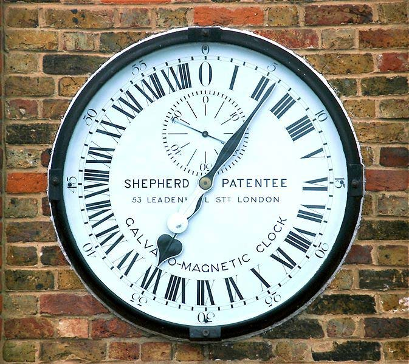

Date and Time Handling
-----------------------

### Objectives

In this chapter you'll learn the basics of the Date object including how to manipulate the
components of dates and times, work with local and international dates and times and
display dates and times in a limited number of formats. You'll learn how to extend the
reach of the Date object by performing custom formatting, add and subtract days,
calculate the difference between dates and work with time zones. You'll also learn some of
the design and implementation issues involved with storing date and time values. Finally,
the chapter introduces a couple of sample utility libraries that you can use to make the job
easier.

### The Date Object

In JavaScript, there are no built-in common date handling functions such as adding and
subtracting days/weeks/months/hour., date and time formatting, date and time
comparisons and long day/week/month names. The basic Date object methods only
handle the following:
- getting and setting the component parts of dates and times, e.g. year, month, day, hours, etc..
- getting local and international dates and times.
- returning dates and times in a limited number of string formats.
  
You can augment the Date prototype to add the features you need on the fly or add a
third party utility library that will do the job for you.

### Creating and Initializing Dates

The Date constructor can be left empty to return the current date and time for the
computer's local time zone, or you can use a constructor overload to initialize to a
particular date and time. When no parameters are passed to the constructor, the date is
initialized with the computer's current local date and time.

```javascript
var now = new Date();
```

You can pass year, month and day parameters to the constructor. The month parameter is
zero-based, i.e. where January is zero, February is one, etc. Unspecified times are initialized
to midnight.

```javascript
var newYears = new Date(2012, 0, 1);
```

This next overload takes a number of milliseconds from January 1st, 1970 GMT at midnight.

```javascript
var newYears = new Date(1325404800000);
```

**Note:** You can get the number of milliseconds for a Date by calling the getTime()
method. Milliseconds are useful for performing date calculations, e.g. intervals
between dates. You can also use the static Date.parse() method that takes a date
string and returns the number of milliseconds since the January 1st, 1970 GMT epoch.
The constructor overload that takes a string representation of the date is surprisingly
flexible. The possible formats are specified in RFC 2822. The examples here all resolve to
the same date.

```javascript
var newYears = new Date("Jan 1, 2012"),
newYears2 = new Date("January 1, 2012"),
newYears3 = new Date("1/1/2012"),
newYears4 = new Date("Sun Jan 01 2012");
```

Once the date is created, use the instance methods to revise component parts of the date.
The example below sets the date to New Years 2012 at midnight.

```javascript
newYears.setYear(2012);
newYears.setMonth(0);
newYears.setDate(1);
newYears.setHours(0);
newYears.setMinutes(0);
newYears.setMilliseconds(0);
```

Fun facts from 1970:
- World population 3.63 billion.
- A gallon of gas was 36 cents, or 0.125 a gallon of petrol in UK pounds sterling.
- A loaf of bread cost 25 cents, a dozen eggs 62 cents and a gallon of milk was $1.15.
- Average cost to buy a home was $23,450 or £4,975 in UK pounds sterling.
- Paul McCartney announces Beatles disbanding.
- Apollo 13 mission is aborted.
- Abdel Nasser of Egypt dies.
- 100,000 people demonstrate against the Vietnam war in Washington.
- The Concord makes first supersonic flight.
- 
### Setting the Time

When a time isn't specified in the constructor, the time is set to midnight. Time
components are hour, minute, second, millisecond. To specify the entire date and time,
use the full set of parameters year, month, day, hour, minute, second, millisecond. This
next example sets the time to 13:30.

```javascript
var newYears = new Date(2012, 0, 1, 13, 30, 0, 0);
```

String constructor parameters can be set in 24 or 12 hour formats.

```javascript
var newYears = new Date("1/1/2012 13:30:00");
var newYears = new Date("1/1/2012 1:30:00 pm");
```

To specify a particular time zone, add an offset. The example places the time in the US and
Canada Pacific time zone.

```javascript
var newYears = new Date("1/1/2012 13:30:00 -8:00");
```

### Date as Strings

JavaScript includes a limited set of no-frills date-to-string methods. The table shows
examples of available methods, a short description and a sample of the output as it might
appear in the console.
|Method Example |Comments and Console Output|
|---|---|
|christmas.toString(); |Human readable, the entire date is output.|
|christmas.toDateString(); |Human readable, date portion only.|
|christmas.toTimeString() |Human readable, time portion only.|
|christmas.toLocaleString() |Uses current locales settings.|
|christmas.toISOString() |ISO 8601 format.|
|christmas.toUTCString() |Universal time format.|
|christmas.toJSON() |JavaScript Object Notation format. Requires JavaScript 1.8.5.|

### Custom Formatting Dates and Times

If you want more than standard date-to-string methods, you'll need to either parse and
format the dates yourself or use a third party utility library. To handle your own parsing,
use the methods that get the component parts of the Date: getFullYear(), getMonth()
and getDate(). Then concatenate the year, month and day together in a specific string
format that suits your purpose. The example below parses the date and reassembles the
pieces in yyyy-M-d format.

```javascript
var aDate = new Date(2012, 5, 2); // some random date
var year = aDate.getFullYear(); // four digit year
var month = aDate.getMonth(); // month number, zero based
var day = aDate.getDate(); // day number
console.log(year + "-" + month + "-" + day); // outputs "2012-5-2"
```

You can extend the base Date functionality by adding functions to the prototype. For
example, adding a new "toYMDString" to the prototype lets you call directly from the
Date object instance, just as if the method were part of the original object. The sample
code below gets the component parts of the Date object and simply reassembles the
pieces using string concatenation.

```javascript
// new function added to prototype
Date.prototype.toYMDString = function () {
"use strict";
var year = this.getFullYear(),
month = this.getMonth(),
day = this.getDate();
return year + "-" + month + "-" + day;
};
var aDate = new Date(2012, 5, 2);
console.log(aDate.toYMDString()); // outputs 2012-5-2
```

### Long Date Format

Long date formats, such as "Wednesday, June 27th, 2019", don't come out of the box and
require a bit more work. You will need the long day name "Wednesday", the long month
"June" and the day number formatted as an ordinal "27th" with the proper "th" suffix".
The long day and month names can be added as arrays to the Date prototype:

```javascript
Date.prototype.days = [
"Sunday",
"Monday",
"Tuesday",
"Wednesday",
"Thursday",
"Friday",
"Saturday"
];
Date.prototype.months = [
"January",
"February",
"March", "April",
"May",
"June",
"July",
"August",
"September",
"October",
"November",
"December"
];
```

How about the part of the date that reads "27th". This is an ordinal representation of the
day of the month. The English language has rules that govern which suffix is used:
1st
2nd
3rd
4th
5th. . .
The general rule is that numbers ending in 1 should be suffixed with "st", those ending in 2
should use "nd", those ending in 3 should use "rd" and everything else ends in "th". As with
a much of the English language, there is always an exception to the rule: the numbers 11, 12
and 13 end in "th". The toOrdinal() method defined below augments the Number
prototype and takes these circumstances into account.

```javascript
Number.prototype.toOrdinal = function () {
"use strict";
// deal with 11th, 12th, 13th exceptions to rule
switch (this % 100) {
case 11:
case 12:
case 13:
return this + "th";
}
// get the suffix for the rightmost digit
switch (this % 10) {
case 1:
return this + "st";
case 2:
return this + "nd";
case 3:
return this + "rd";
default:
return this + "th";
}
};
```

The toOrdinal() method can be implemented in a number of ways, many of them
more succinct than this example. The pattern above was chosen to clearly show the
11th/12th/13th exception without burying the logic in a more terse expression.
To test out that the toOrdinal() method is working for all cases, use a for loop to generate
a series of ordinals.

```javascript
var i;
for (i = 0; i < 120; i += 1) {
console.log(i + " : " + i.toOrdinal());
}
```

The screenshot below shows a sample composite of the first 41 entries. Notice the suffixes
for numbers 1-11-21-31, 2-12-22-32 and 3-13-23-33. The 11th, 12th and 13th are exceptions
to the pattern and are correctly suffixed in the example.


Now that you have the basic components for a long date format, you can add a new
prototype method that assembles the pieces.

```javascript
Date.prototype.toYMDString = function () {
"use strict";
// index into the days array
return this.days[this.getDay()] + ", " +
// index into the months array
this.months[this.getMonth()] + " " +
// return the day of month ordinal
this.getDate().toOrdinal() + ", " +
// use the four digit year
this.getFullYear();
};
```

To test the method, create a Date object and call the new toYMDString() method.

```javascript
var date = new Date(2019, 5, 27);
// output "Wednesday, June 27th, 2019"
console.log(date.toYMDString());
```
To test over a wider range of dates, increment the date inside a loop. At line 03 in the
code below, getDate() returns the current day of the month, then setDate() is used to
increment the date by one day.

```javascript
01 for(i = 0; i < 30; i += 1){
02 console.log(date.getDate() + " - " + date.toYMDString());
03 date.setDate(date.getDate() + 1);
04 }
```
A small sample of the output is shown in the screenshot below:


### Time Format

The stock methods for returning the time as a string are toTimeString() and
toLocaleTimeString(). For any other format you'll need to use a third party library or build
your own. The process is similar to formatting the date in that you extract the basic hour,
minute and second components of the time, develop any descriptive fields you need and
finally reassemble the formatted time. The example below adds a new to12HourString()
method to the Date prototype.

```javascript
Date.prototype.to12HourString = function () {
"use strict";
// get the time components
var hour = this.getHours(),
minute = this.getMinutes(),
second = this.getSeconds(),
// convert from 24 to 12 hour
hour12 = hour > 12 ? hour - 12 : hour,
// determine the am/pm setting
amPm = hour > 12 ? "pm" : "am",
// zero pad the second
twoDigitSecond =
(second.toString().length === 1) ? "0" + second : second;
// format the time
return hour12 + ":" + minute + ":" + twoDigitSecond + " " + amPm;
};
```
The code snippet below tests the new method by displaying the twelve hour format time
every second.

```javascript
var interval = setInterval(function () {
"use strict";
console.clear();
console.log(new Date().to12HourString());
}, 1000);
```

### Date Calculations

The JavaScript object has no built-in methods for adding and subtracting dates. For
example, you can't take the stock Date object and get tomorrow's date with the syntax
used below:

```javascript
var date = new Date(2012, 5, 2);
var tomorrow = date.addDays(1);
```

JavaScript Date objects hold the number of milliseconds that have passed since midnight
of January 1, 1970 UTC (Universal Coordinated Time). Times previous to Jan 1, 1970 are
stored as a negative number of milliseconds. You can get the raw millisecond value of a
Date using the getTime() method. You can use this raw value to get the difference
between two dates or add days to a date.

### Add and Subtract Days

To get the number of milliseconds per day, multiply 1000 (one second of milliseconds) by
60 seconds by 60 minutes by 24 hours. Graft on a new method addDays to the prototype
that takes the number of days to add or subtract as a parameter. Create a new result date
and set its time using the number of milliseconds from the "this" date and add the number
of milliseconds for the number of days passed in as a parameter.

```javascript
// milliseconds for one day
// milliseconds/seconds/minutes/hours
Date.prototype.millisecondsPerDay = 1000 * 60 * 60 * 24;
// new function to prototype
Date.prototype.addDays = function (days) {
"use strict";
var result = new Date();
result.setTime(this.getTime() + (this.millisecondsPerDay * days));
return result;
};
```

To test the code, try adding and subtracting days. The sample below tests for the previous
and next day and displays the string using the toYMDString() method we created in the
Long Date Format section.

```javascript
var date = new Date(),
yesterday = date.addDays(-1),
tomorrow = date.addDays(1);
console.log("Today: " + date.toYMDString());
console.log("Yesterday: " + yesterday.toYMDString());
console.log("Tomorrow: " + tomorrow.toYMDString());
```

The output should look something like the screenshot below:


### Number of Days Between Two Dates

To get the time span between any two dates, first subtract their millisecond values. The
example below subtracts the number of milliseconds for today's date from the date of
Christmas.

```javascript
var today = new Date(),
christmas = new Date(2012, 11, 25),
mils = christmas.getTime() - today.getTime();
// outputs 15429080985 on this particular run
console.log(mils);
```
This particular run output "15429080985", a value not exactly "suitable for framing". To get
the number of days, divide by the number of milliseconds-per-day:

```javascript
// divide out milliseconds, seconds, minutes and hours
var days = mils / (1000*60*60*24);
// outputs 178 days in 15429080985 milliseconds
console.log("days: " + days);
```

To extract days/hours/minutes/seconds, progressively divide into the total millisecond
difference between the two days. This gets you the total number of milliseconds to
Christmas, the total number of seconds to Christmas and so forth. Each field represents the
time to Christmas in its entirety.

```javascript
var today = new Date(),
christmas = new Date(2012, 11, 25),
mils = christmas.getTime() - today.getTime(),
secs = mils / 1000, // extract seconds
mins = secs / 60, // extract minutes
hrs = mins / 60, // extract hours
days = hrs / 24; // extract days
console.log("milliseconds: " + mils); // 15429080985
console.log("seconds: " + secs); // 15429080.985
console.log("minutes: " + mins); // 257151.34975
console.log("hours: " + hrs); // 4285.855829166667
console.log("days: " + days); // 178.5773262152778
```

If you want the days/hours/minutes/seconds together to represent the days to Christmas,
as you would for a "countdown timer", remove each component part of the Date after
extracting that part. You can extract each part of the date, starting with the seconds using
the modulus operator to "peel off" a particular part. In the example below, we're not using
the milliseconds, so divide by 1000 to roll those milliseconds up into seconds. The modulus
operator "%" extracts the seconds portion of the date left over while leaving the minutes/
hours/days intact.

```javascript
var temp = christmas.getTime() - today.getTime();
temp /= 1000; // ignore milliseconds
var secs = temp % 60; // extract seconds
temp /= 60; // ignore seconds
```

This same pattern is repeated until all parts of the date are extracted, until only the
number of hours that evenly divide into a day are left. The final line of code extracts the
number of days by dividing the hours by 24.

```javascript
var today = new Date();
var christmas = new Date(2012, 11, 25);
var mils = christmas.getTime() - today.getTime();
mils /= 1000; // ignore milliseconds
var secs = mils % 60; // extract seconds
mils /= 60; // ignore seconds
var mins = mils % 60; // extract minutes
mils /= 60; // ignore minutes
var hrs = mils % 24; // extract hours
var days = mils / 24; // extract days
console.log("milliseconds: " + mils);
console.log("seconds: " + secs);
console.log("minutes: " + mins);
console.log("hours: " + hrs);
```

Given the sample run where the number of milliseconds difference is 15429080985, the
console output looks like the screenshot below.


Let's enhance the built-in Date object to include a new getTimeSpan() method, where a
new custom TimeSpan object will contain the component parts of the remaining time.

```javascript
function TimeSpan() {
"use strict";
this.days = 0;
this.hours = 0;
this.minutes = 0;
this.seconds = 0;
}
```

A new getTimeSpan() method added to the Date prototype performs the same, "divide
and conquer" strategy as the last example but places the components parts into the
TimeSpan object.

```javascript
Date.prototype.getTimeSpan = function (date) {
"use strict";
// create a new TimeSpan
var result = new TimeSpan(),
// get the date difference in milliseconds
temp = date.getTime() - this.getTime();
temp /= 1000; // ignore milliseconds
result.seconds = temp % 60; // extract seconds
temp /= 60; // ignore seconds
result.minutes = temp % 60; // extract minutes
temp /= 60; // ignore minutes
result.hours = temp % 24; // extract hours
result.days = temp / 24; // extract days
return result;
};
```

Calling the new method is just a matter of passing the second Date object as a parameter
and displaying TimeSpan results.

```javascript
var today = new Date();
var christmas = new Date(2012, 11, 25);
var span = today.getTimeSpan(christmas);
console.log("Days: " + span.days);
console.log("Hours: " + span.hours);
console.log("Minutes: " + span.minutes);
console.log("Seconds: " + span.seconds);
```

### Time Zones

A time zone is a mapping between UTC (Coordinated Universal Time) and the time for a
particular location. For example, on the east coast of the United States, the time zone is
UTC - 5 hours. You can find the offset using the Date object's getTimezoneOffset() that
returns the number of minutes difference between UTC and the local time of the computer.
On the west coast of the United States, Pacific Standard Time is -8, and the offset returned
by the getTimezoneOffset() method is 480 minutes (8 hours) difference. The returned
offset is exactly opposite what you expect because it works "westward" from UTC. To get
the number of hours difference in the expected format, divide by 60 to get the number of
hours and negate the result.

```javascript
var today = new Date();
// returns -8
var offsetHrs = -(today.getTimezoneOffset() / 60);
```



You may also see UTC expressed as GMT (Greenwich
Mean Time), the global time standard until the
introduction of UTC in 1972. GMT is for all practical
purposes the same as UTC. Fun fact: Greenwich is located
at zero degrees, zero minutes longitude.

### Date and Time Storage Issues

Storing time is a special challenge best worked out during the design phase of your
application. There is no one-size-fits-all strategy for persisting time, particularly if want to
use the time from the client machine. Imagine you are writing a bill paying application
that accepts payment from all over the world, then time stamps the online payments and
later displays historical reporting that includes the payment time. What could possibly go
wrong?
- Time zone offsets are not consistent. For example, the code sample above returns -7 (not -8) when run during the summer months when daylight savings time rules kick in.
- Time zones are subject to political changes over time. For example, Hawaii and eastern Kiribati are at roughly the same longitude but are a day apart. Also, the shift to daylight savings time doesn't occur at the same time for all locations. Brazil sets summer time" by decree each year. Israel has a law that requires summer to last at least 150 days.
- The time zone offset may not be a full integer value in all locations. The offset for some areas may be a half or three quarters of an hour, e.g. Newfoundland is UTC -3:30.
- You can't depend on the state of the client computer. How about the battery for the client computer's bios clock? Can you be sure of the operating system and that the OS has all the latest updates that impact the clock and time zones?
  
For these reasons you should distrust times reported by the client. If you have to store
times derived from the client machine via JavaScript, use the time-zone independent UTC
time. Consider storing the local time zone along with the UTC time to make historical
reporting easier. Better still, if the application has a server or web service layer, store UTC
times on the server. While you're at it, make sure the server hardware and operating system
clocks are set correctly to UTC. Also consider using NTP (Network Time Protocol, see www.
ntp.org) servers to keep the time updated. Check your accuracy requirements against how
the operating system's transitions to and from daylight savings time. Not all operating
system versions play nicely when arriving at the same time twice. Some systems even clock
at half speed during the transition to resolve the issue.

Displaying the time is a presentation task that should convert from the UTC time at the last
moment. In some cases you can side-step the issue of converting to local time by using
language that reflects interval, age or relative time, e.g. "This blog was posted 10 minutes
ago".

The Internet Assigned Numbers Authority keeps a database (formerly known as the
"Olson time zone database") of time zone history for representative locations
around the world. The database is updated periodically to reflect political changes.
Third party libraries such as js timezone detect contain similar data for easy use in
JavaScript. Be aware that such libraries may not be historically or geographically
precise, i.e. they do not perform geolocation, but instead pick the most populated
time zones.

### Utility Libraries

There are a number of utility JavaScript Date libraries out there, many of them open
source, that will take care of the usual date calculations for you. There are several
advantages to this route:
- You don't have to spend time developing the code.
- The more people that use these libraries, the more bugs will be surfaced and fixed.
- The code will likely include more rigorous input checking.
- You can examine the code to learn new techniques.


We'll take a look at two open source library examples date.js and moment. Both libraries
are currently available under the MIT License.

### datejs

"Comprehensive, yet simple, stealthy and fast."

If you're testing code in the console, you can either download date.js from www.datejs.
com and paste it right into the console or run something like the following sample to
create a script tag and point it to the file's location. Only run this bit of script once for the
session. At that point the library is loaded into memory and available for use.

```javascript
var script = document.createElement("script");
script.src = "http://datejs.googlecode.com/files/date.js";
script.type = "text/javascript";
document.head.appendChild(script);
```

date.js has a pleasing natural language syntax. Here are a few simple date manipulations
to add and subtract days and weeks.

```javascript
Date.today();
// seven days from now
Date.today().addDays(7);
// a week ago
Date.today().addWeeks(-1);
```

date.js has a comprehensive set of features that will cover most of your wish list. Here's just
a few of the things you can do with date.js:
- Add and subtract all components of a date including milliseconds, seconds, minutes, hours, days, weeks, months and years.
- Validate dates and parts of dates.
- Find if a date is between two other dates.
- Find if a date is in a leap year.
- Get the number of days in a month.
- Get time zone abbreviations for the local computer, e.g. "EST", "UTC".
- Get the UTC date offset, e.g. -8 if the time zone is in Pacific Standard Time.
- Find out if the current time zone has daylight savings and if daylight savings is currently in effect.

The following examples just scratch the surface. For more information, see the Getting
Started Guide or the API Documentation.

```javascript
// same day of month in january
var januaryDay = Date.today().january();
var message = Date.today().getMonthName() + " has " +
Date.today().getDaysInMonth() + " days";
// throws RangeError if it fails
Date.validateDay(31, 2012, 5);
// returns true if a date is between two other dates
var start = new Date(2012, 1, 1);
var end = new Date(2012, 7, 1);
if (Date.today().between(start, end)) {
console.log("date is in range");
}
```

### moment

"A lightweight (4.3k) javascript date library for parsing, manipulating, and formatting dates."

The moment library overlaps date.js somewhat but has a slightly different syntax and some
cool features. The "humanize" feature outputs date information in a human readable form,
e.g. "8 months ago", "in 7 days", "last Tuesday", etc. The moment library has support for
multiple languages and allows you to switch between them (you do apparently need to
supply your own translations though). Here are just a few moment examples:

```javascript
// output "last Tuesday at 3:42 PM"
moment().subtract('days', 3);
// outputs "8 months ago"
moment("2011-10-31", "YYYY-MM-DD").fromNow();
// outputs in 7 days
moment().add('days', 7).fromNow();
```

### Summary

In this chapter you learned the basics of the Date object including how to manipulate the
components of dates and times, work with local and international dates and times and
display dates and times in a limited number of formats. You learned how to extend the
reach of the Date object by performing custom formatting, add and subtract days,
calculate the difference between dates and work with time zones. You also learned some
of the design and implementation issues involved with storing date and time values.
Finally, the chapter introduced sample utility libraries to make the job easier.