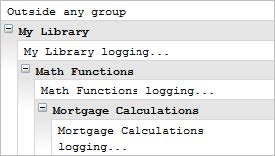

Debugging
----------

### Objectives

The debugging chapter explores how to use debuggers to find errors while the code is
running, consoles to log errors as they happen and defensive coding tips. This chapter
looks briefly at the browser debuggers and the Visual Studio debugger. The Console
Debugging topic focuses on the common methods available to all consoles and
techniques for grouping, timing, tracing and profiling. The defensive coding section
demonstrates how the JSLint utility can help you build more robust code by avoiding error
prone practices.

### Debugging Options

To debug your JavaScript application your choices are:
Using a true interactive debugger at runtime that allows breakpoints, evaluation, step
execution, call stacks and watches. This route is indivisibly coupled with the hosting
environment. Debuggers will require that the JavaScript is pulled in as part of a page.
Log output to the console or embedding log API calls in the JavaScript code itself. This
option doesn't allow you to stop the action and step through it, but will allow you to
load only the pure JavaScript file without loading an HTML page.
You can avoid many errors altogether with JSLint code quality tool. JSLint will help keep
you from obvious mistakes like undeclared variables and some less than obvious
mistakes like leaving trailing whitespace ("In JavaScript, a linefeed can be whitespace or
it can act as a semicolon. This replaces one ambiguity with another. - Douglas
Crockford").

### Debuggers

While consoles allow you to work with "pure" JavaScript, debuggers tend to be tightly
coupled with the environment, usually the browser. Each major browser has developer
tools that include a true runtime debugger.

### Apple Safari and Google Chrome

The debugger in Apple Safari and Google Chrome have very similar interfaces. In Safari,
select the Develop menu Start Debugging JavaScript option. This will open the Scripts
window in the lower half of the browser. You can set breakpoints by clicking the script
editor's gutter on the left hand side. When you reload the page, the debugger will stop at
eligible break points.


The page may have loaded several JavaScript files. Use the drop down menu to the upper
right of editor to select a loaded resource to debug.


Right-click a breakpoint to disable, remove or edit. Editing a breakpoint involves entering
an expression that must be true for the breakpoint stop execution.


The right hand panel of the debugger contains a toolbar along the top and set of panels
running down the side. The toolbar commands from right to left pause/continue, step over
next function call, step into next function call, step out of current function, deactivate
current break points and the current status of the debugger.


Open the Watch Expressions panel to access the Add button where you can enter the
name of an object to be watched.


The Scope Variables panel minimally contains sub panels for Local and Global variables.
You can click the value for properties and edit these by hand. The new values go into effect
immediately as you continue through the code.


The Call Stack lists functions in calling order with the last called functions are at the top of
the list. Click on any item to navigate the editor to the corresponding location in the code.


Below the editor, the Pause on Exceptions button toggles between three states:
Don't Pause on Exceptions, Pause on All Exceptions and Pause on All Uncaught
Exceptions.
Chrome has much the same interface with a few notable exceptions.


Click the Show Navigator button to show a tree of loaded resources. Click an entry to load
it to the editor for debugging.


### Internet Explorer

From Internet Explorer (IE 9 being used for these screenshots), select the tools menu F12
developer tools item.


Drop down the file list above the editor to select alternate resources to debug. Click the
Start debugging to attach the debugger, add your break points in the editor gutter and
interact with your application.


Click options to the right of the editor to display panels for Console, Watch, Local
variables, Call stack and Breakpoints.


### Visual Studio

If you're executing your code from Visual Studio, you needn't bother with browser
debuggers. Visual Studio includes an industrial strength debugger that has been refined
over many generations.


Just a few features that demonstrate how just the break point capabilities alone are more
extensive than anything you can find in a browser debugger:
- The Breakpoint Condition can fire when an expression is true or when it changes.
- The Breakpoint Hit Count can break always or when equal to, a multiple of or greater than or equal to, a value you specify.
- You can Filter breakpoints to only be set for combinations of processes, machines and threads.
- You can optionally log a message to the Output window or run a macro when a breakpoint is hit.
- You can label breakpoints with meaningful descriptions.


The Breakpoints, Watch, Locals and Call Stack panels often appear below the editor but
can be docked anywhere in the IDE.


### Firefox

To debug in the Firefox browser, download the Firebug extension from http://getfirebug.
com/. Click the bug icon at the upper right of the browser to start the debugger. The bug
icon drop down options allow you to place the debugger on any edge of the browser or
detach the debugger into its own separate window.


If you like Firebug but are working in other browsers, you can install the Firebug Lite
extension from http://getfirebug.com/firebuglite. Firebug Lite still has a substantial set
of features and is compatible with IE6+, Opera, Safari and Chrome.
You may need to enable the Script panel by clicking the Enable link.


From there, click the left hand gutter next to the editor to place break points and interact
with your application to fire the break points.


The Watch panel to the right of the editor automatically includes all the variables in your
code and any elements on the page. The Stack panel lists events and called functions with
the currently executing code at the top of the list. Click any item in the stack to navigate
directly to the corresponding code. The Breakpoints panel allows you to disable, enable
and remove breakpoints.

The drop down located top left from the editor filters the types of script that will display:
any static script directly in the code, eval scripts and event scripts. The next drop down to
the right (shown as "Default.aspx" in the screenshot below) lists resources that can be
selected to show in the editor.


The buttons on the toolbar above the editor control debugging execution. From left to
right: Rerun, Continue, Step Into, Step Over, Step Out.


### Console Debugging

The Firebug, Chrome, Safari and Internet Explorer consoles have a common set of methods
starting with the basic output for logging, information, warning and errors. The code
below shows the console log(), info(), warn() and error() methods.

```javascript
console.log("log");
console.info("info");
console.warn("Something bad might happen");
try {
throw new Error("Something bad did happen");
} catch (e) {
console.error(e);
}
```

Depending on the specific console application, the logging may have errors to help
highlight errors and warnings in dense logs. The console output is shown in the table
below:

|Console |Console Output Screenshot|
|---|---|
|Firebug| ![](../media/image64.jpg|
|Chrome |  |
|Safari |  |
|Internet Explorer|  |

Most consoles filter on message type to make finding warnings and errors easier. The
screenshot below shows the Firebug console filtering for only logged Errors.


While Internet Explorer console has the fewest features of the four consoles reviewed in
this topic, balance this with the fact that many console functions, e.g. timing, profiling, are
covered by more powerful tools available in Visual Studio.

### Log Formatting

To format a log string, either concatenate with "+" between strings and variables or use
characters %s for strings and %d for integers to create a format string followed by a list of
the variables that will be substituted. The example below outputs a name followed by a
formatted version number. Both examples output "MortgageCalculator version: .2.5.123".

```javascript
var version = {
name: "MortgageCalculator",
major: 1,
minor: 2,
build: 5,
revision: 123
};
console.log(version.name + " version: " +
version.major + "." +
version.minor + "." +
version.build + "." +
version.revision);
console.log("%s version: %d.%d.%d.%d",
version.name,
version.major,
version.minor,
version.build,
version.revision);
```

Use the %o to output an object:

```javascript
console.log("Version: %o", version);
```

The object may be output as a link or a dump of properties as shown in the screenshot of
Firebug below:


Logging can also dump the contents of an object using the console dir() method.

```javascript
var version = {
name: "MortgageCalculator",
major: 1,
minor: 2,
build: 5,
revision: 123
};
console.dir(version);
```

The screenshot below shows the output in the Firebug console.


### Assertions

If you want to log a message only when a certain condition is true, use the console assert
() method, first passing in a condition that evaluates to a boolean and then the message
to be logged if the condition is true.

```javascript
var version = {
name: "MortgageCalculator",
major: 1,
minor: 2,
build: 5,
revision: 123
};
console.assert(version.major > 1,
"Major version must be greater than 1");
```

The output to the Firebug console is shown in the screenshot below:


### Grouping

Consoles commonly support the group() and groupEnd() methods that wrap logging
within an indented, collapsible block. The example below creates a "My Library" group
with two other nested groups.

```javascript
console.log("Outside any group");
console.group("My Library");
console.log("My Library logging...");
console.group("Math Functions");
console.log("Math Functions logging...");
console.group("Mortgage Calculations");
console.log("Mortgage Calculations logging...");
console.groupEnd("Mortgage Calculations");
console.groupEnd("Math Functions");
console.groupEnd("My Library");
```

The output run in Firebug looks like the screenshot below.



### Timing

You may have written your own timing functions that compare a timestamp before and
after a time-critical operation to see how long it took. These are built-in to the console
using the console time() and timeEnd() methods. Like the grouping functions, just pass a
name to both methods. The timeEnd() method automatically outputs the number of
milliseconds taken by the operations between the time() and timeEnd(). If you want to
simply output a time stamp into the log, call the console timeStamp() method.

```javascript
var i;
console.timeStamp();
console.time("Game loop");
for (i = 0; i < 10000; i += 1) {
// do something...
}
// output the number of milliseconds since
// the call to time()
console.timeEnd("Game loop");
console.timeStamp();
```

The screenshot below shows sample output from the logging code.


### Stack Traces

Where the calling stack is deep or complex, you may find your self wondering, "how did I
end up in this function?". A call to the console trace() answers this question by printing an
interactive stack outline to the log. In the example below, a button click starts off a calling
chain that ends in the method getReceipts(), where the console trace() method is called.

```javascript
<script type="text/javascript">
function getReceipts() {
"use strict";
console.trace();
}
function getAccountsReceivable() {
"use strict";
getReceipts();
}
function calcMonthEnd() {
"use strict";
getAccountsReceivable();
}
</script>
. . .
<input id="MonthEndButton" type="button"
value="Month End" onclick="calcMonthEnd();" />
```

The stack trace shows that we got there by way of getAccountsReceivable() that was called
by calcMonthEnd() and was initially triggered by a click event. Click on any entry to
navigate to the corresponding line in the Script panel editor.


### Profiling

To get detailed performance information about how long function calls are taking and
how many times they are being hit, use the console profile() and profileEnd() methods.
Pass the same profile name to both methods.

```javascript
function getReceipts() {
"use strict";
}
function getAccountsReceivable() {
"use strict";
var i;
for (i = 0; i < 100; i += 1) {
getReceipts();
}
}
function calcMonthEnd() {
"use strict";
console.profile("Month End");
getAccountsReceivable();
console.profileEnd("Month End");
}
```

The call to profileEnd() produces the profile shown in the screenshot below in the Firebug
console.


The Safari and Chrome consoles have a different presentation that shows up in its own
Profiles panel.


### Defensive Coding

After coding in a structured environment like Java or C#, JavaScript just seems a little
freaky. Like HTML, JavaScript has hung out with a bad crowd of browsers and learned
beastly habits. As JavaScript matures, best practices are emerging that bring JavaScript in
line with "respectable" languages. Two of the big guns for making JavaScript safer are the
"use strict" directive and the JSLint code quality tool.

### Strict Mode

Add "use strict" to the first line of a function to disallow some of the flakier aspects of
JavaScript and make it easier for JavaScript engines to optimize. The example below
generates "ReferenceError: assignment to undeclared variable willRobinson". This is a
"good thing" where the error implies that "willRobinson" should be preceded by the var
keyword to declare it.

```javascript
(function () {
"use strict";
willRobinson = "I'm lost in space";
}());
```

Windows Metro Style apps created since Visual Studio 2012 already include the "use strict"
directive by default:


"use strict" prevents assignment of non-writable properties, excludes duplicate properties,
requires object literal property names to be unique and quite a bit more. For more details
on the ECMA 5 "use strict" directive, check out the The strict mode restriction and
exceptions link at ECMA International. For a more readable rundown along with code
examples, see the "Strict mode" article in the Mozilla Developer Network.

Watch out for adding "use strict" at the file level if strict and not-so-strict files are
concatenated. This can lead to bugs suddenly cropping up in the non-strict code as
happened at Amazon. Include "use strict" only at the top of functions.

### JSLint

"For no cost, by adopting a more rigorous style, many classes of errors can be
automatically avoided"
-Douglas Crockford

Never has there been a utility that promises to "hurt your feelings" and that actually
includes an option to "Tolerate Stupidity". The JSLint utility by Douglas Crockford
(originator of the JSON format, author of "JavaScript: The Good Parts") can be used
directly online at www.jslint.com, or included as a Visual Studio extension. Both
flavors of JSLint list errors where each item corresponds to issues encountered in practical
programming situations. Douglas Crockford developed the tool by running JSLint against
other people's malfunctioning code to identify individual problems and also to find
problematic patterns that lead to errors. Essentially, you're getting the benefit of someone
else's agony.
The screenshot below shows JSLint run over a short function.


The JSLint options configure the utility to work in your particular environment. If you need
console methods in your code, enable the Assume console, alert option. Most of the
options are based on painful experience, so be sure to research why the error exists before
switching one of the options to "tolerate".


**Note:**

For an entertaining and thorough explanation of the thinking behind these options,
see the keynote talk "Crockford on JavaScript — Section 8: Programming Style &
Your Brain".

### Summary

The debugging chapter explored how to use debuggers to find errors while the code is
running, consoles to log errors as they happen and defensive coding tips. This chapter
looked briefly at the browser debuggers and the Visual Studio debugger. The Console
Debugging topic focused on the common methods available to all consoles and
techniques for grouping, timing, tracing and profiling. The defensive coding section
demonstrated how the JSLint utility can help you build more robust code by avoiding error
prone practices.