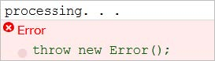

Error Handling
---------------

### Objectives

This chapter explains how to handle error conditions raised in your JavaScript application
and coming from other sources. The chapter explores the built-in JavaScript error objects,
demonstrates how to throw exceptions and how to structure your application to capture
and handle exceptions. The chapter also shows how to ensure a consistent application
state, no matter what. Finally, this chapter shows how exception and resource protection
blocks behave when nested.

### Handling Exceptions in JavaScript

An exception is created at runtime due to an illegal operation. For example, incrementing
an undeclared variable causes a ReferenceError exception. The exception is automatically
reported by the browser or console. The screenshot below shows the console log on the
left and the JavaScript code on the right.


Handling an exception refers to a very specific syntax that takes control away from the
code that caused the exception and passes control to another block of code that
consumes the exception programmatically. The syntax includes two blocks of code marked
by the keywords try and catch. The try {. . .} block holds any code that might create an
exception. If an exception occurs, the try {. . .} block is abandoned immediately and
execution passes to the catch {. . .} block.
Step through the code below:

```javascript
01 try {
02 myvar += 1;
03 alert('never gets here');
04 } catch (e) {
05 console.log(e.message);
06 }
```
- Line 01 begins the try {. . .} block.
- Attempting to reference an undeclared variable causes a ReferenceError exception at line 02.
- Line 03 is never executed. Instead, execution passes to the catch {. . .} block at line 05.
- At line 04, the ReferenceError object is created and placed into the variable named "e".
- Line 05 logs the ReferenceError object message property.
- At line 06, the ReferenceError object is destroyed and is no longer available outside the catch {. . .} block.


At this point, the exception has been handled, that is, the exception object no longer exists.
The browser or console will not automatically display an error message.

### Why Handle Exceptions?

The purpose of handling exceptions is:
- To resolve error conditions. For example, if the exception indicates that an object is an invalid state, you have the chance to rebuild the object with different data and retry the operation.
- To interpret errors for the user. You can throw new exceptions or simply display messages that provide relevant information to the user. For example, consider a utility library that processes uploaded data and throws an error:

```javascript
"':' expected, javascript:false, Line 5 Character 20"
```

There's nothing actionable for the user in this message. Instead, you could present a new
message "The uploaded data is incorrectly formatted.", to explain the steps needed to
correct the situation and present a user interface that allows the user to fix the data or
bypass the operation.

### Native Exception Objects

JavaScript has a generic Error object and six other core error constructors:

|Error Type |Description|
|---|---|
|RangeError |Occurs where a number is outside of a range. Example that throws "RangeError: precision 999 out of range": var num = 123; num.toPrecision(999);|
|ReferenceError |Occurs where the code is trying to access an invalid reference. Example that throws "ReferenceError: assignment to undeclared variable myvar": myvar++;|
|SyntaxError |Occurs when the code is being parsed and invalid code is detected. Example that throws "SyntaxError: unterminated string literal": var customerCode = "A123BC;|
|TypeError |Occurs when a variable is not a valid type. Example that throws "TypeError: customerCode is not a function": var customerCode; customerCode();|
|URIError |Occurs when a malformed URI is detected. Example that throws "URIError: malformed URI sequence": decodeURIComponent("%%%"); |
|EvalError |EvalError represents errors created by using eval() improperly. This error rarely gets fired. In most environments the problem is flagged as a TypeError. Kept for backwards compatibility. This exception is not thrown in most environments. Instead, the underlying error with the JavaScript code, i.e. TypeError, SyntaxError, is thrown.|

### Throwing Exceptions

Exceptions are raised by using the throw keyword followed by an object instance. You can
use any of the JavaScript standard errors or the generic Error object to create application
exceptions on the fly.

```javascript
throw new
Error("Discount cannot be zero");
```

The console will respond with an error message somewhat like the screenshot below:


In fact, any object can be thrown: strings, numbers, even custom object notation.

|Code |Console|
|---|---|
|throw "Discount cannot be zero";| "Doscount cannot be zero"|
|var errorCode = 123; throw errorCode;| 123|
|throw { name: 'CustomException', description: 'division by zero', myErrorCode:123 }| Object {name="Customexception", description="deivision by zero", myErrorCode=123}|

Ad hoc errors like those above provide few contextual clues as to where the error occurred.
It's akin to telling the fire department "a house is on fire, have a nice day" and leaving. In
large bodies of code, exceptions may lie deep in the stack, e.g. in a library of utility
objects. To avoid sending the debug "fire department" on a house-to-house search, you'll
need to tell them where to find the error.
Designing your application for easy debugging and maintenance isn't all about throwing
exceptions, but handling exceptions in a structured way. It's a little more work up front, but
you can build a robust exception handling framework by inheriting from standard
JavaScript errors. The example below inherits from the Error object. The prototype takes a
new Error instance and the prototype constructor points back to the custom error.
Throwing this custom error makes it clear where the error originates.

```javascript
function MyMathLibraryError(message) {
"use strict";
this.name = "MyMathLibraryError";
// use "message" parameter if defined
this.message = message || "Error occurred in My Math Library";
}
MyMathLibraryError.prototype = new Error();
MyMathLibraryError.prototype.constructor = MyMathLibraryError;
```

Inherit from your own error objects to create a structure that can be sorted cleanly when
handling the exception. The example below inherits from the custom
"MyMathLibraryError" to create a new "DivideByZeroError".

```javascript
function DivideByZeroError(message) {
"use strict";
this.name = "DivideByZeroError";
this.message = message || "Division by zero attempted";
}
DivideByZeroError.prototype = new MyMathLibraryError();
DivideByZeroError.prototype.constructor = DivideByZeroError;
```

The clarity and savings of effort all come into play when handling exceptions.
Exception Handling Structure
To structure your exception handling, check if the exception is in the prototype chain using
the instanceof operator. Link "if..else" statements together, from specific errors to the
most general. The example below generates a TypeError at line 03, then the catch block
tests if the error is an instance of a TypeError, then a generic Error and finally falls through
to handle unknown errors.

```javascript
01 try {
02 // generate a TypeError
03 var customerCode = customerCode();
04 } catch (e) {
05 if (e instanceof TypeError) {
06 console.log("TypeError");
07 } else if (e instanceof Error) {
08 console.log("generic error");
09 } else {
10 console.log("unknown error");
11 }
12 }
```

What happens if we trigger a RangeError at line 03 instead of a TypeError? Only
TypeError is checked specifically, so execution falls through to "e instanceof Error".
RangeError inherits from Error so the console will log "generic error". The table below
shows what would happen if we substituted new errors on line 03 and the resulting console
output:

|Code at line 03 |Console Ouput|
|---|---|
|var customerCode = customerCode(); |"TypeError"|
|(123).toPrecision(999); // RangeError | "generic error"|
|decodeURIComponent("%%%"); |"generic error"|
|throw "a string object"; |"unknown error"|
|throw { name:"MyRandomError", description:"My description" } |"unknown error"|

Custom exceptions that participate in the prototype chain can be handled nicely using this
same structure. For example, consider two custom exceptions that inherit from Error in the
following prototype chain hierarchy (see Throwing Exceptions for code that defines these
two exceptions):

```javascript
Error
    MyMathLibraryError
        DivideByZeroError
```

In the code below, a function named "discount" throws a DivideByZeroError if the divisor is
zero,. In the try..catch block that uses the function, the exception is discovered right away
and reported at line 14. If another statement inheriting from MyMathLibraryError were
thrown, execution would pass to line 16. If Error or a descendant were thrown, execution
would pass to line 18.

```javascript
01 function discount(price, discountPercent) {
02 "use strict";
03
04 if (discountPercent === 0) {
05 throw new DivideByZeroError();
06 }
07 return price * (discountPercent / 100);
08 }
09
10 try {
11 var disc = discount(100, 0);
12 } catch (e) {
13 if (e instanceof DivideByZeroError) {
14 console.log("your specific error");
15 } else if (e instanceof MyMathLibraryError) {
16 console.log("math library error");
17 } else if (e instanceof Error) {
18 console.log("generic error ");
19 } else {
20 console.log("unknown error");
21 }
22 }
```

Although its not part of the ECMA standard, you may see multiple catch clauses
allowed by an extension to JavaScript 1.5. In this syntax, the instanceof comparison
is placed right in the catch statement.

```javascript
try{
var disc = discount(100, 0);
}
catch(e if e instanceof DivideByZeroError ) {
console.log("your specific error");
}
catch(e if e instanceof MyMathLibraryError) {
console.log("math library error");
}
catch(e if e instanceof Error) {
console.log("generic error");
}
catch(e) {
console.log("unknown error");
}
```

### Unhandled Exceptions and Re-throwing

Consuming exceptions without handling them can introduce hard-to-find bugs. In the final
"else", if you don't have a way of correcting the error condition, you should re-throw the
exception. The re-thrown exception can be handled by another try..catch block at a higher
level or bubble up to the global exception handler for the environment.
The syntax consists of the throw keyword followed by an exception object:

```javascript
try {
. . .
} catch (e) {
if (e instanceof TypeError) { . . . }
else if (e instanceof ReferenceError) { . . . }
else {
throw e; // don't bury it, re-throw the exception!
}
}
```

### Restoring State

If you set a mouse cursor shape to "busy", then start some processing that throws an
exception, the cursor will never return to its default pointer shape. Or you may consume
some valuable resource before an exception occurs, e.g. open a file, open a connection or
create a large number of elements. All of these situations come under the heading of
"state". The application is in a particular state, the application performs some processing
and finally the application must be restored to its original state.
Instead of try..catch, try..finally keywords are used to restore state. The finally block
always executes no matter what happens in the try block. The table below shows code that
throws an exception. The finally block still executes even though there is no exception
handler.

|Code |Console Ouput|
|---|---|
|try { throw new Error(); console.log("this doesn't execute"); } finally { console.log("always executes"); } console.log("this doesn't execute");| |

A function that returns a value but throws an exception first will return
"undefined" (assuming the exception is handled somewhere and the code is allowed to
continue). You can return a value from the finally block instead. The table below first shows
the execution path without a try..finally block. The second example shows a value
returned from the finally block.

|Code |Console Ouput|
|---|---|
|function process() { "use strict"; throw new Error(); return 123; } console.log("processing. . ."); var result = process(); console.log("Done! " + result); | 

|Code |Console Ouput|
|---|---|
|function process() { "use strict"; try { throw new Error(); } finally { return 456; } return 123; } console.log("processing. . ."); console.log("Done! " + process()); | |

You can also use try..catch..finally syntax. From the example output below you can see
that the exception is handled, the finally block executes and the code following the try..
catch..finally is allowed to execute.

|Code |Console Ouput|
|---|---|
|try { throw new Error(); console.log("this doesn't execute"); } catch(e) { console.log("exception handled"); } finally { console.log("always executes"); } console.log("this does execute"); |  |

### Nested Exception Handling

Exceptions are typically thrown from locations down in the stack, e.g. libraries, frameworks
or utilities, while handling exceptions happens at the application level. In your
applications, you have more control of the input and are likely to know what data you're
working with. Utility functions have no such control. In a function located down in the stack
you have to check inputs carefully. You shouldn't assume the code is executing in a browser
or console or some any particular framework, so exception conditions should be reported
using Error objects. That way the exception can be handled in whatever way the
application sees fit.

What is the order of execution when an exception is thrown? The exception "spirals" out
from the point where the exception was thrown searching for an exception handler, i.e. a
try..catch block. If the exception encounters a catch block, the error object is destroyed and
the hunt is over.

Consider the example below where the calling order is c() > b() > a(). After a() is called, an
exception is thrown but there is no exception handler in function a(), so control passes to
the calling function b(). The function b() wraps the call to a() in a try..catch block, so the
exception is handled and execution finishes. The catch block of c() is never reached.

|Code |Console Ouput|
|---|---|
|function a() { "use strict"; // creates the exception throw new Error("Kaboom"); } function b() { "use strict"; try { a(); // this handles and destroys  // the exception } catch (e) { console.log('handled at b()');  } } function c() { "use strict"; try { b(); // this catch block never reached } catch (e) { console.log('handled at c()'); } } c(); |  |

If there is no handler, each JavaScript environment has its own final mechanism to report
unhandled exceptions. For example, browsers report errors in a status bar or dialog.
This next example shows nested try..catch..finally blocks. Try to walk through the code
below to follow the flow and to see why each statement does or does not execute. The
finally blocks will always execute and all the statements in the calling stack will fire if they
not blocked by an exception.

```javascript
function a() {
console.log('a() executes');
throw new Error("Kaboom");
console.log('a() does not execute');
}
function b() {
try {
a();
console.log('b() does not execute');
} catch (e) {
console.log('caught at b()');
} finally {
console.log('b() finally always executes');
}
}
function c() {
try {
b();
console.log('c() executes');
} catch (e) {
console.log('caught at c()');
} finally {
console.log('c() finally always executes');
}
}
c();
console.log('this executes');
```

The resulting console output is shown in the screenshot below.


### Summary

This chapter explained how to handle error conditions raised in your JavaScript application
and coming from other sources. The chapter explored the built-in JavaScript error objects,
demonstrated how to throw exceptions and how to structure your application to capture
and handle exceptions. The chapter also explained how to ensure a consistent application
state, no matter what. Finally, this chapter showed how exception and resource protection
blocks behave when nested.