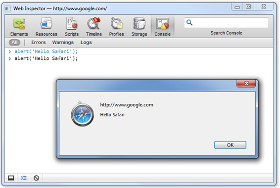
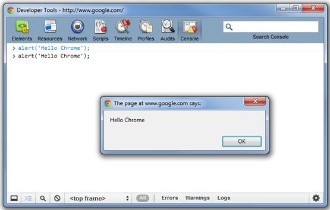
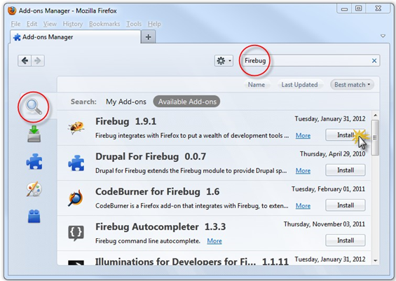
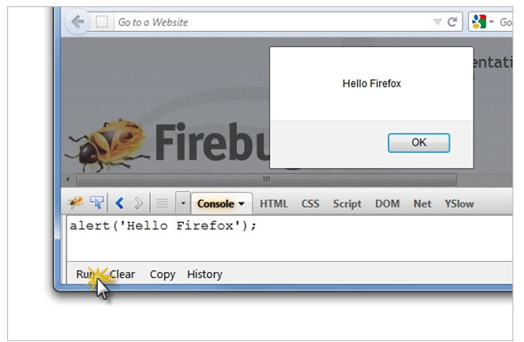
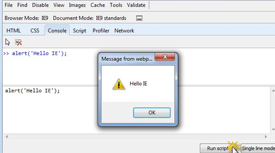
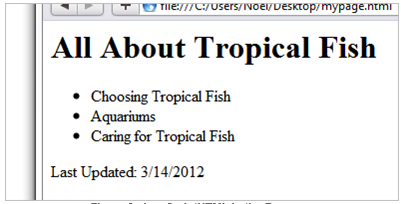
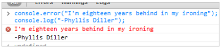
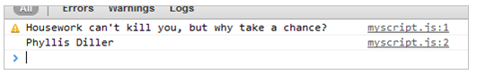

## Getting Started

### Objectives

In this chapter you'll learn how to configure a console application to start working
interactively with JavaScript.

### Choose Your Weapons

There is a New-Years-Eve-size crowd of tools that help build and debug JavaScript code:
consoles, IDE's, web browsers and online interpreters. We will be using the developer
consoles utilities that are built-in to most popular browsers.

### Consoles

When the console is configured, you will be able to enter JavaScript statements and
execute them. Configure the console using your favorite browser from the choices below.

### Safari

This example shows how to configure the Safari browser console. From the "Gear" icon, **select Preferences > Advanced > Show Develop menu in menu bar**


Then, from the Develop menu, select Show Error Console. Take it for a quick test drive by entering the JavaScript code below:

```javascript
alert('Hello Safari');
```

Press Enter to execute the code. An alert dialog should display.



### Chrome

This example shows how to configure the Chrome browser console. From the "Wrench" icon	, **select Tools > JavaScript Console.** Test the console by entering the JavaScript code below:

```javascript
alert('Hello Chrome);
```

Press Enter to execute the code. An alert dialog should display.



### FireFox

The Firebug console for the Firefox browser. From the Firefox menu **select Tools > Add- ons.** Select the Search tab and enter "Firebug". Select the Firebug entry from the list and click the Install button.



Click the Restart now link to reload the browser. Click the "Bug" icon	to show the console. Test the console by entering the JavaScript code below:

```javascript
alert('Hello Firefox");
```

Press the Run link to execute the code. An alert dialog should display.



### Internet Explorer

This example shows how to configure the Internet Explorer browser console. From the "Gear" icon, **select F12 Developer Tools.** Select the Console tab.

Then, from the Develop menu, select Show Error Console. Take it for a quick test drive by entering the JavaScript code below:

```javascript
alert('Hello IE');
```

Press Enter to execute the code. An alert dialog should display.



### Using the Console

Instead of the standard alert() function, use the console object to log values in your JavaScript code. The methods log(), warn() and error() print statements into the console. The console can output primitive types, variables, objects and object properties.


See the Console Debugging topic for more details.

### JavaScript in the Browser

If you want your JavaScript to interact with an HTML page, include a "script" tag with JavaScript directly in the HTML or in an external file. The "script" tag in the HTML page below has only a single inline console.log() statement, but you can add as many lines as you need.

```html
<html>
<head>
<meta http-equiv="Content-Type" content="text/html; charset=utf-8">

<title>JavaScript Nuts and Bolts</title>

<script type="text/javascript">
console.log('JavaScript called while loading the page');
</script>

</head>
<body>
</body>
</html>
```

To define JavaScript code in another file, define the src attribute with the path of the JavaScript file.

```html
<html>
<head>
<meta http-equiv="Content-Type" content="text/html; charset=utf-8">
<title>JavaScript Nuts and Bolts</title>

<script type="text/javascript" src="myscript.js"></script>

</head>
<body>
</body>
</html>
```

**While inline JavaScript is OK for small examples and experimentation, best practice dictates separating your code from your HTML presentation.**

You can write directly to the browser using the built-in document object write() method. The following JavaScript pushes standard HTML out to the browser.

```html
<html>
<head>
<meta http-equiv="Content-Type" content="text/html; charset=utf-8">

<title>JavaScript Nuts and Bolts</title>

<script type="text/javascript">
document.write('<h1>All About Tropical Fish</h1>'); document.write('<ul>'); document.write('<li>Choosing Tropical Fish</li>'); document.write('<li>Aquariums</li>');
document.write('<li>Caring for Tropical Fish</li>'); document.write('</ul>');
document.write('<p id=lastUpdate>Last Updated: 3/14/2012</p>');
</script>

</head>
<body>
</body>
</html>
```

Rendered in the browser, the HTML produced by the JavaScript looks like the screenshot below:



If you want to change an element in the HTML, use the browser document's getElementById() method and pass the ID of the element. For example, the HTML below snags the "Last Updated" element and assigns the current date.
```javascript
document.getElementById('lastUpdate').innerHTML = Date();
```

The JavaScript executes immediately and updates the text.


### Walkthrough

1.	Configure a console for your favorite browser.
2.	Copy the code below into the console and execute it.

```javascript
console.error("I'm eighteen years behind in my ironing"); 
console.log("-Phyllis Diller");
```

The output should look something like the screenshot below.



3.	Create a text file on disk and name it "mypage.html". Copy in the code below to the file.

```html
<html>
<head>
<meta http-equiv="Content-Type" content="text/html; charset=utf-8">
<title>JavaScript For TestComplete</title>

<!-- add JavaScript code here -->

</head>
<body>
</body>
</html>
```
4.	Replace the comment "<!-- add code here -->" with the code below. Notice that the "src" attribute points to "myscript.js".

```html
<script type="text/javascript" src="myscript.js"></script>
```

5.	Add a second file to the same location as "mypage.html" and name it "myscript.js". Add the code below to the "myscript.js" file.

```javascript
console.warn("Housework can't kill you, but why take a chance?"); 
console.log("Phyllis Diller");
```

6.	Drag "mypage.html" from the file location on disk onto the browser. The output should look something like the screenshot below. The specific display details will depend on the browser you're using.



### Summary

In this chapter you learned about the toolsets that let you work with JavaScript interactively and how to configure the environment to get started.