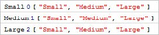
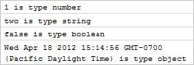
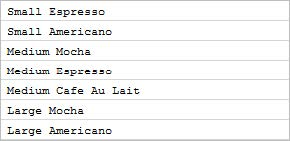
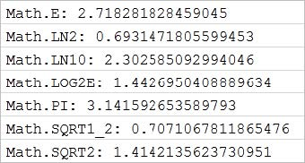
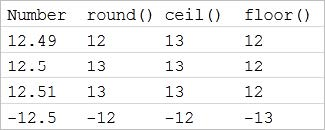
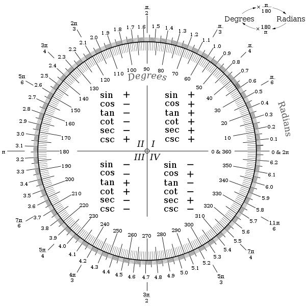
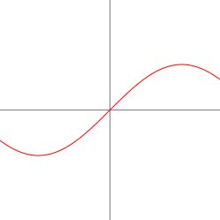

Native Objects
---------------
### Objectives

In this chapter you will learn about the built-in objects supported by JavaScript including
Numbers, Strings, Date and Arrays. The Strings topic demonstrates methods used to
search or manipulate a series of characters. The Arrays topic explains how arrays are
constructed and the methods used to slice-and-dice arrays into new arrangements. The
Math object topic explores the built-in math constants, basic methods for limiting and
rounding numbers, generating random numbers, manipulating exponents and logarithms
and trigonometric functions.

### Numbers

The Number wrapper object has properties that stake out the upper and lower numeric
range.
```
console.log(Number.MIN_VALUE); // 5e-324
console.log(Number.MAX_VALUE); // 7976931348623157e+308
console.log(Number.POSITIVE_INFINITY); //Infinity
console.log(Number.NEGATIVE_INFINITY); //-Infinity
```

The Number object also has methods that return string representations of the number.
Here's a sampling:
```
var myNumber = 123;
console.log(myNumber.toExponential()); // 23e+2
console.log(myNumber.toFixed(5)); // 123.00000
console.log(myNumber.toPrecision(2)); // 2e+2
```

### Strings

A string literal is a primitive type, but is automatically converted to a String object on
demand. You can call String object methods from variables assigned string literals without
specifically creating a new String object. The example below calls the String object
toLowerCase() method on the "status" variable.

```
var status = 'Published';
if (status.toLowerCase() === 'published') {
console.log("Published");
}
```

You can even call the method directly on the literal itself:

```
var isPublished = 'Published'.toLowerCase() === 'published';
```

Here are some of the String object methods for basic tasks:
charAt(), charCodeAt(), concat(), indexOf(), lastIndexOf(), match(), replace(), search(), slice(), split(), substr(), substring(), toLowerCase(), toUpperCase(), toLocaleLowerCase(), toLocaleUpperCase(), trim()

You can use the length property to get the number of Unicode characters in a string. To
retrieve the character at a particular position in the string use ChartAt() or use array-like
indexing syntax, e.g. "my string"[index]. Here's an example that reverses the characters in a
string by iterating one character at a time, from the end of the string backwards to the
starting character (not an efficient algorithm, but illustrates length and charAt()).

```
var heading = "Turned Around",
newString = "",
i;
for (i = heading.length - 1; i >= 0; i -= 1) {
newString += heading.charAt(i);
}
console.log(newString); // outputs "dnuorA denruT"
```

Be aware that strings in JavaScript are immutable and can't be changed in place.
Even using the String.replace() method, JavaScript will still allocate memory for the
new returned string.

String methods that return a string can be called in a series: charAt(), concat(), replace(),
slice(), substr(), substring(), toLower/Upper and trim(). For example, to capitalize a
string, retrieve the first letter by calling charAt(0), then call toUpperCase() against that
character. The substr() method returns the remainder of the string, starting with the
second character.

```
var name = "falafel",
capitalized = name.charAt(0).toUpperCase() + name.substr(1);
console.log(capitalized); // outputs "Falafel"
```

The indexOf() and lastIndexOf() methods return an index of a substring within a string or
-1 if nothing is found.

```
var bruceTheShark = "I am a nice shark, not a mindless eating machine." +
"If I am to change this image, I must first change myself. " +
"Fish are friends, not food.",
foundNemo = bruceTheShark.indexOf("Nemo") > -1;
console.log("Found Nemo: " + foundNemo); // "Found Nemo: false"
```

While indexOf() and lastIndexOf() simply look for a string, search() looks for strings that
satisfy a regular expression. This example looks for at least five occurrences of "swimming"
within a string.

```
var isIrritating, regex, expression, dory;
dory = "Just keep swimming. Just keep swimming. " +
"Just keep swimming, swimming, swimming.";
expression = /(((?!\bswimming\b).)*\bswimming\b){5,}/g;
regex = new RegExp(expression);
isIrritating = dory.search(regex) > -1;
console.log("Mentions swimming at least 5 times: " +
isIrritating); // outputs true
```

See the Regular Expressions chapter for more information on building, understanding and
using regular expressions in JavaScript.

match() also takes a regular expression but returns an array of matching strings. The
example below writes out the single matching string to the console log.

```
var regex, matches, i,
expression = /(((?!\bswimming\b).)*\bswimming\b){5,}/g,
dory = "Just keep swimming. Just keep swimming. " +
"Just keep swimming, swimming, swimming.",
regex = new RegExp(expression),
isIrritating = dory.search(regex) > -1,
matches = dory.match(regex);
console.log("Mentions swimming at least 5 times: " +
isIrritating); // outputs true
for (i = 0; i < matches.length; i += 1) {
console.log(matches[i]);
}
```

Finally, split() takes a string or a regular expression and returns an array of strings. split() is
a workhorse useful for parsing query strings, version numbers, key-value pairs, paths, date
strings and more.

```
var version = "1.0.32.574",
versionParts = version.split(".");
console.log("Major:" + versionParts[0] +
" Minor:" + versionParts[1] +
" Revision:" + versionParts[2] +
" Build:" + versionParts[3]);
// outputs "Major:1 Minor:0 Revision:32 Build:574"
```

### Arrays

Array objects contain lists of elements. To declare an array literal, assign a series of
comma-delimited elements enclosed by square brackets. An array's length property is a
count of the elements in the array that can be used to iterate the array.

```
var sizes = ["Small", "Medium", "Large"],
i;
console.log(sizes[0]); // "Small"
console.log(sizes[sizes.length - 1]); // last item, "Large"
for (i = 0; i < sizes.length; i += 1) {
console.log(i + ": " + sizes[i]);
}
// outputs:
//0: Small
//1: Medium
//2: Large
```

Arrays are dimensioned based on the index of the element at the end of the array. If we
take the sizes[] array and assign an element to the fifth index, as shown below, the array
elements will be "Small", "Medium", "Large", undefined and "Giant".

```
var sizes = ["Small", "Medium", "Large"];
sizes[4] = "Giant";
```

Here are some of the Array object methods for common tasks:
push() / pop() shift() / unshift() concat() splice() join() slice()

The push()/pop() methods add and remove elements to the end of the array while
unshift()/shift() methods add and remove from the start of an array. The example below
defines a "sizes" array containing elements "Small", "Medium" and "Large". The "Large"
element is popped from the end of the array and "Venti" is pushed onto the end of the
array in its place. At this point, the array elements are "Small", "Medium", "Venti". Then the
"Small" element is shifted from the start of the array and "Tall" is unshifted (i.e. prepended)
to the start of the array.

```
var sizes = ["Small", "Medium", "Large"],
large,
small,
i;
// remove "large" from end of array and add "Venti"
large = sizes.pop(); // removes element from end of array
sizes.push("Venti"); // adds item to end of array
// replace "Small" with "Tall"
small = sizes.shift(); // removes element from start of array
sizes.unshift("Tall"); // adds element to start of array
for (i = 0; i < sizes.length; i += 1) {
console.log(i + ": " + sizes[i]);
}
// outputs:
//0: Tall
//1: Medium
//2: Venti
```

To replace items inside the array, use splice(), passing the index where the replacement
will start, then the number of elements to be replaced and finally the element(s) that will
be inserted. In the example, "Grande" replaces the second element. Now the array
elements would be "Tall", "Grande", "Venti".

```
// replace "Medium" from the middle of the array
// start index, number of elements, replacement element(s)
sizes.splice(1, 1, "Grande");
```

To insert more elements, pass more arguments to the splice() method. Now the array
elements consist of "Tall", "Tallish Grande", "Grande", "Venti".

```
// replace second element with two elements.
// elements will now be "Tall", "Tallish Grande", "Grande", "Venti"
sizes.splice(1, 1, "Tallish Grande", "Grande");
```

To delete elements, call splice() and only specify the start and number of elements. The
example below starts from the second element and removes three elements. The array
now has only the single "Tall" element.

```
// delete three elements
// only the "Tall" element remains
sizes.splice(1, 3);
```

The concat() method is another way to glue more elements to an array. You can pass one
or more arrays or even single elements to the concat() method. The example below takes
the literal array with elements "Miniscule" and "Tiny", tacks on the "sizes" array and finally
appends the "Enormous" element. To extract elements from the middle of an array, use
the slice() method and pass the starting index and the number of elements to extract. If
you want to easily present an array as a single comma-delimited string, call the join()
method.

```
var i, sizes = ["Tall", "Grande", "Venti"],
allSizes, starbucksSizes;
// add arrays or elements
allSizes = ["Miniscule", "Tiny"].concat(sizes, "Enormous");
for (i = 0; i < allSizes.length; i += 1) {
console.log(i + ": " + allSizes[i]);
}
// outputs:
//0: Miniscule
//1: Tiny
//2: Tall
//3: Grande
//4: Venti
//5: Enormous
// extracts 3rd through 6th elements
starbucksSizes = allSizes.slice(2, 5);
// outputs elements as a single string
console.log(starbucksSizes.join());
for (i = 0; i < sizes.length; i += 1) {
console.log(i + ": " + sizes[i]);
}
// outputs:
//0: Tall
//1: Grande
//2: Venti
```

### Iteration Methods

Array object methods can iterate the array and call out to a function automatically for
every iteration:
filter() forEach() every() map() some() reduce()

For example, the forEach() method runs a function against each element in the array.
Without using one of these iteration methods, the array must be iterated by index:

```
var i, sizes = ["Small", "Medium", "Large"];
for (i = 0; i < sizes.length; i += 1) {
console.log(i + ": " + sizes[i]);
}
```

Now we can use a function to process each element. The example below passes the
function logElement() to the forEach() method. The signature of forEach() expects
parameters for each element, the index of the element within the array and the array as a
whole.

```
var sizes = ["Small", "Medium", "Large"];
function logElement(element, index, array) {
"use strict";
console.log(element, index, array);
}
sizes.forEach(logElement);
```

The screenshot below shows the output.



You can also use an anonymous function as the forEach() parameter.

```
var sizes = ["Small", "Medium", "Large"];
sizes.forEach(function (element, index, array) {
"use strict";
console.log(element, index, array);
});
```

### Array Element Types

Array elements don't need to be the same type. You can use typeof( **element**) to
determine how each element should be handled.

```
var i, misc = [1, "two", false, new Date()],
numberOfItems = misc.length;
for (i = 0; i < numberOfItems; i += 1) {
console.log(misc[i] + " is type " + typeof (misc[i]));
}
```

The output of the for loop is shown in the screenshot below:



### Multi-Dimensional Arrays

You can simulate a multi-dimensional array by assigning array elements with their own
arrays. The "drinks" array in the example below has three top-level elements where each
element is assigned its own array of drink name strings. The outer "for" loop iterates the
top level elements while the inner "for" loop iterates the elements within the array.
JavaScript allows you to create "jagged arrays" where the number of elements in each
array can vary.

```
var i, x, sizes = ["Small", "Medium", "Large"],
drinks = [
["Espresso", "Americano"],
["Mocha", "Espresso", "Cafe Au Lait"],
["Mocha", "Americano"]
];
for (i = 0; i < sizes.length; i += 1) {
for (x = 0; x < drinks[i].length; x += 1) {
console.log(sizes[i] + " " + drinks[i][x]);
}
}
```

The console output appears in the screenshot below:



### Date

The JavaScript Date object has basic functions for manipulating dates and times. The
example below displays today's date in the computer's local formatting conventions:

```
var today = new Date();
console.log(today.toDateString());
```


For more on the Date object see the Date and Time Handling chapter.

### Math

The JavaScript Math object has a set of frequently used constants and a limited collection
of trigonometric, exponential, functions to limit and round numbers and a random
number generator. All of the methods and constants are static, so reference them directly
off the Math object without creating an instance. Here's a short example that calculates
the volume of a sphere using the Math constant PI and the Math.pow() method.

```
var radius = 5,
volume = (4 / 3) * Math.PI * Math.pow(radius, 3);
```

### Constants

The Math constants include Euler's constant E, natural logs of 2 and 10, the base 2 log of E,
the square root of 2 the square root of one half and PI. The example below outputs the
Math constants to the console log.

```
// Euler's constant, base of natural logs
console.log("Math.E: " + Math.E);
// natural logarithm of 2
console.log("Math.LN2: " + Math.LN2);
// natural logarithm of 10
console.log("Math.LN10: " + Math.LN10);
// base 2 log of E
console.log("Math.LOG2E: " + Math.LOG2E);
// ratio of circumference of a circle to diameter
console.log("Math.PI: " + Math.PI);
// square root of 1/2
console.log("Math.SQRT1_2: " + Math.SQRT1_2);
// square root of 2
console.log("Math.SQRT2: " + Math.SQRT2);
```

The values for each constant show in the console log.



### Limiting and Rounding Numbers

The Math object allows you to limit the value of numbers by rounding, stripping the
number's sign and by getting the minimum and maximum of two numbers.
The Math.abs() method strips the sign from a number and returns the number's absolute
value. If the number is null Math.abs() returns zero.

```
console.log(Math.abs(-5)); // 5
console.log(Math.abs(5)); // 5
console.log(Math.abs(null)); // zero
```

The Math round(), ceil() and floor() perform related functions. When the fractional part
of a number is .5 or more, the Math.round() method rounds up to the next full integer.
Math.ceil() returns the smallest integer greater than or equal to a number passed in as a
parameter. Math.floor() returns the largest integer less than or equal to a number passed
in as a parameter. The code below produces a table that shows the effect of each
function.

```
var i, numbers = [12.49, 12.5, 12.51, -12.5];
console.log("Number\tround()\tceil()\tfloor()");
for (i = 0; i < numbers.length; i += 1) {
console.log(numbers[i] + "\t" +
Math.round(numbers[i]) + "\t" +
Math.ceil(numbers[i]) + "\t" +
Math.floor(numbers[i]));
}
```

The table lists number with border values and shows the effect of each Math function.



The Math min() and max() functions return the minimum or maximum value from a list of
value parameters.

```
Math.min(12, 23, 43, -1, 0); // -1
Math.max(12, 23, 43, -1, 0); // 43
```

The built-in function object method apply() can be used to pass an array to a function.
We're not interested in using apply() to change scope here, just as a quick way of passing
the array to the min() and max() functions. The example below calls the apply() against
both min() and max(), passing the array of numbers.

```
var numbers = [12, 23, 43, -1, 0];
Math.min.apply(null, numbers); // -1
Math.max.apply(null, numbers); // 43
```

### Random Numbers

The Math.random() function only returns a pseudo random number between 0 and 1. To
get something useful, you need to amplify the number into a range of numbers that you
want. For example, to get a random number between 1 and 100, multiply the amount by
100 and add one to the result. Adding one ensures you will never get back zero.

```
var oneToAHundred = Math.floor(Math.random() * 100) + 1;
```

### Exponents and Logarithms

JavaScript handles exponents and logarithms through Math functions pow(), exp() and
log(). Math.pow() raises the power of a number by a given exponent. The example below
raises the base number 2 by an exponent of 10 to return 1024.

```
console.log(Math.pow(2, 10)); // 1024
```

Here's a slightly more involved example that calculates monthly payments given a
principal, an interest rate and a number of payment periods.

```
var principal = 350000,
term = 30,
interestRate = 0.04,
interest = interestRate / 12,
periods = term * 12,
payment = (principal * interest) /
(1 - (Math.pow(1 + interest, -periods)));
console.log(payment);
```

Math.log() produces the natural logarithm of a number. The example below uses Math.
pow() to produce a result and Math.log() to reverse the process.

```
var base = 5,
exponent = 2,
result = Math.pow(base, exponent);
console.log(result); // 25
console.log(Math.log(result) / Math.log(base)); // 2
```

Math.exp() is similar to Math.pow() except that the base is always Euler's constant
(2.718...)

```
console.log(Math.exp(2)); // 7.389...
```

### Trigonometric Functions

JavaScript trigonometric functions include sin(), cos(), tan(), asin(), acos(), atan() and
atan2(). These functions all accept or return radians.



You can convert between radians and degrees using the formula Math.PI / 180, or degrees to radians through the reverse process: Math.PI * 180.

To demonstrate a sin wave visually, we can use the HTML5 canvas. The example below
draws a cross manually. To produce the sin wave, a loop increments an x value from the
left to the right of the canvas. The Math.sin() function is used to return a y value that
places the line vertically on the canvas. Math.sin() returns a value between 0 and 1, so the
number must be amplified by a scale factor. The example uses the Math.random() and
Math.floor() methods to produce a random scale value.



The code below includes the HTML with a single **canvas** element and an onload event
for the body of the page that fires the drawing logic.

```
function draw() {
"use strict";
var canvas = document.getElementById("canvas"),
context = canvas.getContext("2d"),
centerX = 0.5 * context.canvas.width,
centerY = 0.5 * context.canvas.height,
w = context.canvas.width,
h = context.canvas.height,
scale = Math.floor((Math.random() * 180) + 1),
x,
y,
i;
// draw a cross
context.beginPath();
context.strokeStyle = "black";
context.moveTo(0, centerY);
context.lineTo(w, centerY);
context.moveTo(centerX, 0);
context.lineTo(centerX, h);
context.stroke();
context.closePath();
//draw sine wave
context.beginPath();
context.strokeStyle = "red";
for (i = -100; i <= 100; i += 1) {
x = i;
y = scale * Math.sin(x / scale);
context.lineTo(centerX + x, centerY - y);
}
context.stroke();
context.closePath();
}
```

### Summary

In this chapter you learned about the built-in objects supported by JavaScript including
Numbers, Strings, Date and Arrays. The Strings topic demonstrated methods used to
search or manipulate series of characters. The Arrays topic explained how arrays are
constructed and the methods used to slice-and-dice arrays into new arrangements. The
Math object topic explored the built-in math constants, basic methods for limiting and
rounding numbers, generating random numbers, manipulate exponents and logarithms
and trigonometric functions.