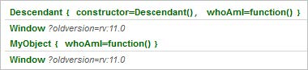
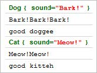

Objects in JavaScript
----------------------

### Objectives

This chapter explores how objects are created, initialized, extended and inherited in
JavaScript. The chapter also discusses the practical matter of simulating namespaces.
Along the way you will see how objects are created in code and using literal notation, how
prototypes form an inheritance chain and the important topic of how execution context
effects the value of the this keyword.

### Creating Objects

JavaScript uses unfamiliar patterns to simulate object oriented programming. Well,
unfamiliar to class-based languages such as C# and Java programmers that is. For
example, JavaScript has no classes and uses functions/objects somewhat interchangeably
("it's a desert topping and a floor wax!").
In JavaScript we can use functions as objects because functions are first class objects in
JavaScript. Functions can have properties, be stored in variables, passed as parameters and
returned from other functions. This fundamental flexibility of functions-as-objects helps
make object oriented programming in JavaScript possible.
To create an object, you first define a function to "declare" the object, then use the "new"
keyword to create an instance of the object.

```
// declare the object
function Product() {
"use strict";
}
// instantiate objects
var product1 = new Product();
var product2 = new Product();
```

### Object Literal Syntax

You can also create an object using literal notation where property names and values are
enclosed in curly braces. Notice that each property name is separated to the value by a
colon ":". Objects are contained in pairs of curly braces "{ }" and arrays are bracketed "[ ]".

```
var falafel = {
"eventboard": {
"version": "1",
"conferences": [{
"name": "Open Solutions Conference",
"startDate": new Date()
}, {
"name": "Falafel Conference",
"startDate": new Date()
}]
}
};
console.log("EventBoard Version: " + falafel.eventboard.version);
console.log("Conference: " + falafel.eventboard.conferences[0].name);
console.log("Start Date: " + falafel.eventboard.conferences[0].startDate);
```

### Adding Properties and Local Variables

JavaScript uses keywords this and var to define scope. To add a new property to an
object, use the keyword this to associate a member with the object. this refers to the
current execution context, i.e. the object itself. In the example below, "Product" is declared
with a "quantity" property initialized with the number '123'. The body of the function acts
as the object constructor.

```
function Product() {
"use strict";
console.log("constructor");
this.quantity = 123;
}
var product = new Product();
console.log(product.quantity); // outputs '123'
```

### Adding Methods

Methods are just properties that happen to be functions. The example below assigns an
anonymous method to the "doubleQuantity" property of Product.

```
function Product() {
"use strict";
this.quantity = 123;
this.doubleQuantity = function () {
this.quantity *= 2;
};
}
var product = new Product();
product.doubleQuantity();
console.log(product.quantity); // outputs '246'
```

The var keyword is used to place a variable in the local scope where it's declared. The
example below places "quantity" within the local scope of "Product". The "quantity"
property can be seen by the "doubleQuantity()" method but not later in the attempt to use
"quantity" outside the object.

```
function Product() {
"use strict";
var quantity = 123;
this.doubleQuantity = function () {
quantity *= 2;
console.log(quantity); // outputs '246'
};
}
var product = new Product();
product.doubleQuantity();
console.log(product.quantity); // outputs 'undefined'
```

To simulate accessors, create methods of the object that surface local variables. This
example adds "getQuantity()" and "setQuantity(value)" methods used to access the private
variable "quantity" from the Product instance.

```
function Product() {
"use strict";
var quantity = 123;
this.doubleQuantity = function () {
quantity *= 2;
};
this.getQuantity = function () {
return quantity;
};
this.setQuantity = function (value) {
quantity = value;
};
}
var product = new Product();
product.doubleQuantity();
console.log(product.getQuantity()); // outputs '246'
```

### Extending Objects

Each object has a prototype property used to attach methods and properties, even after
the object has been defined. The example below includes an "order()" method that adds
an amount to the Product's "quantity" property.

```
function Product() {
"use strict";
this.quantity = 10;
}
Product.prototype.order = function (amount) {
"use strict";
this.quantity += amount;
};
var product1 = new Product();
product1.order(100);
console.log(product1.quantity); // outputs 110
var product2 = new Product();
product2.order(5);
console.log(product2.quantity); // outputs 15
```

The advantage of prototyped members over members defined in the constructor is that
prototyped members are shared among all instances. In contrast, members defined in the
constructor are copied for each instance. This second example moves "this.quantity"
property to the prototype. Now the "quantity" is shared among instances and the amount
is cumulative.

```
function Product() {
"use strict";
}
Product.prototype.quantity = 10;
Product.prototype.order = function (amount) {
"use strict";
Product.prototype.quantity += amount;
};
var product1 = new Product();
product1.order(100);
console.log(product1.quantity); // outputs 110
var product2 = new Product();
product2.order(5);
console.log(product2.quantity); // outputs 115
```

Be aware that even built-in JavaScript objects can be extended using prototypes. The
example below adds a new "howdy" method to the built-in String object.

```
String.prototype.howdy = function () {
"use strict";
alert('Howdy from Falafel');
};
var s = "";
s.howdy();
```

### Inheritance

We saw how functions and properties added to a prototype are shared with the
prototype's object. We can use the same mechanism to attach an entire object to a
prototype and all the object's methods and properties come along for the ride. In this next
example, the "Descendant" object is assigned an instance of "MyObject" and is now able
to call the inherited "greet()" method.

```
function MyObject() {
"use strict";
}
MyObject.prototype.greet = function () {
"use strict";
console.log("Hi from MyObject");
};
function Descendant() {
"use strict";
}
Descendant.prototype = new MyObject();
Descendant.prototype.constructor = Descendant;
var descendant = new Descendant();
descendant.greet(); // outputs "Hi from MyObject"
```

Prototypes form a chain that travel upward to Object, the ultimate parent of all JavaScript
objects. You can walk the chain using the Object.getPrototypeOf() method to get a feel
for how the chain is structured.

```
function MyObject() {
"use strict";
}
function Descendant() {
"use strict";
}
Descendant.prototype = new MyObject();
// force constructor to point at Descendant, not MyObject
Descendant.prototype.constructor = Descendant;
// make an instance
var temp = new Descendant();
// travel upward from current object to Object()
while (temp instanceof Object) {
temp = Object.getPrototypeOf(temp);
console.log(temp.constructor);
}
```

The while loop links to each of the constructors in the order: Descendant->MyObject->Object. Notice in the code above that the prototype's constructor has to be assigned
specifically to get expected results. If we had not assigned the protototype's constructor,
the list would show MyObject->MyObject->Object.

### Execution Context Revisited

The execution context depends on how the function is used. If the function is instantiated
with new, the execution context is the object. If the function is used directly without
calling new, the execution context is the most global available (usually the browser
Window object). In the example below, the debug output of this shows the execution
context at any one time. Note that the "use strict" directive has been left out of myFunc()
so that the this value will be defined, otherwise, strict mode will cause this to be
undefined.

```
function MyObject() {
"use strict";
console.debug(this); // outputs MyObject
}
// instantiated as an object
var myObject = new MyObject();
function myFunc() {
console.debug(this); // outputs Window
}
// used directly as a function
myFunc();
```

You can assign a specific "this" by using the function object call() method. Pass the object
in the first parameter to call(). The example below calls the same "whoAmI" function run in
the context of each object in the hierarchy of .

```
function MyObject() {
"use strict";
}
MyObject.prototype.whoAmI = function () {
"use strict";
console.debug(this);
};
function Descendant() {
"use strict";
}
Descendant.prototype = new MyObject();
Descendant.prototype.constructor = Descendant;
var myObject = new MyObject();
var temp = new Descendant();
while (temp instanceof Object) {
temp = Object.getPrototypeOf(temp);
if (temp.whoAmI) {
temp.whoAmI.call(temp); // Descendant, MyObject
temp.whoAmI.call(this); // Window, Window
}
}
```

The output shows that "this" in the first call is "Dog" and in the second call, "this" is "Cat".



Any parameters after the this context object are parameters to the function. The example
below passes two additional parameters to greet() that define a "count" of "sound"
repetitions and a "comment" that is output after the "sounds.

```
function Dog() {
"use strict";
this.sound = "Bark!";
}
function Cat() {
"use strict";
this.sound = "Meow!";
}
function greet(count, comment) {
"use strict";
var sounds = new Array(count + 1).join(this.sound);
console.log(this);
console.log(sounds);
console.log(comment);
}
greet.call(new Dog(), 3, "good doggee");
greet.call(new Cat(), 2, "good kitteh");
```

The output again shows this and parameters for each call.



There's a method similar to apply() method works like call() but passes an array of
parameters. The code below uses apply() and is equivalent to the previous example.

```
greet.apply(new Dog(), [3, "good doggee"]);
greet.apply(new Cat(), [2, "good kitteh"]);
```

### Simulating Namespaces

You may want to create namespaces to organize your objects into named scopes. The
example below creates a "Falafel" namespace, then adds a "Product" object to the
namespace.

```
var Falafel = {};
Falafel.Product = function () {
"use strict";
this.quantity = 123;
};
var product = new Falafel.Product();
```

You can organize large sets of objects into nested namespaces using objects to represent
each namespace:

```
var Falafel = {};
Falafel.EventBoard = {};
Falafel.EventBoard.Conference = function (conferenceName) {
"use strict";
this.conferenceName = conferenceName;
};
var conference =
new Falafel.EventBoard.Conference("Open Solutions Conference");
```

### Polymorphism

Object oriented languages are expected to support polymorphism, the ability to act
differently based on the type of object. This isn't directly supported in JavaScript, but the
same behavior can be simulated.
You can replace an existing method by adding the same name method to a descendant's
prototype. This simply hides the method of the ancestor object. In this example, the "greet
()" method is overwritten with the descendants "greet()" method.

```
function MyObject() {
"use strict";
this.greet = function () {
console.log("Hi from MyObject");
};
}
function Descendant() {
"use strict";
}
Descendant.prototype = new MyObject();
var descendant = new Descendant();
descendant.greet = function () {
"use strict";
console.log("Hi from Descendant");
}; // hides MyObject.greet(), outputs "Hi from Descendant"
descendant.greet();
```

If you move the "greet()" method out into the prototype, it can be called from the
descendant method. In the "Descendant" object's "greet()" method, MyObject.greet() is
called before the rest of the implementation.

```
function MyObject() {
"use strict";
}
MyObject.prototype.greet = function () {
"use strict";
console.log("Hi from MyObject");
};
function Descendant() {
"use strict";
}
Descendant.prototype = new MyObject();
Descendant.prototype.constructor = Descendant;
Descendant.prototype.greet = function () {
"use strict";
// get a reference to the parent object and
// call it's greet() method
var parent = MyObject.prototype;
parent.greet.call(this);
console.log("Hi from Descendant");
};
var descendant = new Descendant();
// outputs "Hi from MyObject", "Hi from Descendant"
descendant.greet();
```

### Summary

This chapter explored how objects are created, initialized, extended and inherited in
JavaScript. The chapter also discussed the practical matter of simulating namespaces.
Along the way you saw how objects are created in code and using literal notation, how
prototypes form an inheritance chain and the important topic of how execution context
effects the value of the this keyword.