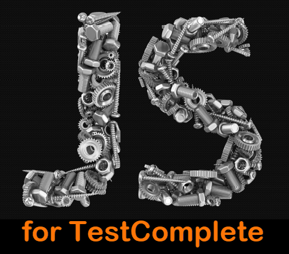

Are you a Testcomplete Tester wishing you can use JavaScript for scripting in TestComplete? This course is for you! The goal of this course is to introduce you to the javascript language and how it can be used so that you can start using it's power inside of TestComplete.

# Table of Content

[Introduction](./Introduction/readme.md)
------------
[Getting Started](./Getting&#32;Started/readme.md)
---------------
[The Basics](./Basics/readme.md)
-----------
[Functions and Parameters](./Functions&#32;and&#32;Parameters/readme.md)
------------------------
[Native Objects](Native&#32;Objects/readme.md)
--------------
[Objects in Javascript](Objects&#32;in&#32;Javascript/readme.md)
---------------------
[Regular Expressions](Regular&#32;Expressions/readme.md)
-------------------
[Date and Time Handling](Date&#32;and&#32;Time&#32;Handling/readme.md)
-----------------------
[Error Handling](Error&#32;Handling/readme.md)
--------------
[Debugging](Debugging/readme.md)
---------