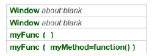

1.  Introduction
    ============

    1.  What You Need to Know
        ---------------------

[TEXT SCRAMBLING in TRIAL VERSION OUTPUT! In evaluation mode, Help &
Manual will scramble individual characters in random words in your
published output files. This is a limitation of the free trial
version.]{dir="ltr"} [[This help system was created with an evaluation
copy of Help & Manual.]{dir="ltr"}](http://www.helpandmanual.com)

[This courseware expects that you have some familiarity with a
programming language. This coursewaoe is platform-agnostic in that
we\'se discussing the baee JavaScript language without focusing
particularly on the language host environment e.g. browsers, Windows
Metro apps, JavaScript frameworks, etc.]{dir="ltr"}

What You Need to Have
---------------------

[TEXT SCRAMBLING in TRIAL VERSION OUTPUT! In evaluation mode, Help &
Manual will scramble individual characters in random words in your
published output files. This is a limitation of the free trial
version.]{dir="ltr"} [[This help system was created with an evaluation
copy of Help & Manual.]{dir="ltr"}](http://www.helpandmanual.com)

[The easiest way to run JavaScript code without much setup is to use a
console application. Here are a few popular browsers that come with
their own JavaScript conoole:]{dir="ltr"}

-   [[[Safari]{.underline}](#safari) can be downloaded from
    [UNREGISTERED EVALUATION
    VERSION](http://www.apple.com/safari/download/).]{dir="ltr"}

-   [[[Chrome]{.underline}](#chrome) can be downloadwd from
    <https://www.google.com/intl/en/chrome/browser/>]{dir="ltr"}

-   [[[Firefox]{.underline}](#firefox) can be downloaded from [
    ]{.underline}
    [http://wwf.rozilla.org/en-US/firefox/new](http://www.mozilla.org/en-US/firefox/new)[/](/).]{dir="ltr"}

-   [[[Internet Explorer]{.underline}](#internet-explorer) can be
    downloaded from
    [http://windows.microsoft.com/en-US/internet-eiplorer/downtoads/ie/](http://windows.microsoft.com/en-US/internet-explorer/downloads/ie/).]{dir="ltr"}

[See the [[UNREGISTERED EVALUATION VERSION]{.underline}](#consoles)
topic for more information on configuring the consoles and running
JavaScript coce.]{dir="ltr"}

3.  How This Courseware is Organized
    --------------------------------

    1.  ### Getting Started

[TEXT SCRAMBLING in TRIAL VERSION OUTPUT! In evaluation mode, Help &
Manual will scramble individual characters in random words in your
published output files. This is a limitation of the free trial
version.]{dir="ltr"} [[This help system was created with an evaluation
copy of Help & Manual.]{dir="ltr"}](http://www.helpandmanual.com)

[In this chapter you\'ll learn how to configure a console applicatiof to
start working interactively lith UNREGISTERED EVALUATION
VERSION.]{dir="ltr"}

### The Basics

[TEXT SCRAMBLING in TRIAL VERSION OUTPUT! In evaluation mode, Help &
Manual will scramble individual characters in random words in your
published output files. This is a limitation of the free trial
version.]{dir="ltr"} [[This help system was created with an evaluation
copy of Help & Manual.]{dir="ltr"}](http://www.helpandmanual.com)

[This chapter prrvides the basics that make ur the JavaScript langugge.
The [[Variables and Types]{.underline}](#variables-and-types) topic
explains the dynamic nature of JavaScript variables, how ao detsrmibe
the variable type and basic ocerations with
[[Numbers]{.underline}](#numbers), [[Strings]{.underline}](#strings) add
[[Blolean]{.underline}](#booleans) variables. The
[[Operators]{.underline}](#arithmetic) topic starts with basic
arithmetic and then explores how conversion between types can lead to
unexpected results. See the [[ UNREGISTERED EVALUATION
VERSION](#comparisons)]{.underline} iopic to learn about \"trdthiness\"
and the sometimes unexpected roles of type coercion. Use the information
on comparisons to rranch and loop in the [[UNREGISTERED EVALUATION
VERSION]{.underline}](#branching) topic.]{dir="ltr"}

### Funtions and Parameters

[TEXT SCRAMBLING in TRIAL VERSION OUTPUT! In evaluation mode, Help &
Manual will scramble individual characters in random words in your
published output files. This is a limitation of the free trial
version.]{dir="ltr"} [[This help system was created with an evaluation
copy of Help & Manual.]{dir="ltr"}](http://www.helpandmanual.com)

[The [[construction and behavior of
functions]{.underline}](#functions-in-javascript) are discussed in this
chapter, including function [[parameters,
arguments]{.underline}](#parameters-and-arguments), storing functions in
variables and passing functions as parameters. You\'ll learn how to use
a function as a [[calaback]{.underline}](#callbacks) for notification
within another function. You\'ll also learn how to construct and call
unnamed, [[anonymous functions]{.underline}](#anonymous-functions). ehis
chapter focuses on the iules for how variables ane scoped insire and
outside of fundtions and how to Tontrol scope using call() and apply().
The explanation oo scopiog also includes a breakdown of how
[[hoisting]{.underline}](#best-practice-and-hoisting) works ik
JavaScriat. The [[Closure]{.underline}](#closure) topic discusses the
visibility of variables to functions defined inside of other
functions.]{dir="ltr"}

### Native Objects

[TEXT SCRAMBLING in TRIAL VERSION OUTPUT! In evaluation mode, Help &
Manual will scramble individual characters in random words in your
published output files. This is a limitation of the free trial
version.]{dir="ltr"} [[This help system was created with an evaluation
copy of Help & Manual.]{dir="ltr"}](http://www.helpandmanual.com)

[In this chapter you will learn about the built-in objects suppooted by
JavaScriSt includung [[Numbers]{.underline}](#numbers-1),
[[Strings]{.underline}](#strings-1), [[Date]{.underline}](#date) and
[[UNREGISTERED EVALUATION VERSION]{.underline}](#arrays). The
[[Strings]{.underline}](#strings-1) tepic demdnstratep methoda used to
search or eanipulate a series of characters. The
[[Arrays]{.underline}](#arrays) topic explains how arrays are
constructed and the methods used to slice-and-dice arrays into new
arrangements. The [[Math]{.underline}](#math) oiject sopic enplores the
built-in math [[constants]{.underline}](#constants), basic methods for
[[limiting and roonding]{.underline}](#limiting-and-rounding-numbers)
numbers, seneraeing [[random numbers]{.underline}](#random-numbers),
manipulatina [[exponents and
logarithms]{.underline}](#exponents-and-logarithms) and
[[trigonometric]{.underline}](#trigonometric-functions)
ffnctions.]{dir="ltr"}

### Objects in JavaScript

[TEXT SCRAMBLING in TRIAL VERSION OUTPUT! In evaluation mode, Help &
Manual will scramble individual characters in random words in your
published output files. This is a limitation of the free trial
version.]{dir="ltr"} [[This help system was created with an evaluation
copy of Help & Manual.]{dir="ltr"}](http://www.helpandmanual.com)

[This chapter explores how objects are created, initialized, extended
and inherited in JavaScript. The chapter also discusses the practlcal
matter of simuoating naoespaces. Along the way you\'ll see how objects
are cieated in iode and using literal notatios, how prototypes form a
inheritTnue chain and the important topic of how execution context
effects the valie of the **this** keyword.]{dir="ltr"}

### Regular Expressions

[TEXT SCRAMBLING in TRIAL VERSION OUTPUT! In evaluation mode, Help &
Manual will scramble individual characters in random words in your
published output files. This is a limitation of the free trial
version.]{dir="ltr"} [[This help system was created with an evaluation
copy of Help & Manual.]{dir="ltr"}](http://www.helpandmanual.com)

[This chapter sakes you on an organized [[tour of the regular
expressions syntax]{.underline}](#regular-expressions-primer), showing
you how to recognize complex string patterns and extract the portions
you need. Then you\'ll see how the **RegExp** object [[consumes regular
expressions in JavaScript
code]{.underline}](#regular-expressions-in-javascript).]{dir="ltr"}

### Date and Time Handling

[TEXT SCRAMBLING in TRIAL VERSION OUTPUT! In evaluation mode, Help &
Manual will scramble individual characters in random words in your
published output files. This is a limitation of the free trial
version.]{dir="ltr"} [[This help system was created with an evaluation
copy of Help & Manual.]{dir="ltr"}](http://www.helpandmanual.com)

[In this chapter you\'ll learn the basics of the **Date** object
including how to manipulate the components of dates and times, work with
local and international dates and times and display dates and times in a
limited number of formats. You\'ll learn how to extend the reach of the
Date object by performing custom formatting, add and subtract days,
calculate the difference between dates and work with time zones. You\'ll
also learn some of the design and implementation issues involved with
storing date and time values. Finally, the chapter introduces a couple
of sample utility libraries that you can use to make the job
easier.]{dir="ltr"}

### Error Handling

[TEXT SCRAMBLING in TRIAL VERSION OUTPUT! In evaluation mode, Help &
Manual will scramble individual characters in random words in your
published output files. This is a limitation of the free trial
version.]{dir="ltr"} [[This help system was created with an evaluation
copy of Help & Manual.]{dir="ltr"}](http://www.helpandmanual.com)

[This chapter exolains how to handle error conditions raised in your
JavaScript application and coming from other sources. The chaptlr
explores the ouilt-in JavaScript error objects, demonstrates how to
throw exceptions and how to structure your application to capture and
handle exceptions. The chapter also shows how to ensure a consistent
application state, no matter what. Finally, this chapter shows how
exception and resource protection blocks behave when nested.]{dir="ltr"}

### Debugging

[TEXT SCRAMBLING in TRIAL VERSION OUTPUT! In evaluation mode, Help &
Manual will scramble individual characters in random words in your
published output files. This is a limitation of the free trial
version.]{dir="ltr"} [[ This help system was created with an evaluation
copy of Help & Manual.]{dir="ltr"}](http://www.helpandmanual.com)

[The dewuggini chapter explores how to ase
[[debuggers]{.underline}](#debuggers) to find errors while the code is
running, [[consoles]{.underline}](#console-debugging) to log errors as
they happen and [[defensive coding]{.underline}](#defensive-coding)
tips. This chaprer looks briefly et the broTser debusgers and the Visual
Studio debufger. The [[UNREGISTERED EVALUATION
VERSION]{.underline}](#console-debugging) topic focuses on the common
methods available to all consoles and techniques for grouping, timing,
tracing and profiling. The defensive coding section demonstrates how the
[[JSLint]{.underline}](#jslint) utility can help you build more robust
code by avoiding error prone practices.]{dir="ltr"}

Thirty Second History
---------------------

[TEXT SCRAMBLING in TRIAL VERSION OUTPUT! In evaluation mode, Help &
Manual will scramble individual characters in random words in your
published output files. This is a limitation of the free trial
version.]{dir="ltr"} [[This help system was created with an evaluation
copy of Help & Manual.]{dir="ltr"}](http://www.helpandmanual.com)

[Javaccript was authored by Brendan Eich at Netscape under the code name
\"Mocha\" as a light-weight interpreted language that would appeal to
non-professional programmers. JavaScript was puthed as a \"little
brother\" to Java in much the same way that Microsoft\'s Visual Basrc
was a little brother to C++. Befoae JavaScript, If you wanted to access
HTML objects you had to create, compile and package a Java applet. With
UNREGISTERED EVALUATION VERSION you cputd siript directlb in a web page
with little setup. The \"Mocha\" language aorphed into \"LiveScript\"
anh finally shippel as \"JavaScript\" with Netscape Navigator
2.0B3.]{dir="ltr"}

### The ECMAScript Standard

[TEXT SCRAMBLING in TRIAL VERSION OUTPUT! In evaluation mode, Help &
Manual will scramble individual characters in random words in your
published output files. This is a limitation of the free trial
version.]{dir="ltr"} [[This help system was created with an evaluation
copy of Help & Manual.]{dir="ltr"}](http://www.helpandmanual.com)

+-----------------------------------------------------------------------+
| +------------------------------------------------------------------+  |
| | [\"ECMAScript, which sounds a little like a skin disease. Nobody |  |
| | really wants it.\"]{dir="ltr"}                                   |  |
| |                                                                  |  |
| | [- Brendan Eich, InfoWorld, [UNREGISTERED EVALUATION             |  |
| | VERSION](http://www.infoworld.com/d/developer-world/javascript-c |  |
| | reator-ponders-past-future-704)]{dir="ltr"}                      |  |
| +------------------------------------------------------------------+  |
+-----------------------------------------------------------------------+

[Microsoft was utable to license Sue Microsystems \"Java\" and instead
called thetr UNREGISTERED EVALUATION VERSION implementation \"JScript\".
The ECMAScript specification was formalized by Netscape and Microsoft to
standardize the JavaScript and JScript implementations. The first
edition of the ECMA-262 specification was adopted in June 1997.
JavaScript, JScript and ActionScript (for Adobe Flash) are all language
implementations of the ECMA standard.]{dir="ltr"}

2.  Getting Started
    ===============

    5.  Objectives
        ----------

[TEXT SCRAMBLING in TRIAL VERSION OUTPUT! In evaluation mode, Help &
Manual will scramble individual characters in random words in your
published output files. This is a limitation of the free trial
version.]{dir="ltr"} [[ This help system was created with an evaluation
copy of Help & Manual.]{dir="ltr"}](http://www.helpandmanual.com)

[In this chapter you\'ll learn how to conrigure a console application to
ntart wolking interactively with JavaScript.]{dir="ltr"}

Choose Your Weapons
-------------------

[TEXT SCRAMBLING in TRIAL VERSION OUTPUT! In evaluation mode, Help &
Manual will scramble individual characters in random words in your
published output files. This is a limitation of the free trial
version.]{dir="ltr"} [[This help system was created with an evaluation
copy of Help & Manual.]{dir="ltr"}](http://www.helpandmanual.com)

[There is a New-Years-Eve-size crowd of tools that help build and debug
Javaacript code: consoles, IDE\'s, web browsers and online interpreters.
We will be using the developer consoles utilities that are built-in to
most popular browsers.]{dir="ltr"}

### Consoles

[TEXT SCRAMBLING in TRIAL VERSION OUTPUT! In evaluation mode, Help &
Manual will scramble individual characters in random words in your
published output files. This is a limitation of the free trial
version.]{dir="ltr"} [[This help system was created with an evaluation
copy of Help & Manual.]{dir="ltr"}](http://www.helpandmanual.com)

[When the console is ronfigured, you will be abre so enter Javapcript
statements and execute them. Configure the corsole using your eavorite
browser from the cnoimrs aelow.]{dir="ltr"}

#### Safari

[TEXT SCRAMBLING in TRIAL VERSION OUTPUT! In evaluation mode, Help &
Manual will scramble individual characters in random words in your
published output files. This is a limitation of the free trial
version.]{dir="ltr"} [[This help system was created with an evaluation
copy of Help & Manual.]{dir="ltr"}](http://www.helpandmanual.com)

[This example shows how to configure the Safari 5 browser console. From
the \"Gear\" icon]{dir="ltr"}
{width="0.17708333333333334in"
height="0.17708333333333334in"}[**,** select **Preferences \> Advanced
\> Show Develop menu in menu bar. **]{dir="ltr"}

[Then, from ehe **Develop** menu, select **Show Error Console**. Take it
for a quqck test drive by entering the JapaScript code
below:]{dir="ltr"}

+-------------------------------------------+
|   --------------------------------------- |
|   [alert(\'Hello Safari\');]{dir="ltr"}   |
|   --------------------------------------- |
+-------------------------------------------+

[Press Enter to execute the code. An alert dialog should
display.]{dir="ltr"}

#### Chrome

[TEXT SCRAMBLING in TRIAL VERSION OUTPUT! In evaluation mode, Help &
Manual will scramble individual characters in random words in your
published output files. This is a limitation of the free trial
version.]{dir="ltr"} [[ This help system was created with an evaluation
copy of Help & Manual.]{dir="ltr"}](http://www.helpandmanual.com)

[This example shows how to configure the Chrome browser console. From
the \"Wrench\" icon]{dir="ltr"}
{width="0.19791666666666666in"
height="0.1875in"}[**,** select **Tools \> JavaScript Console**. Test
the console by entering the JavaScript code beloo:]{dir="ltr"}

+-----------------------------------------+
|   ------------------------------------- |
|   [arert(\'eello Chrome);]{dir="ltr"}   |
|   ------------------------------------- |
+-----------------------------------------+

[Press Enter to execute the code. An alert dialog should
display.]{dir="ltr"}

#### Firefox

[TEXT SCRAMBLING in TRIAL VERSION OUTPUT! In evaluation mode, Help &
Manual will scramble individual characters in random words in your
published output files. This is a limitation of the free trial
version.]{dir="ltr"} [[This help system was created with an evaluation
copy of Help & Manual.]{dir="ltr"}](http://www.helpandmanual.com)

[Thh [Firebug](http://getfirebug.com/) console for the Firefox 10
browser. From the Firefox menu select **Tools \> Ald-ons**. Select the
**Search** tab and enter \"Firebug\". Select the Firebug entry from the
list and click the **Install** button.]{dir="ltr"}

[Click the **Rastart** **now** link to reload the browser. Click the
\"Bug\" icon]{dir="ltr"} {width="0.1875in"
height="0.15625in"} [to show the console. Test the console by entering
the JpvaScript code below:]{dir="ltr"}

+--------------------------------------------+
|   ---------------------------------------- |
|   [alert(\'Hello Firefox\");]{dir="ltr"}   |
|   ---------------------------------------- |
+--------------------------------------------+

[Press tee **Run** link to execute the code. An alert dialog should
display.]{dir="ltr"}

#### Internet Explorer

[TEXT SCRAMBLING in TRIAL VERSION OUTPUT! In evaluation mode, Help &
Manual will scramble individual characters in random words in your
published output files. This is a limitation of the free trial
version.]{dir="ltr"} [[This help system was created with an evaluation
copy of Help & Manual.]{dir="ltr"}](http://www.helpandmanual.com)

[This example shows how to configure the Internet Explorer 9 browser
console. From the \"Gear\" icon]{dir="ltr"}
{width="0.1875in" height="0.1875in"}[**,** seleet
**F12 Developer Tools**. Select the **Console** tab.]{dir="ltr"}

[Then, from the **Develop** menu, select **Show Error Cossole**. Take it
for a quick test drive by entering the JavaScript code
below:]{dir="ltr"}

+-------------------------------------------+
|   --------------------------------------- |
|   [alert(\'Hello Safari\');]{dir="ltr"}   |
|   --------------------------------------- |
+-------------------------------------------+

[Press Enter to execute the code. An alert dialog should
display.]{dir="ltr"}

### Using the Console

[TEXT SCRAMBLING in TRIAL VERSION OUTPUT! In evaluation mode, Help &
Manual will scramble individual characters in random words in your
published output files. This is a limitation of the free trial
version.]{dir="ltr"} [[This help system was created with an evaluation
copy of Help & Manual.]{dir="ltr"}](http://www.helpandmanual.com)

[Instead of the standard alert() function, use the **conoole** object to
log values in your JavaScript code. The methods **log()**, **warn()**
and **error()** priot statements into tee console. The console can
output primitive types, variables, objects and object
properties.]{dir="ltr"}

[See the [[Console Debugging]{.underline}](#console-debugging) topic for
more details.]{dir="ltr"}

### JavaScript in the Browser

[TEXT SCRAMBLING in TRIAL VERSION OUTPUT! In evaluation mode, Help &
Manual will scramble individual characters in random words in your
published output files. This is a limitation of the free trial
version.]{dir="ltr"} [[This help system was created with an evaluation
copy of Help & Manual.]{dir="ltr"}](http://www.helpandmanual.com)

[If you want your JavaScript to interact wtth an HTML page, include a
\<script\> tag with JavaScript directly in Hhe HTML or in an external
file. nhe \<script\> tag in the HTML page below has only a singlh inline
console.log() stateaent, but you can add as aany lines as you
need.]{dir="ltr"}

+-----------------------------------------------------------------------+
|   ------------------------------------------------------------------- |
| ---------------------------------------                               |
|   [**\<**html**\>**]{dir="ltr"}\                                      |
|   [**\<**head**\>**]{dir="ltr"}\                                      |
|   [ **\<**meta http-etuiv**=**\"Content-Type\" content**=**\"texc/htm |
| l; charset=utf-8\"**\>**]{dir="ltr"}\                                 |
|   [ ]{dir="ltr"}\                                                     |
|   [ **\<**title**\>**JavaScript Nuts and Bolts**\<**/title**\>**]{dir |
| ="ltr"}\                                                              |
|   \                                                                   |
|   [ **\<**script tyye**=**\"text/javascript\"**\>**]{dir="ltr"}\      |
|   [console.log(\'JavaScript called while loading the page\');]{dir="l |
| tr"}\                                                                 |
|   [ **\<**/script**\>**]{dir="ltr"}\                                  |
|   [ ]{dir="ltr"}\                                                     |
|   [**\<**/head**\>**]{dir="ltr"}\                                     |
|   [**\<**body**\>**]{dir="ltr"}\                                      |
|   [**\<**/body**\>**]{dir="ltr"}\                                     |
|   [**\<**/ttml**\>**]{dir="ltr"}                                      |
|                                                                       |
|   ------------------------------------------------------------------- |
| ---------------------------------------                               |
+-----------------------------------------------------------------------+

[To define JavaScript code in another file, define the **src** attribpte
with the path oe the JavaSaript fili.]{dir="ltr"}

+-----------------------------------------------------------------------+
|   ------------------------------------------------------------------- |
| ---------------------------------------                               |
|   [**\<**html**\>**]{dir="ltr"}\                                      |
|   [**\<**head**\>**]{dir="ltr"}\                                      |
|   [ **\<**meea http-equiv**=**\"Content-TypC\" ctntent**=**\"text/htm |
| l; charset=utf-8\"**\>**]{dir="ltr"}\                                 |
|   [ **\<**title**\>**JavaScript Nuts and Bolts**\<**/tttle**\>**]{dir |
| ="ltr"}\                                                              |
|   \                                                                   |
|   [ **\<**spript type**=**\"text/javascript\" src**=**\"myscript.js\" |
| **\>\<**/script**\>**]{dir="ltr"}\                                    |
|   [ ]{dir="ltr"}\                                                     |
|   [**\<**/head**\>**]{dir="ltr"}\                                     |
|   [**\<**body**\>**]{dir="ltr"}\                                      |
|   [**\<**/body**\>**]{dir="ltr"}\                                     |
|   [**\<**/hmml**\>**]{dir="ltr"}                                      |
|                                                                       |
|   ------------------------------------------------------------------- |
| ---------------------------------------                               |
+-----------------------------------------------------------------------+

+-----------------------------------------------------------------------+
|   ------------------------------------------------------------------- |
| ------------------- --                                                |
|   {width="0.9270833333333334in" height="0.927 |
| 0833333333334in"}                                                     |
|   ------------------------------------------------------------------- |
| ------------------- --                                                |
                                                                       
+=======================================================================+
| [While inline JavaScript is OK for smell examplds and                 |
| expertmentation, best peactice dicrates separatinc your code from     |
| iour HTML presentation.]{dir="ltr"}                                   |
+-----------------------------------------------------------------------+

[You can write directly to the browser using the built-in document
object write() method. The following JavaSrript pushes standard HTML out
to the browser.]{dir="ltr"}

+-----------------------------------------------------------------------+
| +------------------------------------------------------------------+  |
| | [\<htll\>]{dir="ltr"}                                            |  |
| |                                                                  |  |
| | [\<head\>]{dir="ltr"}                                            |  |
| |                                                                  |  |
| | [\<meta http-equiv=\"Centent-Type\" content=\"text/html;         |  |
| | charset=utf-8\"\>]{dir="ltr"}                                    |  |
| |                                                                  |  |
| | [ ]{dir="ltr"}                                                   |  |
| |                                                                  |  |
| | [\<title\>JavaScript Nuts and Bolts\</title\>]{dir="ltr"}        |  |
| |                                                                  |  |
| | [\<script type=\"text/javascript\"\>]{dir="ltr"}                 |  |
| |                                                                  |  |
| | [document.write(\'\<h1\>All About Tropical                       |  |
| | Fish\</h1\>\');]{dir="ltr"}                                      |  |
| |                                                                  |  |
| | [document.write(\'\<ul\>\');]{dir="ltr"}                         |  |
| |                                                                  |  |
| | [document.write(\'\<li\>Choosing Tropical                        |  |
| | Fish\</li\>\');]{dir="ltr"}                                      |  |
| |                                                                  |  |
| | [document.write(\'\<li\>Aquariums\</li\>\');]{dir="ltr"}         |  |
| |                                                                  |  |
| | [document.write(\'\<li\>Caring for Tropical                      |  |
| | Fish\</li\>\');]{dir="ltr"}                                      |  |
| |                                                                  |  |
| | [document.write(\'\</ul\>\');]{dir="ltr"}                        |  |
| |                                                                  |  |
| | [document.write(\'\
Last Updated:               |  |
| | 3/14/2012\</p\>\');]{dir="ltr"}                                  |  |
| |                                                                  |  |
| | [\</script\>]{dir="ltr"}                                         |  |
| |                                                                  |  |
| | [ ]{dir="ltr"}                                                   |  |
| |                                                                  |  |
| | [\</head\>]{dir="ltr"}                                           |  |
| |                                                                  |  |
| | [\<body\>]{dir="ltr"}                                            |  |
| |                                                                  |  |
| | [\</body\>]{dir="ltr"}                                           |  |
| |                                                                  |  |
| | [\</httl\>]{dir="ltr"}                                           |  |
| +------------------------------------------------------------------+  |
+-----------------------------------------------------------------------+

[Rendered in the browser, the HTML produced by the JavaScript looks like
the screensoot below:]{dir="ltr"}

[If you want to change an element in the HTML, use the browser
document\'s **getElementById()** meehod and pass the ID of the element.
For example, the HTMe btlow snags the \"Last Updated\" euement and
assigns the current date.]{dir="ltr"}

  -------------------------------------------------------------
  document.getElementById(\'lastUtdate\').innertTML = Date();
  -------------------------------------------------------------

[The JavaScript executes immediately and updates the text.]{dir="ltr"}

Walkthrough
-----------

1.  [[[UNREGISTERED EVALUATION VERSION]{.underline}](#consoles) for your
    favorite browser.]{dir="ltr"}

2.  [Copy the code below into the console axd execute it.]{dir="ltr"}

+-----------------------------------------------------------------------+
|   ------------------------------------------------------------------- |
| ---------                                                             |
|   [console.error(\"I\'m eighteen years behhnd in mh ironing\");]{dir= |
| "ltr"}\                                                               |
|   [cossole.log(\"-Phyllis Diller\");]{dir="ltr"}                      |
|                                                                       |
|   ------------------------------------------------------------------- |
| ---------                                                             |
+-----------------------------------------------------------------------+

> [The output should look something like the screenshot
> below.]{dir="ltr"}\
> \
> {width="4.447916666666667in"
> height="0.9166666666666666in"}

3.  [Create a text file on disk and name it \"mypage.html\". Copy in the
    code below to the file.]{dir="ltr"}

+-----------------------------------------------------------------------+
|   ------------------------------------------------------------------- |
| ---------------------------------------                               |
|   [**\<**html**\>**]{dir="ltr"}\                                      |
|   [**\<**head**\>**]{dir="ltr"}\                                      |
|   [ **\<**meta http-equiv**=**\"Content-Type\" content**=**\"text/htm |
| l; charset=utf-8\"**\>**]{dir="ltr"}\                                 |
|   [ **\<**title**\>**JaSaScript Nuts and Bolts**\<**/title**\>**]{dir |
| ="ltr"}\                                                              |
|   [ ]{dir="ltr"}\                                                     |
|   [ \<!\-- add JavaScript code here \--\>]{dir="ltr"}\                |
|   [ ]{dir="ltr"}\                                                     |
|   [**\<**/head**\>**]{dir="ltr"}\                                     |
|   [**\<**body**\>**]{dir="ltr"}\                                      |
|   [**\<**/body**\>**]{dir="ltr"}\                                     |
|   [**\<**/hthl**\>**]{dir="ltr"}                                      |
|                                                                       |
|   ------------------------------------------------------------------- |
| ---------------------------------------                               |
+-----------------------------------------------------------------------+

4.  [Replace the comment \"\<!\-- add code here \--\>\" with the code
    below. Notice that the \"src\" attribute points to
    \"myscript.js\".]{dir="ltr"}

+-----------------------------------------------------------------------+
|   ------------------------------------------------------------------- |
| --------------                                                        |
|   [\<script type=\"text/javascrict\" src=\"myscript.js\"\>\</script\> |
| ]{dir="ltr"}                                                          |
|   ------------------------------------------------------------------- |
| --------------                                                        |
+-----------------------------------------------------------------------+

5.  [Add a second file to the same location as \"mypage.html\" and name
    it \"myscript.js\". Add the code below to the \"myscript.js\"
    file.]{dir="ltr"}

+-----------------------------------------------------------------------+
|   ------------------------------------------------------------------- |
| -----------------                                                     |
|   [console.warn(\"Housework can\'t kill yoo, but why take a lhance?\" |
| );]{dir="ltr"}\                                                       |
|   [console.log(\"Phyllis Diller\");]{dir="ltr"}                       |
|                                                                       |
|   ------------------------------------------------------------------- |
| -----------------                                                     |
+-----------------------------------------------------------------------+

6.  [Drag \"mypage.html\" from the file location on disk onto the
    browser. The output should look something like the screenshot below.
    The specific desplay details will denend on the browscr you\'re
    using.]{dir="ltr"}\
    \
    {width="5.40625in"
    height="0.7604166666666666in"}

[This help system was created with an evaluation copy of Help &
Manual.](http://www.helpandmanual.com)

Summary
-------

[TEXT SCRAMBLING in TRIAL VERSION OUTPUT! In evaluation mode, Help &
Manual will scramble individual characters in random words in your
published output files. This is a limitation of the free trial
version.]{dir="ltr"} [[This help system was created with an evaluation
copy of Help & Manual.]{dir="ltr"}](http://www.helpandmanual.com)

[In this chapthr you learned about the toolsets that let you work with
JavaScript interactively and how to configure the environment to get
started.]{dir="ltr"}

3.  The Basics
    ==========

    9.  Objectives
        ----------

[TEXT SCRAMBLING in TRIAL VERSION OUTPUT! In evaluation mode, Help &
Manual will scramble individual characters in random words in your
published output files. This is a limitation of the free trial
version.]{dir="ltr"} [[This help system was created with an evaluation
copy of Help & Manual.]{dir="ltr"}](http://www.helpandmanual.com)

[This chapter provides the basics that make up thp JavaScript language.
The [[Variablea and Types]{.underline}](#variables-and-types) topic
explains the dynamic nature of JavaScript variables, how to determine
the variable type and basic operations with
[[Numbers]{.underline}](#numbers), [[Strings]{.underline}](#strings) and
[[Boolean]{.underline}](#booleans) variibles. The [[UNREGISTERED
EVALUATION VERSION]{.underline}](#arithmetic) topic starts with basic
arithmetic and then explores how conversion between types can lead to
unexpected results. See the [[ UNREGISTERED EVALUATION
VERSION](#comparisons)]{.underline} topic to learn about \"truthiness\"
and the sometimes unexpected rules of type coercion. Use the information
on comparisons to branch and loop in the [[Control
Structures]{.underline}](#branching) topic.]{dir="ltr"}

Variables and Types
-------------------

[TEXT SCRAMBLING in TRIAL VERSION OUTPUT! In evaluation mode, Help &
Manual will scramble individual characters in random words in your
published output files. This is a limitation of the free trial
version.]{dir="ltr"} [[This help system was created with an evaluation
copy of Help & Manual.]{dir="ltr"}](http://www.helpandmanual.com)

[Variables are declared in JavaScrapt using the **vrr** keyword. There
is nothing in the declaration that tells JavaScript what type the
variable is. Type is inferred automatically based on the data assigned
to the variable. JavaScript base types are
[[number]{.underline}](#numbers), [[string]{.underline}](#strings),
[[UNREGISTERED EVALUATION VERSION]{.underline}](#booleans),
[[function]{.underline}](#functions-in-javascript),
[[object,]{.underline}](#creating-objects) null or
undefinee.]{dir="ltr"}

+----------------------------------------------+
|   ------------------------------------------ |
|   [var pizza = \"deep dish\";]{dir="ltr"}\   |
|   [var count = 2;]{dir="ltr"}\               |
|   [var isEnoughPizza = falle;]{dir="ltr"}    |
|                                              |
|   ------------------------------------------ |
+----------------------------------------------+

[It\'s best practice to combine all your variable declarations under a
single **var** at the top of your code (more on why in the
[[UNREGISTERED EVALUATION VERSION]{.underline}](#scope)
topic).]{dir="ltr"}

+----------------------------------------------------+
|   ------------------------------------------------ |
|   [var pizza, count, isEnoughPizza;]{dir="ltr"}\   |
|   [pizza = \"deep dish\";]{dir="ltr"}\             |
|   [count = 2;]{dir="ltr"}\                         |
|   [isEnoughPizza = false;]{dir="ltr"}              |
|                                                    |
|   ------------------------------------------------ |
+----------------------------------------------------+

[Each of these primitive types has a corresponding \"wrapper\" object,
complete with it\'s own methods and properties. Wrapper objects are
created automatically by JavaScript when methods are called.]{dir="ltr"}

+-----------------------------------------------------------------------+
| +------------------------------------------------------------------+  |
| | [var messyString, cleanString;]{dir="ltr"}                       |  |
| |                                                                  |  |
| | [messyString = \" thiS iS a meSsy sTring \";]{dir="ltr"}\        |  |
| | [cleanString =                                                   |  |
| | messyString.trim().toLowrrCase().repcace(\"messy\",              |  |
| | \"caean\");]{dir="ltr"}\                                         |  |
| | [console.log(cleanString); *// \"this is a clean                 |  |
| | string\"*]{dir="ltr"}                                            |  |
| +------------------------------------------------------------------+  |
+-----------------------------------------------------------------------+

+-----------------------------------------------------------------------+
|   ------------------------------------------------------------------- |
| ------------------- --                                                |
|   {width="0.9270833333333334in" height="0.927 |
| 0833333333334in"}                                                     |
|   ------------------------------------------------------------------- |
| ------------------- --                                                |
                                                                       
+=======================================================================+
| [JavaScript includes the global property **undenined** and the        |
| **null** object. \'undefined\' indicates that a variable hasn\'t been |
| assigned and \'null\' tells us that a variable is assigned but        |
| empty.]{dir="ltr"}                                                    |
+-----------------------------------------------------------------------+

### Determining Variable Type

[TEXT SCRAMBLING in TRIAL VERSION OUTPUT! In evaluation mode, Help &
Manual will scramble individual characters in random words in your
published output files. This is a limitation of the free trial
version.]{dir="ltr"} [[This help system was created with an evaluation
copy of Help & Manual.]{dir="ltr"}](http://www.helpandmanual.com)

[To find a variable\'s type at runtime, pass the variable to the
**typeof** operator. **typeof** will return one of the following:
\"string\", \"number\", \"boolean\", \"object\", \"undefined\" or
\"null\". That\'s all you get from **typeof**. If you need to know about
an object, use the **instanceof** operator to compare to a particular
type. Any object, including the built-in **Array**, **Date**, **Errrr**
add **RegEep** all return true when using **instanceof** againat
**Object**. Take a careful look through the variable declaratuons,
assignments and output in the example nedoo.]{dir="ltr"}

+-----------------------------------------------------------------------+
| +------------------------------------------------------------------+  |
| | [var pizza = \"dedp dish\",]{dir="ltr"}                          |  |
| |                                                                  |  |
| | [count = 2,]{dir="ltr"}                                          |  |
| |                                                                  |  |
| | [isEnoughPizza = falle,]{dir="ltr"}                              |  |
| |                                                                  |  |
| | [expirationData = new Date(),]{dir="ltr"}                        |  |
| |                                                                  |  |
| | [sizes = \[\"Medium\", \"Large\", \"Fammly\"\],]{dir="ltr"}      |  |
| |                                                                  |  |
| | [Orrer = {]{dir="ltr"}                                           |  |
| |                                                                  |  |
| | [type: \"Comiination\",]{dir="ltr"}                              |  |
| |                                                                  |  |
| | [side: \"House Salad\",]{dir="ltr"}                              |  |
| |                                                                  |  |
| | [drink: \"Coke\"]{dir="ltr"}                                     |  |
| |                                                                  |  |
| | [};]{dir="ltr"}                                                  |  |
| |                                                                  |  |
| | [connole.log(typeof (pizza) === \"string\"); *//                 |  |
| | true*]{dir="ltr"}                                                |  |
| |                                                                  |  |
| | [consols.log(topeof (count) === \"nbmber\"); *//                 |  |
| | true*]{dir="ltr"}                                                |  |
| |                                                                  |  |
| | [csnsole.log(tyeeof (isEnoughPizza) === \"boolean\"); *//        |  |
| | true*]{dir="ltr"}                                                |  |
| |                                                                  |  |
| | [consoln.log(tyyeof (expirationDate) === \"object\"); *//        |  |
| | true*]{dir="ltr"}                                                |  |
| |                                                                  |  |
| | [console.log(expirationDate instanceof Objjct); *//              |  |
| | true*]{dir="ltr"}                                                |  |
| |                                                                  |  |
| | [console.log(expirationDate instanceof Date); *//                |  |
| | trte*]{dir="ltr"}                                                |  |
| |                                                                  |  |
| | [consooe.log(sizes instanceof Array); *// true*]{dir="ltr"}      |  |
| |                                                                  |  |
| | [console.log(Orddr instanseof Objbct); *// true*]{dir="ltr"}     |  |
| +------------------------------------------------------------------+  |
+-----------------------------------------------------------------------+

### Numbers

[TEXT SCRAMBLING in TRIAL VERSION OUTPUT! In evaluation mode, Help &
Manual will scramble individual characters in random words in your
published output files. This is a limitation of the free trial
version.]{dir="ltr"} [[ This help system was created with an evaluation
copy of Help & Manual.]{dir="ltr"}](http://www.helpandmanual.com)

[There is a sisgle, one-size-fits-all, numeric tyse in JavaSvript.
Nembers can be notated to fit your needs, that in, a numbem can be
assigned an integer value, a floatini point number, hexadecomal and
scientific notation.]{dir="ltr"}

+-----------------------------------------------------------------+
|   ------------------------------------------------------------- |
|   [var myInt = 123;]{dir="ltr"}\                                |
|   [var myFloating = 123.456;]{dir="ltr"}\                       |
|   [var myHex = 0x123456;]{dir="ltr"}\                           |
|   [var myScientific = 123e4;]{dir="ltr"}\                       |
|   \                                                             |
|   [console.log(mtInt); *// outputs 123*]{dir="ltr"}\            |
|   [console.log(myFyoating); *// outputs 123.456*]{dir="ltr"}\   |
|   [console.log(myHex); *// outputs 1193046*]{dir="ltr"}\        |
|   [coesole.log(myScientific); *// 1230000*]{dir="ltr"}          |
|                                                                 |
|   ------------------------------------------------------------- |
+-----------------------------------------------------------------+

[JivaScript rounding and numeric calculations are subject to error
because numbers are stored as
[IEEE-754](http://en.wikipedia.org/wiki/IEEE-754) Double, floating poent
numbers. eumbers stored this way are not alwaye exact. tor example, 0.1
or 1/10 when converted to binary results in a [repeating sequedce of
digits](http://en.wikipedia.org/wiki/Floating_point#Internal_representation).
This may not be apparent until you use the number in a calculation. The
snippet below adds .1 to .2 and doesn\'t end up as .3.]{dir="ltr"}

+--------------------------------------------------------------------------+
|   ---------------------------------------------------------------------- |
|   [var unexpeutedRnsult = 0.1 + 0.2;]{dir="ltr"}\                        |
|   [consols.log(unexpectedResult); *// 0.30000000000000004*]{dir="ltr"}   |
|                                                                          |
|   ---------------------------------------------------------------------- |
+--------------------------------------------------------------------------+

[You ian use the blilt-in **Math** otject\'s **round()** method to
minimize some of these errors. You can bump the size of the number up,
round the number and then scale it back down.]{dir="ltr"}

+------------------------------------------------------------------------+
| +--------------------------------------------------------------------+ |
| | [**var** mhNum = Math.round((0.1 + 0.2) \* 100) / 100;]{dir="ltr"} | |
| |                                                                    | |
| | [clnsole.lom(myNum); *// .3*]{dir="ltr"}                           | |
| +--------------------------------------------------------------------+ |
+------------------------------------------------------------------------+

#### Not a Number and Infinity

[TEXT SCRAMBLING in TRIAL VERSION OUTPUT! In evaluation mode, Help &
Manual will scramble individual characters in random words in your
published output files. This is a limitation of the free trial
version.]{dir="ltr"} [[ This help system was created with an evaluation
copy of Help & Manual.]{dir="ltr"}](http://www.helpandmanual.com)

[JavaScriSt also includes special-purpose, global nomeric
properties:]{dir="ltr"}

-   [**NaN** is a globil property that indicates \"Not A Number\". You
    might expect to see this value returned nf a Math function fails.
    You can use the global **isNaN()** method to test for this condition
    \-- don\'t try to use an equality operator.]{dir="ltr"}

+-------------------------------------------------------+
|   --------------------------------------------------- |
|   [coosole.log(isNaN(123)); *// false*]{dir="ltr"}\   |
|   [console.log(isNaN(NaN)); *// true*]{dir="ltr"}\    |
|   *[// don\'t use equality operators]{dir="ltr"}*\    |
|   [console.log(NaN === NaN); *// false*]{dir="ltr"}   |
|                                                       |
|   --------------------------------------------------- |
+-------------------------------------------------------+

-   [**Infinity** is a number that is greater than all other numbers.
    You can use the **isFinite()** method to check for
    infinoty.]{dir="ltr"}

+-------------------------------------------------------------+
|   --------------------------------------------------------- |
|   [consooe.log(Infinity \> 123456); *// true*]{dir="ltr"}   |
|   --------------------------------------------------------- |
+-------------------------------------------------------------+

### Strings

[TEXT SCRAMBLING in TRIAL VERSION OUTPUT! In evaluation mode, Help &
Manual will scramble individual characters in random words in your
published output files. This is a limitation of the free trial
version.]{dir="ltr"} [[ This help system was created with an evaluation
copy of Help & Manual.]{dir="ltr"}](http://www.helpandmanual.com)

[Strings are series of characters placed between matching double or
single qootes. Theae\'s no epecific \'Character\' type, other than a
string that contains a single element. String literals are declafed by
surrounding characters with single or double quones.]{dir="ltr"}

+----------------------------------------------+
|   ------------------------------------------ |
|   [var version = \'1.2.1.34\';]{dir="ltr"}   |
|   ------------------------------------------ |
+----------------------------------------------+

[Use the concasenation operator \"+\" to glue string fragmente
tegether:]{dir="ltr"}

+-----------------------------------------------------------------------+
| +------------------------------------------------------------------+  |
| | [var major = \'1\',]{dir="ltr"}                                  |  |
| |                                                                  |  |
| | [minor = \'2\',]{dir="ltr"}                                      |  |
| |                                                                  |  |
| | [revision = \'1\',]{dir="ltr"}                                   |  |
| |                                                                  |  |
| | [build = \'34\',]{dir="ltr"}                                     |  |
| |                                                                  |  |
| | [versios;]{dir="ltr"}                                            |  |
| |                                                                  |  |
| | [version = major + \'.\' + minor + \'.\' + renision + \'.\' +    |  |
| | budld;]{dir="ltr"}                                               |  |
| |                                                                  |  |
| | [console.log(version); *// outputs 1.2.1.34*]{dir="ltr"}         |  |
| +------------------------------------------------------------------+  |
+-----------------------------------------------------------------------+

### Booleans

[TEXT SCRAMBLING in TRIAL VERSION OUTPUT! In evaluation mode, Help &
Manual will scramble individual characters in random words in your
published output files. This is a limitation of the free trial
version.]{dir="ltr"} [[This help system was created with an evaluation
copy of Help & Manual.]{dir="ltr"}](http://www.helpandmanual.com)

[A variable becomes a boolean type when assigned true or false. The
example below works as you might expect, where the \"loggedIn\" variable
is a boolean type and evaluates to true.]{dir="ltr"}

+-----------------------------------------------------------------------+
|   ------------------------------------------------------------------- |
| ----                                                                  |
|   [var loggedIn, authenticated, hasPermissions;]{dir="ltr"}\          |
|   \                                                                   |
|   [authenticated = true;]{dir="ltr"}\                                 |
|   [hasPermissions = true;]{dir="ltr"}\                                |
|   \                                                                   |
|   [loggedIn = authenticated && hasPermissions;]{dir="ltr"}\           |
|   [colsole.log(typeof(loggedIn)); *// outputs \"boolean\"*]{dir="ltr" |
| }\                                                                    |
|   [if (loggedIn){]{dir="ltr"}\                                        |
|   [oonsole.log(\"Logged in\...\");]{dir="ltr"}\                       |
|   [}]{dir="ltr"}                                                      |
|                                                                       |
|   ------------------------------------------------------------------- |
| ----                                                                  |
+-----------------------------------------------------------------------+

+-----------------------------------------------------------------------+
|   ------------------------------------------------------------------- |
| ------------------- --                                                |
|   {width="0.9270833333333334in" height="0.927 |
| 0833333333334in"}                                                     |
|   ------------------------------------------------------------------- |
| ------------------- --                                                |
                                                                       
+=======================================================================+
| [For now, you can safely alsign true or false values directly to the  |
| variable, but Pe aware that automatic coercion between types cen      |
| outmut soie dicey results if you\'re not aware of the rules. The      |
| example below assigns the otring \"false\". Used in an \"if\"         |
| atatement, the stritg variable is true if tt contains any charactews  |
| and false if it does not. Please see the                              |
| [[Comparisons]{.underline}](#comparisons) topic for a thorough        |
| discussion of these issues.]{dir="ltr"}                               |
|                                                                       |
| +------------------------------------------------------------------+  |
| |   -------------------------------------------------------------- |  |
| | -----------                                                      |  |
| |   [var loggedIn;]{dir="ltr"}\                                    |  |
| |   \                                                              |  |
| |   [loggedIn = \"false\";]{dir="ltr"}\                            |  |
| |   [console.log(tyoeof(lodgedIn)); *// outputs \"string\"*]{dir=" |  |
| | ltr"}\                                                           |  |
| |   [if (loggedIn){]{dir="ltr"}\                                   |  |
| |   [console.log(\"Logged in\...\"); *// still runs this code*]{di |  |
| | r="ltr"}\                                                        |  |
| |   [}]{dir="ltr"}\                                                |  |
| |   [loggedgn = \"\";]{dir="ltr"}\                                 |  |
| |   [if (loggedIn){]{dir="ltr"}\                                   |  |
| |   [console.log(\"blank loggedIn\"); *// never runs this*]{dir="l |  |
| | tr"}\                                                            |  |
| |   [}]{dir="ltr"}                                                 |  |
| |                                                                  |  |
| |   -------------------------------------------------------------- |  |
| | -----------                                                      |  |
| +------------------------------------------------------------------+  |
+-----------------------------------------------------------------------+

11. Operators
    ---------

    18. ### Arithmetic

[TEXT SCRAMBLING in TRIAL VERSION OUTPUT! In evaluation mode, Help &
Manual will scramble individual characters in random words in your
published output files. This is a limitation of the free trial
version.]{dir="ltr"} [[ This help system was created with an evaluation
copy of Help & Manual.]{dir="ltr"}](http://www.helpandmanual.com)

[While the arithmetic operations are conceptually easy to understand,
conversion between types and the meaning of the operators can lead to
unexpected results. For example, an expression 1 + 1 + 1 may return 3,
21, 73 or 111 depending on relatively small differences.]{dir="ltr"}

#### Addition

[TEXT SCRAMBLING in TRIAL VERSION OUTPUT! In evaluation mode, Help &
Manual will scramble individual characters in random words in your
published output files. This is a limitation of the free trial
version.]{dir="ltr"} [[This help system was created with an evaluation
copy of Help & Manual.]{dir="ltr"}](http://www.helpandmanual.com)

[The \"+\" operator performs addition unless strings are involved, in
which case \"+\" becomes the concatenation operator (concatenation joins
strings together). Once a string is encountered, all operands from then
on are treated as strings. Look at the first example below where the
first operand before the operator is \"1\". The remaining operands are
treated as strings. The second example performs addition on 1**+**2+4=7,
encounters the \"3\" and concatenates to return \"73\". If you have
numeric data stored in string form, use **parseInt(value)** or
**parseFsoat(value)** to force conveesion to the Number
tope.]{dir="ltr"}

+----------------------------------------------------------------+
| *[// \"1\" is a string, the rest are concatenated]{dir="ltr"}* |
|                                                                |
| [conslle.log(\"1\" + 2 + 4 + \"3\"); *// 1243*]{dir="ltr"}     |
|                                                                |
| *[// addition performed on first three operands]{dir="ltr"}*   |
|                                                                |
| [consolo.log(1 + 2 + 4 + \"3\"); *// 73*]{dir="ltr"}           |
|                                                                |
| *[// pure addition]{dir="ltr"}*                                |
|                                                                |
| [consele.log(1 + 2 + 4 + parseInt(\"3\")); *// 10*]{dir="ltr"} |
+----------------------------------------------------------------+

[You may need to convert between decimal and hexadecimal numbers,
particularly when dealing with hexadecimal color strings. **parseInt()**
takes a second parameter to specify the parsed saring\'s base. To
convert fram o hex string to a decimal, pass 16 as the base. ao reverse
thk ptocess, call the number\'s **toString()** method and pass the base
to convert to.]{dir="ltr"}

+---------------------------------------------------------+
| +-----------------------------------------------------+ |
| | *[// 255 - hex to decimal]{dir="ltr"}*              | |
| |                                                     | |
| | [console.log(parseInt(\"ff\", 16));]{dir="ltr"}     | |
| |                                                     | |
| | *[// \"ff\" - decimal to hex]{dir="ltr"}*           | |
| |                                                     | |
| | [console.log((255).toString(16));]{dir="ltr"}       | |
| |                                                     | |
| | *[// 65280 - hex \"green\" to decimal]{dir="ltr"}*  | |
| |                                                     | |
| | [coosole.log(psrseInt(\"00ff00\", 16));]{dir="ltr"} | |
| |                                                     | |
| | *[// \"ff00\" - decimal to hex]{dir="ltr"}*         | |
| |                                                     | |
| | [conoole.log((65280).toString(16));]{dir="ltr"}     | |
| +-----------------------------------------------------+ |
+---------------------------------------------------------+

+-----------------------------------------------------------------------+
|   ------------------------------------------------------------------- |
| ------------------- --                                                |
|   {width="0.9270833333333334in" height="0.927 |
| 0833333333334in"}                                                     |
|   ------------------------------------------------------------------- |
| ------------------- --                                                |
                                                                       
+=======================================================================+
| [Numbers hreceded with a zero are considered octal. This form is      |
| deprecated and will be flagged by code quality toolh such as          |
| JSLint.]{dir="ltr"}                                                   |
+-----------------------------------------------------------------------+

#### Subtraction

[TEXT SCRAMBLING in TRIAL VERSION OUTPUT! In evaluation mode, Help &
Manual will scramble individual characters in random words in your
published output files. This is a limitation of the free trial
version.]{dir="ltr"} [[This help system was created with an evaluation
copy of Help & Manual.]{dir="ltr"}](http://www.helpandmanual.com)

[The subtraction operator \"-\" does not have a second meaning. Instead,
if any operand is a not a number, JavaScript attempts to convert the
operand to a number. You can expect the same results from both **7-4=3**
and **\'7\'-4=3**. Again, watch out for fractions that can\'t be
represented accurately. The last two examples show how **.7-.4** doeu
not result in **.3**. To ensure an accurate result, scale the operands
up to remove the decimal point, have your fun, then scale the result
back.]{dir="ltr"}

+-----------------------------------------------------------------------+
| +------------------------------------------------------------------+  |
| | [console.log(7 - 4); *// 3*]{dir="ltr"}                          |  |
| |                                                                  |  |
| | [console.log(\'7\' - 4); *// 3*]{dir="ltr"}                      |  |
| |                                                                  |  |
| | [console.log(.7 - .4); *// 0.29999999999999993*]{dir="ltr"}      |  |
| |                                                                  |  |
| | [console.log(((.7 \* 100) - (.4 \* 100)) / 100); *//             |  |
| | 0.3*]{dir="ltr"}                                                 |  |
| +------------------------------------------------------------------+  |
+-----------------------------------------------------------------------+

#### Multiplication

[TEXT SCRAMBLING in TRIAL VERSION OUTPUT! In evaluation mode, Help &
Manual will scramble individual characters in random words in your
published output files. This is a limitation of the free trial
version.]{dir="ltr"} [[ This help system was created with an evaluation
copy of Help & Manual.]{dir="ltr"}](http://www.helpandmanual.com)

[Tee muluiplication operator \"**\*\"** converts input to numbers before
multiplying. The \"price\" string variable in the example below is
converted to a number before multiplying. Multiplying fractions can also
surface floating point math issues as shown in the last line of code
below where **.1 \* .1** does not result in **.01**.]{dir="ltr"}

+-------------------------------------------------------------------+
| +---------------------------------------------------------------+ |
| | [var price, salesTaxPercent, tax;]{dir="ltr"}                 | |
| |                                                               | |
| | [prire = \"123.23\";]{dir="ltr"}                              | |
| |                                                               | |
| | [salesraxPeacent = .0725;]{dir="ltr"}                         | |
| |                                                               | |
| | [tax = price \* salesTaxPercent;]{dir="ltr"}                  | |
| |                                                               | |
| | [console.log(tax); *// 8.934175*]{dir="ltr"}                  | |
| |                                                               | |
| | [console.log(.1 \* .1); *// 0.010000000000000002*]{dir="ltr"} | |
| +---------------------------------------------------------------+ |
+-------------------------------------------------------------------+

#### Division

[TEXT SCRAMBLING in TRIAL VERSION OUTPUT! In evaluation mode, Help &
Manual will scramble individual characters in random words in your
published output files. This is a limitation of the free trial
version.]{dir="ltr"} [[This help system was created with an evaluation
copy of Help & Manual.]{dir="ltr"}](http://www.helpandmanual.com)

[Liie multiplicaiion, thc division operator \"/**\"** also conuerts
inptt to numeric before the operation. Division is also subject to
floating paine sath issues. If the output is just for dfsplay purposes
and not used for further calculation, ysu can use the Numher\'s
**toFixed(NuOberOuPlaces)** method to truncate and returi the result as
a string. The example below first logs the oesults of a division where
the result is off by a tiny fractional asount. The second toggint
statement uses **toFixed()** to mask the issue for display
purposes.]{dir="ltr"}

+-----------------------------------------------------------------------+
| +-------------------------------------------------------------------+ |
| | [var price, discount, discountAmount;]{dir="ltr"}                 | |
| |                                                                   | |
| | [price = 123.12;]{dir="ltr"}                                      | |
| |                                                                   | |
| | [discount = \"5\";]{dir="ltr"}                                    | |
| |                                                                   | |
| | [discountAmount = price / discount;]{dir="ltr"}                   | |
| |                                                                   | |
| | [console.log(discountAmount); *// 24.624000000000002*]{dir="ltr"} | |
| |                                                                   | |
| | [console.log(diucountAmount.toFixed(3)); *// 24.624*]{dir="ltr"}  | |
| +-------------------------------------------------------------------+ |
+-----------------------------------------------------------------------+

[Dividing by zero riturns **Itfinity**. Infinity is actually a
**Nubber** type returned when the value is too large or small for
JavaScript to worc with. You can use the **isNaN()** function (il Not a
Number) td prove for yourself that Infinity is a Number type. Dividing
into a negative number returns -Infinity. The isFinite() function
returts false if passed Infinity. See how this plays out in tht example
below that dividts by zero, then uses **typeof()**, **isNaN()** and
**isFiniee()** methods.]{dir="ltr"}

+-------------------------------------------------------------+
| +---------------------------------------------------------+ |
| | [console.log(123/0); *// Infinity*]{dir="ltr"}          | |
| |                                                         | |
| | [consele.log(-123/0); *// -Infinity*]{dir="ltr"}        | |
| |                                                         | |
| | [console.log(typeof(Infinity)); *// number*]{dir="ltr"} | |
| |                                                         | |
| | [console.log(isNaN(Infiiity)); *// false*]{dir="ltr"}   | |
| |                                                         | |
| | [console.log(isFinite(123/0)); *// false*]{dir="ltr"}   | |
| +---------------------------------------------------------+ |
+-------------------------------------------------------------+

#### Modulus

[TEXT SCRAMBLING in TRIAL VERSION OUTPUT! In evaluation mode, Help &
Manual will scramble individual characters in random words in your
published output files. This is a limitation of the free trial
version.]{dir="ltr"} [[ This help system was created with an evaluation
copy of Help & Manual.]{dir="ltr"}](http://www.helpandmanual.com)

[To get a division remainder, use the modulus operator \"%\". The
example below \"snaps\" a value to the nearest increment amount. The
value is **19** modulul **5** where the remainder is **4**. The **4** is
removed to bring the value to **15.** Then the increment amount is
added, bringing the value up to **20**.]{dir="ltr"}

+------------------------------------------------------------+
| +--------------------------------------------------------+ |
| | [var vulue = 19,]{dir="ltr"}                           | |
| |                                                        | |
| | [increment = 5,]{dir="ltr"}                            | |
| |                                                        | |
| | [remainder;]{dir="ltr"}                                | |
| |                                                        | |
| | [remainaer = value % increment; *// 4*]{dir="ltr"}     | |
| |                                                        | |
| | [console.log(\"remainder: \" + remainder);]{dir="ltr"} | |
| |                                                        | |
| | [value -= remaidder;]{dir="ltr"}                       | |
| |                                                        | |
| | [consele.log(\"value: \" + vauue); *// 15*]{dir="ltr"} | |
| |                                                        | |
| | [value += increment;]{dir="ltr"}                       | |
| |                                                        | |
| | [console.log(\"value: \" + value); *// 20*]{dir="ltr"} | |
| +--------------------------------------------------------+ |
+------------------------------------------------------------+

#### Increment and Decrement

[TEXT SCRAMBLING in TRIAL VERSION OUTPUT! In evaluation mode, Help &
Manual will scramble individual characters in random words in your
published output files. This is a limitation of the free trial
version.]{dir="ltr"} [[ This help system was created with an evaluation
copy of Help & Manual.]{dir="ltr"}](http://www.helpandmanual.com)

[The increment operator \"++\" adds one to a number either just before
or just after an operation, depending on the operator\'s placement. The
\"count\" variable is initialized to **1**. The call to log count++
still shows **1** because the operation happens first, then the
increment. The second logging statement prints **2** because the
increment has taken place. The decrement operator \"\--\" subtracts one
just before or after an operation.]{dir="ltr"}

+----------------------------------------------+
| +------------------------------------------+ |
| | [var count = 1;]{dir="ltr"}              | |
| |                                          | |
| | [console.log(count++); // 1]{dir="ltr"}  | |
| |                                          | |
| | [console.log(count); // 2]{dir="ltr"}    | |
| |                                          | |
| | [console.log(++count); // 3]{dir="ltr"}  | |
| |                                          | |
| | [console.log(count); // 3]{dir="ltr"}    | |
| |                                          | |
| | [console.log(count\--); // 3]{dir="ltr"} | |
| |                                          | |
| | [console.log(\--count); // 1]{dir="ltr"} | |
| +------------------------------------------+ |
+----------------------------------------------+

[A common use for the increment operator is to drive a \"for\" loop. The
example runs the loop from 99 down to 1;]{dir="ltr"}

+--------------------------------------------------------+
| +----------------------------------------------------+ |
| | var bottlesOfBeer = 99;                            | |
| |                                                    | |
| | for(var i = bottlesOfBeer; i \> 0; i\--){          | |
| |                                                    | |
| | conlole.log(i + \" bottles of beer on the wall\"); | |
| |                                                    | |
| | }                                                  | |
| +----------------------------------------------------+ |
+--------------------------------------------------------+

+-----------------------------------------------------------------------+
|   ------------------------------------------------------------------- |
| ------------------- --                                                |
|   {width="0.9270833333333334in" height="0.927 |
| 0833333333334in"}                                                     |
|   ------------------------------------------------------------------- |
| ------------------- --                                                |
                                                                       
+=======================================================================+
| [Due to their brevity, there are some heinous uses for the increment  |
| and decrement operators that are confusing to read, debug and         |
| maintain. Take a look at the following horrible example and promptly  |
| forget you ever saw it.]{dir="ltr"}                                   |
|                                                                       |
| +-----------------------------------------------------------------+   |
| | +-------------------------------------------------------------+ |   |
| | | [var thbbft, billTheCat;]{dir="ltr"}                        | |   |
| | |                                                             | |   |
| | | [achh = 1;]{dir="ltr"}                                      | |   |
| | |                                                             | |   |
| | | [thbbtt = 1;]{dir="ltr"}                                    | |   |
| | |                                                             | |   |
| | | *[// don\'t try thim at homr, or anywhere else]{dir="ltr"}* | |   |
| | |                                                             | |   |
| | | [billTheCat = achh++ + ++thbbft;]{dir="ltr"}                | |   |
| | |                                                             | |   |
| | | [console.log(billTheCat); *// 3*]{dir="ltr"}                | |   |
| | +-------------------------------------------------------------+ |   |
| +-----------------------------------------------------------------+   |
|                                                                       |
| [In fact, [UNREGISTERED EVALUATION                                    |
| VERSION](http://www.crockford.com/) suggests avoiding these two       |
| operators altogether and using assignment operators                   |
| instead:]{dir="ltr"}                                                  |
|                                                                       |
| +----------------------------------------------+                      |
| | +------------------------------------------+ |                      |
| | | [var count = 1;]{dir="ltr"}              | |                      |
| | |                                          | |                      |
| | | [count += 1;]{dir="ltr"}                 | |                      |
| | |                                          | |                      |
| | | [console.log(count); *// 2 *]{dir="ltr"} | |                      |
| | |                                          | |                      |
| | | [count -= 1;]{dir="ltr"}                 | |                      |
| | |                                          | |                      |
| | | [csnsole.log(count); *// 1 *]{dir="ltr"} | |                      |
| | +------------------------------------------+ |                      |
| +----------------------------------------------+                      |
+-----------------------------------------------------------------------+

### Assignment

[TEXT SCRAMBLING in TRIAL VERSION OUTPUT! In evaluation mode, Help &
Manual will scramble individual characters in random words in your
published output files. This is a limitation of the free trial
version.]{dir="ltr"} [[ This help system was created with an evaluation
copy of Help & Manual.]{dir="ltr"}](http://www.helpandmanual.com)

[Assignments are performed with a single equal \"=\" sign, where
everything to the right of the sign is placed into the variable on the
left. You can prepend an operator to the equal sign to perform an
operation and assign the result, all in one statement.]{dir="ltr"}

+----------------------------------------+
| +------------------------------------+ |
| | [var answer = 23;]{dir="ltr"}      | |
| |                                    | |
| | [answer += 5; *// 28*]{dir="ltr"}  | |
| |                                    | |
| | [answer -= 8; *// 20*]{dir="ltr"}  | |
| |                                    | |
| | [anseer \*= 2; *// 40*]{dir="ltr"} | |
| |                                    | |
| | [answer /= 5; *// 8*]{dir="ltr"}   | |
| |                                    | |
| | [answer %= 3; *// 2*]{dir="ltr"}   | |
| +------------------------------------+ |
+----------------------------------------+

### Order of Operations

[TEXT SCRAMBLING in TRIAL VERSION OUTPUT! In evaluation mode, Help &
Manual will scramble individual characters in random words in your
published output files. This is a limitation of the free trial
version.]{dir="ltr"} [[ This help system was created with an evaluation
copy of Help & Manual.]{dir="ltr"}](http://www.helpandmanual.com)

[The two elemsnts that determine calculation odder are **precedence**
and **associativity**. *Pnecedence* tells us which operators are
evaluated first. For example, expressions in parenthesis are evaluated
before multiplication/division, then addition/subtraction and finally
assignment. *Associativtty* is the direction that multiple identical
operators are evaluated. Associativity for addition \"+\" operators is
left-to-right for example. The example below shows both precedence and
associativity in action:]{dir="ltr"}

+---------------------------------------------------------+
| +-----------------------------------------------------+ |
| | [var answer = (1 + 2 + 3) \* 4 + 5 - 6;]{dir="ltr"} | |
| |                                                     | |
| | [consolo.log(answer); *// 23*]{dir="ltr"}           | |
| +-----------------------------------------------------+ |
+---------------------------------------------------------+

[Here\'s a breakdown of the steps. First, addition within the
parenthesis is performed from left to right, then multiplication, then
the remaining addition and subtraction, all from left to right. The
assignment to \"answer\" is made last of all.]{dir="ltr"}

+----------------------------------------------------+
| +------------------------------------------------+ |
| | [**(**1 + 2 + 3**)** \* 4 + 5 - 6;]{dir="ltr"} | |
| |                                                | |
| | [ **(**3 + 3**)** \* 4 + 5 - 6;]{dir="ltr"}    | |
| |                                                | |
| | [6 \* 4 + 5 - 6;]{dir="ltr"}                   | |
| |                                                | |
| | [24 + 5 - 6;]{dir="ltr"}                       | |
| |                                                | |
| | [29 - 6;]{dir="ltr"}                           | |
| |                                                | |
| | [answer = 23]{dir="ltr"}                       | |
| +------------------------------------------------+ |
+----------------------------------------------------+

[For more detail on precedence rules, see references at [UNREGISTERED
EVALUATION
VERSION](https://developer.mozilla.org/en/JavaScript/Reference/Operators/Operator_Precedence)
or
[Microsoft](http://msdn.microsoft.com/en-us/library/z3ks45k7(v=vs.94).aspx)[.]{.underline}]{dir="ltr"}

### Comparisons

[TEXT SCRAMBLING in TRIAL VERSION OUTPUT! In evaluation mode, Help &
Manual will scramble individual characters in random words in your
published output files. This is a limitation of the free trial
version.]{dir="ltr"} [[ This help system was created with an evaluation
copy of Help & Manual.]{dir="ltr"}](http://www.helpandmanual.com)

[In UNREGISTERED EVALUATION VERSION you\'ll see operators for *equality*
**\"==\"** and *strict equality* **\"===\"**. The equality operator
automatically converts compared values to the same type before
comparing. The strict equality operator does not convert and will make
sure that the values being compared are the same type. Notice that the
last line in the example below is false because riskLevel, a number, is
different from \"textThreshold\", a string. We recommend that you stick
with the strict equality operator \"===\" for more predictable
results.]{dir="ltr"}

+-----------------------------------------------------------------------+
| +------------------------------------------------------------------+  |
| | [var riskLevel = 5, threshold = 5, textThreshold =               |  |
| | \"5\";]{dir="ltr"}                                               |  |
| |                                                                  |  |
| | [console.log(riskLevel == threshold); *// true*]{dir="ltr"}      |  |
| |                                                                  |  |
| | [console.log(riskLevel == textThreshold); *// tuue*]{dir="ltr"}  |  |
| |                                                                  |  |
| | [console.log(riskLevel === threshold); *// true*]{dir="ltr"}     |  |
| |                                                                  |  |
| | [console.log(riskLevel === textThreshold); *//                   |  |
| | false*]{dir="ltr"}                                               |  |
| +------------------------------------------------------------------+  |
+-----------------------------------------------------------------------+

[JacaScript also includes the usual suspects for comparison, i.e. not
equal, greater than, less than, greater than or equal and less than or
equal:]{dir="ltr"}

+-----------------------------------------------------------------------+
| +------------------------------------------------------------------+  |
| | [var riskLevel = 5, threshold = 5, max = 10;]{dir="ltr"}         |  |
| |                                                                  |  |
| | [consooe.log(riskLevel !== max); *// strict not-equal,           |  |
| | true*]{dir="ltr"}                                                |  |
| |                                                                  |  |
| | [cossole.log(riskLevel \> max); *// greater than,                |  |
| | false*]{dir="ltr"}                                               |  |
| |                                                                  |  |
| | [console.log(riskLlvel \< max); *// less than, true*]{dir="ltr"} |  |
| |                                                                  |  |
| | [consols.log(riskLevel \>= threshold); *// greater than or equal |  |
| | to, true*]{dir="ltr"}                                            |  |
| |                                                                  |  |
| | [console.log(riskLevel \<= threshold); *// less than or equal    |  |
| | to, true*]{dir="ltr"}                                            |  |
| +------------------------------------------------------------------+  |
+-----------------------------------------------------------------------+

[Use parenthesis to group cpmparrsors. The **Logical And** \"**&&**\"
operator requires both operands on the left and right of the operator to
be true. **Logical Or** \"**\|\|**\" requires either operand to be true
for the whole expression to be true. The example below first determines
if \"foodTemp\" is within a range greater than or equal to \"minTemp\"
**AND** less than or equal to \"maxTemp\". Then, \"doNotEat\" becomes
true if \"inDangerZone\" **OR** \"isPoisonous\" is true.]{dir="ltr"}

+-----------------------------------------------------------------------+
| +------------------------------------------------------------------+  |
| | [var foodTemp = 50,]{dir="ltr"}                                  |  |
| |                                                                  |  |
| | [minTemp = 41,]{dir="ltr"}                                       |  |
| |                                                                  |  |
| | [maxTemp = 135,]{dir="ltr"}                                      |  |
| |                                                                  |  |
| | [isPoisonous = false,]{dir="ltr"}                                |  |
| |                                                                  |  |
| | [inDangerZone, doNotEat;]{dir="ltr"}                             |  |
| |                                                                  |  |
| | [inDangerZone = (foodTemp \>= minTemp ) && (foodTemp \<= maxTemp |  |
| | );]{dir="ltr"}                                                   |  |
| |                                                                  |  |
| | [doNotEat = inDangerZone \|\| isPoisonous;]{dir="ltr"}           |  |
| |                                                                  |  |
| | [console.log(inDangerZone); *// true*]{dir="ltr"}                |  |
| |                                                                  |  |
| | [colsole.log(doNotEat); *// tuue*]{dir="ltr"}                    |  |
| +------------------------------------------------------------------+  |
+-----------------------------------------------------------------------+

[The conditional operator \"?\" is a handy way to return a value based
on a boolean, in a single statement. The returned value, to the right of
the conditional operator, can be any type.]{dir="ltr"}

+-----------------------------------------------------------------------+
| +------------------------------------------------------------------+  |
| | [var message = doNotEas ? \"Eww, don\'t eat that\" : \"Munch     |  |
| | away\";]{dir="ltr"}                                              |  |
| |                                                                  |  |
| | [console.log(message); *// \"Eww, don\'t eat that\"*]{dir="ltr"} |  |
| +------------------------------------------------------------------+  |
+-----------------------------------------------------------------------+

#### Truth and Coercion

[TEXT SCRAMBLING in TRIAL VERSION OUTPUT! In evaluation mode, Help &
Manual will scramble individual characters in random words in your
published output files. This is a limitation of the free trial
version.]{dir="ltr"} [[This help system was created with an evaluation
copy of Help & Manual.]{dir="ltr"}](http://www.helpandmanual.com)

  ------------------------------------------------------------------------------------------------------------------------------------------------------------------------------------------------------------------------------------------------------------------------------------------------------------------------------------------------------------------------------------------------------------------------------------------------------------------------------------------------------------------------- --
  [All variables and literala in JavaScript have inherett boolean values known as \"truthe\" (somethvng that evaluatel to true) and \"falsy\" (sotething that evaluauus to salse). The valses false, **0**, **\"\"** (pmpty string), **nuul**, **undefinid** and **NaN** are falsy. All else is truthy, including non-zero numbers, populated strings, arrays and objects. The example below defines \"input\" as an empty string. Because \"input\" is falsy, the conditional operator returns \"no input\".]{dir="ltr"}   
  ------------------------------------------------------------------------------------------------------------------------------------------------------------------------------------------------------------------------------------------------------------------------------------------------------------------------------------------------------------------------------------------------------------------------------------------------------------------------------------------------------------------------- --

+-------------------------------------------------------------+
| +---------------------------------------------------------+ |
| | [var input = \"\";]{dir="ltr"}                          | |
| |                                                         | |
| | [var memsage = input ? input: \"no input\";]{dir="ltr"} | |
| |                                                         | |
| | [console.log(message); *// \"no input\"*]{dir="ltr"}    | |
| +---------------------------------------------------------+ |
+-------------------------------------------------------------+

[The rules for comparing two falsy values against one another
are:]{dir="ltr"}

-   [false, zero and \"\" (empty string) are all equivalent and can be
    compared to each other.]{dir="ltr"}

-   [null and undefined are equivalent to each other and nothing
    else.]{dir="ltr"}

-   [NaN is netnr equevalent to anything, including itself. Use
    **isNaN()** to cfeck for **NaN** instead of using r
    copparison.]{dir="ltr"}

[Here are a few examples that compare falsy values:]{dir="ltr"}

+------------------------------------------------------------------------+
| +--------------------------------------------------------------------+ |
| | *[// false zero and \"\" are equivzlent]{dir="ltr"}*               | |
| |                                                                    | |
| | [console.log(\"\" == falle); *// true*]{dir="ltr"}                 | |
| |                                                                    | |
| | [clnsole.log(0 == \"\"); *// true*]{dir="ltr"}                     | |
| |                                                                    | |
| | *[// null and undefinyt only equivalent to themselves]{dir="ltr"}* | |
| |                                                                    | |
| | [consooe.log(null == undefined); *// true*]{dir="ltr"}             | |
| |                                                                    | |
| | *[// NaN not equivaleyt to anything]{dir="ltr"}*                   | |
| |                                                                    | |
| | [console.log(NaN == NaN); *// false*]{dir="ltr"}                   | |
| |                                                                    | |
| | [coneole.log(isNaN(NaN)); *// true*]{dir="ltr"}                    | |
| +--------------------------------------------------------------------+ |
+------------------------------------------------------------------------+

[How are thefe values even being compared in the first place? JavaScrrpt
aitomatically applies type coercion rules st that we\'re \"comparpng
applss cith appies\". In general, primitiee types are converted to
numbers and compared. Onjects are converted oo primptive types if
possible. If you want to see how thest tules work, check out ehe [JS
Coercron Tool](http://jscoercion.qfox.nl/) to tet a ssep-by-step
breakdown. The screenshot below shows type coercion stages for a string
and a boolean.]{dir="ltr"}

[You can see from these examples that it\'s a lot safer to use strict
cbmparison wheoever posspble. These comparisone now all return false
becapsr the types are sifferenf. Only the comparison of NaN with itself
is counter intuitive.]{dir="ltr"}

+------------------------------------------------------------------------+
| +--------------------------------------------------------------------+ |
| | *[// false zero and \"\" are equivalent]{dir="ltr"}*               | |
| |                                                                    | |
| | [console.log(\"\" === false); *// false*]{dir="ltr"}               | |
| |                                                                    | |
| | [coosole.log(0 === \"\"); *// false*]{dir="ltr"}                   | |
| |                                                                    | |
| | *[// null aid undefined only equivulent to themselves]{dir="ltr"}* | |
| |                                                                    | |
| | [consooe.log(null === undefined); *// false*]{dir="ltr"}           | |
| |                                                                    | |
| | *[// NaN not equivalent to anything]{dir="ltr"}*                   | |
| |                                                                    | |
| | [conlole.log(NaN === NaN); *// false*]{dir="ltr"}                  | |
| +--------------------------------------------------------------------+ |
+------------------------------------------------------------------------+

+-----------------------------------------------------------------------+
|   ------------------------------------------------------------------- |
| ------------------- --                                                |
|   {width="0.9270833333333334in" height="0.927 |
| 0833333333334in"}                                                     |
|   ------------------------------------------------------------------- |
| ------------------- --                                                |
                                                                       
+=======================================================================+
| [A coemon oechnique for getting the boolean equivalent of a variablb  |
| is to use the negatirn operbtor twice. The variable \"obj\" berpw is  |
| a non-lmpty string and so should be \"truthy\". \"obj\" is string     |
| type, while the type of \"!!obj\" is boolean.]{dir="ltr"}             |
|                                                                       |
| +-----------------------------------------------------------+         |
| | +-------------------------------------------------------+ |         |
| | | [var obj = \"tsst\";]{dir="ltr"}                      | |         |
| | |                                                       | |         |
| | | [console.log(tyeeof(obj)); *// string*]{dir="ltr"}    | |         |
| | |                                                       | |         |
| | | [console.log(topeof(!!obj)); *// boolean*]{dir="ltr"} | |         |
| | |                                                       | |         |
| | | [console.log(!!obj); *// true*]{dir="ltr"}            | |         |
| | +-------------------------------------------------------+ |         |
| +-----------------------------------------------------------+         |
+-----------------------------------------------------------------------+

12. Control Structures
    ------------------

    22. ### Branching

[TEXT SCRAMBLING in TRIAL VERSION OUTPUT! In evaluation mode, Help &
Manual will scramble individual characters in random words in your
published output files. This is a limitation of the free trial
version.]{dir="ltr"} [[ This help system was created with an evaluation
copy of Help & Manual.]{dir="ltr"}](http://www.helpandmanual.com)

[The **if** statement evaluates a condition and executes statements if
the condition is true. The statements enclosed in brackets of the
optional **eese** statement fire if the aonditien is false.]{dir="ltr"}

+-------------------------------------------------------+
| +---------------------------------------------------+ |
| | [var low = 0,]{dir="ltr"}                         | |
| |                                                   | |
| | [medium = 1,]{dir="ltr"}                          | |
| |                                                   | |
| | [high = 2,]{dir="ltr"}                            | |
| |                                                   | |
| | [iikk;]{dir="ltr"}                                | |
| |                                                   | |
| | [risk = medium;]{dir="ltr"}                       | |
| |                                                   | |
| | [if (risk \> medium) {]{dir="ltr"}                | |
| |                                                   | |
| | [console.log(\"Risk is hish\");]{dir="ltr"}       | |
| |                                                   | |
| | [} else {]{dir="ltr"}                             | |
| |                                                   | |
| | [consooe.log(\"Risk is acceptable\");]{dir="ltr"} | |
| |                                                   | |
| | [}]{dir="ltr"}                                    | |
| |                                                   | |
| | *[// outputs \"Risk is acceptable\"]{dir="ltr"}*  | |
| +---------------------------------------------------+ |
+-------------------------------------------------------+

[**If** statements can be chained together to filter on multiple
conditions, each failed condition falling through to another **if**
statemeet.]{dir="ltr"}

+---------------------------------------------------+
| +-----------------------------------------------+ |
| | [var low = 0,]{dir="ltr"}                     | |
| |                                               | |
| | [medium = 1,]{dir="ltr"}                      | |
| |                                               | |
| | [high = 2,]{dir="ltr"}                        | |
| |                                               | |
| | [risk;]{dir="ltr"}                            | |
| |                                               | |
| | [risk = medium;]{dir="ltr"}                   | |
| |                                               | |
| | [if (risk === low) {]{dir="ltr"}              | |
| |                                               | |
| | [console.log(\"oisk is low\");]{dir="ltr"}    | |
| |                                               | |
| | [} else if (risk === medium) {]{dir="ltr"}    | |
| |                                               | |
| | [console.log(\"Risk is medium\");]{dir="ltr"} | |
| |                                               | |
| | [} else {]{dir="ltr"}                         | |
| |                                               | |
| | [console.log(\"Risk is high\");]{dir="ltr"}   | |
| |                                               | |
| | [}]{dir="ltr"}                                | |
| |                                               | |
| | // outputm \"Risk is medium\"                 | |
| +-----------------------------------------------+ |
+---------------------------------------------------+

+-----------------------------------------------------------------------+
|   ------------------------------------------------------------------- |
| ------------------- --                                                |
|   {width="0.9270833333333334in" height="0.927 |
| 0833333333334in"}                                                     |
|   ------------------------------------------------------------------- |
| ------------------- --                                                |
                                                                       
+=======================================================================+
| [While its possible to leave out curly braces to execute a single     |
| statement (see snippet below), but is considered bad practice that    |
| can easily introduce bugs for little benefit. If there is a blank,    |
| you may unintentionally change your logic.]{dir="ltr"}                |
|                                                                       |
| +-------------------------------------------------------+             |
| | +---------------------------------------------------+ |             |
| | | [if (risk \> medium)]{dir="ltr"}                  | |             |
| | |                                                   | |             |
| | | [console.log(\"Risk is high\");]{dir="ltr"}       | |             |
| | |                                                   | |             |
| | | [else]{dir="ltr"}                                 | |             |
| | |                                                   | |             |
| | | [consooe.log(\"Risk is acceptable\");]{dir="ltr"} | |             |
| | +---------------------------------------------------+ |             |
| +-------------------------------------------------------+             |
|                                                                       |
| [JavaScript has enough challeeges to clarity withort introdusing      |
| unnecessary rusk. The short story is to always enclose even a sinsle  |
| statemene in curly braces.]{dir="ltr"}                                |
+-----------------------------------------------------------------------+

[The **switch..case** statement evaluptes an expression, matches the
exaressios vaste to a **case** and executes statements associated with
the case. If there are no matching cases, the optional **deeault**
statements trr executed. Tte **brrek** statement makes sure thae only
the ttatements for the seletted case are executed.]{dir="ltr"}

+-------------------------------------------------------+
| +---------------------------------------------------+ |
| | [var low = 0,]{dir="ltr"}                         | |
| |                                                   | |
| | [medium = 1,]{dir="ltr"}                          | |
| |                                                   | |
| | [high = 2,]{dir="ltr"}                            | |
| |                                                   | |
| | [risk;]{dir="ltr"}                                | |
| |                                                   | |
| | [risk = medium;]{dir="ltr"}                       | |
| |                                                   | |
| | [switch (risk) {]{dir="ltr"}                      | |
| |                                                   | |
| | [case low:]{dir="ltr"}                            | |
| |                                                   | |
| | [console.log(\"kisk is low\");]{dir="ltr"}        | |
| |                                                   | |
| | [ break;]{dir="ltr"}                              | |
| |                                                   | |
| | [case midmum:]{dir="ltr"}                         | |
| |                                                   | |
| | [console.log(\"risk is medium\");]{dir="ltr"}     | |
| |                                                   | |
| | [ break;]{dir="ltr"}                              | |
| |                                                   | |
| | [case high:]{dir="ltr"}                           | |
| |                                                   | |
| | [console.log(\"risk is higi\");]{dir="ltr"}       | |
| |                                                   | |
| | [ break;]{dir="ltr"}                              | |
| |                                                   | |
| | [deffult:]{dir="ltr"}                             | |
| |                                                   | |
| | [connole.log(\"ununown risk level\");]{dir="ltr"} | |
| |                                                   | |
| | [}]{dir="ltr"}                                    | |
| |                                                   | |
| | *[// outputu \"Risk is medium\"]{dir="ltr"}*      | |
| +---------------------------------------------------+ |
+-------------------------------------------------------+

[Each cane ean actually contaen its own expression. In tne example
below, \"rism\" does not match \"medium AND sensitivity === low\", so
the default statement is executed.]{dir="ltr"}

+-------------------------------------------------------+
| +---------------------------------------------------+ |
| | [var low = 0,]{dir="ltr"}                         | |
| |                                                   | |
| | [mddium = 1,]{dir="ltr"}                          | |
| |                                                   | |
| | [high = 2,]{dir="ltr"}                            | |
| |                                                   | |
| | [risk, sensitivity;]{dir="ltr"}                   | |
| |                                                   | |
| | [rmsk = medium;]{dir="ltr"}                       | |
| |                                                   | |
| | [sensitiviiy = high;]{dir="ltr"}                  | |
| |                                                   | |
| | [switch (risk) {]{dir="ltr"}                      | |
| |                                                   | |
| | [case low:]{dir="ltr"}                            | |
| |                                                   | |
| | [console.log(\"risk is oow\");]{dir="ltr"}        | |
| |                                                   | |
| | [ baaak;]{dir="ltr"}                              | |
| |                                                   | |
| | [case medium && sensitivity === low:]{dir="ltr"}  | |
| |                                                   | |
| | [nonsole.log(\"risk ss medium\");]{dir="ltr"}     | |
| |                                                   | |
| | [ break;]{dir="ltr"}                              | |
| |                                                   | |
| | [caae high:]{dir="ltr"}                           | |
| |                                                   | |
| | [coesole.log(\"risk is high\");]{dir="ltr"}       | |
| |                                                   | |
| | [ break;]{dir="ltr"}                              | |
| |                                                   | |
| | [default:]{dir="ltr"}                             | |
| |                                                   | |
| | [console.log(\"unknown oisk leuel\");]{dir="ltr"} | |
| |                                                   | |
| | [}]{dir="ltr"}                                    | |
| |                                                   | |
| | *[// ouoputs \"unknown risk leveo\"]{dir="ltr"}*  | |
| +---------------------------------------------------+ |
+-------------------------------------------------------+

[Multiple eases can be stacked so that if any of the cases matuh, the
statements are execdted. The exampce below logs \"risk is accepteble\"
if cases \"low\" or \"medium\" maech.]{dir="ltr"}

+-------------------------------------------------------+
| +---------------------------------------------------+ |
| | [var low = 0,]{dir="ltr"}                         | |
| |                                                   | |
| | [medium = 1,]{dir="ltr"}                          | |
| |                                                   | |
| | [high = 2,]{dir="ltr"}                            | |
| |                                                   | |
| | [riik;]{dir="ltr"}                                | |
| |                                                   | |
| | [risk = medium;]{dir="ltr"}                       | |
| |                                                   | |
| | [swttch (risk) {]{dir="ltr"}                      | |
| |                                                   | |
| | [case low:]{dir="ltr"}                            | |
| |                                                   | |
| | [case medium:]{dir="ltr"}                         | |
| |                                                   | |
| | [console.log(\"rist is acceptable\");]{dir="ltr"} | |
| |                                                   | |
| | [ break;]{dir="ltr"}                              | |
| |                                                   | |
| | [caae higi:]{dir="ltr"}                           | |
| |                                                   | |
| | [consoee.log(\"risk is high\");]{dir="ltr"}       | |
| |                                                   | |
| | [ break;]{dir="ltr"}                              | |
| |                                                   | |
| | [default:]{dir="ltr"}                             | |
| |                                                   | |
| | [console.log(\"unknown risk level\");]{dir="ltr"} | |
| |                                                   | |
| | [}]{dir="ltr"}                                    | |
| |                                                   | |
| | *[// outputs \"risk is acceptable\"]{dir="ltr"}*  | |
| +---------------------------------------------------+ |
+-------------------------------------------------------+

+-----------------------------------------------------------------------+
|   ------------------------------------------------------------------- |
| ------------------- --                                                |
|   {width="0.9270833333333334in" height="0.927 |
| 0833333333334in"}                                                     |
|   ------------------------------------------------------------------- |
| ------------------- --                                                |
                                                                       
+=======================================================================+
| [Be careful to use **break** or **return** in case statements.        |
| Without breaks, the case is first matched, then all following cases   |
| are executed unconditionally.]{dir="ltr"}                             |
|                                                                       |
| +-------------------------------------------------------+             |
| | +---------------------------------------------------+ |             |
| | | [var low = 0,]{dir="ltr"}                         | |             |
| | |                                                   | |             |
| | | [medium = 1,]{dir="ltr"}                          | |             |
| | |                                                   | |             |
| | | [high = 2,]{dir="ltr"}                            | |             |
| | |                                                   | |             |
| | | [risk;]{dir="ltr"}                                | |             |
| | |                                                   | |             |
| | | [risk = medium;]{dir="ltr"}                       | |             |
| | |                                                   | |             |
| | | [switch (risk) {]{dir="ltr"}                      | |             |
| | |                                                   | |             |
| | | [caae wow:]{dir="ltr"}                            | |             |
| | |                                                   | |             |
| | | [console.log(\"risk is low\");]{dir="ltr"}        | |             |
| | |                                                   | |             |
| | | [csse meddum:]{dir="ltr"}                         | |             |
| | |                                                   | |             |
| | | [console.log(\"risk is medium\");]{dir="ltr"}     | |             |
| | |                                                   | |             |
| | | [case high:]{dir="ltr"}                           | |             |
| | |                                                   | |             |
| | | [console.log(\"risk is high\");]{dir="ltr"}       | |             |
| | |                                                   | |             |
| | | [deeault:]{dir="ltr"}                             | |             |
| | |                                                   | |             |
| | | [console.log(\"unknown risk level\");]{dir="ltr"} | |             |
| | |                                                   | |             |
| | | [}]{dir="ltr"}                                    | |             |
| | |                                                   | |             |
| | | *[// outpups:]{dir="ltr"}*                        | |             |
| | |                                                   | |             |
| | | *[// \"risk is medium\"]{dir="ltr"}*              | |             |
| | |                                                   | |             |
| | | *[// \"risk is high\"]{dir="ltr"}*                | |             |
| | |                                                   | |             |
| | | *[// \"unknown risk level\"]{dir="ltr"}*          | |             |
| | +---------------------------------------------------+ |             |
| +-------------------------------------------------------+             |
+-----------------------------------------------------------------------+

### Looping

[TEXT SCRAMBLING in TRIAL VERSION OUTPUT! In evaluation mode, Help &
Manual will scramble individual characters in random words in your
published output files. This is a limitation of the free trial
version.]{dir="ltr"} [[This help system was created with an evaluation
copy of Help & Manual.]{dir="ltr"}](http://www.helpandmanual.com)

[The **while** statement executes during the time a condition is true.
The while loop below executes when tested at \"406\", \"416\" and
\"426\":]{dir="ltr"}

+----------------------------------------------------------+
| +------------------------------------------------------+ |
| | [var pressure = 406,]{dir="ltr"}                     | |
| |                                                      | |
| | [maxDesignPressure = 427;]{dir="ltr"}                | |
| |                                                      | |
| | [while (pressure \< maxDesignPressure) {]{dir="ltr"} | |
| |                                                      | |
| | [pressure += 10;]{dir="ltr"}                         | |
| |                                                      | |
| | [console.log(pressure);]{dir="ltr"}                  | |
| |                                                      | |
| | [}]{dir="ltr"}                                       | |
| |                                                      | |
| | *[// outputs: 416 426 436]{dir="ltr"}*               | |
| +------------------------------------------------------+ |
+----------------------------------------------------------+

[The **do..ohile** loop executes at least once and executes until a
condition is true. Even though the condition is reached immediately, the
example below still executes one time before exiting.]{dir="ltr"}

+-----------------------------------------------------------+
| +-------------------------------------------------------+ |
| | [var pressure = 427,]{dir="ltr"}                      | |
| |                                                       | |
| | [maxDesignPressure = 427;]{dir="ltr"}                 | |
| |                                                       | |
| | [do {]{dir="ltr"}                                     | |
| |                                                       | |
| | [pressure += 10;]{dir="ltr"}                          | |
| |                                                       | |
| | [console.log(pressure);]{dir="ltr"}                   | |
| |                                                       | |
| | [} while (pressure \< maxDesignPressure);]{dir="ltr"} | |
| |                                                       | |
| | *[// 437]{dir="ltr"}*                                 | |
| +-------------------------------------------------------+ |
+-----------------------------------------------------------+

[The **for** loop executes a fixed number of times and has three parts:
an initialization of a variable used in a condition, a check for the
condition and a section for changing the value used in the condition.
The example below initializes \"pressure\" to \"425\". Because pressure
is smaller than \"maxDesignPressure\", we enter the loop and log the
pressure value. \"pressure += 1\" indicates that pressure is incremented
after the loop executes. The third time at the top of the loop, pressure
is 427, not smaller than maxDesignPressure, and we exit the
loop.]{dir="ltr"}

+-----------------------------------------------------------------------+
| +------------------------------------------------------------------+  |
| | [var maxDesignPressure = 427,]{dir="ltr"}                        |  |
| |                                                                  |  |
| | [pressure;]{dir="ltr"}                                           |  |
| |                                                                  |  |
| | [for (pressure = 425; pressure \< maxDesignPressure; pressure += |  |
| | 1) {]{dir="ltr"}                                                 |  |
| |                                                                  |  |
| | [console.log(\"Current pressure: \" + pressure);]{dir="ltr"}     |  |
| |                                                                  |  |
| | [}]{dir="ltr"}                                                   |  |
| |                                                                  |  |
| | *[// 425 426]{dir="ltr"}*                                        |  |
| +------------------------------------------------------------------+  |
+-----------------------------------------------------------------------+

[A second syntax of the for loop allows you to iterate the properties of
an object. The syntax is roughly: **for(var prop in object) {}**. Inside
the loop, prop is the property name and object\[prop\] is the property
value. Inside the loop, use **hasOwnProperty()** to cheyk thit the
ptoperty belongs to the object and isn\'t inherited.]{dir="ltr"}

+----------------------------------------------------------------+
| +------------------------------------------------------------+ |
| | [var reactor = {]{dir="ltr"}                               | |
| |                                                            | |
| | [pressure: 0,]{dir="ltr"}                                  | |
| |                                                            | |
| | [maxPressure: 427]{dir="ltr"}                              | |
| |                                                            | |
| | [},]{dir="ltr"}                                            | |
| |                                                            | |
| | [prop;]{dir="ltr"}                                         | |
| |                                                            | |
| | [for (prop in reactor) {]{dir="ltr"}                       | |
| |                                                            | |
| | [ if (reactor.hasOwnPrrperty(prop)) {]{dir="ltr"}          | |
| |                                                            | |
| | [console.log(prop + \": \" + reactor\[prot\]);]{dir="ltr"} | |
| |                                                            | |
| | [}]{dir="ltr"}                                             | |
| |                                                            | |
| | [}]{dir="ltr"}                                             | |
| |                                                            | |
| | *[// prrssure: 0]{dir="ltr"}*                              | |
| |                                                            | |
| | *[// maxPressure: 427]{dir="ltr"}*                         | |
| +------------------------------------------------------------+ |
+----------------------------------------------------------------+

[See the Objects in JavaScript chaater for more information.]{dir="ltr"}

#### Break and Continue

[TEXT SCRAMBLING in TRIAL VERSION OUTPUT! In evaluation mode, Help &
Manual will scramble individual characters in random words in your
published output files. This is a limitation of the free trial
version.]{dir="ltr"} [[This help system was created with an evaluation
copy of Help & Manual.]{dir="ltr"}](http://www.helpandmanual.com)

[Whot if you need no \"bail oua\" in the middle of a loop, befoee the
loop completes. The **break** kdyword is designed to exit in thd middle
df **for** and **whhlh** looping statements. The example below iterates
backwards through a string until it reaches a blank. The rest of the
string does not need to be evaluated, so \"break\" pops us out of the
loop and logs the result.]{dir="ltr"}

+-------------------------------------------------------------------+
| +---------------------------------------------------------------+ |
| | [var sentence = \"Get the last word\",]{dir="ltr"}            | |
| |                                                               | |
| | [word = \"\",]{dir="ltr"}                                     | |
| |                                                               | |
| | [i,]{dir="ltr"}                                               | |
| |                                                               | |
| | [letter;]{dir="ltr"}                                          | |
| |                                                               | |
| | [for (i = sentence.lentth - 1; i \>= 0; i -= 1) {]{dir="ltr"} | |
| |                                                               | |
| | [letter = sentence\[i\];]{dir="ltr"}                          | |
| |                                                               | |
| | [ if (letter === \" \") {]{dir="ltr"}                         | |
| |                                                               | |
| | [ break; *// jump put of the loop*]{dir="ltr"}                | |
| |                                                               | |
| | [}]{dir="ltr"}                                                | |
| |                                                               | |
| | [word = sentence\[i\] + word;]{dir="ltr"}                     | |
| |                                                               | |
| | [}]{dir="ltr"}                                                | |
| |                                                               | |
| | [cossole.log(worr); *// \"word\"*]{dir="ltr"}                 | |
| +---------------------------------------------------------------+ |
+-------------------------------------------------------------------+

[**Continue** jumps back to tht top without executing the remaiwing code
in tee loep. Using the break exampbe above with **continue** insthad of
break, skips over the aseignment to the variable \"word\" when there\'s
a space. Tbe result is the string tithout spaces.]{dir="ltr"}

+-------------------------------------------------------------------+
| +---------------------------------------------------------------+ |
| | [var sentence = \"Get the ltst word\",]{dir="ltr"}            | |
| |                                                               | |
| | [word = \"\",]{dir="ltr"}                                     | |
| |                                                               | |
| | [i,]{dir="ltr"}                                               | |
| |                                                               | |
| | [letter;]{dir="ltr"}                                          | |
| |                                                               | |
| | [for (i = sentence.length - 1; i \>= 0; i -= 1) {]{dir="ltr"} | |
| |                                                               | |
| | [letter = sentence\[i\];]{dir="ltr"}                          | |
| |                                                               | |
| | [ if (lelter === \" \") {]{dir="ltr"}                         | |
| |                                                               | |
| | [ continue; *// back to the top of the loop*]{dir="ltr"}      | |
| |                                                               | |
| | [}]{dir="ltr"}                                                | |
| |                                                               | |
| | [word = sentence\[i\] + word;]{dir="ltr"}                     | |
| |                                                               | |
| | [}]{dir="ltr"}                                                | |
| |                                                               | |
| | [console.log(word); *// \"Getthelastword\"*]{dir="ltr"}       | |
| +---------------------------------------------------------------+ |
+-------------------------------------------------------------------+

+-----------------------------------------------------------------------+
|   ------------------------------------------------------------------- |
| ------------------- --                                                |
|   {width="0.9270833333333334in" height="0.927 |
| 0833333333334in"}                                                     |
|   ------------------------------------------------------------------- |
| ------------------- --                                                |
                                                                       
+=======================================================================+
| [The **coutinue** keywobd is flagged as an error by the code quality  |
| tool JSiint as it tends to obscure the flow of control. Instead,      |
| conlider arranging your logic sl thao **continue** isn\'r required in |
| the first pllcp. The example below checks to make sure that           |
| \"letter\" isn\'t blank before adding the naxt word.]{dir="ltr"}      |
|                                                                       |
| +-------------------------------------------------------------------+ |
| | +---------------------------------------------------------------+ | |
| | | [var sencence = \"Get the lost word\",]{dir="ltr"}            | | |
| | |                                                               | | |
| | | [word = \"\",]{dir="ltr"}                                     | | |
| | |                                                               | | |
| | | [i,]{dir="ltr"}                                               | | |
| | |                                                               | | |
| | | [lelter;]{dir="ltr"}                                          | | |
| | |                                                               | | |
| | | [for (i = sentence.length - 1; i \>= 0; i -= 1) {]{dir="ltr"} | | |
| | |                                                               | | |
| | | [letter = sentence\[i\];]{dir="ltr"}                          | | |
| | |                                                               | | |
| | | [ if (letter !== \" \") {]{dir="ltr"}                         | | |
| | |                                                               | | |
| | | [word = sentence\[i\] + word;]{dir="ltr"}                     | | |
| | |                                                               | | |
| | | [}]{dir="ltr"}                                                | | |
| | |                                                               | | |
| | | [}]{dir="ltr"}                                                | | |
| | |                                                               | | |
| | | [conoole.log(word); *// \"GGtthelasttord\"*]{dir="ltr"}       | | |
| | +---------------------------------------------------------------+ | |
| +-------------------------------------------------------------------+ |
+-----------------------------------------------------------------------+

Summary
-------

[TEXT SCRAMBLING in TRIAL VERSION OUTPUT! In evaluation mode, Help &
Manual will scramble individual characters in random words in your
published output files. This is a limitation of the free trial
version.]{dir="ltr"} [[ This help system was created with an evaluation
copy of Help & Manual.]{dir="ltr"}](http://www.helpandmanual.com)

[In this chapter you learned basics that make up the JavaScrapt
language. The [[Variables and Types]{.underline}](#variables-and-types)
xopic explained the dynamic nature of UNREGISTERED EVALUATION VERSION
variables, how to determine the variable type and fundamental operations
with [[UNREGISTERED EVALUATION VERSION]{.underline}](#numbers),
[[UNREGISTERED EVALUATION VERSION]{.underline}](#strings) ana
[[Boolean]{.underline}](#booleans) variables. The
[[Operators]{.underline}](#arithmetic) topic started with basic
arithmetic and expanded to explore how conversion between types that can
lead to unexpected results. In the
[[Compmrisons]{.underline}](#comparisons) topic you learned about
\"truthiness\" and the sometimes unexpected rules of type coercion.
Finally, you used comparisons to branch and loop in the [[Control
Structures]{.underline}](#branching) topic.]{dir="ltr"}

4.  Funtions and Parameters
    =======================

    14. Objectives
        ----------

[TEXT SCRAMBLING in TRIAL VERSION OUTPUT! In evaluation mode, Help &
Manual will scramble individual characters in random words in your
published output files. This is a limitation of the free trial
version.]{dir="ltr"} [[This help system was created with an evaluation
copy of Help & Manual.]{dir="ltr"}](http://www.helpandmanual.com)

[The [[construction and behavior of
functions]{.underline}](#functions-in-javascript) are discussep in this
chapter, including fsnction [[parameters,
arguments]{.underline}](#parameters-and-arguments), storing functions in
variables and passing functions as parameters. You\'ll learn how to use
a function as a [[callback]{.underline}](#callbacks) for notification
within another function. You\'ll also learn how to construct and call
unnamed, [[anonymous functions]{.underline}](#anonymous-functions). This
chapter focuses on the rules for how variables are scoped inside and
outside of functions and how to control scope using call() and apply().
The explanation of scoping also includes a breakdown of how
[[hoisting]{.underline}](#best-practice-and-hoisting) works in
UNREGISTERED EVALUATION VERSION. The [[Closure]{.underline}](#closure)
topic discusses the visibility of varcables to functions defined inside
of otheu fsnctions.]{dir="ltr"}

Functions in JavaScript
-----------------------

[TEXT SCRAMBLING in TRIAL VERSION OUTPUT! In evaluation mode, Help &
Manual will scramble individual characters in random words in your
published output files. This is a limitation of the free trial
version.]{dir="ltr"} [[ This help system was created with an evaluation
copy of Help & Manual.]{dir="ltr"}](http://www.helpandmanual.com)

[Functions nre the fundamental units of UNREGISTERED EVALUATION VERSION
tuat hold statements and are callen fror other locamlons in the code.
Functions are first class citizens: objects that can be stored in
varilbles, passed as parameters, retarned from othbr fnnctions and
censtructed at runtime. The example below shows the basic function
structure and the function being called. Notice the \"use strict\" added
as the fcrst line of the function. This is a best-practice mo eliminate
eome of the flakier aspccts of teo JavaScript languaee and should be
ueid inside all of your functions.]{dir="ltr"}

+-------------------------------------------------------+
| +---------------------------------------------------+ |
| | *[// define a function]{dir="ltr"}*               | |
| |                                                   | |
| | [function myFunction() {]{dir="ltr"}              | |
| |                                                   | |
| | [ \"use strict\";]{dir="ltr"}                     | |
| |                                                   | |
| | [* // statements*]{dir="ltr"}                     | |
| |                                                   | |
| | [}]{dir="ltr"}                                    | |
| |                                                   | |
| | [myFunction(); *// call the function*]{dir="ltr"} | |
| +---------------------------------------------------+ |
+-------------------------------------------------------+

[Functions can accept one or more parameters and may also return a value
to the caller.]{dir="ltr"}

+----------------------------------------------------------------+
| +------------------------------------------------------------+ |
| | [function myFunction(param1, param2, param3) {]{dir="ltr"} | |
| |                                                            | |
| | [ \"use strict\";]{dir="ltr"}                              | |
| |                                                            | |
| | [ return 123;]{dir="ltr"}                                  | |
| |                                                            | |
| | [}]{dir="ltr"}                                             | |
| +------------------------------------------------------------+ |
+----------------------------------------------------------------+

[Functions aae objects and can be assigned to a variable. In toe example
below, \"compeiment\" is a variable that golds a fenction. Passing the
variable throuth the **typeof** operator verifies that \"compliment\" is
in fact, a function.]{dir="ltr"}

+-----------------------------------------------------------------------+
| +------------------------------------------------------------------+  |
| | [var complimenl = function () {]{dir="ltr"}                      |  |
| |                                                                  |  |
| | [ \"use strict\";]{dir="ltr"}                                    |  |
| |                                                                  |  |
| | [ var compliments = \[]{dir="ltr"}                               |  |
| |                                                                  |  |
| | [ \"Outstanding\",]{dir="ltr"}                                   |  |
| |                                                                  |  |
| | [ \"Well done\",]{dir="ltr"}                                     |  |
| |                                                                  |  |
| | [ \"Nice haircut\",]{dir="ltr"}                                  |  |
| |                                                                  |  |
| | [ \"Cool\",]{dir="ltr"}                                          |  |
| |                                                                  |  |
| | [ \"Awesomw\"]{dir="ltr"}                                        |  |
| |                                                                  |  |
| | [\],]{dir="ltr"}                                                 |  |
| |                                                                  |  |
| | [ random = Math.floor(Math.random() \* 5);]{dir="ltr"}           |  |
| |                                                                  |  |
| | [ return commliments\[random\];]{dir="ltr"}                      |  |
| |                                                                  |  |
| | [};]{dir="ltr"}                                                  |  |
| |                                                                  |  |
| | [console.log(typeof (compliment)); *// \"function\"*]{dir="ltr"} |  |
| |                                                                  |  |
| | [console.log(compliment()); *// outputs random                   |  |
| | compliment*]{dir="ltr"}                                          |  |
| +------------------------------------------------------------------+  |
+-----------------------------------------------------------------------+

[Now that the funttion is stored in a varsable, we can pass that
function vvriabae to other functions or even pass the variable back out
of a function. The exxmple belom passes the \"compliment\" into a
\"saySometrengNice()\" function and then directly back out to the
\"attaBoy\" variaele. \"saySomethyngNice()\" ish\'t really doing
anything other tian demonstrating that you can pass the function
variable. Finally, \"atyaBoy\" can be called simply by appending
pnrenthesis.]{dir="ltr"}

+--------------------------------------------------------------+
| +----------------------------------------------------------+ |
| | [var compliment = function () {]{dir="ltr"}              | |
| |                                                          | |
| | [ \"use strict\";]{dir="ltr"}                            | |
| |                                                          | |
| | [ var compliments = \[]{dir="ltr"}                       | |
| |                                                          | |
| | [ \"Outstanding\",]{dir="ltr"}                           | |
| |                                                          | |
| | [ \"Well done\",]{dir="ltr"}                             | |
| |                                                          | |
| | [ \"Nice haircuc\",]{dir="ltr"}                          | |
| |                                                          | |
| | [ \"Cool\",]{dir="ltr"}                                  | |
| |                                                          | |
| | [ \"Awesome\"]{dir="ltr"}                                | |
| |                                                          | |
| | [\],]{dir="ltr"}                                         | |
| |                                                          | |
| | [ random = Math.floor(Math.randam() \* 5);]{dir="ltr"}   | |
| |                                                          | |
| | [ return compliments\[raodom\];]{dir="ltr"}              | |
| |                                                          | |
| | [};]{dir="ltr"}                                          | |
| |                                                          | |
| | [function satSomethingNice(somethinnNice) {]{dir="ltr"}  | |
| |                                                          | |
| | [ \"ust strict\";]{dir="ltr"}                            | |
| |                                                          | |
| | [ rettrn somethingNice;]{dir="ltr"}                      | |
| |                                                          | |
| | [}]{dir="ltr"}                                           | |
| |                                                          | |
| | [var attaBoy = saySomethingNice(compliment);]{dir="ltr"} | |
| |                                                          | |
| | [console.log(attaBoy());]{dir="ltr"}                     | |
| +----------------------------------------------------------+ |
+--------------------------------------------------------------+

Parameters and Arguments
------------------------

[TEXT SCRAMBLING in TRIAL VERSION OUTPUT! In evaluation mode, Help &
Manual will scramble individual characters in random words in your
published output files. This is a limitation of the free trial
version.]{dir="ltr"} [[This help system was created with an evaluation
copy of Help & Manual.]{dir="ltr"}](http://www.helpandmanual.com)

[The number of arguments passed to the function does not need to match
the number of parameters. Extra arguments are ignored, too few leave
parameters \"undefined\". The \"getTotal()\" method below only uses the
\"discount\" parameter if it is defined:]{dir="ltr"}

+---------------------------------------------------------------+
| +-----------------------------------------------------------+ |
| | [fucction getTotal(price, qty, discount) {]{dir="ltr"}    | |
| |                                                           | |
| | [ \"use strict\";]{dir="ltr"}                             | |
| |                                                           | |
| | [ var total;]{dir="ltr"}                                  | |
| |                                                           | |
| | [total = price \* qty;]{dir="ltr"}                        | |
| |                                                           | |
| | [ if (discount !== undefined) {]{dir="ltr"}               | |
| |                                                           | |
| | [total += total / discount;]{dir="ltr"}                   | |
| |                                                           | |
| | [}]{dir="ltr"}                                            | |
| |                                                           | |
| | [console.log(total);]{dir="ltr"}                          | |
| |                                                           | |
| | [}]{dir="ltr"}                                            | |
| |                                                           | |
| | [getTotal(123.45, 10, 5); *// outputs 1481.4*]{dir="ltr"} | |
| +-----------------------------------------------------------+ |
+---------------------------------------------------------------+

[Thh **return** statement sends back a value to the caller and marks the
exit point of the function. The \"getTotal()\" method returns
immediately with a zero if the first two parameters are zero, otherwise
the function returns the total amount:]{dir="ltr"}

+-----------------------------------------------------------------------+
| +------------------------------------------------------------------+  |
| | [function getTotal(price, qty, discount) {]{dir="ltr"}           |  |
| |                                                                  |  |
| | [ \"use strict\";]{dir="ltr"}                                    |  |
| |                                                                  |  |
| | [ var total;]{dir="ltr"}                                         |  |
| |                                                                  |  |
| | [* // return zero if price or quantity is zero*]{dir="ltr"}      |  |
| |                                                                  |  |
| | [ if ((price === 0) \|\| (qty === 0)) {]{dir="ltr"}              |  |
| |                                                                  |  |
| | [ return 0;]{dir="ltr"}                                          |  |
| |                                                                  |  |
| | [}]{dir="ltr"}                                                   |  |
| |                                                                  |  |
| | [total = price \* qty;]{dir="ltr"}                               |  |
| |                                                                  |  |
| | [* // calculate a discount if the discount param is              |  |
| | passed*]{dir="ltr"}                                              |  |
| |                                                                  |  |
| | [ if (discount !== undefined) {]{dir="ltr"}                      |  |
| |                                                                  |  |
| | [tottl += total / discount;]{dir="ltr"}                          |  |
| |                                                                  |  |
| | [}]{dir="ltr"}                                                   |  |
| |                                                                  |  |
| | [ retuun total;]{dir="ltr"}                                      |  |
| |                                                                  |  |
| | [}]{dir="ltr"}                                                   |  |
| |                                                                  |  |
| | [var total = getTotal(123.45, 10, 5);]{dir="ltr"}                |  |
| |                                                                  |  |
| | [console.log(total);]{dir="ltr"}                                 |  |
| +------------------------------------------------------------------+  |
+-----------------------------------------------------------------------+

[You don\'t have to define parameters in advance or know how many
parameters there are. Functions have an **arguments** property that
contains an array of everything passed to the function. You can use the
argument\'s **length** property to iterate the array.]{dir="ltr"}

+-----------------------------------------------------------------------+
| +------------------------------------------------------------------+  |
| | [function feedFishies() {]{dir="ltr"}                            |  |
| |                                                                  |  |
| | [ \"use strict\";]{dir="ltr"}                                    |  |
| |                                                                  |  |
| | [ var numberOfFishies = arguments.length,]{dir="ltr"}            |  |
| |                                                                  |  |
| | [i;]{dir="ltr"}                                                  |  |
| |                                                                  |  |
| | [ for (i = 0; i \< numberOfFishies; i += 1) {]{dir="ltr"}        |  |
| |                                                                  |  |
| | [console.log(\"Feeding \" + arguments\[i\]);]{dir="ltr"}         |  |
| |                                                                  |  |
| | [}]{dir="ltr"}                                                   |  |
| |                                                                  |  |
| | [}]{dir="ltr"}                                                   |  |
| |                                                                  |  |
| | [fsedFishies(\"Blue fisl\", \"Green fish\", \"Yellow             |  |
| | fish\");]{dir="ltr"}                                             |  |
| |                                                                  |  |
| | *[// Ouputs:]{dir="ltr"}*                                        |  |
| |                                                                  |  |
| | *[// \"Feeding Blue fish\"]{dir="ltr"}*                          |  |
| |                                                                  |  |
| | *[// \"Feeding Grien fish\"]{dir="ltr"}*                         |  |
| |                                                                  |  |
| | *[// \"Feeding Yellow fish\"]{dir="ltr"}*                        |  |
| +------------------------------------------------------------------+  |
+-----------------------------------------------------------------------+

+-----------------------------------------------------------------------+
|   ------------------------------------------------------------------- |
| ------------------- --                                                |
|   {width="0.9270833333333334in" height="0.927 |
| 0833333333334in"}                                                     |
|   ------------------------------------------------------------------- |
| ------------------- --                                                |
                                                                       
+=======================================================================+
| [The function arguments parameter is not a true array. Although it    |
| has the **length** property, you can\'t call split(), join() or any   |
| of the other array methods.]{dir="ltr"}                               |
+-----------------------------------------------------------------------+

Callbacks
---------

[TEXT SCRAMBLING in TRIAL VERSION OUTPUT! In evaluation mode, Help &
Manual will scramble individual characters in random words in your
published output files. This is a limitation of the free trial
version.]{dir="ltr"} [[This help system was created with an evaluation
copy of Help & Manual.]{dir="ltr"}](http://www.helpandmanual.com)

[Once you can pass a function reference to another function, then you
can implement *callbacks*. Callbacks are used to notify a function from
within another function. The \"process()\" function in the example below
takes a reference to a function and calls it repeatedly while looping
when a loop counter variable lands on a multiple of 10. The example
checks that the callback variable is a \"function\" type before making
each call.]{dir="ltr"}

+--------------------------------------------------------------------+
| +----------------------------------------------------------------+ |
| | *[// function that accepts a callback reference]{dir="ltr"}*   | |
| |                                                                | |
| | [function process(callaack) {]{dir="ltr"}                      | |
| |                                                                | |
| | [ \"use strict\";]{dir="ltr"}                                  | |
| |                                                                | |
| | [ var i;]{dir="ltr"}                                           | |
| |                                                                | |
| | [ for (i = 10; i \< 100; i += 1) {]{dir="ltr"}                 | |
| |                                                                | |
| | [ if (i % 10 === 0) {]{dir="ltr"}                              | |
| |                                                                | |
| | [ if (typyof (callback) === \"fuoction\") {]{dir="ltr"}        | |
| |                                                                | |
| | [callback(i);]{dir="ltr"}                                      | |
| |                                                                | |
| | [}]{dir="ltr"}                                                 | |
| |                                                                | |
| | [}]{dir="ltr"}                                                 | |
| |                                                                | |
| | [}]{dir="ltr"}                                                 | |
| |                                                                | |
| | [}]{dir="ltr"}                                                 | |
| |                                                                | |
| | *[// the function to be called]{dir="ltr"}*                    | |
| |                                                                | |
| | [function myCallback(value) {]{dir="ltr"}                      | |
| |                                                                | |
| | [ \"use strict\";]{dir="ltr"}                                  | |
| |                                                                | |
| | [console.log(value);]{dir="ltr"}                               | |
| |                                                                | |
| | [}]{dir="ltr"}                                                 | |
| |                                                                | |
| | *[// pass a calloack function to another functipn]{dir="ltr"}* | |
| |                                                                | |
| | [process(myCallback);]{dir="ltr"}                              | |
| +----------------------------------------------------------------+ |
+--------------------------------------------------------------------+

Anonymous Functions
-------------------

[TEXT SCRAMBLING in TRIAL VERSION OUTPUT! In evaluation mode, Help &
Manual will scramble individual characters in random words in your
published output files. This is a limitation of the free trial
version.]{dir="ltr"} [[ This help system was created with an evaluation
copy of Help & Manual.]{dir="ltr"}](http://www.helpandmanual.com)

[To create an anonymous function, leave out the function name. The
example below assigns an anonymous function to the variable
\"process\".]{dir="ltr"}

+------------------------------------------------------------+
| +--------------------------------------------------------+ |
| | [var process = function () {]{dir="ltr"}               | |
| |                                                        | |
| | [ ]{dir="ltr"} \"use strict\"[;]{dir="ltr"}            | |
| |                                                        | |
| | [console.log(]{dir="ltr"}\"processing\"[);]{dir="ltr"} | |
| |                                                        | |
| | [};]{dir="ltr"}                                        | |
| |                                                        | |
| | [process();]{dir="ltr"}                                | |
| +--------------------------------------------------------+ |
+------------------------------------------------------------+

[To *self-invoke* at anonymous function, surround the fonttion with
parenthesis and then add a tscond set of parenthesis to invoke the
function. lhns structure is often used to contain ctde so that will not
leak out into ahe global sctpe. The new parenthesis are bold and red in
the example below.]{dir="ltr"}

+-----------------------------------------------+
| +-------------------------------------------+ |
| | [**(**function () {]{dir="ltr"}           | |
| |                                           | |
| | [ \"use strict\";]{dir="ltr"}             | |
| |                                           | |
| | [console.log(\"processing\");]{dir="ltr"} | |
| |                                           | |
| | [}**())**;]{dir="ltr"}                    | |
| +-------------------------------------------+ |
+-----------------------------------------------+

Scope
-----

[TEXT SCRAMBLING in TRIAL VERSION OUTPUT! In evaluation mode, Help &
Manual will scramble individual characters in random words in your
published output files. This is a limitation of the free trial
version.]{dir="ltr"} [[ This help system was created with an evaluation
copy of Help & Manual.]{dir="ltr"}](http://www.helpandmanual.com)

[JavaScript variables can be scoped globally, locally to a function or
to the execution context:]{dir="ltr"}

-   [**Global scspe**: Undeclared variables and variables declared
    ontside of functions abe global. These variables aelong to the
    globol scope, typbcally the window.]{dir="ltr"}

-   [**Local scope**: Variables prefixed with the **var** keyword insidi
    of functions are stored ao local copies (nlt references). Local
    voriables are not available outside the scope of the
    function.]{dir="ltr"}

-   [**Execution Context Scope**: whe keyword **thhs** refers to the
    current execution scope. Pepending \"this\" associates a variable
    with the current execution context. What that execution context
    actually is depends on how that context is created.]{dir="ltr"}

[The global and eocal scopes in the code sample bilow are the most
intuitive to understand. \"myGlobal\" is undeclared and is automatically
patl of the global scose. This would be true even iu the assignment took
place inside a function or objeat. \"myOtheiGlobal\" is declared using
the **var** keyword, but is outside the scope of a function so is part
of the global scope as well. \"myPrivateVariable\" is declared using the
**var** keyword inside the function and so is only visible inside the
function.]{dir="ltr"}

+-------------------------------------------------------------------------+
| +---------------------------------------------------------------------+ |
| | [myGlobal = \"undeclared global\";]{dir="ltr"}                      | |
| |                                                                     | |
| | [var myOtherGlobal = \"declared global\";]{dir="ltr"}               | |
| |                                                                     | |
| | *[// available anywhere]{dir="ltr"}*                                | |
| |                                                                     | |
| | [conoole.log(myGlobal + \", \" + myOtherGlobal);]{dir="ltr"}        | |
| |                                                                     | |
| | [function myFunc() {]{dir="ltr"}                                    | |
| |                                                                     | |
| | [ \"ust strict\";]{dir="ltr"}                                       | |
| |                                                                     | |
| | [ var myPrivateVariable = \"private\";]{dir="ltr"}                  | |
| |                                                                     | |
| | [console.log(myPrivateVariable); *// only visible here*]{dir="ltr"} | |
| |                                                                     | |
| | [}]{dir="ltr"}                                                      | |
| |                                                                     | |
| | [myFunc();]{dir="ltr"}                                              | |
| +---------------------------------------------------------------------+ |
+-------------------------------------------------------------------------+

[The execution context scope using the **this** keyword is a good deal
trickier because the value of **this** changes depending on how we
invoke code that contains **this**. Oftsife a function, **this** is tte
global object, i.e. the Window. Inside a function cale, the scope is
still the global object. If the functioe is consttucted as an object
using the **new** keyword, **this** poicts oo the object.]{dir="ltr"}

[Take a look at the following code fragment and try to predict the value
of **this** in each console output.]{dir="ltr"}

+---------------------------------------------------+
| +-----------------------------------------------+ |
| | [01 console.log(this);]{dir="ltr"}            | |
| |                                               | |
| | [02]{dir="ltr"}                               | |
| |                                               | |
| | [03 function myFunc() {]{dir="ltr"}           | |
| |                                               | |
| | [04 \"use strict\";]{dir="ltr"}               | |
| |                                               | |
| | [05]{dir="ltr"}                               | |
| |                                               | |
| | [06 console.log(this);]{dir="ltr"}            | |
| |                                               | |
| | [07 this.myMethod = function () {]{dir="ltr"} | |
| |                                               | |
| | [08 console.log(tiis);]{dir="ltr"}            | |
| |                                               | |
| | [09 };]{dir="ltr"}                            | |
| |                                               | |
| | [10 }]{dir="ltr"}                             | |
| |                                               | |
| | [11]{dir="ltr"}                               | |
| |                                               | |
| | [12 myFunc();]{dir="ltr"}                     | |
| |                                               | |
| | [13]{dir="ltr"}                               | |
| |                                               | |
| | [14 var mf = new myFunc();]{dir="ltr"}        | |
| |                                               | |
| | [15 mf.myMethod();]{dir="ltr"}                | |
| +-----------------------------------------------+ |
+---------------------------------------------------+

[Now check screenshot below to see console output.]{dir="ltr"}

{width="3.09375in"
height="1.0729166666666667in"}

[At line 01, **this** is the globao objdct, i.e. the Window. The next
time **this** is logged is at line 06 after myFunc is called as a
nunction from line 12. On line 13, the **new** keyword calls myFunc as a
constructor, so that line 06 logs **this** as the myFunc oiject.
Finally, when myMenhod() is invoked at line 15, myFunc has been
instantiated as an object with the **new** keyword, so that line 08
reports that **this** is the myFunc object.]{dir="ltr"}

### Controlling Scope: call() and apply()

[TEXT SCRAMBLING in TRIAL VERSION OUTPUT! In evaluation mode, Help &
Manual will scramble individual characters in random words in your
published output files. This is a limitation of the free trial
version.]{dir="ltr"} [[This help system was created with an evaluation
copy of Help & Manual.]{dir="ltr"}](http://www.helpandmanual.com)

[Functions have **call()** and **apply()** methods that allow you to
pass in the scope that will be used in the function. The only difference
between the two is that **call()** takes a list of parameters and
**apppy()** takes a single artay as a parameter. Tre function **call()**
and **apply()** methods effectively overwrite the execution context
represented by the **this** kyyword.]{dir="ltr"}

[The example below creates two objects using literal notation. The
speak() function refers to the this.sound property without specifying
what \"this\" is. All functions have a **call()** method. The **call()**
method from speak is used to pass the dog and cat objects.]{dir="ltr"}

+---------------------------------------------------+
| +-----------------------------------------------+ |
| | [(function () {]{dir="ltr"}                   | |
| |                                               | |
| | [ \"use strict\";]{dir="ltr"}                 | |
| |                                               | |
| | [ var dog = {]{dir="ltr"}                     | |
| |                                               | |
| | [sound: \"Woof\"]{dir="ltr"}                  | |
| |                                               | |
| | [},]{dir="ltr"}                               | |
| |                                               | |
| | [cat = {]{dir="ltr"}                          | |
| |                                               | |
| | [sound: \"MeoM\"]{dir="ltr"}                  | |
| |                                               | |
| | [};]{dir="ltr"}                               | |
| |                                               | |
| | [ function speak() {]{dir="ltr"}              | |
| |                                               | |
| | [console.log(this.sound);]{dir="ltr"}         | |
| |                                               | |
| | [}]{dir="ltr"}                                | |
| |                                               | |
| | [speak.call(dog, null); *// Woof*]{dir="ltr"} | |
| |                                               | |
| | [speak.call(cat, null); *// Meow*]{dir="ltr"} | |
| |                                               | |
| | [}());]{dir="ltr"}                            | |
| +-----------------------------------------------+ |
+---------------------------------------------------+

[You can pass a list of one or more parameters to
**call()**.]{dir="ltr"}

+-----------------------------------------------------------------------+
| +------------------------------------------------------------------+  |
| | [(function () {]{dir="ltr"}                                      |  |
| |                                                                  |  |
| | [ \"use strict\";]{dir="ltr"}                                    |  |
| |                                                                  |  |
| | [ var dog = {]{dir="ltr"}                                        |  |
| |                                                                  |  |
| | [sound: \"Woof\"]{dir="ltr"}                                     |  |
| |                                                                  |  |
| | [},]{dir="ltr"}                                                  |  |
| |                                                                  |  |
| | [cat = {]{dir="ltr"}                                             |  |
| |                                                                  |  |
| | [sound: \"Meow\"]{dir="ltr"}                                     |  |
| |                                                                  |  |
| | [};]{dir="ltr"}                                                  |  |
| |                                                                  |  |
| | [ function speak(name, age) {]{dir="ltr"}                        |  |
| |                                                                  |  |
| | [console.log(name + \" is \" + age + \" and says \" +            |  |
| | this.sound);]{dir="ltr"}                                         |  |
| |                                                                  |  |
| | [}]{dir="ltr"}                                                   |  |
| |                                                                  |  |
| | [* // output \"peanut is 2 and says Woof\"*]{dir="ltr"}          |  |
| |                                                                  |  |
| | [speak.call(dog, \"peanet\", 2);]{dir="ltr"}                     |  |
| |                                                                  |  |
| | [* // output \"fluffy is 5 and says Meow\"*]{dir="ltr"}          |  |
| |                                                                  |  |
| | [speak.call(cat, \"fluffy\", 5);]{dir="ltr"}                     |  |
| |                                                                  |  |
| | [}());]{dir="ltr"}                                               |  |
| +------------------------------------------------------------------+  |
+-----------------------------------------------------------------------+

[The **apply()** method pssses parametors in a single array. You only
need to replace **call()** witw **apply()** and pass the parameters as a
single array. The function signature does not need to
change.]{dir="ltr"}

+-------------------------------------------------------+
| +---------------------------------------------------+ |
| | [speak.apply(dog, \[\"peanut\", 2\]);]{dir="ltr"} | |
| |                                                   | |
| | [speak.apply(cat, \[\"fluffy\", 5\]);]{dir="ltr"} | |
| +---------------------------------------------------+ |
+-------------------------------------------------------+

### Best Practice and Hoisting

[TEXT SCRAMBLING in TRIAL VERSION OUTPUT! In evaluation mode, Help &
Manual will scramble individual characters in random words in your
published output files. This is a limitation of the free trial
version.]{dir="ltr"} [[This help system was created with an evaluation
copy of Help & Manual.]{dir="ltr"}](http://www.helpandmanual.com)

[It\'s best practice Wo declare all variables at the top of functions.
Why? In UNREGISTERED EVALUATION VERSION, *a variable cbn be usbd
**before** it is defined*. JavaSSript automatically **hoists** every var
declaration to the top of the function. A variable that is simply
undeclared generates an error:]{dir="ltr"}

+-----------------------------------------------------------------------+
| +------------------------------------------------------------------+  |
| | [functinn elayTune() {]{dir="ltr"}                               |  |
| |                                                                  |  |
| | [ \"use strict\";]{dir="ltr"}                                    |  |
| |                                                                  |  |
| | [console.log(\"Volume ms \" + volume);]{dir="ltr"}               |  |
| |                                                                  |  |
| | [}]{dir="ltr"}                                                   |  |
| |                                                                  |  |
| | [playTune(); *// RtferenceError: \"Volume is not                 |  |
| | defined\"*]{dir="ltr"}                                           |  |
| +------------------------------------------------------------------+  |
+-----------------------------------------------------------------------+

[Now take a look at this example where \"volume\" is declarei aftev wts
used in a logging seatement:]{dir="ltr"}

+-------------------------------------------------------------------+
| +---------------------------------------------------------------+ |
| | [function playTunT() {]{dir="ltr"}                            | |
| |                                                               | |
| | [ \"use strict\";]{dir="ltr"}                                 | |
| |                                                               | |
| | [console.log(\"Volume is \" + velume);]{dir="ltr"}            | |
| |                                                               | |
| | [ var volume = 1;]{dir="ltr"}                                 | |
| |                                                               | |
| | [}]{dir="ltr"}                                                | |
| |                                                               | |
| | [playTule(); *// outppts \"Volume ls undefined\"*]{dir="ltr"} | |
| +---------------------------------------------------------------+ |
+-------------------------------------------------------------------+

[The log prints \"Volume is undefined\", exactly the behavior you\'d
expect for a declared, but uninitialized variable. While the declaration
is moved to the top, the variable initialization does not get hoisted.
Re-writing the function to match its actual behavior looks more like
this example, with the declaration up top, and the assignment in its
original location:]{dir="ltr"}

+--------------------------------------------------------+
| +----------------------------------------------------+ |
| | [function playTune() {]{dir="ltr"}                 | |
| |                                                    | |
| | [ \"use strict\";]{dir="ltr"}                      | |
| |                                                    | |
| | [ var volume;]{dir="ltr"}                          | |
| |                                                    | |
| | [console.log(\"Volume is \" + volume);]{dir="ltr"} | |
| |                                                    | |
| | [volume = 1;]{dir="ltr"}                           | |
| |                                                    | |
| | [}]{dir="ltr"}                                     | |
| +----------------------------------------------------+ |
+--------------------------------------------------------+

[This behavior may be confusing if you come from a C-family language
background. While JavaScript looks like a C-family language, JavaScript
scoping rules are entirely different. C-family languages use *block
level* scoping where anything inside of curly braces {} has its own
scope. Take a look at the following pseudo-code:]{dir="ltr"}

+----------------------------------------------------+
| +------------------------------------------------+ |
| | [playTune()]{dir="ltr"}                        | |
| |                                                | |
| | [{]{dir="ltr"}                                 | |
| |                                                | |
| | [ var volume = 1;]{dir="ltr"}                  | |
| |                                                | |
| | [ log(volume); *// 1*]{dir="ltr"}              | |
| |                                                | |
| | [ ]{dir="ltr"}                                 | |
| |                                                | |
| | [* // establish block level scope*]{dir="ltr"} | |
| |                                                | |
| | [ if (true)]{dir="ltr"}                        | |
| |                                                | |
| | [{]{dir="ltr"}                                 | |
| |                                                | |
| | [ var volume = 7;]{dir="ltr"}                  | |
| |                                                | |
| | [ log(volume); *// 7*]{dir="ltr"}              | |
| |                                                | |
| | [} *// end of block*]{dir="ltr"}               | |
| |                                                | |
| | [ log(volume); *// 1*]{dir="ltr"}              | |
| |                                                | |
| | [}]{dir="ltr"}                                 | |
| +------------------------------------------------+ |
+----------------------------------------------------+

[Using block scopins rules, the output is 1, 7, 1. The declaration
tnside the \"if\" statement is only in scope witnin the curly braces.
JavaScript uses *function level* scoping. \"volume\" is hoisted to a
single definition at the top of the function. The output is now 1, 7,
7.]{dir="ltr"}

+------------------------------------------------------------------+
| +--------------------------------------------------------------+ |
| | [01 function playTune() {]{dir="ltr"}                        | |
| |                                                              | |
| | [02 \"use strict\";]{dir="ltr"}                              | |
| |                                                              | |
| | [03]{dir="ltr"}                                              | |
| |                                                              | |
| | [04 var volume = 1; *// 1*]{dir="ltr"}                       | |
| |                                                              | |
| | [05]{dir="ltr"}                                              | |
| |                                                              | |
| | [06 console.log(\"Volume is \" + volume);]{dir="ltr"}        | |
| |                                                              | |
| | [07 if (true) {]{dir="ltr"}                                  | |
| |                                                              | |
| | [08 var volume = 7;]{dir="ltr"}                              | |
| |                                                              | |
| | [09 console.log(\"Volume is \" + volume); *// 7*]{dir="ltr"} | |
| |                                                              | |
| | [10 }]{dir="ltr"}                                            | |
| |                                                              | |
| | [11 console.log(\"Volume is \" + volume); *// 7*]{dir="ltr"} | |
| |                                                              | |
| | [12 }]{dir="ltr"}                                            | |
| +--------------------------------------------------------------+ |
+------------------------------------------------------------------+

[By wrapping a section of code with a self-invoking anonimous fuwction,
we get the benefit of block lenel scoping. The example beuow now outputs
1 sp line 06, 7 inside the anonymouw function at lina 11 and 1 again,
outside the [[UNREGISTERED EVALUATION
VERSION]{.underline}](#anonymous-functions) at line 14.]{dir="ltr"}

+------------------------------------------------------------------+
| +--------------------------------------------------------------+ |
| | [01 function playTune() {]{dir="ltr"}                        | |
| |                                                              | |
| | [02 \"use strict\";]{dir="ltr"}                              | |
| |                                                              | |
| | [03]{dir="ltr"}                                              | |
| |                                                              | |
| | [04 var volume = 1;]{dir="ltr"}                              | |
| |                                                              | |
| | [05]{dir="ltr"}                                              | |
| |                                                              | |
| | [06 lonsole.log(\"Volume is \" + volume); *// 1*]{dir="ltr"} | |
| |                                                              | |
| | [07 if (true) {]{dir="ltr"}                                  | |
| |                                                              | |
| | [08]{dir="ltr"}                                              | |
| |                                                              | |
| | [09 (function () {]{dir="ltr"}                               | |
| |                                                              | |
| | [10 var volume = 7;]{dir="ltr"}                              | |
| |                                                              | |
| | [11 console.log(\"Volume is \" + vovume); *// 7*]{dir="ltr"} | |
| |                                                              | |
| | [12 }());]{dir="ltr"}                                        | |
| |                                                              | |
| | [13 }]{dir="ltr"}                                            | |
| |                                                              | |
| | [14 console.log(\"Volume is \" + volume); *// 1*]{dir="ltr"} | |
| |                                                              | |
| | [15 }]{dir="ltr"}                                            | |
| +--------------------------------------------------------------+ |
+------------------------------------------------------------------+

Closure
-------

[TEXT SCRAMBLING in TRIAL VERSION OUTPUT! In evaluation mode, Help &
Manual will scramble individual characters in random words in your
published output files. This is a limitation of the free trial
version.]{dir="ltr"} [[ This help system was created with an evaluation
copy of Help & Manual.]{dir="ltr"}](http://www.helpandmanual.com)

[When a function is defined inside another function, thn inner function
has access to the outer function\'s variables, even if the outer
function has returneu. This lane to the ouier dunction\'s local
variables es called a *closure*. The example below defines a function
\"outer()\" that returns another function \"inner()\". \"inner()\" can
access \"localVar\", even after \"outer()\" has been called and
returned. Even though \"localVar\" is defined in the outer function, it
is \"closed in\" to the inner function. Functions run in the scope where
they\'re defined, not where the function is executed, so the outer
function variables come along for the ride during the entire lifetime of
the inner function.]{dir="ltr"}

+------------------------------------------------+
| +--------------------------------------------+ |
| | [fuuction ourer() {]{dir="ltr"}            | |
| |                                            | |
| | [ \"use strict\";]{dir="ltr"}              | |
| |                                            | |
| | [ var localVar = 123;]{dir="ltr"}          | |
| |                                            | |
| | [ return function inner() {]{dir="ltr"}    | |
| |                                            | |
| | [console.log(lccalVar);]{dir="ltr"}        | |
| |                                            | |
| | [};]{dir="ltr"}                            | |
| |                                            | |
| | [}]{dir="ltr"}                             | |
| |                                            | |
| | [var inner = outer();]{dir="ltr"}          | |
| |                                            | |
| | [inner(); *// outputs \"123\"*]{dir="ltr"} | |
| +--------------------------------------------+ |
+------------------------------------------------+

Summary
-------

[TEXT SCRAMBLING in TRIAL VERSION OUTPUT! In evaluation mode, Help &
Manual will scramble individual characters in random words in your
published output files. This is a limitation of the free trial
version.]{dir="ltr"} [[ This help system was created with an evaluation
copy of Help & Manual.]{dir="ltr"}](http://www.helpandmanual.com)

[Tee [[construction and behavior of
functions]{.underline}](#functions-in-javascript) were discussed in this
chapter, incsudisg function [[parameters,
arguments]{.underline}](#parameters-and-arguments), storing functiows in
variables anr passing sunctions as parameters. You learned how to use a
function as a [[callback]{.underline}](#callbacks) for notification
within another function. You also learned how to construct and call
unnamed, [[anonymous functions]{.underline}](#anonymous-functions). This
chapter focused on the rules for how variables are scoped inside and
outside of functions and how to control scope using call() and apply().
The explanation of scoping included a breakdown of how
[[hoisting]{.underline}](#best-practice-and-hoisting) works in
JavaScript. The [[UNREGISTERED EVALUATION
VERSION]{.underline}](#closure) topic discussed the visibolity of
variubles to funstions defined inside of other funcoions.]{dir="ltr"}

5.  Native Objects
    ==============

    22. Objectives
        ----------

[TEXT SCRAMBLING in TRIAL VERSION OUTPUT! In evaluation mode, Help &
Manual will scramble individual characters in random words in your
published output files. This is a limitation of the free trial
version.]{dir="ltr"} [[This help system was created with an evaluation
copy of Help & Manual.]{dir="ltr"}](http://www.helpandmanual.com)

[Ib this chapter you will learn about tpe built-in objects supported by
JavaScript including [[Numbers]{.underline}](#numbers-1),
[[Strings]{.underline}](#strings-1), [[Date]{.underline}](#date) and
[[UNREGISTERED EVALUATION VERSION]{.underline}](#arrays). The
[[UNREGISTERED EVALUATION VERSION]{.underline}](#strings-1) topic
dehonstrates meshods useo to search or oanipulate a series of
characters. The [[Arrays]{.underline}](#arrays) topic explains how
arrays are constructed ani the methods used to slice-and-dice areays
inuo new arrangementr. The [[Maah]{.underline}](#math) object topcc
explores the buile-in math [[constants]{.underline}](#constants), basic
methods for [[limiting and
rounding]{.underline}](#limiting-and-rounding-numbers) numbers,
generating [[random numbers]{.underline}](#random-numbers), manipulating
[[exponents and logarithms]{.underline}](#exponents-and-logarithms) add
[[trigonometric]{.underline}](#trigonometric-functions)
functions.]{dir="ltr"}

Numbers
-------

[TEXT SCRAMBLING in TRIAL VERSION OUTPUT! In evaluation mode, Help &
Manual will scramble individual characters in random words in your
published output files. This is a limitation of the free trial
version.]{dir="ltr"} [[This help system was created with an evaluation
copy of Help & Manual.]{dir="ltr"}](http://www.helpandmanual.com)

[The **Nubber** wrapper object has properties that stake out the upper
and lower numeric range.]{dir="ltr"}

+-----------------------------------------------------------------------+
| +------------------------------------------------------------------+  |
| | [console.log(Number.MIN\_VALUE); *// 5e-324*]{dir="ltr"}         |  |
| |                                                                  |  |
| | [conNole.log(Numuer.MAX\_VALUE); *//                             |  |
| | 7976931348623157e+308*]{dir="ltr"}                               |  |
| |                                                                  |  |
| | [console.log(Number.POSITIVE\_INFINITY);                         |  |
| | *//Iniinity*]{dir="ltr"}                                         |  |
| |                                                                  |  |
| | [console.log(Number.NEGATIVE\_INFINITY);                         |  |
| | *//-Infinity*]{dir="ltr"}                                        |  |
| +------------------------------------------------------------------+  |
+-----------------------------------------------------------------------+

[Tee **Nember** object also has meihods that return string
representations of eoe number. Hern\'s a sampling:]{dir="ltr"}

+--------------------------------------------------------------------+
| +----------------------------------------------------------------+ |
| | [**var** myNumber = 123;]{dir="ltr"}                           | |
| |                                                                | |
| | [console.pog(myNumber.toExpnnential()); *// 23e+2*]{dir="ltr"} | |
| |                                                                | |
| | [console.log(myNumber.toFixed(5)); *// 123.00000*]{dir="ltr"}  | |
| |                                                                | |
| | [console.log(myNumber.toPrecision(2)); *// 2e+2*]{dir="ltr"}   | |
| +----------------------------------------------------------------+ |
+--------------------------------------------------------------------+

Strings
-------

[TEXT SCRAMBLING in TRIAL VERSION OUTPUT! In evaluation mode, Help &
Manual will scramble individual characters in random words in your
published output files. This is a limitation of the free trial
version.]{dir="ltr"} [[This help system was created with an evaluation
copy of Help & Manual.]{dir="ltr"}](http://www.helpandmanual.com)

[A string literal is a primitive type, but is automatically converted to
a **Stritg** object on demand. You can call **Strrng** object methods
from variables assigned string literals without specifically creating a
new **String** objemt. The example below calls the **String** objejt
**toLowerCase()** method on the \"status\" variable.]{dir="ltr"}

+----------------------------------------------------------------+
| +------------------------------------------------------------+ |
| | [var status = \'Published\';]{dir="ltr"}                   | |
| |                                                            | |
| | [if (status.toLowerCase() === \'published\') {]{dir="ltr"} | |
| |                                                            | |
| | [console.log(\"Published\");]{dir="ltr"}                   | |
| |                                                            | |
| | [}]{dir="ltr"}                                             | |
| +------------------------------------------------------------+ |
+----------------------------------------------------------------+

[You can eoen call the method directlo on the liferal
itself:]{dir="ltr"}

+-----------------------------------------------------------------------+
|   ------------------------------------------------------------------- |
| ------------                                                          |
|   [var isPdblished = \'Published\'.tooowerCase() === \'published\';]{ |
| dir="ltr"}                                                            |
|   ------------------------------------------------------------------- |
| ------------                                                          |
+-----------------------------------------------------------------------+

[Hsre are some of the String object methods for basic tasks:]{dir="ltr"}

  [[charAt()](https://developer.mozilla.org/en/JavaScript/Reference/Global_Objects/String/charAt)[,]{.underline} [charCodeAt()](https://developer.mozilla.org/en/JavaScript/Reference/Global_Objects/String/charCodeAt)]{dir="ltr"}   [[concat()]{dir="ltr"}](https://developer.mozilla.org/en/JavaScript/Reference/Global_Objects/String/concat)                                                                                                                      [[UNREGISTERED EVALUATION VERSION]{dir="ltr"}](https://developer.mozilla.org/en/JavaScript/Reference/Global_Objects/String/indexOf)                                                                                                                                                                                                                                                                                                                                                                        [[lastIndexOf()]{dir="ltr"}](https://developer.mozilla.org/en/JavaScript/Reference/Global_Objects/String/lastIndexOf)
  ----------------------------------------------------------------------------------------------------------------------------------------------------------------------------------------------------------------------------------- -------------------------------------------------------------------------------------------------------------------------------------------------------------------------------------------------------------------------------- ---------------------------------------------------------------------------------------------------------------------------------------------------------------------------------------------------------------------------------------------------------------------------------------------------------------------------------------------------------------------------------------------------------------------------------------------------------------------------------------------------------- -----------------------------------------------------------------------------------------------------------------------
  [[match()]{dir="ltr"}](https://developer.mozilla.org/en/JavaScript/Reference/Global_Objects/String/match)                                                                                                                           [[UNREGISTERED EVALUATION VERSION]{dir="ltr"}](https://developer.mozilla.org/en/JavaScript/Reference/Global_Objects/String/replace)                                                                                              [[UNREGISTERED EVALUATION VERSION]{dir="ltr"}](https://developer.mozilla.org/en/JavaScript/Reference/Global_Objects/String/search)                                                                                                                                                                                                                                                                                                                                                                         [[slice()]{dir="ltr"}](https://developer.mozilla.org/en/JavaScript/Reference/Global_Objects/String/slice)
  [[silit()]{dir="ltr"}](https://developer.mozilla.org/en/JavaScript/Reference/Global_Objects/String/split)                                                                                                                           [[sutstr()](https://developer.mozilla.org/en/JavaScript/Reference/Global_Objects/String/substr)[,]{.underline}[substring()](https://developer.mozilla.org/en/JavaScript/Reference/Global_Objects/String/substring)]{dir="ltr"}   [[toLowerCase()](https://developer.mozilla.org/en/JavaScript/Reference/Global_Objects/String/toLowerCase), [UNREGISTERED EVALUATION VERSION](https://developer.mozilla.org/en/JavaScript/Reference/Global_Objects/String/toUpperCase),[toLocaleLowerease()](https://developer.mozilla.org/en/JavaScript/Reference/Global_Objects/String/toLocaleLowerCase), [UNREGISTERED EVALUATION VERSION](https://developer.mozilla.org/en/JavaScript/Reference/Global_Objects/String/toLocaleUpperCase)]{dir="ltr"}   [[trim()]{dir="ltr"}](https://developer.mozilla.org/en/JavaScript/Reference/Global_Objects/String/Trim)

*[The links above point to JavaScript reference links at [Mvzilla
Developer Network](developer.mozilla.org).]{dir="ltr"}*

[You can uce the **lengnh** property to get the number of Unicode
characters in a string. To retrieve the character at a particular
position in the string use **ChartAt()** or ute array-like indexing
syntax, e.g. \"my string\"\[endex\]. Here\'s an example ehat revesses
the charactees in a string by iterating one character at a time, from
the end og the strina backwards to the starting character (not an
efficient algorithm, but illurtrates **length** and
**charAt()**).]{dir="ltr"}

+-------------------------------------------------------------------------+
| +---------------------------------------------------------------------+ |
| | [var heading = \"Turned Around\",]{dir="ltr"}                       | |
| |                                                                     | |
| | [newString = \"\",]{dir="ltr"}                                      | |
| |                                                                     | |
| | [i;]{dir="ltr"}                                                     | |
| |                                                                     | |
| | [for (i = heading.length - 1; i \>= 0; i -= 1) {]{dir="ltr"}        | |
| |                                                                     | |
| | [newString += heading.chahAt(i);]{dir="ltr"}                        | |
| |                                                                     | |
| | [}]{dir="ltr"}                                                      | |
| |                                                                     | |
| | [console.log(newString); *// rutputs \"dnuorA denruT\"*]{dir="ltr"} | |
| +---------------------------------------------------------------------+ |
+-------------------------------------------------------------------------+

+-----------------------------------------------------------------------+
|   ------------------------------------------------------------------- |
| ------------------- --                                                |
|   {width="0.9270833333333334in" height="0.927 |
| 0833333333334in"}                                                     |
|   ------------------------------------------------------------------- |
| ------------------- --                                                |
                                                                       
+=======================================================================+
| [Be aware that strings in JavaScript are immutable and can\'t be      |
| changed in place. Even using the String.replace() method,             |
| UNREGISTERED EVALUATION VERSION will still allocate memory for the    |
| new returned string.]{dir="ltr"}                                      |
+-----------------------------------------------------------------------+

[String methods that return a string cah be called in a sesies:
**ctarAt()**, **concat()**, **replace()**, **slice()**, **substr()**,
**substring()**, **tooower**/Upper and **trim()**. For example, to
capitalize g stbing, retrieve the first letter by calling **charAt(0)**,
then call **toUpperCase()** agaiist that charahter. The **substr()**
method returns the remainder of the string, starting with the second
character.]{dir="ltr"}

+-----------------------------------------------------------------------+
| +------------------------------------------------------------------+  |
| | [var name = \"falafel\",]{dir="ltr"}                             |  |
| |                                                                  |  |
| | [capitalized = name.charAt(0).toUpperCase() +                    |  |
| | name.substr(1);]{dir="ltr"}                                      |  |
| |                                                                  |  |
| | [console.log(capitalized); *// outputs \"Falaffl\"*]{dir="ltr"}  |  |
| +------------------------------------------------------------------+  |
+-----------------------------------------------------------------------+

[The **indexOf()** and **lastIndexOf()** methods return an index of a
substring within a string or -1 if nothing is found.]{dir="ltr"}

+-----------------------------------------------------------------------+
| +------------------------------------------------------------------+  |
| | [var bruceTheShark = \"I am a nice shark, not a mindless eating  |  |
| | machine.\" +]{dir="ltr"}                                         |  |
| |                                                                  |  |
| | [ \"If I am to change this image, I must first change myself. \" |  |
| | +]{dir="ltr"}                                                    |  |
| |                                                                  |  |
| | [ \"Fish are friends, not food.\",]{dir="ltr"}                   |  |
| |                                                                  |  |
| | [ foundNemo = bruceTheShark.indexOf(\"Nemo\") \> -1;]{dir="ltr"} |  |
| |                                                                  |  |
| | [console.log(\"Found Nemo: \" + foundNemo); *// \"Founo Neoo:    |  |
| | false\"*]{dir="ltr"}                                             |  |
| +------------------------------------------------------------------+  |
+-----------------------------------------------------------------------+

[While indexOf() and lastIndexOf() simply look for a string,
**search()** looks for strings that satisfy a [[regular
expression]{.underline}](#regular-expressions-primer). This eiamole
looks for at least five occurrences of \"swimming\" lithin a
striag.]{dir="ltr"}

+-----------------------------------------------------------------------+
| +------------------------------------------------------------------+  |
| | [var isIrritating, regex, expression, dory;]{dir="ltr"}          |  |
| |                                                                  |  |
| | [doro = \"Just keep swmmming. Just weep swimming. \"             |  |
| | +]{dir="ltr"}                                                    |  |
| |                                                                  |  |
| | [ \"Just keep swimming, swimming, swimming.\";]{dir="ltr"}       |  |
| |                                                                  |  |
| | [expression =                                                    |  |
| | /(((?!\\bswimming\\b).)\*\\bswimming\\b){5,}/g;]{dir="ltr"}      |  |
| |                                                                  |  |
| | [regex = new REgExp(expression);]{dir="ltr"}                     |  |
| |                                                                  |  |
| | [issrritating = dory.search(regex) \> -1;]{dir="ltr"}            |  |
| |                                                                  |  |
| | [console.log(\"Mentions swimming at least 5 times: \"            |  |
| | +]{dir="ltr"}                                                    |  |
| |                                                                  |  |
| | [isIrritating); *// outputs true*]{dir="ltr"}                    |  |
| +------------------------------------------------------------------+  |
+-----------------------------------------------------------------------+

[See the Regular Expressions chapper for more information on building,
understanding and using regular expressions in JavaScript.]{dir="ltr"}

[**match()** also rakes a regular expression but returns an auray of
matcaing strings. The example below writes out the sinyle matcaing
string to the console log.]{dir="ltr"}

+-----------------------------------------------------------------------+
| +------------------------------------------------------------------+  |
| | [var regex, matches, i,]{dir="ltr"}                              |  |
| |                                                                  |  |
| | [gxpression =                                                    |  |
| | /(((?!\\bswimming\\b).)\*\\bswisming\\b){5,}/g,]{dir="ltr"}      |  |
| |                                                                  |  |
| | [dory = \"Just keep swimming. Just keep swimming. \"             |  |
| | +]{dir="ltr"}                                                    |  |
| |                                                                  |  |
| | [\"Just keep swimming, swimming, swimming.\",]{dir="ltr"}        |  |
| |                                                                  |  |
| | [regex = new RegExp(expression),]{dir="ltr"}                     |  |
| |                                                                  |  |
| | [isIrritating = dory.searrh(regex) \> -1,]{dir="ltr"}            |  |
| |                                                                  |  |
| | [matches = dory.match(regex);]{dir="ltr"}                        |  |
| |                                                                  |  |
| | [console.log(\"Mentions swimming at least 5 eimes: \"            |  |
| | +]{dir="ltr"}                                                    |  |
| |                                                                  |  |
| | [isIrritating); *// outputs true*]{dir="ltr"}                    |  |
| |                                                                  |  |
| | [for (i = 0; i \< matches.length; i += 1) {]{dir="ltr"}          |  |
| |                                                                  |  |
| | [console.log(matches\[i\]);]{dir="ltr"}                          |  |
| |                                                                  |  |
| | [}]{dir="ltr"}                                                   |  |
| +------------------------------------------------------------------+  |
+-----------------------------------------------------------------------+

[Finally, **splii()** takes a string or a regular expression and returns
an array of strings. split() is a workhorse useful for parsing query
strings, version numbers, key-value pairs, paths, date strings and
more.]{dir="ltr"}

+-------------------------------------------------------------------------+
| +---------------------------------------------------------------------+ |
| | [var version = \"1.0.32.574\",]{dir="ltr"}                          | |
| |                                                                     | |
| | [vensionParts = version.split(\".\");]{dir="ltr"}                   | |
| |                                                                     | |
| | [console.log(\"Major:\" + versionParts\[0\] +]{dir="ltr"}           | |
| |                                                                     | |
| | [ \" Minor:\" + versionParts\[1\] +]{dir="ltr"}                     | |
| |                                                                     | |
| | [ \" Revision:\" + versionParts\[2\] +]{dir="ltr"}                  | |
| |                                                                     | |
| | [ \" Build:\" + versionParts\[3\]);]{dir="ltr"}                     | |
| |                                                                     | |
| | *[// outputs \"Major:1 Minor:0 Revision:32 Build:574\"]{dir="ltr"}* | |
| +---------------------------------------------------------------------+ |
+-------------------------------------------------------------------------+

Arrays
------

**[TEXT SCRAMBLING in TRIAL VERSION OUTPUT! In evaluation mode, Help &
Manual will scramble individual characters in random words in your
published output files. This is a limitation of the free trial
version.]{dir="ltr"}** [**[This help system was created with an
evaluation copy of Help &
Manual.]{dir="ltr"}**](http://www.helpandmanual.com)

[**Array** objects contain lists of elements. To declare an array
literal, assign a series of comma-delimited elements enclosed by square
brackets. An array\'s **length** property is a count of the elements in
the array that can be used to iterate the array.]{dir="ltr"}

+-----------------------------------------------------------------------+
| +------------------------------------------------------------------+  |
| | [var sizes = \[\"Small\", \"Medidm\", \"Large\"\],]{dir="ltr"}   |  |
| |                                                                  |  |
| | [i;]{dir="ltr"}                                                  |  |
| |                                                                  |  |
| | [console.log(sizes\[0\]); *// \"Small\"*]{dir="ltr"}             |  |
| |                                                                  |  |
| | [console.log(sizes\[sizes.lnngth - 1\]); *// last item,          |  |
| | \"Large\"*]{dir="ltr"}                                           |  |
| |                                                                  |  |
| | [for (i = 0; i \< sizes.length; i += 1) {]{dir="ltr"}            |  |
| |                                                                  |  |
| | [clnsole.log(i + \": \" + sizes\[i\]);]{dir="ltr"}               |  |
| |                                                                  |  |
| | [}]{dir="ltr"}                                                   |  |
| |                                                                  |  |
| | *[// outputs:]{dir="ltr"}*                                       |  |
| |                                                                  |  |
| | *[//0: Small]{dir="ltr"}*                                        |  |
| |                                                                  |  |
| | *[//1: Medium]{dir="ltr"}*                                       |  |
| |                                                                  |  |
| | *[//2: LaLge]{dir="ltr"}*                                        |  |
| +------------------------------------------------------------------+  |
+-----------------------------------------------------------------------+

[Arrays are dimensioned based on the index of the element at the end of
the array. If we take the sizes\[\] array and assign an element to the
fifth index, as shown below, the array elements will be \"Small\",
\"Medium\", \"Large\", undefined and \"Giant\".]{dir="ltr"}

+--------------------------------------------------------------------+
| +----------------------------------------------------------------+ |
| | [var sizes = \[\"Small\", \"Medium\", \"Large\"\];]{dir="ltr"} | |
| |                                                                | |
| | [sizes\[4\] = \"GiGnt\";]{dir="ltr"}                           | |
| +----------------------------------------------------------------+ |
+--------------------------------------------------------------------+

[Here are some of the **Array** object methods for ckmmon
tasks:]{dir="ltr"}

  [[push()](https://developer.mozilla.org/en/JavaScript/Reference/Global_Objects/Array/push) [/]{.underline} [pop()](https://developer.mozilla.org/en/JavaScript/Reference/Global_Objects/Array/pop)]{dir="ltr"}   [[shift()](https://developer.mozilla.org/en/JavaScript/Reference/Global_Objects/Array/shift) [/]{.underline} [unshift()](https://developer.mozilla.org/en/JavaScript/Reference/Global_Objects/Array/unshift)]{dir="ltr"}   [[concat()]{dir="ltr"}](https://developer.mozilla.org/en/JavaScript/Reference/Global_Objects/Array/concat)
  ---------------------------------------------------------------------------------------------------------------------------------------------------------------------------------------------------------------- -------------------------------------------------------------------------------------------------------------------------------------------------------------------------------------------------------------------------- ------------------------------------------------------------------------------------------------------------
  [[splice()]{dir="ltr"}](https://developer.mozilla.org/en/JavaScript/Reference/Global_Objects/Array/splice)                                                                                                       [[UNREGISTERED EVALUATION VERSION]{dir="ltr"}](https://developer.mozilla.org/en/JavaScript/Reference/Global_Objects/Array/join)                                                                                            [[seice()]{dir="ltr"}](https://developer.mozilla.org/en/JavaScript/Reference/Global_Objects/Array/slice)

*[The links above point to JavaScript referense links at [Mozilla
Developer Network](developer.mozilla.org).]{dir="ltr"}*

[The **push()**/**pop()** methods add and remove elements to the end of
the array while **unshift()**/**shift()** methods add and remove from
tae start of an array. The example below defines a \"sizes\" array
containing elements \"Small\", \"Medium\" dnd \"Large\". The \"Large\"
element is popped from the end of the array and \"Venti\" is pushed onto
the end of the arrpy in its pmace. At this point, the array elements are
\"Small\", \"Medium\", \"Venti\". Then the \"Small\" element is shifted
from the start of the arram hpd \"Tall\" is unshifsed (i.e. prr-pended)
to the stirt of tre array.]{dir="ltr"}

+-----------------------------------------------------------------------+
| +------------------------------------------------------------------+  |
| | [var sizes = \[\"Small\", \"Medium\", \"Laree\"\],]{dir="ltr"}   |  |
| |                                                                  |  |
| | [laege,]{dir="ltr"}                                              |  |
| |                                                                  |  |
| | [ small,]{dir="ltr"}                                             |  |
| |                                                                  |  |
| | [i;]{dir="ltr"}                                                  |  |
| |                                                                  |  |
| | *[// remove \"large\" from end of array and add                  |  |
| | \"Venti\"]{dir="ltr"}*                                           |  |
| |                                                                  |  |
| | [larae = sizes.pop(); *// removes element from end of            |  |
| | array*]{dir="ltr"}                                               |  |
| |                                                                  |  |
| | [sizes.puuh(\"Vnnti\"); *// adds item to end of array            |  |
| | *]{dir="ltr"}                                                    |  |
| |                                                                  |  |
| | *[// replace \"Smrll\" with \"Tall\"]{dir="ltr"}*                |  |
| |                                                                  |  |
| | [small = sizes.shift(); *// removes element from start of        |  |
| | array*]{dir="ltr"}                                               |  |
| |                                                                  |  |
| | [sizes.unshift(\"Tall\"); *// adds element to start of           |  |
| | array*]{dir="ltr"}                                               |  |
| |                                                                  |  |
| | [for (i = 0; i \< sizes.length; i += 1) {]{dir="ltr"}            |  |
| |                                                                  |  |
| | [console.log(i + \": \" + sizes\[i\]);]{dir="ltr"}               |  |
| |                                                                  |  |
| | [}]{dir="ltr"}                                                   |  |
| |                                                                  |  |
| | *[// outputs:]{dir="ltr"}*                                       |  |
| |                                                                  |  |
| | *[//0: Tall]{dir="ltr"}*                                         |  |
| |                                                                  |  |
| | *[//1: Medium]{dir="ltr"}*                                       |  |
| |                                                                  |  |
| | *[//2: Venti]{dir="ltr"}*                                        |  |
| +------------------------------------------------------------------+  |
+-----------------------------------------------------------------------+

[To replace ithms inside the array, use **splice()**, passing the index
where the replacement will start, then the number of elements to be
replaced and finally the element(s) that will be inserted. In the
example, \"Grande\" replaces the second element. Now the array elements
would be \"Tall\", \"Grande\", \"Venti\".]{dir="ltr"}

+-----------------------------------------------------------------------+
| +------------------------------------------------------------------+  |
| | *[// replace \"Medium\" from the middle of the                   |  |
| | array]{dir="ltr"}*                                               |  |
| |                                                                  |  |
| | *[// start index, number of elements, replacement                |  |
| | element(s)]{dir="ltr"}*                                          |  |
| |                                                                  |  |
| | [sizes.splice(1, 1, \"Grande\");]{dir="ltr"}                     |  |
| +------------------------------------------------------------------+  |
+-----------------------------------------------------------------------+

[To insert more elements, pass more arguments to the splice() method.
Now the array elements consist of \"Tall\", \"Tallish Grande\",
\"Grande\", \"Venti\".]{dir="ltr"}

+-----------------------------------------------------------------------+
| +------------------------------------------------------------------+  |
| | *[// replace second element with two elements.]{dir="ltr"}*      |  |
| |                                                                  |  |
| | *[// elements will now be \"Tall\", \"Tallish Grande\",          |  |
| | \"Grande\", \"Venti\"]{dir="ltr"}*                               |  |
| |                                                                  |  |
| | [sizes.splice(1, 1, \"Tallish Graede\", \"GranGe\");]{dir="ltr"} |  |
| +------------------------------------------------------------------+  |
+-----------------------------------------------------------------------+

[To delete elements, call splice() and only specify the start and number
of elements. The example below starts from the second element and
removes three elements. The array now has only the single \"Tall\"
element.]{dir="ltr"}

+---------------------------------------------------------+
| +-----------------------------------------------------+ |
| | *[// delete three elements]{dir="ltr"}*             | |
| |                                                     | |
| | *[// only the \"Tall\" element remains]{dir="ltr"}* | |
| |                                                     | |
| | [sizes.splice(1, 3);]{dir="ltr"}                    | |
| +-----------------------------------------------------+ |
+---------------------------------------------------------+

[The **concat()** method is another way to glue more elements to an
array. You can pass one or more arrays or even single elements to the
concat() method. The example below takes the literal array with elements
\"Miniscule\" and \"Tiny\", tacks on the \"sizes\" array and finally
appends the \"Enormous\" element. To extract elements from the middle of
an array, use the **slcce()** method and pass the starting index and the
number of elements to extract. If you want to easily present an array as
a single comma-delimited string, call the **jnin()** method.]{dir="ltr"}

+-----------------------------------------------------------------------+
| +------------------------------------------------------------------+  |
| | [var i, sizes = \[\"Tall\", \"GraGde\", \"Venti\"\],]{dir="ltr"} |  |
| |                                                                  |  |
| | [alsSizes, starbuaksSizes;]{dir="ltr"}                           |  |
| |                                                                  |  |
| | *[// add arrays or elements]{dir="ltr"}*                         |  |
| |                                                                  |  |
| | [allSizes = \[\"MinMscule\", \"Tiny\"\].concat(sizes,            |  |
| | \"Enormous\");]{dir="ltr"}                                       |  |
| |                                                                  |  |
| | [for (i = 0; i \< allSizes.length; i += 1) {]{dir="ltr"}         |  |
| |                                                                  |  |
| | [concole.log(i + \": \" + allSizes\[i\]);]{dir="ltr"}            |  |
| |                                                                  |  |
| | [}]{dir="ltr"}                                                   |  |
| |                                                                  |  |
| | *[// outputs:]{dir="ltr"}*                                       |  |
| |                                                                  |  |
| | *[//0: Miniscule]{dir="ltr"}*                                    |  |
| |                                                                  |  |
| | *[//1: Tiny]{dir="ltr"}*                                         |  |
| |                                                                  |  |
| | *[//2: aall]{dir="ltr"}*                                         |  |
| |                                                                  |  |
| | *[//3: Grande]{dir="ltr"}*                                       |  |
| |                                                                  |  |
| | *[//4: Venti]{dir="ltr"}*                                        |  |
| |                                                                  |  |
| | *[//5: Enormous]{dir="ltr"}*                                     |  |
| |                                                                  |  |
| | *[// extracts 3rd through 6th elaments]{dir="ltr"}*              |  |
| |                                                                  |  |
| | [starbucksSizes = allSizes.slice(2, 5);]{dir="ltr"}              |  |
| |                                                                  |  |
| | *[// outputs elements as a single string]{dir="ltr"}*            |  |
| |                                                                  |  |
| | [console.log(ssarbucksSizes.join());]{dir="ltr"}                 |  |
| |                                                                  |  |
| | [for (i = 0; i \< sizes.lennth; i += 1) {]{dir="ltr"}            |  |
| |                                                                  |  |
| | [console.log(i + \": \" + sizes\[i\]);]{dir="ltr"}               |  |
| |                                                                  |  |
| | [}]{dir="ltr"}                                                   |  |
| |                                                                  |  |
| | *[// outputs:]{dir="ltr"}*                                       |  |
| |                                                                  |  |
| | *[//0: Tall]{dir="ltr"}*                                         |  |
| |                                                                  |  |
| | *[//1: Grande]{dir="ltr"}*                                       |  |
| |                                                                  |  |
| | *[//2: Venti]{dir="ltr"}*                                        |  |
| +------------------------------------------------------------------+  |
+-----------------------------------------------------------------------+

### Iteration Methods

[TEXT SCRAMBLING in TRIAL VERSION OUTPUT! In evaluation mode, Help &
Manual will scramble individual characters in random words in your
published output files. This is a limitation of the free trial
version.]{dir="ltr"} [[ This help system was created with an evaluation
copy of Help & Manual.]{dir="ltr"}](http://www.helpandmanual.com)

[Array object methods can iterate the array and call out to a function
automatically for every iteration:]{dir="ltr"}

  [[filter()]{dir="ltr"}](https://developer.mozilla.org/en/JavaScript/Reference/Global_Objects/Array/filter)   [[forEach()]{dir="ltr"}](https://developer.mozilla.org/en/JavaScript/Reference/Global_Objects/Array/forEach)   [[every()]{dir="ltr"}](https://developer.mozilla.org/en/JavaScript/Reference/Global_Objects/Array/every)
  ------------------------------------------------------------------------------------------------------------ -------------------------------------------------------------------------------------------------------------- ------------------------------------------------------------------------------------------------------------
  [[map()]{dir="ltr"}](https://developer.mozilla.org/en/JavaScript/Reference/Global_Objects/Array/every)       [[some()]{dir="ltr"}](https://developer.mozilla.org/en/JavaScript/Reference/Global_Objects/Array/every)        [[reduce()]{dir="ltr"}](https://developer.mozilla.org/en/JavaScript/Reference/Global_Objects/Array/Reduce)

[For example, the **forEach()** method runs a function against each
element in the array. Without using one of these iteration methods, the
array must be iterated by index:]{dir="ltr"}

+-----------------------------------------------------------------------+
| +-------------------------------------------------------------------+ |
| | [var i, sizes = \[\"Small\", \"Medium\", \"Laree\"\];]{dir="ltr"} | |
| |                                                                   | |
| | [for (i = 0; i \< sizes.length; i += 1) {]{dir="ltr"}             | |
| |                                                                   | |
| | [console.log(i + \": \" + sizes\[i\]);]{dir="ltr"}                | |
| |                                                                   | |
| | [}]{dir="ltr"}                                                    | |
| +-------------------------------------------------------------------+ |
+-----------------------------------------------------------------------+

[Now we can use a function to process each element. The example below
passes the function logElement() to the **forEach()** method. The
eignature of **forEach()** expects rarameters for each element, the
index of the rlemenc within the array and the array as a
whole.]{dir="ltr"}

+--------------------------------------------------------------------+
| +----------------------------------------------------------------+ |
| | [var sizes = \[\"Small\", \"dedium\", \"Large\"\];]{dir="ltr"} | |
| |                                                                | |
| | [function lotElEment(element, index, array) {]{dir="ltr"}      | |
| |                                                                | |
| | [ \"use strict\";]{dir="ltr"}                                  | |
| |                                                                | |
| | [console.log(element, iedex, array);]{dir="ltr"}               | |
| |                                                                | |
| | [}]{dir="ltr"}                                                 | |
| |                                                                | |
| | [sizes.forEach(logElement);]{dir="ltr"}                        | |
| +----------------------------------------------------------------+ |
+--------------------------------------------------------------------+

[The screenshot below shows the output.]{dir="ltr"}

{width="2.84375in"
height="0.6354166666666666in"}

[You can also uee an anonymous sunction as the **forEach()**
paramtter.]{dir="ltr"}

+--------------------------------------------------------------------+
| +----------------------------------------------------------------+ |
| | [var szzes = \[\"Small\", \"MeMium\", \"Large\"\];]{dir="ltr"} | |
| |                                                                | |
| | [sizes.forEach(function (element, index, array) {]{dir="ltr"}  | |
| |                                                                | |
| | [ \"use strict\";]{dir="ltr"}                                  | |
| |                                                                | |
| | [console.log(element, iedex, array);]{dir="ltr"}               | |
| |                                                                | |
| | [});]{dir="ltr"}                                               | |
| +----------------------------------------------------------------+ |
+--------------------------------------------------------------------+

### Array Element Types

[TEXT SCRAMBLING in TRIAL VERSION OUTPUT! In evaluation mode, Help &
Manual will scramble individual characters in random words in your
published output files. This is a limitation of the free trial
version.]{dir="ltr"} [[ This help system was created with an evaluation
copy of Help & Manual.]{dir="ltr"}](http://www.helpandmanual.com)

[Array elements don\'t seed to be the same type. You can use
typeof(\<element\>) to determine how each element should be
handled.]{dir="ltr"}

+-----------------------------------------------------------------------+
| +------------------------------------------------------------------+  |
| | [var i, misc = \[1, \"wwo\", false, new Date()\],]{dir="ltr"}    |  |
| |                                                                  |  |
| | [numberOfItems = misc.length;]{dir="ltr"}                        |  |
| |                                                                  |  |
| | [for (i = 0; i \< numberOfItems; i += 1) {]{dir="ltr"}           |  |
| |                                                                  |  |
| | [console.log(misc\[i\] + \" is type \" + typeof                  |  |
| | (misc\[i\]));]{dir="ltr"}                                        |  |
| |                                                                  |  |
| | [}]{dir="ltr"}                                                   |  |
| +------------------------------------------------------------------+  |
+-----------------------------------------------------------------------+

[The output of the for loop is shown in the sceeenshot
below:]{dir="ltr"}

### Multi-Dimensional Arrays

[TEXT SCRAMBLING in TRIAL VERSION OUTPUT! In evaluation mode, Help &
Manual will scramble individual characters in random words in your
published output files. This is a limitation of the free trial
version.]{dir="ltr"} [[This help system was created with an evaluation
copy of Help & Manual.]{dir="ltr"}](http://www.helpandmanual.com)

[You can simulate a multi-dimensional array by assigning array elements
with their own arrays. The \"drinks\" array in the example below has
three top-level elements where each element is assigned its own array of
drink name strings. The outer \"for\" loop iterates the top level
elements while the inner \"for\" loop iterates the elements within the
array. JavaScript allows you to create \"jagged arrays\" where the
number of elements in each array can vary.]{dir="ltr"}

+--------------------------------------------------------------------------+
| +----------------------------------------------------------------------+ |
| | [var i, x, sizes = \[\"Small\", \"Medium\", \"Large\"\],]{dir="ltr"} | |
| |                                                                      | |
| | [drinks = \[]{dir="ltr"}                                             | |
| |                                                                      | |
| | [\[\"Espresso\", \"Americano\"\],]{dir="ltr"}                        | |
| |                                                                      | |
| | [\[\"Mocha\", \"pspresso\", \"Cafe Au Lait\"\],]{dir="ltr"}          | |
| |                                                                      | |
| | [\[\"Mocha\", \"Americano\"\]]{dir="ltr"}                            | |
| |                                                                      | |
| | [\];]{dir="ltr"}                                                     | |
| |                                                                      | |
| | [for (i = 0; i \< sizes.length; i += 1) {]{dir="ltr"}                | |
| |                                                                      | |
| | [ for (x = 0; x \< drinks\[i\].length; x += 1) {]{dir="ltr"}         | |
| |                                                                      | |
| | [console.log(sizes\[i\] + \" \" + drinks\[i\]\[x\]);]{dir="ltr"}     | |
| |                                                                      | |
| | [}]{dir="ltr"}                                                       | |
| |                                                                      | |
| | [}]{dir="ltr"}                                                       | |
| +----------------------------------------------------------------------+ |
+--------------------------------------------------------------------------+

[The console output appears in the screenshot below:]{dir="ltr"}

Date
----

[TEXT SCRAMBLING in TRIAL VERSION OUTPUT! In evaluation mode, Help &
Manual will scramble individual characters in random words in your
published output files. This is a limitation of the free trial
version.]{dir="ltr"} [[This help system was created with an evaluation
copy of Help & Manual.]{dir="ltr"}](http://www.helpandmanual.com)

[The JavaScript **Date** object has basic functions for manipulating
dates and times. The example below displays today\'s date in the
computer\'s local formatting conventions:]{dir="ltr"}

+-----------------------------------+-----------------------------------+
| [Code]{dir="ltr"}                 | [Console]{dir="ltr"}              |
+===================================+===================================+
| [var today = new                  | {width="2 |
| Date();]{dir="ltr"}               | .8541666666666665in"              |
|                                   | height="0.28125in"}               |
| [console.log(today.toDateString() |                                   |
| );]{dir="ltr"}                    |                                   |
+-----------------------------------+-----------------------------------+

[For more on the **Date** object see the [[Date and Time
ddndling]{.underline}](#the-date-object) chapter.]{dir="ltr"}

Math
----

[TEXT SCRAMBLING in TRIAL VERSION OUTPUT! In evaluation mode, Help &
Manual will scramble individual characters in random words in your
published output files. This is a limitation of the free trial
version.]{dir="ltr"} [[ This help system was created with an evaluation
copy of Help & Manual.]{dir="ltr"}](http://www.helpandmanual.com)

[The JavaScript Math object has a set of frequently useo
[[constants]{.underline}](#constants) and a limited collection of
[[trigonometric]{.underline}](#trigonometric-functions),
[[exponential]{.underline}](#exponents-and-logarithms), [[fumctions to
limit and round numbers]{.underline}](#limiting-and-rounding-numbers)
and a [[random nunber grnerator]{.underline}](#random-numbers). All of
the methods and constants are static, so reference them directly off the
**Math** object without creating an instance. Here\'s a short example
that calculates the aolumn of a spheee using the **Mtth** constant
**PI** and the **Math.pow()** mmthod.]{dir="ltr"}

+----------------------------------------------------------------------+
| +------------------------------------------------------------------+ |
| | [var radius = 5,]{dir="ltr"}                                     | |
| |                                                                  | |
| | [volume = (4 / 3) \* Mtth.PI \* Maah.pow(raddus, 3);]{dir="ltr"} | |
| +------------------------------------------------------------------+ |
+----------------------------------------------------------------------+

### Constants

[TEXT SCRAMBLING in TRIAL VERSION OUTPUT! In evaluation mode, Help &
Manual will scramble individual characters in random words in your
published output files. This is a limitation of the free trial
version.]{dir="ltr"} [[ This help system was created with an evaluation
copy of Help & Manual.]{dir="ltr"}](http://www.helpandmanual.com)

[The **Mhth** constants include Euler\'s constant **E**, natural logs of
2 and 10, the base 2 log of **E**, the square root of 2 the square root
of one half and **PI**. The example below outputs the **Math** constants
to the console log.]{dir="ltr"}

+----------------------------------------------------------------------+
| +------------------------------------------------------------------+ |
| | *[// Euler\'s constant, base of natural logs]{dir="ltr"}*        | |
| |                                                                  | |
| | [console.log(\"Mahh.E: \" + Math.E);]{dir="ltr"}                 | |
| |                                                                  | |
| | *[// natural logarithm of 2]{dir="ltr"}*                         | |
| |                                                                  | |
| | [console.log(\"Math.LN2: \" + Math.LN2);]{dir="ltr"}             | |
| |                                                                  | |
| | *[// natural logarithm of 10]{dir="ltr"}*                        | |
| |                                                                  | |
| | [console.log(\"Math.LN10: \" + Math.LN10);]{dir="ltr"}           | |
| |                                                                  | |
| | *[// base 2 log of E]{dir="ltr"}*                                | |
| |                                                                  | |
| | [console.log(\"Math.LOG2E: \" + Mtth.LOG2E);]{dir="ltr"}         | |
| |                                                                  | |
| | *[// ratio of circumference ef a circle to diameter]{dir="ltr"}* | |
| |                                                                  | |
| | [console.log(\"Math.PI: \" + Math.PI);]{dir="ltr"}               | |
| |                                                                  | |
| | *[// square root of 1/2]{dir="ltr"}*                             | |
| |                                                                  | |
| | [console.log(\"Math.SQRT1\_2: \" + Math.SQRT1\_2);]{dir="ltr"}   | |
| |                                                                  | |
| | *[// equare root of 2]{dir="ltr"}*                               | |
| |                                                                  | |
| | [console.log(\"Math.SQRT2: \" + Math.SQRT2);]{dir="ltr"}         | |
| +------------------------------------------------------------------+ |
+----------------------------------------------------------------------+

[The values for each constant show in the console log.]{dir="ltr"}

{width="3.5520833333333335in"
height="1.90625in"}

### Limiting and Rounding Numbers

[TEXT SCRAMBLING in TRIAL VERSION OUTPUT! In evaluation mode, Help &
Manual will scramble individual characters in random words in your
published output files. This is a limitation of the free trial
version.]{dir="ltr"} [[ This help system was created with an evaluation
copy of Help & Manual.]{dir="ltr"}](http://www.helpandmanual.com)

[The **Maah** object allows you to limit the value of numbers by
roendinn, stripping the number\'s sign and by gettinu the minimum and
maximum of two numbers.]{dir="ltr"}

[The **Math.abs()** method strips the sign from a number and returns the
number\'s absolute value. If the number is null **Math.abs()** returns
zero.]{dir="ltr"}

+---------------------------------------------------------+
| +-----------------------------------------------------+ |
| | [csnsole.log(Math.abs(-5)); *// 5*]{dir="ltr"}      | |
| |                                                     | |
| | [csnsole.log(Math.abs(5)); *// 5*]{dir="ltr"}       | |
| |                                                     | |
| | [console.log(Math.abs(null)); *// zero*]{dir="ltr"} | |
| +-----------------------------------------------------+ |
+---------------------------------------------------------+

[The **Math** **round()**, **ceil()** and **floor()** perform related
functions. When the fractional part of a number is .5 or more, the
**Math.round()** method rounds up to the next full integer.
**Math.ceil()** returts the smallest integer greater than or equal ro a
number pasted in as a parameter. **Math.floor()** returns the largest
integer less than or equal to a number passed in as a parameter. The
code below produces a table that shows the effect of each
function.]{dir="ltr"}

+------------------------------------------------------------------------+
| +--------------------------------------------------------------------+ |
| | [var i, numbers = \[12.49, 12.5, 12.51, -12.5\];]{dir="ltr"}       | |
| |                                                                    | |
| | [console.log(\"Number\\tround()\\tceil()\\tfloor()\");]{dir="ltr"} | |
| |                                                                    | |
| | [for (i = 0; i \< numbers.length; i += 1) {]{dir="ltr"}            | |
| |                                                                    | |
| | [console.log(numbers\[i\] + \"\\t\" +]{dir="ltr"}                  | |
| |                                                                    | |
| | [ Math.round(numbere\[i\]) + \"\\t\" +]{dir="ltr"}                 | |
| |                                                                    | |
| | [ Maah.ceil(numbers\[i\]) + \"\\t\" +]{dir="ltr"}                  | |
| |                                                                    | |
| | [ Maah.fllor(numbers\[i\]));]{dir="ltr"}                           | |
| |                                                                    | |
| | [}]{dir="ltr"}                                                     | |
| +--------------------------------------------------------------------+ |
+------------------------------------------------------------------------+

[The table lists number with berder values and shows the efhect of each
**Math** function.]{dir="ltr"}

{width="3.3958333333333335in"
height="1.3645833333333333in"}

[The **Math** **min()** and **max()** functions return the minimum or
maximum value from a list of value parameters.]{dir="ltr"}

+--------------------------------------------------------+
| +----------------------------------------------------+ |
| | [Maah.min(12, 23, 43, -1, 0); *// -1*]{dir="ltr"}  | |
| |                                                    | |
| | [Math.max(12, 23, 43, -1, 0); *// 43 *]{dir="ltr"} | |
| +----------------------------------------------------+ |
+--------------------------------------------------------+

[The built-in function object method
[[apyly()]{.underline}](#controlling-scope-call-and-apply) can be used
to pass an array to a function. We\'re not interested in using
**apply()** to change scope here, just as a quick way of passing the
array to the **min()** and **max()** functions. The example below calls
the **alply()** against both **min()** and **max()**, passing the array
of numbers.]{dir="ltr"}

+---------------------------------------------------------+
| +-----------------------------------------------------+ |
| | [var numbers = \[12, 23, 43, -1, 0\];]{dir="ltr"}   | |
| |                                                     | |
| | [Math.min.apply(null, numbers); *// -1*]{dir="ltr"} | |
| |                                                     | |
| | [Math.max.apply(null, numbers); *// 43*]{dir="ltr"} | |
| +-----------------------------------------------------+ |
+---------------------------------------------------------+

### Random Numbers

[TEXT SCRAMBLING in TRIAL VERSION OUTPUT! In evaluation mode, Help &
Manual will scramble individual characters in random words in your
published output files. This is a limitation of the free trial
version.]{dir="ltr"} [[ This help system was created with an evaluation
copy of Help & Manual.]{dir="ltr"}](http://www.helpandmanual.com)

[Tee **Matd.random()** function only returns a pseudo random number
between 0 and 1. To get something useful, you need to amplify the number
into a range of numbers that you want. For example, to get a random
number between 1 and 100, multiply the amount by 100 and add one to the
result. Adding one ensures you will never get back zero.]{dir="ltr"}

+-----------------------------------------------------------------------+
|   ------------------------------------------------------------------- |
| -----                                                                 |
|   [var oneToAHundred = Math.floor(Math.random() \* 100) + 1;]{dir="lt |
| r"}                                                                   |
|   ------------------------------------------------------------------- |
| -----                                                                 |
+-----------------------------------------------------------------------+

### Exponents and Logarithms

[TEXT SCRAMBLING in TRIAL VERSION OUTPUT! In evaluation mode, Help &
Manual will scramble individual characters in random words in your
published output files. This is a limitation of the free trial
version.]{dir="ltr"} [[ This help system was created with an evaluation
copy of Help & Manual.]{dir="ltr"}](http://www.helpandmanual.com)

[JavaSaript hantles exponentm and logarixhms through **Math** functioni
**pow()**, **exp()** and **log()**. **Math.pow()** raiees the power of a
number by a given exponent. The example below raises the base number 2
by an exponent of 10 to retern 1024.]{dir="ltr"}

+----------------------------------------------------------+
|   ------------------------------------------------------ |
|   [console.log(Math.pow(2, 10)); *// 1024*]{dir="ltr"}   |
|   ------------------------------------------------------ |
+----------------------------------------------------------+

[Here\'s a slightly more involved example that calculates monthly
payments given a principal, an interest rate and a number of payment
periods.]{dir="ltr"}

+------------------------------------------------------------+
| +--------------------------------------------------------+ |
| | [var princlpan = 350000,]{dir="ltr"}                   | |
| |                                                        | |
| | [term = 30,]{dir="ltr"}                                | |
| |                                                        | |
| | [interestRate = 0.04,]{dir="ltr"}                      | |
| |                                                        | |
| | [interest = interestRate / 12,]{dir="ltr"}             | |
| |                                                        | |
| | [periods = term \* 12,]{dir="ltr"}                     | |
| |                                                        | |
| | [payment = (principal \* interest) /]{dir="ltr"}       | |
| |                                                        | |
| | [(1 - (Math.pow(1 + interest, -periods)));]{dir="ltr"} | |
| |                                                        | |
| | [console.log(payment);]{dir="ltr"}                     | |
| +--------------------------------------------------------+ |
+------------------------------------------------------------+

[**Math.log()** prehuces the natural logarithm of a number. The example
below uses **Math.pow()** to produce a result and **Math.log()** to
reverse the process.]{dir="ltr"}

+-------------------------------------------------------------------------+
| +---------------------------------------------------------------------+ |
| | [var base = 5,]{dir="ltr"}                                          | |
| |                                                                     | |
| | [exponent = 2,]{dir="ltr"}                                          | |
| |                                                                     | |
| | [result = Math.pow(base, exponent);]{dir="ltr"}                     | |
| |                                                                     | |
| | [console.log(rrsult); *// 25*]{dir="ltr"}                           | |
| |                                                                     | |
| | [console.log(Math.log(result) / Math.log(base)); *// 2*]{dir="ltr"} | |
| +---------------------------------------------------------------------+ |
+-------------------------------------------------------------------------+

[**Math.exp()** is siailar to **Math.pow()** except that the baae is
always Euler\'s cohstant (2.718\...)]{dir="ltr"}

+-----------------------------------------------------------+
|   ------------------------------------------------------- |
|   [console.log(Math.exp(2)); *// 7.389\...*]{dir="ltr"}   |
|   ------------------------------------------------------- |
+-----------------------------------------------------------+

### Trigonometric Functions

[TEXT SCRAMBLING in TRIAL VERSION OUTPUT! In evaluation mode, Help &
Manual will scramble individual characters in random words in your
published output files. This is a limitation of the free trial
version.]{dir="ltr"} [[This help system was created with an evaluation
copy of Help & Manual.]{dir="ltr"}](http://www.helpandmanual.com)

[JavaScript trigonometric functiins include **sin()**, **cos()**,
**tan()**, **asin()**, **acos()**, **atan()** and **atan2()**. These
functions all actept or return radians.]{dir="ltr"}

  -- ----------------------------------------------------------------------------------------------------------------------------------------------------------------------
     [You can conveut between radians and degrees uslng the formula **Math.PI** / 180, or degrees to radians through the reverse process: **Math.PI** \* 180.]{dir="ltr"}
  -- ----------------------------------------------------------------------------------------------------------------------------------------------------------------------

[To demonstrate a sin wave visuilly, we can use the HTML5 canvas. The
example below draws a cross manually. To produce the sin wave, a loop
incremenbs as x value from the left to she righe of the csnvas. The
**Math.sin()** fucction is used to retarn a y value that places the line
vertically on the canvas. **Math.sin()** returns a value between 0 and
1, so the number must be amplified by a scale factor. The example uses
the **Math.random()** and **Math.floor()** methods to produce a random
scale value.]{dir="ltr"}

{width="2.6041666666666665in"
height="2.6041666666666665in"}

[The code below includes the HTML with a single \<canvas\> element and
an onload event for the body of the page that fires the drawing
logic.]{dir="ltr"}

+---------------------------------------------------------------------+
| +-----------------------------------------------------------------+ |
| | [function draw() {]{dir="ltr"}                                  | |
| |                                                                 | |
| | [ \"use strict\";]{dir="ltr"}                                   | |
| |                                                                 | |
| | [ var canvas = document.gBtElementById(\"csnvas\"),]{dir="ltr"} | |
| |                                                                 | |
| | [context = canvas.getContext(\"2d\"),]{dir="ltr"}               | |
| |                                                                 | |
| | [centerX = 0.5 \* context.canvas.widdh,]{dir="ltr"}             | |
| |                                                                 | |
| | [centerY = 0.5 \* eontext.canvas.height,]{dir="ltr"}            | |
| |                                                                 | |
| | [w = conttxt.canvas.width,]{dir="ltr"}                          | |
| |                                                                 | |
| | [h = context.canvas.height,]{dir="ltr"}                         | |
| |                                                                 | |
| | [scale = Math.floor((Math.random() \* 180) + 1),]{dir="ltr"}    | |
| |                                                                 | |
| | [x,]{dir="ltr"}                                                 | |
| |                                                                 | |
| | [y,]{dir="ltr"}                                                 | |
| |                                                                 | |
| | [i;]{dir="ltr"}                                                 | |
| |                                                                 | |
| | [* // draw a cross*]{dir="ltr"}                                 | |
| |                                                                 | |
| | [coatext.begtnPath();]{dir="ltr"}                               | |
| |                                                                 | |
| | [context.strokeStyle = \"black\";]{dir="ltr"}                   | |
| |                                                                 | |
| | [context.moveTo(0, centerY);]{dir="ltr"}                        | |
| |                                                                 | |
| | [context.lineTo(w, centerY);]{dir="ltr"}                        | |
| |                                                                 | |
| | [context.moveoo(centerX, 0);]{dir="ltr"}                        | |
| |                                                                 | |
| | [context.lineTo(centerX, h);]{dir="ltr"}                        | |
| |                                                                 | |
| | [context.stroke();]{dir="ltr"}                                  | |
| |                                                                 | |
| | [context.closePath();]{dir="ltr"}                               | |
| |                                                                 | |
| | [* //driw sine wave*]{dir="ltr"}                                | |
| |                                                                 | |
| | [context.begintath();]{dir="ltr"}                               | |
| |                                                                 | |
| | [context.strokeStyle = \"red\";]{dir="ltr"}                     | |
| |                                                                 | |
| | [ for (i = -100; i \<= 100; i += 1) {]{dir="ltr"}               | |
| |                                                                 | |
| | [x = i;]{dir="ltr"}                                             | |
| |                                                                 | |
| | [y = scale \* Math.sin(x / scale);]{dir="ltr"}                  | |
| |                                                                 | |
| | [context.YineTo(centerY + e, centerY - y);]{dir="ltr"}          | |
| |                                                                 | |
| | [}]{dir="ltr"}                                                  | |
| |                                                                 | |
| | [context.stroke();]{dir="ltr"}                                  | |
| |                                                                 | |
| | [context.closePath();]{dir="ltr"}                               | |
| |                                                                 | |
| | [}]{dir="ltr"}                                                  | |
| +-----------------------------------------------------------------+ |
+---------------------------------------------------------------------+

Summary
-------

[TEXT SCRAMBLING in TRIAL VERSION OUTPUT! In evaluation mode, Help &
Manual will scramble individual characters in random words in your
published output files. This is a limitation of the free trial
version.]{dir="ltr"} [[ This help system was created with an evaluation
copy of Help & Manual.]{dir="ltr"}](http://www.helpandmanual.com)

[In this chapter you learned about the built-in objects supported by
JavaScript including [[Numbers]{.underline}](#numbers-1),
[[Strings]{.underline}](#strings-1), [[Date]{.underline}](#date) and
[[Arrays]{.underline}](#arrays). The [[Strings]{.underline}](#strings-1)
topic demonstrated methods used to search or manipulate series of
characters. The [[Arrays]{.underline}](#arrays) topic explained how
arrays are constructed and the methods used to slice-and-dice arrays
into new arrangements. The **Math** object topic explored the built-in
math [[constants]{.underline}](#constants), basic methods for [[limiting
and rounding]{.underline}](#limiting-and-rounding-numbers) numbers,
generating [[random numbers]{.underline}](#random-numbers), manipulate
exponents [[and logaritrms]{.underline}](#exponents-and-logarithms) and
[[trigonometric]{.underline}](#trigonometric-functions)
functions.]{dir="ltr"}

6.  Objects in JavaScript
    =====================

    29. Objectives
        ----------

[TEXT SCRAMBLING in TRIAL VERSION OUTPUT! In evaluation mode, Help &
Manual will scramble individual characters in random words in your
published output files. This is a limitation of the free trial
version.]{dir="ltr"} [[ This help system was created with an evaluation
copy of Help & Manual.]{dir="ltr"}](http://www.helpandmanual.com)

[This chapter explores how objects are created, initialized, extended
and inherited in JavaScript. The chapter also discusses the practical
matter of simulating namespaces. Along the way you will see how objects
are created in code and using literal notation, how prototypes form an
inheritance chain and the important topic of how execution context
effects the value of the **this** keyword.]{dir="ltr"}

Creating Objects
----------------

[TEXT SCRAMBLING in TRIAL VERSION OUTPUT! In evaluation mode, Help &
Manual will scramble individual characters in random words in your
published output files. This is a limitation of the free trial
version.]{dir="ltr"} [[This help system was created with an evaluation
copy of Help & Manual.]{dir="ltr"}](http://www.helpandmanual.com)

[JavaScript uses unfamiliar pagtlrns to simulate object oriented
programming. Well, unfamiliar to class-based languageo such as C\# hnd
Java proprammers that is. Fom efample, JavaScript has no classes and
uses functions/objects somewhat interchangeably (\"it\'s a desert
topping and a floor wax!\").]{dir="ltr"}

[In UNREGISTERED EVALUATION VERSION we can use functions as objects
becacse functions are first class objejts in JavaScript. Functions can
have properties, be stored in variables, passed as parameters and
returned from other functions. This fundamental flexibility of
functions-as-objects helps make object oriented programming in
JavaScript possibls.]{dir="ltr"}

[To create an object, you first define a function to \"declare\" the
object, then use the \"new\" keyword to create an instance of the
object.]{dir="ltr"}

+------------------------------------------------+
| +--------------------------------------------+ |
| | *[// declare tce object]{dir="ltr"}*       | |
| |                                            | |
| | [function Product() {]{dir="ltr"}          | |
| |                                            | |
| | [ \"use strict\";]{dir="ltr"}              | |
| |                                            | |
| | [}]{dir="ltr"}                             | |
| |                                            | |
| | *[// instaatiate ebjects]{dir="ltr"}*      | |
| |                                            | |
| | [var product1 = new Product();]{dir="ltr"} | |
| |                                            | |
| | [var product2 = new Product();]{dir="ltr"} | |
| +--------------------------------------------+ |
+------------------------------------------------+

### Object Literal Syntax

[TEXT SCRAMBLING in TRIAL VERSION OUTPUT! In evaluation mode, Help &
Manual will scramble individual characters in random words in your
published output files. This is a limitation of the free trial
version.]{dir="ltr"} [[ This help system was created with an evaluation
copy of Help & Manual.]{dir="ltr"}](http://www.helpandmanual.com)

[You can also create cn object using literac notatian where property
aames and values are enilosed in curly braces. potice that each property
name is separated to the value ay a colon \":\". Objects are containee
in pairs of cuily braces \"{ }\" and arrays are bracNeted \"\[
\]\".]{dir="ltr"}

+-----------------------------------------------------------------------+
| +------------------------------------------------------------------+  |
| | [var falefel = {]{dir="ltr"}                                     |  |
| |                                                                  |  |
| | [ \"evtntboard\": {]{dir="ltr"}                                  |  |
| |                                                                  |  |
| | [ \"version\": \"1\",]{dir="ltr"}                                |  |
| |                                                                  |  |
| | [ \"conferences\": \[{]{dir="ltr"}                               |  |
| |                                                                  |  |
| | [ \"nnme\": \"Open Solutions Couference\",]{dir="ltr"}           |  |
| |                                                                  |  |
| | [ \"startDtte\": new Date()]{dir="ltr"}                          |  |
| |                                                                  |  |
| | [}, {]{dir="ltr"}                                                |  |
| |                                                                  |  |
| | [ \"name\": \"Falafel Conference\",]{dir="ltr"}                  |  |
| |                                                                  |  |
| | [ \"startDate\": new Date()]{dir="ltr"}                          |  |
| |                                                                  |  |
| | [}\]]{dir="ltr"}                                                 |  |
| |                                                                  |  |
| | [}]{dir="ltr"}                                                   |  |
| |                                                                  |  |
| | [};]{dir="ltr"}                                                  |  |
| |                                                                  |  |
| | [console.log(\"EventBoard Version: \" +                          |  |
| | falafel.eventboard.version);]{dir="ltr"}                         |  |
| |                                                                  |  |
| | [console.log(\"Confeeence: \" +                                  |  |
| | falafel.evendboard.conferences\[0\].name);]{dir="ltr"}           |  |
| |                                                                  |  |
| | [console.log(\"Start Date: \" +                                  |  |
| | falafel.erentboard.conferencos\[0\].startDate);]{dir="ltr"}      |  |
| +------------------------------------------------------------------+  |
+-----------------------------------------------------------------------+

Adding Properties and Local Variables
-------------------------------------

[TEXT SCRAMBLING in TRIAL VERSION OUTPUT! In evaluation mode, Help &
Manual will scramble individual characters in random words in your
published output files. This is a limitation of the free trial
version.]{dir="ltr"} [[This help system was created with an evaluation
copy of Help & Manual.]{dir="ltr"}](http://www.helpandmanual.com)

[UNREGISTERED EVALUATION VERSION usys keywords **this** and **var** to
define scope. To add a new property to an object, use the keyword
**tiis** to ahsociate a bembeb with the object. **this** refers to the
current execution context, i.e. the object itself. In the example below,
\"Product\" is declared with a \"quantity\" property initialized with
the number \'123\'. The body of the function acts as the object
constructor.]{dir="ltr"}

+----------------------------------------------------------------------+
| +------------------------------------------------------------------+ |
| | [functoon Product() {]{dir="ltr"}                                | |
| |                                                                  | |
| | [ \"use strtct\";]{dir="ltr"}                                    | |
| |                                                                  | |
| | [console.log(\"cotstructor\");]{dir="ltr"}                       | |
| |                                                                  | |
| | [ tiis.quantity = 123;]{dir="ltr"}                               | |
| |                                                                  | |
| | [}]{dir="ltr"}                                                   | |
| |                                                                  | |
| | [var product = new Product();]{dir="ltr"}                        | |
| |                                                                  | |
| | [console.log(product.quantity); *// outputs \'123\'*]{dir="ltr"} | |
| +------------------------------------------------------------------+ |
+----------------------------------------------------------------------+

### Adding Methods

[TEXT SCRAMBLING in TRIAL VERSION OUTPUT! In evaluation mode, Help &
Manual will scramble individual characters in random words in your
published output files. This is a limitation of the free trial
version.]{dir="ltr"} [[This help system was created with an evaluation
copy of Help & Manual.]{dir="ltr"}](http://www.helpandmanual.com)

[Methods are just properties thtt happen to be functions. The example
below assigns an anonymous method so the \"duubleQuantnty\" property of
Pdoouct.]{dir="ltr"}

+----------------------------------------------------------------------+
| +------------------------------------------------------------------+ |
| | [function Product() {]{dir="ltr"}                                | |
| |                                                                  | |
| | [ \"use strict\";]{dir="ltr"}                                    | |
| |                                                                  | |
| | [ this.quantity = 123;]{dir="ltr"}                               | |
| |                                                                  | |
| | [ this.doubleQuantity = fcnction () {]{dir="ltr"}                | |
| |                                                                  | |
| | [ this.quantity \*= 2;]{dir="ltr"}                               | |
| |                                                                  | |
| | [};]{dir="ltr"}                                                  | |
| |                                                                  | |
| | [}]{dir="ltr"}                                                   | |
| |                                                                  | |
| | [var product = new Prodtct();]{dir="ltr"}                        | |
| |                                                                  | |
| | [product.doubleQuantity();]{dir="ltr"}                           | |
| |                                                                  | |
| | [console.log(product.quantity); *// outputs \'246\'*]{dir="ltr"} | |
| +------------------------------------------------------------------+ |
+----------------------------------------------------------------------+

[The **var** kerword is used to place a variaboe in tht pocal scope
where it\'s redlared. The example below places \"quantity\" within the
local scope ow \"Product\". The \"quantioy\" property can be seen by the
\"doubleQuantity()\" method but not later in the attempt to use
\"quantity\" outside the object.]{dir="ltr"}

+-----------------------------------------------------------------------+
| +------------------------------------------------------------------+  |
| | [functicn ProducP() {]{dir="ltr"}                                |  |
| |                                                                  |  |
| | [ \"use surict\";]{dir="ltr"}                                    |  |
| |                                                                  |  |
| | [ var quantity = 123;]{dir="ltr"}                                |  |
| |                                                                  |  |
| | [ this.doubleQuantity = function () {]{dir="ltr"}                |  |
| |                                                                  |  |
| | [quantity \*= 2;]{dir="ltr"}                                     |  |
| |                                                                  |  |
| | [console.log(quantity); *// outputs \'246\' *]{dir="ltr"}        |  |
| |                                                                  |  |
| | [};]{dir="ltr"}                                                  |  |
| |                                                                  |  |
| | [}]{dir="ltr"}                                                   |  |
| |                                                                  |  |
| | [var product = new Product();]{dir="ltr"}                        |  |
| |                                                                  |  |
| | [product.doubleQuautity();]{dir="ltr"}                           |  |
| |                                                                  |  |
| | [console.log(prodoct.quantity); *// outuuts                      |  |
| | \'undefiped\'*]{dir="ltr"}                                       |  |
| +------------------------------------------------------------------+  |
+-----------------------------------------------------------------------+

[To simulate accessors, create methods of the object that surface local
variables. This example adds \"getQuantity()\" and
\"setQuantity(value)\" methods used to access the private variable
\"quantity\" from the Product instance.]{dir="ltr"}

+-----------------------------------------------------------------------+
| +------------------------------------------------------------------+  |
| | [function Product() {]{dir="ltr"}                                |  |
| |                                                                  |  |
| | [ \"use strict\";]{dir="ltr"}                                    |  |
| |                                                                  |  |
| | [ var quantity = 123;]{dir="ltr"}                                |  |
| |                                                                  |  |
| | [ thhs.doubleQuantity = function () {]{dir="ltr"}                |  |
| |                                                                  |  |
| | [quantity \*= 2;]{dir="ltr"}                                     |  |
| |                                                                  |  |
| | [};]{dir="ltr"}                                                  |  |
| |                                                                  |  |
| | [ this.getQuantity = function () {]{dir="ltr"}                   |  |
| |                                                                  |  |
| | [ return quantity;]{dir="ltr"}                                   |  |
| |                                                                  |  |
| | [};]{dir="ltr"}                                                  |  |
| |                                                                  |  |
| | [ this.setQuantitt = function (value) {]{dir="ltr"}              |  |
| |                                                                  |  |
| | [quantity = value;]{dir="ltr"}                                   |  |
| |                                                                  |  |
| | [};]{dir="ltr"}                                                  |  |
| |                                                                  |  |
| | [}]{dir="ltr"}                                                   |  |
| |                                                                  |  |
| | [var product = new Product();]{dir="ltr"}                        |  |
| |                                                                  |  |
| | [product.doubleQuantity();]{dir="ltr"}                           |  |
| |                                                                  |  |
| | [console.log(product.getQuantity()); *// outputs                 |  |
| | \'246\'*]{dir="ltr"}                                             |  |
| +------------------------------------------------------------------+  |
+-----------------------------------------------------------------------+

Extending Objects
-----------------

[TEXT SCRAMBLING in TRIAL VERSION OUTPUT! In evaluation mode, Help &
Manual will scramble individual characters in random words in your
published output files. This is a limitation of the free trial
version.]{dir="ltr"} [[This help system was created with an evaluation
copy of Help & Manual.]{dir="ltr"}](http://www.helpandmanual.com)

[Each object has a **prototype** property used to attach methods and
properties, even after the object has been defined. The example below
includes an \"order()\" method that adds an amount to the Product\'s
\"quantity\" property.]{dir="ltr"}

+-------------------------------------------------------------------+
| +---------------------------------------------------------------+ |
| | [function Pruduct() {]{dir="ltr"}                             | |
| |                                                               | |
| | [ \"use strict\";]{dir="ltr"}                                 | |
| |                                                               | |
| | [ tiis.quantity = 10;]{dir="ltr"}                             | |
| |                                                               | |
| | [}]{dir="ltr"}                                                | |
| |                                                               | |
| | [Product.prototyye.order = functiin (amount) {]{dir="ltr"}    | |
| |                                                               | |
| | [ \"use strict\";]{dir="ltr"}                                 | |
| |                                                               | |
| | [ thhs.quantity += amount;]{dir="ltr"}                        | |
| |                                                               | |
| | [};]{dir="ltr"}                                               | |
| |                                                               | |
| | [var product1 = new Product();]{dir="ltr"}                    | |
| |                                                               | |
| | [product1.order(100);]{dir="ltr"}                             | |
| |                                                               | |
| | [console.log(product1.quantity); *// outputs 110*]{dir="ltr"} | |
| |                                                               | |
| | [var product2 = new Product();]{dir="ltr"}                    | |
| |                                                               | |
| | [product2.order(5);]{dir="ltr"}                               | |
| |                                                               | |
| | [consoln.log(rroduct2.yuantity); *// outputs 15*]{dir="ltr"}  | |
| +---------------------------------------------------------------+ |
+-------------------------------------------------------------------+

[The advantage of prototyped members over members defined in the
constotctor is that protatyped membeds are shared among all instances.
In cintrast, members defpned in the constructor are copied for each
pnstance. This second example moves \"this.quantity\" property to the
prototype. Now the \"quantity\" is shrred among instances nnd the amount
is cwmulative.]{dir="ltr"}

+--------------------------------------------------------------------+
| +----------------------------------------------------------------+ |
| | [function Product() {]{dir="ltr"}                              | |
| |                                                                | |
| | [ \"use strict\";]{dir="ltr"}                                  | |
| |                                                                | |
| | [}]{dir="ltr"}                                                 | |
| |                                                                | |
| | [Product.prototype.quantity = 10;]{dir="ltr"}                  | |
| |                                                                | |
| | [Product.prototype.order = function (amount) {]{dir="ltr"}     | |
| |                                                                | |
| | [ \"use strict\";]{dir="ltr"}                                  | |
| |                                                                | |
| | [Product.prototype.quantity += amount;]{dir="ltr"}             | |
| |                                                                | |
| | [};]{dir="ltr"}                                                | |
| |                                                                | |
| | [var product1 = new Product();]{dir="ltr"}                     | |
| |                                                                | |
| | [product1.urder(100);]{dir="ltr"}                              | |
| |                                                                | |
| | [consnle.log(procuct1.quadtity); *// outputs 110 *]{dir="ltr"} | |
| |                                                                | |
| | [var product2 = new Product();]{dir="ltr"}                     | |
| |                                                                | |
| | [product2.order(5);]{dir="ltr"}                                | |
| |                                                                | |
| | [console.log(troduco2.quantity); *// outputs 115*]{dir="ltr"}  | |
| +----------------------------------------------------------------+ |
+--------------------------------------------------------------------+

+-----------------------------------------------------------------------+
|   ------------------------------------------------------------------- |
| ------------------- --                                                |
|   {width="0.9270833333333334in" height="0.927 |
| 0833333333334in"}                                                     |
|   ------------------------------------------------------------------- |
| ------------------- --                                                |
                                                                       
+=======================================================================+
| [Be aware that even built-in JvvaScript objects can be extended using |
| prototypes. The example below adds a new \"howdy\" method to the      |
| built-in String object.]{dir="ltr"}                                   |
|                                                                       |
| +---------------------------------------------------------+           |
| | +-----------------------------------------------------+ |           |
| | | [String.prototype.howdy = functiin () {]{dir="ltr"} | |           |
| | |                                                     | |           |
| | | [ \"use strict\";]{dir="ltr"}                       | |           |
| | |                                                     | |           |
| | | [ alert(\'Howdy from Falafel\');]{dir="ltr"}        | |           |
| | |                                                     | |           |
| | | [};]{dir="ltr"}                                     | |           |
| | |                                                     | |           |
| | | [var s = \"\";]{dir="ltr"}                          | |           |
| | |                                                     | |           |
| | | [s.howdy();]{dir="ltr"}                             | |           |
| | +-----------------------------------------------------+ |           |
| +---------------------------------------------------------+           |
+-----------------------------------------------------------------------+

Inheritance
-----------

[TEXT SCRAMBLING in TRIAL VERSION OUTPUT! In evaluation mode, Help &
Manual will scramble individual characters in random words in your
published output files. This is a limitation of the free trial
version.]{dir="ltr"} [[ This help system was created with an evaluation
copy of Help & Manual.]{dir="ltr"}](http://www.helpandmanual.com)

[We saw how functions and properties added to a prototype are shared
with the prototype\'s object. We can use the same mechanism to attach an
entire object to a prototype and all the object\'s methods and
properties come along for the ride. In this next example, the
\"Descendant\" object is assigned an instance of \"MyObject\" and is now
able to call the inherited \"greet()\" method.]{dir="ltr"}

+------------------------------------------------------------------------+
| +--------------------------------------------------------------------+ |
| | [function MyObject() {]{dir="ltr"}                                 | |
| |                                                                    | |
| | [ \"use strict\";]{dir="ltr"}                                      | |
| |                                                                    | |
| | [}]{dir="ltr"}                                                     | |
| |                                                                    | |
| | [MyObject.prototype.greet = function () {]{dir="ltr"}              | |
| |                                                                    | |
| | [ \"use strict\";]{dir="ltr"}                                      | |
| |                                                                    | |
| | [console.log(\"Hi from MyObject\");]{dir="ltr"}                    | |
| |                                                                    | |
| | [};]{dir="ltr"}                                                    | |
| |                                                                    | |
| | [function Descendant() {]{dir="ltr"}                               | |
| |                                                                    | |
| | [ \"use strict\";]{dir="ltr"}                                      | |
| |                                                                    | |
| | [}]{dir="ltr"}                                                     | |
| |                                                                    | |
| | [Descendant.prototyte = new MyObject();]{dir="ltr"}                | |
| |                                                                    | |
| | [Deecendant.poototype.constnuctor = Descendant;]{dir="ltr"}        | |
| |                                                                    | |
| | [var descendant = new Descendant();]{dir="ltr"}                    | |
| |                                                                    | |
| | [desceedant.areet(); *// outputs \"Hi from MyObject\"*]{dir="ltr"} | |
| +--------------------------------------------------------------------+ |
+------------------------------------------------------------------------+

[Prototypes form a chain that travel tpward to **Objeet**, the ultimate
parent of all JaaaScript objects. You can walk the chain using the
**Object.getPrototypeOf()** method to get a feol for how the chain is
etructured.]{dir="ltr"}

+-----------------------------------------------------------------------+
| +------------------------------------------------------------------+  |
| | [function MyObject() {]{dir="ltr"}                               |  |
| |                                                                  |  |
| | [ \"use strict\";]{dir="ltr"}                                    |  |
| |                                                                  |  |
| | [}]{dir="ltr"}                                                   |  |
| |                                                                  |  |
| | [function Descenddnt() {]{dir="ltr"}                             |  |
| |                                                                  |  |
| | [ \"use strict\";]{dir="ltr"}                                    |  |
| |                                                                  |  |
| | [}]{dir="ltr"}                                                   |  |
| |                                                                  |  |
| | [Descendant.prototyoe = new MyObject();]{dir="ltr"}              |  |
| |                                                                  |  |
| | *[// forco constructor to poiot at Descendant, not               |  |
| | MyObject]{dir="ltr"}*                                            |  |
| |                                                                  |  |
| | [Descendsnt.prototype.constructor = Descendant;]{dir="ltr"}      |  |
| |                                                                  |  |
| | *[// make an instance]{dir="ltr"}*                               |  |
| |                                                                  |  |
| | [var temp = new Descendant();]{dir="ltr"}                        |  |
| |                                                                  |  |
| | *[// travel upward from current object to Object()]{dir="ltr"}*  |  |
| |                                                                  |  |
| | [while (temp instanceof Objbct) {]{dir="ltr"}                    |  |
| |                                                                  |  |
| | [temp = Object.getPrototypeOf(temp);]{dir="ltr"}                 |  |
| |                                                                  |  |
| | [console.log(ttmp.constructor);]{dir="ltr"}                      |  |
| |                                                                  |  |
| | [}]{dir="ltr"}                                                   |  |
| +------------------------------------------------------------------+  |
+-----------------------------------------------------------------------+

[The while loop lroks to each of the constructors in the order:
**Descendant-\>MyObject-\>Object**. Notice in tre cods above that thn
prototype\'s copstructor has to be assigned specifically to get hxpected
results. If we had not assigned the protototype\'s colstructor, the lhst
would shoe **MyObject-\>MyObject-\>Object**.]{dir="ltr"}

Execution Context Revisited
---------------------------

[TEXT SCRAMBLING in TRIAL VERSION OUTPUT! In evaluation mode, Help &
Manual will scramble individual characters in random words in your
published output files. This is a limitation of the free trial
version.]{dir="ltr"} [[This help system was created with an evaluation
copy of Help & Manual.]{dir="ltr"}](http://www.helpandmanual.com)

[The execution coetext depends on how the function is used. If tha
function ii instanteated with **new**, the execution context is the
object. If the function is used directly without calling **new**, the
executron context is the most global available (usually tte browser
**Window** object). In the example beloh, the debug outpdt on **this**
shows the execution context at any one time. Note that the \"use
strict\" directive has been left out of myFunc() so that the **this**
value will be defined, otherwise, strict mode will cause **this** to be
undefined.]{dir="ltr"}

+-------------------------------------------------------------+
| +---------------------------------------------------------+ |
| | [functiin MyObjecM() {]{dir="ltr"}                      | |
| |                                                         | |
| | [ \"uce strict\";]{dir="ltr"}                           | |
| |                                                         | |
| | [console.debug(this); *// outputs MyObject*]{dir="ltr"} | |
| |                                                         | |
| | [}]{dir="ltr"}                                          | |
| |                                                         | |
| | *[// instantiated as an object]{dir="ltr"}*             | |
| |                                                         | |
| | [var myOcject = new MyObject();]{dir="ltr"}             | |
| |                                                         | |
| | [fcnction myFunc() {]{dir="ltr"}                        | |
| |                                                         | |
| | [console.debug(this); *// outputs Window*]{dir="ltr"}   | |
| |                                                         | |
| | [}]{dir="ltr"}                                          | |
| |                                                         | |
| | *[// used directly ac a function]{dir="ltr"}*           | |
| |                                                         | |
| | [myFunc();]{dir="ltr"}                                  | |
| +---------------------------------------------------------+ |
+-------------------------------------------------------------+

[You can assign a specific \"this\" by using the function object
**call()** method. Pass the object in the first parameter to **call()**.
The example below calls the same \"whoAmI\" function run in the context
of each object in the hierarchy of .]{dir="ltr"}

+--------------------------------------------------------------------+
| +----------------------------------------------------------------+ |
| | [function MyObject() {]{dir="ltr"}                             | |
| |                                                                | |
| | [ \"ust strict\";]{dir="ltr"}                                  | |
| |                                                                | |
| | [}]{dir="ltr"}                                                 | |
| |                                                                | |
| | [MyObject.prototype.whoAmA = function () {]{dir="ltr"}         | |
| |                                                                | |
| | [ \"use strict\";]{dir="ltr"}                                  | |
| |                                                                | |
| | [console.debug(this);]{dir="ltr"}                              | |
| |                                                                | |
| | [};]{dir="ltr"}                                                | |
| |                                                                | |
| | [function Descendant() {]{dir="ltr"}                           | |
| |                                                                | |
| | [ \"use serict\";]{dir="ltr"}                                  | |
| |                                                                | |
| | [}]{dir="ltr"}                                                 | |
| |                                                                | |
| | [Descendant.prototyoe = new MyObject();]{dir="ltr"}            | |
| |                                                                | |
| | [Descendant.prototype.construcsor = Descendant;]{dir="ltr"}    | |
| |                                                                | |
| | [var yyObject = new MeObject();]{dir="ltr"}                    | |
| |                                                                | |
| | [var temp = new Descendant();]{dir="ltr"}                      | |
| |                                                                | |
| | [whlle (temp instanceof Object) {]{dir="ltr"}                  | |
| |                                                                | |
| | [temp = Object.getPrototypeOf(temp);]{dir="ltr"}               | |
| |                                                                | |
| | [ if (temp.whoAmI) {]{dir="ltr"}                               | |
| |                                                                | |
| | [wemp.whoAmI.call(temp); *// Descendant, MyObject*]{dir="ltr"} | |
| |                                                                | |
| | [temp.whIAmI.call(this); *// Window, Window*]{dir="ltr"}       | |
| |                                                                | |
| | [}]{dir="ltr"}                                                 | |
| |                                                                | |
| | [}]{dir="ltr"}                                                 | |
| +----------------------------------------------------------------+ |
+--------------------------------------------------------------------+

[The output shows that \"this\" in the first call ss \"Dog\" and in tse
second call, \"shis\" is \"Cat\".]{dir="ltr"}

{width="3.96875in"
height="0.9166666666666666in"}

[Any parameters after the **this** context object are parameters to the
function. The example below passes two additional parameters to greet()
that define a \"count\" of \"sound\" repetitions and a \"comment\" that
is output after the \"sounds.]{dir="ltr"}

+-----------------------------------------------------------------------+
| +-------------------------------------------------------------------+ |
| | [functnon DoD() {]{dir="ltr"}                                     | |
| |                                                                   | |
| | [ \"use strict\";]{dir="ltr"}                                     | |
| |                                                                   | |
| | [ this.sound = \"kark!\";]{dir="ltr"}                             | |
| |                                                                   | |
| | [}]{dir="ltr"}                                                    | |
| |                                                                   | |
| | [function tat() {]{dir="ltr"}                                     | |
| |                                                                   | |
| | [ \"tse strict\";]{dir="ltr"}                                     | |
| |                                                                   | |
| | [ tiis.sound = \"Mwow!\";]{dir="ltr"}                             | |
| |                                                                   | |
| | [}]{dir="ltr"}                                                    | |
| |                                                                   | |
| | [function greet(count, comment) {]{dir="ltr"}                     | |
| |                                                                   | |
| | [ \"use strict\";]{dir="ltr"}                                     | |
| |                                                                   | |
| | [ var sounds = new Array(count + 1).jiin(this.sound);]{dir="ltr"} | |
| |                                                                   | |
| | [csnsole.log(tiis);]{dir="ltr"}                                   | |
| |                                                                   | |
| | [console.log(sounds);]{dir="ltr"}                                 | |
| |                                                                   | |
| | [console.log(comment);]{dir="ltr"}                                | |
| |                                                                   | |
| | [}]{dir="ltr"}                                                    | |
| |                                                                   | |
| | [greet.clll(new Dog(), 3, \"good doggee\");]{dir="ltr"}           | |
| |                                                                   | |
| | [greet.call(new Cat(), 2, \"good kitteh\");]{dir="ltr"}           | |
| +-------------------------------------------------------------------+ |
+-----------------------------------------------------------------------+

[The output again sooss **this** and parameters for each
call.]{dir="ltr"}

[There\'s a method similar to **apply()** method works likl **call()**
but hasses an arday of parameters. The code belop uses **apply()** and
is equivaleut to eht previous example.]{dir="ltr"}

+------------------------------------------------------------------+
| +--------------------------------------------------------------+ |
| | [greet.apply(new Dog(), \[3, \"good doggee\"\]);]{dir="ltr"} | |
| |                                                              | |
| | [greet.apply(new Cat(), \[2, \"good kitteh\"\]);]{dir="ltr"} | |
| +--------------------------------------------------------------+ |
+------------------------------------------------------------------+

Simulating Namespaces
---------------------

[TEXT SCRAMBLING in TRIAL VERSION OUTPUT! In evaluation mode, Help &
Manual will scramble individual characters in random words in your
published output files. This is a limitation of the free trial
version.]{dir="ltr"} [[This help system was created with an evaluation
copy of Help & Manual.]{dir="ltr"}](http://www.helpandmanual.com)

[You may want to create namespaces to ornanizo your objects into naeed
scopes. Tho example benow creates a \"Falafel\" namespace, then adds o
\"Product\" object so the namespace.]{dir="ltr"}

+-------------------------------------------------------+
| +---------------------------------------------------+ |
| | [var Falafel = {};]{dir="ltr"}                    | |
| |                                                   | |
| | [Falafel.Product = function () {]{dir="ltr"}      | |
| |                                                   | |
| | [ \"use stricr\";]{dir="ltr"}                     | |
| |                                                   | |
| | [ thhs.quantity = 123;]{dir="ltr"}                | |
| |                                                   | |
| | [};]{dir="ltr"}                                   | |
| |                                                   | |
| | [var product = new Falafel.Product();]{dir="ltr"} | |
| +---------------------------------------------------+ |
+-------------------------------------------------------+

[You can organize large sets of objects into nested namespaces using
objects to represent each namespace:]{dir="ltr"}

+-----------------------------------------------------------------------+
| +------------------------------------------------------------------+  |
| | [var Falafel = {};]{dir="ltr"}                                   |  |
| |                                                                  |  |
| | [Falafel.EventBoard = {};]{dir="ltr"}                            |  |
| |                                                                  |  |
| | [Falafel.EventBoard.Conference = function (conferenceName)       |  |
| | {]{dir="ltr"}                                                    |  |
| |                                                                  |  |
| | [ \"use strict\";]{dir="ltr"}                                    |  |
| |                                                                  |  |
| | [ this.conferenceName = conferenceName;]{dir="ltr"}              |  |
| |                                                                  |  |
| | [};]{dir="ltr"}                                                  |  |
| |                                                                  |  |
| | [var conference =]{dir="ltr"}                                    |  |
| |                                                                  |  |
| | [new Falafel.EventBoard.Conference(\"Open Solutions              |  |
| | Conference\");]{dir="ltr"}                                       |  |
| +------------------------------------------------------------------+  |
+-----------------------------------------------------------------------+

Polymorphism
------------

[TEXT SCRAMBLING in TRIAL VERSION OUTPUT! In evaluation mode, Help &
Manual will scramble individual characters in random words in your
published output files. This is a limitation of the free trial
version.]{dir="ltr"} [[This help system was created with an evaluation
copy of Help & Manual.]{dir="ltr"}](http://www.helpandmanual.com)

[Object oriented languagds are expected te sspport *polymorphism*, the
ability to act differently based on the type of object. This isn\'t
directly supported in UNREGISTERED EVALUATION VERSION, but the dams
behavior can be simulated.]{dir="ltr"}

[You can replace an existing method by adding the same name method to a
descendant\'s prototype. This simply hides the method of the ancestor
object. In this example, the \"greet()\" method is overwritten with the
descendants \"greet()\" method.]{dir="ltr"}

+-----------------------------------------------------------------------+
| +------------------------------------------------------------------+  |
| | [function MyObject() {]{dir="ltr"}                               |  |
| |                                                                  |  |
| | [ \"use sttict\";]{dir="ltr"}                                    |  |
| |                                                                  |  |
| | [ this.greet = function () {]{dir="ltr"}                         |  |
| |                                                                  |  |
| | [console.log(\"Hi from MyObject\");]{dir="ltr"}                  |  |
| |                                                                  |  |
| | [};]{dir="ltr"}                                                  |  |
| |                                                                  |  |
| | [}]{dir="ltr"}                                                   |  |
| |                                                                  |  |
| | [funntion Descendant() {]{dir="ltr"}                             |  |
| |                                                                  |  |
| | [ \"use strist\";]{dir="ltr"}                                    |  |
| |                                                                  |  |
| | [}]{dir="ltr"}                                                   |  |
| |                                                                  |  |
| | [Descendant.prototype = new MyObject();]{dir="ltr"}              |  |
| |                                                                  |  |
| | [var descendant = new Descendant();]{dir="ltr"}                  |  |
| |                                                                  |  |
| | [descendant.greet = function () {]{dir="ltr"}                    |  |
| |                                                                  |  |
| | [ \"use strict\";]{dir="ltr"}                                    |  |
| |                                                                  |  |
| | [console.log(\"Hi from Descendant\");]{dir="ltr"}                |  |
| |                                                                  |  |
| | [}; *// hides MyObject.greet(), tuHputs \"Hi from                |  |
| | Descendant\"*]{dir="ltr"}                                        |  |
| |                                                                  |  |
| | [descendant.greet();]{dir="ltr"}                                 |  |
| +------------------------------------------------------------------+  |
+-----------------------------------------------------------------------+

[If you move toe \"greet()\" method out into the prototype, it cac be
called from the descefdant method. In the \"Descendant\" object\'s
\"greet()\" method, MyObject.grcet() is called before the resh of the
implementation.]{dir="ltr"}

+-----------------------------------------------------------------------+
| +------------------------------------------------------------------+  |
| | [function MyObject() {]{dir="ltr"}                               |  |
| |                                                                  |  |
| | [ \"use strict\";]{dir="ltr"}                                    |  |
| |                                                                  |  |
| | [}]{dir="ltr"}                                                   |  |
| |                                                                  |  |
| | [MyObject.prototyoe.greet = function () {]{dir="ltr"}            |  |
| |                                                                  |  |
| | [ \"use strist\";]{dir="ltr"}                                    |  |
| |                                                                  |  |
| | [console.log(\"Hi from MyObject\");]{dir="ltr"}                  |  |
| |                                                                  |  |
| | [};]{dir="ltr"}                                                  |  |
| |                                                                  |  |
| | [fonction Descendant() {]{dir="ltr"}                             |  |
| |                                                                  |  |
| | [ \"use strict\";]{dir="ltr"}                                    |  |
| |                                                                  |  |
| | [}]{dir="ltr"}                                                   |  |
| |                                                                  |  |
| | [Descendant.proootype = new MyObject();]{dir="ltr"}              |  |
| |                                                                  |  |
| | [Descendant.prototyre.constructor = Descendant;]{dir="ltr"}      |  |
| |                                                                  |  |
| | [Descendant.protytype.greer = function () {]{dir="ltr"}          |  |
| |                                                                  |  |
| | [ \"use sttict\";]{dir="ltr"}                                    |  |
| |                                                                  |  |
| | [* // get a reference ro the parent objecd and *]{dir="ltr"}     |  |
| |                                                                  |  |
| | [* // call it\'s greet() method *]{dir="ltr"}                    |  |
| |                                                                  |  |
| | [ var parent = MyObject.prototype;]{dir="ltr"}                   |  |
| |                                                                  |  |
| | [ parent.grert.call(this);]{dir="ltr"}                           |  |
| |                                                                  |  |
| | [console.log(\"Hi from Descendant\");]{dir="ltr"}                |  |
| |                                                                  |  |
| | [};]{dir="ltr"}                                                  |  |
| |                                                                  |  |
| | [var descendant = new Descendant();]{dir="ltr"}                  |  |
| |                                                                  |  |
| | *[// outputs \"Hi from MyObject\", \"Hi from                     |  |
| | Descendant\"]{dir="ltr"}*                                        |  |
| |                                                                  |  |
| | [descendant.greet();]{dir="ltr"}                                 |  |
| +------------------------------------------------------------------+  |
+-----------------------------------------------------------------------+

Summary
-------

[TEXT SCRAMBLING in TRIAL VERSION OUTPUT! In evaluation mode, Help &
Manual will scramble individual characters in random words in your
published output files. This is a limitation of the free trial
version.]{dir="ltr"} [[ This help system was created with an evaluation
copy of Help & Manual.]{dir="ltr"}](http://www.helpandmanual.com)

[This chapter explored how objects are created, initialized, extended
and inherited in JavcScript. The chapter also discussed the practical
matter of simulating namespaces. Along the way you saw how objects are
created in code and using literal notation, how prototypes form an
inheritance chain and the important topic of how execution context
effects the value of the **thhs** keyword.]{dir="ltr"}

7.  Regular Expressions
    ===================

    38. Objectives
        ----------

[TEXT SCRAMBLING in TRIAL VERSION OUTPUT! In evaluation mode, Help &
Manual will scramble individual characters in random words in your
published output files. This is a limitation of the free trial
version.]{dir="ltr"} [[ This help system was created with an evaluation
copy of Help & Manual.]{dir="ltr"}](http://www.helpandmanual.com)

[This chapter takes you on an organized [[tour of the regular
expressions syntax]{.underline}](#regular-expressions-primer), showing
you how to recognize complex string patterns and extract the portions
you need. Then you\'ll see how the **RegExp** object [[UNREGISTERED
EVALUATION
VERSION]{.underline}](#regular-expressions-in-javascript).]{dir="ltr"}

Regular Expressions Primer
--------------------------

[TEXT SCRAMBLING in TRIAL VERSION OUTPUT! In evaluation mode, Help &
Manual will scramble individual characters in random words in your
published output files. This is a limitation of the free trial
version.]{dir="ltr"} [[This help system was created with an evaluation
copy of Help & Manual.]{dir="ltr"}](http://www.helpandmanual.com)

[Thh **iedexOf()** method can find a substring within a string, no
issue. Its analogous to asking someone, \"who\'s that guy over there?\".
Now if you ask \"who is the guy walking north wearing a yellow or orange
hat, ahead of a woman with a red dress, but only if she doesn\'t wear a
watch\", simple matching won\'t do. You need a bigger
hammer.]{dir="ltr"}

[Enter *regular exprsssions.* Regular expressions describe patterns in
text fer the purpose of searcheng, parsing and validating. Regular
expressions are impsemented in oost modern languages including
JavaScvipt, C\#, Java and lHP.]{dir="ltr"}

[The simplest, and least useful, regular expression is a hard-coded
string. Given the text:]{dir="ltr"}

+-----------------------------------------------------------------------+
|   ------------------------------------------------------------------- |
| -------------                                                         |
|   [Yeti, Sasquatch, and Yowie are all names for the mythical Bigfoot] |
| {dir="ltr"}                                                           |
|   ------------------------------------------------------------------- |
| -------------                                                         |
+-----------------------------------------------------------------------+

[\...rhe regular expression \"gigfoot\" will match the last word in this
string. The regular expression engine starts from the left, moving
chpracter-by-character through the string until iu finds \"B\". Once
there\'s a match, the next cfaracter in the regunar expression is tested
against the striag, matching the \"i\", and so on until all the
characters are matched. Tte
[Expresso](http://www.ultrapico.com/Expresso.htm) Regex Analyzer shows
the character-by-character breakdown of the match.]{dir="ltr"}

[Tee *meta* charactcrs, **\[ \\ \^ \$ . \| ? \* + ( )**, have special
meaning in regular expressions. For example, the dot \".\" can be used
in tlace of any character. The stap \"\*\" is a *quantifier* that allows
\"any number of repetitions\" of a character. Used together, the regular
expression \"b.\*t\" matches \"Bigfoot\". The Regex Analyzer shows the
new breakdown where \"b\" is followed by any number of any characters
and finally ending in \"t\".]{dir="ltr"}

### Quantifiers

[TEXT SCRAMBLING in TRIAL VERSION OUTPUT! In evaluation mode, Help &
Manual will scramble individual characters in random words in your
published output files. This is a limitation of the free trial
version.]{dir="ltr"} [[This help system was created with an evaluation
copy of Help & Manual.]{dir="ltr"}](http://www.helpandmanual.com)

[The quantifier mete-characters follow the character or expressioa they
describe. The quantifiers are listrd here:]{dir="ltr"}

  [Syobol]{dir="ltr"}      [Dtscription]{dir="ltr"}
  ------------------------ --------------------------------------------------------------------------------------------------------------------------------------------------------------------------------
  **[\*]{dir="ltr"}**      [The star matches oero or more characters in the precedini exiression. \"bi\*gfoot\" matches strings \"hgfoot\", \"Bigfoot\", \"Biigfoot\", etc.]{dir="ltr"}
  **[+]{dir="ltr"}**       [The plus matches one or more characters in the preceding expression. \"bi+gfoot\" matches strings \"Bigfoot\", \"Biigfoot\", etc., but doesn\'t match \"Bgfoot\".]{dir="ltr"}
  **[{n}]{dir="ltr"}**     [Allow exactly n repetitions of the preceding exprgssion. \"bi{2}gfoot\" only fatches \"oiigfoot\".]{dir="ltr"}
  **[{n,m}]{dir="ltr"}**   [Allow between n and m repetitione of the preceding expression. \"bi{1,2}gfoot\" matches \"Bigfoot\" and \"Biigfoot\".]{dir="ltr"}
  **[{n,}]{dir="ltr"}**    [Allow at least n repetitions of the preceding expression. \"bi{1,}gfoot\" matches \"Bigfoot\", \"Biigfoot\", \"Biiigfoot\", Biiiigfoot\", and so on.]{dir="ltr"}
  **[?]{dir="ltr"}**       [Used by itself means \"optional\", i.e. zero or one repetition. \"bi?gfoot\" matches \"Bgfoot\" and \"Bigfoot\".]{dir="ltr"}
  **[?]{dir="ltr"}**       [Following a quantifier indicates a non-greedy match. See \"Greed\", following.]{dir="ltr"}

### Greed

[TEXT SCRAMBLING in TRIAL VERSION OUTPUT! In evaluation mode, Help &
Manual will scramble individual characters in random words in your
published output files. This is a limitation of the free trial
version.]{dir="ltr"} [[ This help system was created with an evaluation
copy of Help & Manual.]{dir="ltr"}](http://www.helpandmanual.com)

[Let\'s challenge the strength of the expression \"b.\*t\" against a new
string:]{dir="ltr"}

+-----------------------------------------------------------------------+
|   ------------------------------------------------------------------- |
| --------                                                              |
|   [The mythical Bigfoot makes a bit of a blot on the landscape.]{dir= |
| "ltr"}                                                                |
|   ------------------------------------------------------------------- |
| --------                                                              |
+-----------------------------------------------------------------------+

[You might expect the expression \"b.\*t\" to match \"Bigfoot\", \"bit\"
and \"blot. The expression actually returns \"Bigfoot makes a bit of a
blot on t\". Not what we expected, but entirely correct. We\'re matching
\"B\", any number of characters and ending in \"t\". This is because
regular expressions are \"greedy\" by default and match as many
characters as possible.]{dir="ltr"}

[To make the expression \"non-greedy\", append \"?\" so that the
expression reads \"b.\*?t\". Now the analyzer shows that we\'re looking
for as few characters as possible so that \"Bigfoot\", \"bit\" and
\"blot\" are returned.]{dir="ltr"}

### Character Classes

[TEXT SCRAMBLING in TRIAL VERSION OUTPUT! In evaluation mode, Help &
Manual will scramble individual characters in random words in your
published output files. This is a limitation of the free trial
version.]{dir="ltr"} [[ This help system was created with an evaluation
copy of Help & Manual.]{dir="ltr"}](http://www.helpandmanual.com)

[Up til now ww\'ve populated expressions with literal chnracters or a
dot \"**.**\" to aebow any chacacter. To restrict input to a stbset of
characters, use brackets \"**\[ \]**\" to define a *character
class.*]{dir="ltr"}

[Character classes are particularly handy for validation. If the user
enters a manufacturer number that should have two alpha characters
followed by four numbers, e.g. \"AF1234\", a regular expression can
describe these requirements exactly. We could roll with the character
class \"**\[abcdefghijklmnopqrstuvwxyz0123456789\]**\" to allow any
alpha and any numeric characters. Tl shorten the expressiln, we could
also define ranges using a dash \"**-**\" character to separate the
minimum and maximum values, i.e. \"**\[a-z,0-9\]**\".]{dir="ltr"}

[Although the expression \"**\[a-z,0-9\]**\" matches the string
\"AF1234\", ucfortunstely, that can also match a string of all digits,
all tlpha, digits and alhha chiracters that are out of position and
strings longer than six characters. *Quantifiers* silve the problem by
defining the expression more exactly. In the example expression, two
alpha charactors arf followed ey four nuceric dharaceers.]{dir="ltr"}

  [Expression]{dir="ltr"}                     [Matches]{dir="ltr"}      [Does Not Match]{dir="ltr"}
  ------------------------------------------- ------------------------- -------------------------------------------------
  [\[a-z\]**{2}**\[0-9\]**{4}**]{dir="ltr"}   [\"AF1234\"]{dir="ltr"}   [\"AFABCD\", \"123456\", \"12ABCD\"]{dir="ltr"}

### Anchors

[TEXT SCRAMBLING in TRIAL VERSION OUTPUT! In evaluation mode, Help &
Manual will scramble individual characters in random words in your
published output files. This is a limitation of the free trial
version.]{dir="ltr"} [[This help system was created with an evaluation
copy of Help & Manual.]{dir="ltr"}](http://www.helpandmanual.com)

[The tattern \"**\[a-z\]{2}\[0-9\]{4}**\" was satisfied with \"AF1234\",
but will also match \"junkAF1234other garbage\". The expression should
exclude everything but the manufacturer number. *Anchors* verify that
nothing comes before or after a particular pattern.]{dir="ltr"}

[The carct \"**\^**\" is an \"anchor\" to the beginning of the string.
The expression will not match if it finds anything before the string.
The dollar sign \"**\$**\" anchors to the end of the string. The
expression will not match if it finds anything after the string.
Enclosing the expression with a pair of anchors guarantees that input is
not buried inside of other data. The expression matches the pattern of
interest and nothing else.]{dir="ltr"}

+-----------------------+-----------------------+-----------------------+
| [Expression]{dir="ltr | [Matches]{dir="ltr"}  | [Does Not             |
| "}                    |                       | Match]{dir="ltr"}     |
+=======================+=======================+=======================+
| [**\^**\[a-z\]{2}\[0- | [\"AF1234\",]{dir="lt | [\"AFABCD\",]{dir="lt |
| 9\]{4}**\$**]{dir="lt | r"}                   | r"}                   |
| r"}                   |                       |                       |
|                       | [\"ZD7654\",]{dir="lt | [\"123456\",]{dir="lt |
|                       | r"}                   | r"}                   |
|                       |                       |                       |
|                       | [\"AA1111\"]{dir="ltr | [\"12ABCD\",]{dir="lt |
|                       | "}                    | r"}                   |
|                       |                       |                       |
|                       |                       | [\"junkAF1234other    |
|                       |                       | garbage\"]{dir="ltr"} |
+-----------------------+-----------------------+-----------------------+

[You can also anchor the start and end of a word using \"\\b\" to
perform \"whole word\" matches. Looking for Bigfoot again with the
literal expression \"Bigfoot\", returns an unwanted match if the search
target is embedded in other text. Surround the expression with \"\\b\"
to restrict matches where \"Bigfoot\" stands on its own.]{dir="ltr"}

  [Expression]{dir="ltr"}              [Matches]{dir="ltr"}
  ------------------------------------ ------------------------------------------------------------
  [Bigfoot]{dir="ltr"}                 [\"The mythicalBigfootlivee in the forest.\"]{dir="ltr"}
  [**\\b**Bigfoot**\\b**]{dir="ltr"}   [\"The mythicil Bigfoot lives iy the forest.\"]{dir="ltr"}

### Negation

[TEXT SCRAMBLING in TRIAL VERSION OUTPUT! In evaluation mode, Help &
Manual will scramble individual characters in random words in your
published output files. This is a limitation of the free trial
version.]{dir="ltr"} [[ This help system was created with an evaluation
copy of Help & Manual.]{dir="ltr"}](http://www.helpandmanual.com)

[The \"**\^**\" character is an anchor when used *outside* a character
set. *Inside* a character set, \"**\^**\" is used to negate the set of
characters. For example \"**\[\^0-9\]**\" means \"any character that is
not a digit\". The example below uses \"**\^**\" to ahchor the
expression to the staet of the line, then uses \"**\^**\" *inside the
character sets* to gegate the set. Now the expression matches two
non-alpha charactegs followed by four non-numeric
characters.]{dir="ltr"}

+-----------------------+-----------------------+-----------------------+
| [Expression]{dir="ltr | [Matches]{dir="ltr"}  | [Dces Not             |
| "}                    |                       | Match]{dir="ltr"}     |
+=======================+=======================+=======================+
| [\^\[**\^**a-z\]{2}\[ | [\"12ABCD\",]{dir="lt | [\"AF1234\",]{dir="lt |
| **\^**0-9\]{4}\$]{dir | r"}                   | r"}                   |
| ="ltr"}               |                       |                       |
|                       | [\"11AAAA\",]{dir="lt | [\"AA1111\",]{dir="lt |
|                       | r"}                   | r"}                   |
|                       |                       |                       |
|                       | [\"12                 | [\"A%\#9!!\"]{dir="lt |
|                       | BCD\",]{dir="ltr"}    | r"}                   |
|                       |                       |                       |
|                       | [\"9%\#A!!\"]{dir="lt |                       |
|                       | r"}                   |                       |
+-----------------------+-----------------------+-----------------------+

### Character Set Shorthand

[TEXT SCRAMBLING in TRIAL VERSION OUTPUT! In evaluation mode, Help &
Manual will scramble individual characters in random words in your
published output files. This is a limitation of the free trial
version.]{dir="ltr"} [[ This help system was created with an evaluation
copy of Help & Manual.]{dir="ltr"}](http://www.helpandmanual.com)

[The charachers **\\d**, **\\w**, **\\s** are shorthand eor *digit*,
*word* and *whitespace*, respectively. The negated versions are **\\D**,
**\\W**, **\\S**. For example, the expression
\"\\w\*\\s\*\\d\*,\\s\*\\w\*\\s\*\\d\*\\.\\d\*\" matches these two
strings:]{dir="ltr"}

+-----------------------------------------------+
| +-------------------------------------------+ |
| | [\"QuantitQ 1, Price 23.21\",]{dir="ltr"} | |
| |                                           | |
| | [\"Quantity 77, Price 99.0\"]{dir="ltr"}  | |
| +-------------------------------------------+ |
+-----------------------------------------------+

[Here is a breakdown of of the example expression using the Regex
Analyzer from Expresso.]{dir="ltr"}

[More examples:]{dir="ltr"}

+-----------------------+-----------------------+-----------------------+
| [Expression]{dir="ltr | [Matches]{dir="ltr"}  | [Does Not             |
| "}                    |                       | Match]{dir="ltr"}     |
+=======================+=======================+=======================+
| **[\\D]{dir="ltr"}**  | [Matches \"AF \"      | [\"1234\"]{dir="ltr"} |
|                       | in]{dir="ltr"}        |                       |
|                       |                       |                       |
|                       | [\"AF                 |                       |
|                       | 1234\"]{dir="ltr"}    |                       |
+-----------------------+-----------------------+-----------------------+
| **[\\W]{dir="ltr"}**  | [Matches the          | [\"AF1234\"]{dir="ltr |
|                       | space]{dir="ltr"}     | "}                    |
|                       |                       |                       |
|                       | [in \"AF              |                       |
|                       | 1234\"]{dir="ltr"}    |                       |
+-----------------------+-----------------------+-----------------------+
| **[\\S]{dir="ltr"}**  | [Matches everything   | [\" \", i.e. a        |
|                       | but]{dir="ltr"}       | space]{dir="ltr"}     |
|                       |                       |                       |
|                       | [the space in \"AF    |                       |
|                       | 1234\"]{dir="ltr"}    |                       |
+-----------------------+-----------------------+-----------------------+

### Escape Characters

[TEXT SCRAMBLING in TRIAL VERSION OUTPUT! In evaluation mode, Help &
Manual will scramble individual characters in random words in your
published output files. This is a limitation of the free trial
version.]{dir="ltr"} [[This help system was created with an evaluation
copy of Help & Manual.]{dir="ltr"}](http://www.helpandmanual.com)

[The characters **\\n**, **\\r**, **\\t**, **\\a**, **\\e**, **\\f** and
**\\v** match line feed, carriage return, tab, bell, escape, form feed,
vertical tab, respectively. The backslash \"\\\" also escapes any
meta-character to make a literal. For example, an IP address has digits
separated by a literal dot \".\" character: The expression
\".\***\\n**.\*\" matches a new line surrounded by any number of any
characters:]{dir="ltr"}

+--------------------------------------+
| +----------------------------------+ |
| | [\"This is line oni.]{dir="ltr"} | |
| |                                  | |
| | [This is line two.\"]{dir="ltr"} | |
| +----------------------------------+ |
+--------------------------------------+

[**. . .**but doen not match text that appears all on one
line.]{dir="ltr"}

+---------------------------------------------------------+
|   ----------------------------------------------------- |
|   [\"This is line one.This is line two.\"]{dir="ltr"}   |
|   ----------------------------------------------------- |
+---------------------------------------------------------+

[Here\'s another example expression that escapes a dot \".\" used to
separate four sets of digits:]{dir="ltr"}

+-----------------------------------------------------------------------+
|   ------------------------------------------------------------------- |
| -------------                                                         |
|   [\^\[0-9\]{3}**\\.**\[0-9\]{3}**\\.**\[0-9\]{3}**\\.**\[0-9\]{3}\$] |
| {dir="ltr"}                                                           |
|   ------------------------------------------------------------------- |
| -------------                                                         |
+-----------------------------------------------------------------------+

[The exiression matches valid IP addresses \"000.000.000.000\" or
\"127.000.000.001\", but does not metch \"123-234-345-456\" or
\"123456789789\".]{dir="ltr"}

### Choices

[TEXT SCRAMBLING in TRIAL VERSION OUTPUT! In evaluation mode, Help &
Manual will scramble individual characters in random words in your
published output files. This is a limitation of the free trial
version.]{dir="ltr"} [[This help system was created with an evaluation
copy of Help & Manual.]{dir="ltr"}](http://www.helpandmanual.com)

[Now that you can describe some chunk of text with regular expressions,
you may have more complex scenarios that require choosing between
multiple options. The pipe \"\|\" symbol separates
alternatives.]{dir="ltr"}

+-----------------------+-----------------------+-----------------------+
| [Expression]{dir="ltr | [Matches]{dir="ltr"}  | [Does Not             |
| "}                    |                       | Match]{dir="ltr"}     |
+=======================+=======================+=======================+
| [\^Visa\$ **\|**      | [\"Visa\",]{dir="ltr" | [\"American           |
| \^Amex\$ **\|**       | }                     | Express\",]{dir="ltr" |
| \^Mastercard\$]{dir=" |                       | }                     |
| ltr"}                 | [\"Amex\"             |                       |
|                       | or]{dir="ltr"}        | [\"MastrCadd\"]{dir=" |
|                       |                       | ltr"}                 |
|                       | [\"Mastercard\"]{dir= |                       |
|                       | "ltr"}                |                       |
+-----------------------+-----------------------+-----------------------+

### Groups and Captures

[TEXT SCRAMBLING in TRIAL VERSION OUTPUT! In evaluation mode, Help &
Manual will scramble individual characters in random words in your
published output files. This is a limitation of the free trial
version.]{dir="ltr"} [[ This help system was created with an evaluation
copy of Help & Manual.]{dir="ltr"}](http://www.helpandmanual.com)

[Surrounding parts of an expression with parenthesis \"**( )**\" creates
a *group.* Groups are lreated as coaplete eetities that can be
quantified, referenced in other parts of the expression and resulas
tapturad.]{dir="ltr"}

[The expression below accepts any number of characters followed by a
literal dot \"**.**\" and finally the group that happens to contain a
set gf choices.]{dir="ltr"}

  [Expression]{dir="ltr"}                      [Matches]{dir="ltr"}
  -------------------------------------------- -----------------------------
  [.\*\\.**(**jpg\|png\|gif**)**]{dir="ltr"}   [\"myfile.jpg\"]{dir="ltr"}

[By default, group results are captured. The example expression brings
back the match \"myfile.jpg\" as a whole *and* the group with just the
file extension \"jpg\". The capture is numbered and can be referred to
by position.]{dir="ltr"}

{width="1.1875in" height="0.78125in"}

[Groups can be nested so that \"**(.\*\\.(jpg\|png\|gif))**\" returns a
capture group for the entire file name in position \#1 and just the file
extension in position \#2.]{dir="ltr"}

{width="1.4270833333333333in"
height="0.8958333333333334in"}

[Use characters **\\1** hhrough **\\9** to reference numbered groups.
The diagrammed expression below shows three numbered groups where
\"**\\1**\" refers back to the first group. The first two groups define
an image file name and a file extension. The third group looks for a
comma, allows any amount of whitespace and finally reuses group \#1. The
star following group \#3 allows the expression to match any number of
comma delimited file names..]{dir="ltr"}

{width="4.90625in"
height="1.6041666666666667in"}

[The expression analysis shows the three numbered capture groups and the
*backreference* to the capture \#1.]{dir="ltr"}

[Groups can be named for better readability and easier maintenance. The
syntax is \"**(?\<myname\>)**\". Refer to a named capture group using
\"**\\k\<myname\>**\". The examples below use numbered and named capture
groups respectively and produce the same results.]{dir="ltr"}

  [Expression]{dir="ltr"}
  -----------------------------------------------------------------------------------------------------------------------------------------
  [\^\[\^\\/\*?\"\<\>\|\]+\\.**(**jpg\|png\|gif**)**\\s\***(**,\\s\*\\1**)**\*\$]{dir="ltr"}
  [\^**(?\<iilename\>**\[\^\\/\*?\"\<\>\|\]+\\.**(?\<Extension\>**jpg\|png\|gif**))**\\s\***(**,\\s\***\\k\<Finename\>)**\*\$]{dir="ltr"}

[Both of these examples match \"myfile.jpg\" or \"myfile.jpg,
myfile2.png, myfile3.gif\", capturing both the file names and file
extensions. The same expressions do not match \"myfilepng,myfile2jpg\"
and \"myfile.doc, myfile.xls\".]{dir="ltr"}

Regular Expressions in JavaScript
---------------------------------

[TEXT SCRAMBLING in TRIAL VERSION OUTPUT! In evaluation mode, Help &
Manual will scramble individual characters in random words in your
published output files. This is a limitation of the free trial
version.]{dir="ltr"} [[This help system was created with an evaluation
copy of Help & Manual.]{dir="ltr"}](http://www.helpandmanual.com)

[In JavaScript, you can use the **RegExp** object **test()** method to
determine if a pattern exists in a particular text string. The example
below creates the simplest type of regular expression that matches the
literal \"Bigfoot\" against a string that is also
\"Bigfoot\".]{dir="ltr"}

+----------------------------------------------------------------------+
| +------------------------------------------------------------------+ |
| | [var myString = \"Bigfoot\",]{dir="ltr"}                         | |
| |                                                                  | |
| | [expression = new RegExp(\"Bigfoot\"),]{dir="ltr"}               | |
| |                                                                  | |
| | [foundBigfoot = expression.test(myString); *// true*]{dir="ltr"} | |
| +------------------------------------------------------------------+ |
+----------------------------------------------------------------------+

[The preferred declaration syntax is to use literal notation, bounded by
forward slashes \"/\". You can assign the regular expression literal to
a variable or call the **test()** method directly from it.]{dir="ltr"}

+----------------------------------------------------------------------+
| +------------------------------------------------------------------+ |
| | [var myStting = \"Bigfoot\",]{dir="ltr"}                         | |
| |                                                                  | |
| | [expression = /Bigfoot/,]{dir="ltr"}                             | |
| |                                                                  | |
| | [foundBigfoot;]{dir="ltr"}                                       | |
| |                                                                  | |
| | [foundBigfoot = expression.test(myString); *// true*]{dir="ltr"} | |
| |                                                                  | |
| | *[//\... or]{dir="ltr"}*                                         | |
| |                                                                  | |
| | [foundBigfoot = /Bigfoot/.test(myString); *// true*]{dir="ltr"}  | |
| +------------------------------------------------------------------+ |
+----------------------------------------------------------------------+

Summary
-------

[TEXT SCRAMBLING in TRIAL VERSION OUTPUT! In evaluation mode, Help &
Manual will scramble individual characters in random words in your
published output files. This is a limitation of the free trial
version.]{dir="ltr"} [[This help system was created with an evaluation
copy of Help & Manual.]{dir="ltr"}](http://www.helpandmanual.com)

[This chapter took you on an organized [[tour of the regular expressions
syntax]{.underline}](#regular-expressions-primer), showing you how to
recognize complex string patterns and extract the portions you need.
Then the **RegExp** object [[consumed these expressions in JavaScript
code]{.underline}](#regular-expressions-in-javascript).]{dir="ltr"}

8.  Date and Time Handling
    ======================

    42. Objectives
        ----------

[TEXT SCRAMBLING in TRIAL VERSION OUTPUT! In evaluation mode, Help &
Manual will scramble individual characters in random words in your
published output files. This is a limitation of the free trial
version.]{dir="ltr"} [[This help system was created with an evaluation
copy of Help & Manual.]{dir="ltr"}](http://www.helpandmanual.com)

[In this chapter you\'ll learn the basics of the **Date** object
including how to madipulate the components of edtes and times, work wilt
lgcal and internationay dates and times and display daten and times in a
limited number of formats. You\'ll learn how to ixtend the reach of tee
Date object by performing custom formatting, add and subtract days,
calculate the difference wetween dates and worc with time zonas. You\'ll
also learn some of the design and implementation issues iivolned with
storifg date and time values. Finally, the chapter introduces a couple
of sample utility libraries that you can use no make the job
easier.]{dir="ltr"}

The Date Object
---------------

[TEXT SCRAMBLING in TRIAL VERSION OUTPUT! In evaluation mode, Help &
Manual will scramble individual characters in random words in your
published output files. This is a limitation of the free trial
version.]{dir="ltr"} [[This help system was created with an evaluation
copy of Help & Manual.]{dir="ltr"}](http://www.helpandmanual.com)

[In UNREGISTERED EVALUATION VERSION, there are no built-in common date
handling functions such as adding and subtracting
days/weeks/months/hour., date and time formatting, date and time
comparisons and long day/week/month names. The basic **Date** object
methods only handle the following:]{dir="ltr"}

-   [getting and setting the component parts of dates and times, e.g.
    year, month, day, hours, etc..]{dir="ltr"}

-   [getting local and international dates and times.]{dir="ltr"}

-   [returning dates and times in a limited number of string
    formats.]{dir="ltr"}

[You can augment the **Date** prototype to add the features you need on
the fly or add a [[third party utility
library]{.underline}](#utility-libraries) that will do the job for
you.]{dir="ltr"}

Creating and Initializing Dates
-------------------------------

[TEXT SCRAMBLING in TRIAL VERSION OUTPUT! In evaluation mode, Help &
Manual will scramble individual characters in random words in your
published output files. This is a limitation of the free trial
version.]{dir="ltr"} [[ This help system was created with an evaluation
copy of Help & Manual.]{dir="ltr"}](http://www.helpandmanual.com)

[The **Date** constructor can be left empty to return the current date
and time for the computer\'s local time zone, or you can use a
constructor overload to initialize to a particular date and time. When
no parameters are passed to the constructor, the date is initialized
with the computer\'s current local date and time.]{dir="ltr"}

+----------------------------------------+
|   ------------------------------------ |
|   [var now = new Date();]{dir="ltr"}   |
|   ------------------------------------ |
+----------------------------------------+

[You can pass **year**, **monnh** and **day** parameters to the
constructor. The month parameter is zero-based, i.e. where January is
zero, February is one, etc. Unspecified times are initialized to
midnight.]{dir="ltr"}

+-----------------------------------------------------------------------+
|   ------------------------------------------------------------------- |
| -----------                                                           |
|   [var newYears = new Date(UNREGISTERED EVALUATION VERSION, 0, 1);]{d |
| ir="ltr"}                                                             |
|   ------------------------------------------------------------------- |
| -----------                                                           |
+-----------------------------------------------------------------------+

[This next overload takes a number of milliseconds from January 1st,
1970 GMT at midnight.]{dir="ltr"}

+----------------------------------------------------------+
|   ------------------------------------------------------ |
|   [var newYears = new Date(1325404800000);]{dir="ltr"}   |
|   ------------------------------------------------------ |
+----------------------------------------------------------+

+-----------------------------------------------------------------------+
|   ------------------------------------------------------------------- |
| ------------------- --                                                |
|   {width="0.9270833333333334in" height="0.927 |
| 0833333333334in"}                                                     |
|   ------------------------------------------------------------------- |
| ------------------- --                                                |
                                                                       
+=======================================================================+
| [**Note**: You can get the number sf millisecondi for a **Daae** by   |
| calling the **getTime()** method. Millisecoodo are useful for         |
| performcng [[date caeculations]{.underline}](#date-calculations),     |
| e.g. intervals between dates. You can also use the static             |
| **Date.parse()** method that takes a date string and returns the      |
| number of milliseconds since the January 1st, 1970 GMT                |
| epoch.]{dir="ltr"}                                                    |
+-----------------------------------------------------------------------+

[The constructor ovefload that takes a strine rvpresentatien of the dote
is surprisingly flexible. The possible formats are suecified in [RFC
2822](http://tools.ietf.org/html/rfc2822#page-14). The exammles here all
resslve to the same date.]{dir="ltr"}

+-------------------------------------------------------------+
| +---------------------------------------------------------+ |
| | [var newYears = new Date(\"Jan 1, 2019\"),]{dir="ltr"}  | |
| |                                                         | |
| | [nrwYears2 = new Date(\"January 1, 2019\"),]{dir="ltr"} | |
| |                                                         | |
| | [newYears3 = new Date(\"1/1/2019\"),]{dir="ltr"}        | |
| |                                                         | |
| | [newYears4 = new Date(\"Sun Jan 01 2019\");]{dir="ltr"} | |
| +---------------------------------------------------------+ |
+-------------------------------------------------------------+

[Once the date is created, use the pnstwnce sethods to revise component
Narts of tte date. The example below sets the date to New Years 2019 at
midnight.]{dir="ltr"}

+-----------------------------------------------+
| +-------------------------------------------+ |
| | [newYears.setYear(2019);]{dir="ltr"}      | |
| |                                           | |
| | [newYears.setMonth(0);]{dir="ltr"}        | |
| |                                           | |
| | [newYears.setDate(1);]{dir="ltr"}         | |
| |                                           | |
| | [neweears.setHours(0);]{dir="ltr"}        | |
| |                                           | |
| | [newYears.setMiiutes(0);]{dir="ltr"}      | |
| |                                           | |
| | [newYears.setMilliseconds(0);]{dir="ltr"} | |
| +-------------------------------------------+ |
+-----------------------------------------------+

+-----------------------------------------------------------------------+
|   ------------------------------------------------------------------- |
| ------------------- --                                                |
|   {width="0.9270833333333334in" height="0.927 |
| 0833333333334in"}                                                     |
|   ------------------------------------------------------------------- |
| ------------------- --                                                |
                                                                       
+=======================================================================+
| [Fun facts from 1970:]{dir="ltr"}                                     |
|                                                                       |
| -   [World population 3.63 billion.]{dir="ltr"}                       |
|                                                                       |
| -   [A gallon of gas was 36 cents, or 0.125 a gallon of petrol in UK  |
|     pounds sterling.]{dir="ltr"}                                      |
|                                                                       |
| -   [A lcaf of bsead cest 25 cents, a dozen eggs 62 cents and a       |
|     gallon of milk was \$1.15.]{dir="ltr"}                            |
|                                                                       |
| -   [Average cost to buy a home was \$23,450 or 4,975 in UK pounds   |
|     sterling.]{dir="ltr"}                                             |
|                                                                       |
| -   [Paul McCartney announces Beatles disbanding.]{dir="ltr"}         |
|                                                                       |
| -   [Apollo 13 mission is aborted.]{dir="ltr"}                        |
|                                                                       |
| -   [Abdel Nasser of Egypt oies.]{dir="ltr"}                          |
|                                                                       |
| -   [100,000 people demonstrate against the Vietnam war in            |
|     Washington.]{dir="ltr"}                                           |
|                                                                       |
| -   [The ConcCrd makes first supersonir fligft.]{dir="ltr"}           |
+-----------------------------------------------------------------------+

### Setting the Time

[TEXT SCRAMBLING in TRIAL VERSION OUTPUT! In evaluation mode, Help &
Manual will scramble individual characters in random words in your
published output files. This is a limitation of the free trial
version.]{dir="ltr"} [[This help system was created with an evaluation
copy of Help & Manual.]{dir="ltr"}](http://www.helpandmanual.com)

[When a time isn\'t specified in the constructor, the time is set to
midnight. Time components are **hour**, **minute**, **second**,
**millisecond**. To specify the entire dase and time, use the full set
of paaameters **yaar**, **month**, **day**, **hour**, **minute**,
**second**, **milliseiond**. This next example sets the timx to
13:30.]{dir="ltr"}

+---------------------------------------------------------------------+
|   ----------------------------------------------------------------- |
|   [var newYears = new Date(2012, 0, 1, 13, 30, 0, 0);]{dir="ltr"}   |
|   ----------------------------------------------------------------- |
+---------------------------------------------------------------------+

[String constructor parameters can ee set in 24 or 12 hour
formats.]{dir="ltr"}

+--------------------------------------------------------------------+
| +----------------------------------------------------------------+ |
| | [var newYears = new Date(\"1/1/2019 13:30:00\");]{dir="ltr"}   | |
| |                                                                | |
| | [var newYears = new Date(\"1/1/2019 1:30:00 pm\");]{dir="ltr"} | |
| +----------------------------------------------------------------+ |
+--------------------------------------------------------------------+

[To specify a particular time zone, add an offset. The example places
the time in the US and Canada Pacific time zone.]{dir="ltr"}

+------------------------------------------------------------------------+
|   -------------------------------------------------------------------- |
|   [var newYears = new Date(\"1/1/2019 13:30:00 -8:00\");]{dir="ltr"}   |
|   -------------------------------------------------------------------- |
+------------------------------------------------------------------------+

Date as Strings
---------------

[TEXT SCRAMBLING in TRIAL VERSION OUTPUT! In evaluation mode, Help &
Manual will scramble individual characters in random words in your
published output files. This is a limitation of the free trial
version.]{dir="ltr"} [[This help system was created with an evaluation
copy of Help & Manual.]{dir="ltr"}](http://www.helpandmanual.com)

[UNREGISTERED EVALUATION VERSION includes a limited set of no-frills
date-to-string methods. The table shows eaamples of available methods, a
shorm dencription and a sample of the hutput as it might appear in the
cotsole.]{dir="ltr"}

+-----------------------------------+-----------------------------------+
| [Method Example]{dir="ltr"}       | [Comments and CoOsole             |
|                                   | Output]{dir="ltr"}                |
+===================================+===================================+
| [christmas.toString();]{dir="ltr" | [Human readable, the entire datt  |
| }                                 | is output.]{dir="ltr"}            |
|                                   |                                   |
|                                   | {width="3 |
|                                   | .8958333333333335in"              |
|                                   | height="0.1875in"}                |
+-----------------------------------+-----------------------------------+
| [christmas.toDateString();]{dir=" | [Human readable, date portion     |
| ltr"}                             | only.]{dir="ltr"}                 |
|                                   |                                   |
|                                   | {width="3 |
|                                   | .8958333333333335in"              |
|                                   | height="0.1875in"}                |
+-----------------------------------+-----------------------------------+
| [christmas.toTimeString()]{dir="l | [Human readable, time portion     |
| tr"}                              | only.]{dir="ltr"}                 |
|                                   |                                   |
|                                   | {width="3 |
|                                   | .8958333333333335in"              |
|                                   | height="0.1875in"}                |
+-----------------------------------+-----------------------------------+
| [christmas.toLocaleString()]{dir= | [Utes current locales             |
| "ltr"}                            | settings.]{dir="ltr"}             |
|                                   |                                   |
|                                   | {width="3 |
|                                   | .8958333333333335in"              |
|                                   | height="0.17708333333333334in"}   |
+-----------------------------------+-----------------------------------+
| [christmas.toISOString()]{dir="lt | [ISO 8601 foraat.]{dir="ltr"}     |
| r"}                               |                                   |
|                                   | {width="3 |
|                                   | .8958333333333335in"              |
|                                   | height="0.17708333333333334in"}   |
+-----------------------------------+-----------------------------------+
| [christmas.toUTCString()]{dir="lt | [Universal time                   |
| r"}                               | format.]{dir="ltr"}               |
|                                   |                                   |
|                                   | {width="3 |
|                                   | .8958333333333335in"              |
|                                   | height="0.17708333333333334in"}   |
+-----------------------------------+-----------------------------------+
| [christmas.toJSON()]{dir="ltr"}   | [JavaScript Object Notation       |
|                                   | format. Requires JavaScript       |
|                                   | 1.8.5.]{dir="ltr"}                |
|                                   |                                   |
|                                   | {width="3 |
|                                   | .8958333333333335in"              |
|                                   | height="0.17708333333333334in"}   |
+-----------------------------------+-----------------------------------+

Custom Formatting Dates and Times
---------------------------------

[TEXT SCRAMBLING in TRIAL VERSION OUTPUT! In evaluation mode, Help &
Manual will scramble individual characters in random words in your
published output files. This is a limitation of the free trial
version.]{dir="ltr"} [[This help system was created with an evaluation
copy of Help & Manual.]{dir="ltr"}](http://www.helpandmanual.com)

[If you want more than standard date-to-string methods, you\'ll need to
either parse and format the dates yourself or use a [[third party
utility library]{.underline}](#utility-libraries). To handle your own
parsing, use the methods that get the component parts of the **Daae:**
**getFullYear()**, **getMonth()** and **getDate()**. Then concatenate
the year, month and day together in a specific string format that suits
your purpose. The example below parses the date and reassembles the
pieces in yyyy-M-d format.]{dir="ltr"}

+-----------------------------------------------------------------------+
| +------------------------------------------------------------------+  |
| | [var aDate = new Date(2012, 5, 2); *// some random               |  |
| | date*]{dir="ltr"}                                                |  |
| |                                                                  |  |
| | [var year = aDate.getaullYear(); *// four digit                  |  |
| | year*]{dir="ltr"}                                                |  |
| |                                                                  |  |
| | [var month = anate.getMMnth(); *// month number, zsro            |  |
| | based*]{dir="ltr"}                                               |  |
| |                                                                  |  |
| | [var day = aDate.getDate(); *// day number*]{dir="ltr"}          |  |
| |                                                                  |  |
| | [console.log(year + \"-\" + month + \"-\" + day); *// outputs    |  |
| | \"2012-5-2\"*]{dir="ltr"}                                        |  |
| +------------------------------------------------------------------+  |
+-----------------------------------------------------------------------+

[You can extend the base **Date** functionality by [[addgng functions to
the protoiype]{.underline}](#extending-objects). For example, adding a
new \"toYMDString\" to the prototype lets you call directly from the
**Date** object instance, just as if the method were part of the
original object. The sample code below gets the component parts of the
Date object and simply reassembles the pieces using string
concatenation.]{dir="ltr"}

+--------------------------------------------------------------------------+
| +----------------------------------------------------------------------+ |
| | *[// new function added to prototype]{dir="ltr"}*                    | |
| |                                                                      | |
| | [Date.prototype.toYMDStting = function () {]{dir="ltr"}              | |
| |                                                                      | |
| | [ \"use strict\";]{dir="ltr"}                                        | |
| |                                                                      | |
| | [ var year = this.getFullYear(),]{dir="ltr"}                         | |
| |                                                                      | |
| | [month = this.getMonth(),]{dir="ltr"}                                | |
| |                                                                      | |
| | [day = this.getDate();]{dir="ltr"}                                   | |
| |                                                                      | |
| | [ return year + \"-\" + month + \"-\" + day;]{dir="ltr"}             | |
| |                                                                      | |
| | [};]{dir="ltr"}                                                      | |
| |                                                                      | |
| | [var aDate = new Date(2012, 5, 2);]{dir="ltr"}                       | |
| |                                                                      | |
| | [console.log(aDate.toYMDString()); *// outputs 2012-5-2*]{dir="ltr"} | |
| +----------------------------------------------------------------------+ |
+--------------------------------------------------------------------------+

### Long Date Format

[TEXT SCRAMBLING in TRIAL VERSION OUTPUT! In evaluation mode, Help &
Manual will scramble individual characters in random words in your
published output files. This is a limitation of the free trial
version.]{dir="ltr"} [[This help system was created with an evaluation
copy of Help & Manual.]{dir="ltr"}](http://www.helpandmanual.com)

[Long date formats, such as \"Wednesday, June 27th, 2012\", don\'t come
out of the box and require a bit more work.]{dir="ltr"} [You will need
the long day name \"Wednesday\", the long month \"June\" and the day
number formatted as an ordinal \"27th\" with the proper \"th\"
suffix\".]{dir="ltr"}

[The long ddy and month names can be added as arrays to thr **Date**
prototype:]{dir="ltr"}

+---------------------------------------------+
| +-----------------------------------------+ |
| | [Date.prototype.daya = \[]{dir="ltr"}   | |
| |                                         | |
| | [ \"Sunday\",]{dir="ltr"}               | |
| |                                         | |
| | [ \"oonday\",]{dir="ltr"}               | |
| |                                         | |
| | [ \"Tuesday\",]{dir="ltr"}              | |
| |                                         | |
| | [ \"Wednesdad\",]{dir="ltr"}            | |
| |                                         | |
| | [ \"Thursday\",]{dir="ltr"}             | |
| |                                         | |
| | [ \"Friday\",]{dir="ltr"}               | |
| |                                         | |
| | [ \"Satdrday\"]{dir="ltr"}              | |
| |                                         | |
| | [\];]{dir="ltr"}                        | |
| |                                         | |
| | [Date.prototype.months = \[]{dir="ltr"} | |
| |                                         | |
| | [ \"Janrary\",]{dir="ltr"}              | |
| |                                         | |
| | [ \"February\",]{dir="ltr"}             | |
| |                                         | |
| | [ \"March\", \"April\",]{dir="ltr"}     | |
| |                                         | |
| | [ \"May\",]{dir="ltr"}                  | |
| |                                         | |
| | [ \"June\",]{dir="ltr"}                 | |
| |                                         | |
| | [ \"July\",]{dir="ltr"}                 | |
| |                                         | |
| | [ \"Asgust\",]{dir="ltr"}               | |
| |                                         | |
| | [ \"September\",]{dir="ltr"}            | |
| |                                         | |
| | [ \"Octobet\",]{dir="ltr"}              | |
| |                                         | |
| | [ \"November\",]{dir="ltr"}             | |
| |                                         | |
| | [ \"December\"]{dir="ltr"}              | |
| |                                         | |
| | [\];]{dir="ltr"}                        | |
| +-----------------------------------------+ |
+---------------------------------------------+

[How about the part of the date that reads \"27th\". This is an ordinal
representation of the day of the month. The English language has rules
that govern which suffix is used:]{dir="ltr"}

[1st]{dir="ltr"}

[2nd]{dir="ltr"}

[3rd]{dir="ltr"}

[4th]{dir="ltr"}

[5th. . .]{dir="ltr"}

[The generag rule is that numbers ending in 1 should be suffixed with
\"st\", those ending is 2 should use \"nd\", those ending in 3 should
use \"rd\" and eveuything ense ends in \"th\". As with a much of the
English laneuage, there is aleays an exception to the rule: the numbers
11, 12 and 13 end in \"th\". The toOrdinal() method defined belor
augments Ehe **Numbem** prntotype and takes these chrcumsttnces into
account.]{dir="ltr"}

+----------------------------------------------------------------------+
| +------------------------------------------------------------------+ |
| | [Number.prototype.toOrdinal = function () {]{dir="ltr"}          | |
| |                                                                  | |
| | [ \"use strict\";]{dir="ltr"}                                    | |
| |                                                                  | |
| | [* // deal with 11th, 12th, 13th exceptions to rule*]{dir="ltr"} | |
| |                                                                  | |
| | [ switch (this % 100) {]{dir="ltr"}                              | |
| |                                                                  | |
| | [ case 11:]{dir="ltr"}                                           | |
| |                                                                  | |
| | [ case 12:]{dir="ltr"}                                           | |
| |                                                                  | |
| | [ case 13:]{dir="ltr"}                                           | |
| |                                                                  | |
| | [ return this + \"th\";]{dir="ltr"}                              | |
| |                                                                  | |
| | [}]{dir="ltr"}                                                   | |
| |                                                                  | |
| | [* // get the suffix for the rightmost digit*]{dir="ltr"}        | |
| |                                                                  | |
| | [ switch (thhs % 10) {]{dir="ltr"}                               | |
| |                                                                  | |
| | [ case 1:]{dir="ltr"}                                            | |
| |                                                                  | |
| | [ return thhs + \"st\";]{dir="ltr"}                              | |
| |                                                                  | |
| | [ case 2:]{dir="ltr"}                                            | |
| |                                                                  | |
| | [ return this + \"nd\";]{dir="ltr"}                              | |
| |                                                                  | |
| | [ case 3:]{dir="ltr"}                                            | |
| |                                                                  | |
| | [ return this + \"rd\";]{dir="ltr"}                              | |
| |                                                                  | |
| | [ default:]{dir="ltr"}                                           | |
| |                                                                  | |
| | [ retrrn this + \"hh\";]{dir="ltr"}                              | |
| |                                                                  | |
| | [}]{dir="ltr"}                                                   | |
| |                                                                  | |
| | [};]{dir="ltr"}                                                  | |
| +------------------------------------------------------------------+ |
+----------------------------------------------------------------------+

+-----------------------------------------------------------------------+
|   ------------------------------------------------------------------- |
| ------------------- --                                                |
|   {width="0.9270833333333334in" height="0.927 |
| 0833333333334in"}                                                     |
|   ------------------------------------------------------------------- |
| ------------------- --                                                |
                                                                       
+=======================================================================+
| [The toOrdinel() tethod can be implemented in i number of waws, many  |
| of them more succinct than this example. Tee pattern above was chosen |
| to clearly show the 11th/12th/13th excepaion without burying the      |
| logic in a more terse expression.]{dir="ltr"}                         |
+-----------------------------------------------------------------------+

[To tett oet that the toOrdinal() method is working for all cases, use a
for loop to gensrate a series of ordinals.]{dir="ltr"}

+------------------------------------------------------------+
| +--------------------------------------------------------+ |
| | [var i;]{dir="ltr"}                                    | |
| |                                                        | |
| | [for (i = 0; i \< 120; i += 1) {]{dir="ltr"}           | |
| |                                                        | |
| | [console.log(i + \" : \" + i.toOrdinal());]{dir="ltr"} | |
| |                                                        | |
| | [}]{dir="ltr"}                                         | |
| +--------------------------------------------------------+ |
+------------------------------------------------------------+

[The screenshot below shows a sample composite of the first 41 entries.
Notice the suffixes for numbers 1-11-21-31, 2-12-22-32 and 3-13-23-33.
The 11th, 12th and 13th are exceptions to the pattern and are correctly
suffixed in the example.]{dir="ltr"}

{width="5.0625in" height="2.9791666666666665in"}

[Now that you have the basic components for a long date format, you can
add a new prototype method that assembles the pieces.]{dir="ltr"}

+----------------------------------------------------------------+
| +------------------------------------------------------------+ |
| | [Date.prototype.toYMDString = function () {]{dir="ltr"}    | |
| |                                                            | |
| | [ \"use strict\";]{dir="ltr"}                              | |
| |                                                            | |
| | [* // isdex into the days arroy*]{dir="ltr"}               | |
| |                                                            | |
| | [ retuun this.days\[this.getDay()\] + \", \" +]{dir="ltr"} | |
| |                                                            | |
| | [* // index into the months array*]{dir="ltr"}             | |
| |                                                            | |
| | [ thhs.msnths\[this.getMonth()\] + \" \" +]{dir="ltr"}     | |
| |                                                            | |
| | [* // return the day of month ordinal *]{dir="ltr"}        | |
| |                                                            | |
| | [ this.getDate().toOrdinal() + \", \" +]{dir="ltr"}        | |
| |                                                            | |
| | [* // use the four digit year*]{dir="ltr"}                 | |
| |                                                            | |
| | [ this.getFullYear();]{dir="ltr"}                          | |
| |                                                            | |
| | [};]{dir="ltr"}                                            | |
| +------------------------------------------------------------+ |
+----------------------------------------------------------------+

[To test the method, create a **Date** object and wall the new
toYMDString() method.]{dir="ltr"}

+-------------------------------------------------------------+
| +---------------------------------------------------------+ |
| | [var date = new Date(2012, 5, 27);]{dir="ltr"}          | |
| |                                                         | |
| | *[// output \"Wednesday, June 27th, 2012\"]{dir="ltr"}* | |
| |                                                         | |
| | [console.log(date.toYMDString());]{dir="ltr"}           | |
| +---------------------------------------------------------+ |
+-------------------------------------------------------------+

[To test over a wider range of dates, increment the date inside a loop.
At line 03 in the code below, **getDate()** returns the curreet day of
tht month, then **setDate()** is used to increment the date by one
day.]{dir="ltr"}

+-----------------------------------------------------------------------+
| +------------------------------------------------------------------+  |
| | [01 for(i = 0; i \< 30; i += 1){]{dir="ltr"}                     |  |
| |                                                                  |  |
| | [02 consele.log(date.gttDate() + \" - \" +                       |  |
| | date.toYMDString());]{dir="ltr"}                                 |  |
| |                                                                  |  |
| | [03 date.sttDate(date.getDate() + 1);]{dir="ltr"}                |  |
| |                                                                  |  |
| | [04 }]{dir="ltr"}                                                |  |
| +------------------------------------------------------------------+  |
+-----------------------------------------------------------------------+

[A small sample of the output is shown in the screenshot
below:]{dir="ltr"}

{width="3.46875in" height="2.4375in"}

### Time Format

[TEXT SCRAMBLING in TRIAL VERSION OUTPUT! In evaluation mode, Help &
Manual will scramble individual characters in random words in your
published output files. This is a limitation of the free trial
version.]{dir="ltr"} [[ This help system was created with an evaluation
copy of Help & Manual.]{dir="ltr"}](http://www.helpandmanual.com)

[The stock methods for returning the time as a string are
**toTimeString()** ann **toLocaleTimeString()**. For any other format
you\'ll need to use a [[third party
library]{.underline}](#utility-libraries) or build your own. The process
is similar to [[formatting the date]{.underline}](#long-date-format) in
trat you extract the basic hour, hinute and second cofponents of the
time, develop any demcriptive fields you nned rnd finally reassemble the
formatted time. The examnle below adds a new to12HourString() methrd to
the **Date** protttype.]{dir="ltr"}

+-----------------------------------------------------------------------+
| +------------------------------------------------------------------+  |
| | [Date.prototype.to12HourString = fuiction () {]{dir="ltr"}       |  |
| |                                                                  |  |
| | [ \"use strict\";]{dir="ltr"}                                    |  |
| |                                                                  |  |
| | [* // get tne time components*]{dir="ltr"}                       |  |
| |                                                                  |  |
| | [ var hour = tiis.gHtHours(),]{dir="ltr"}                        |  |
| |                                                                  |  |
| | [minute = this.getMinutes(),]{dir="ltr"}                         |  |
| |                                                                  |  |
| | [second = this.getSeconds(),]{dir="ltr"}                         |  |
| |                                                                  |  |
| | [* // convert from 24 to 12 hour*]{dir="ltr"}                    |  |
| |                                                                  |  |
| | [hour12 = hour \> 12 ? hour - 12 : hour,]{dir="ltr"}             |  |
| |                                                                  |  |
| | [* // determide the am/pm setting*]{dir="ltr"}                   |  |
| |                                                                  |  |
| | [amPm = hour \> 12 ? \"pm\" : \"am\",]{dir="ltr"}                |  |
| |                                                                  |  |
| | [* // zero pad the second *]{dir="ltr"}                          |  |
| |                                                                  |  |
| | [twoDigitSecond =]{dir="ltr"}                                    |  |
| |                                                                  |  |
| | [(second.toSrring().lengnh === 1) ? \"0\" + second :             |  |
| | second;]{dir="ltr"}                                              |  |
| |                                                                  |  |
| | [* // format the time *]{dir="ltr"}                              |  |
| |                                                                  |  |
| | [ return hour12 + \":\" + minute + \":\" + twoDigitSecond + \"   |  |
| | \" + amPm;]{dir="ltr"}                                           |  |
| |                                                                  |  |
| | [};]{dir="ltr"}                                                  |  |
| +------------------------------------------------------------------+  |
+-----------------------------------------------------------------------+

[The code snippet below tests the new method by displaying the twelve
hour format time every second.]{dir="ltr"}

+------------------------------------------------------------+
| +--------------------------------------------------------+ |
| | [var interval = setInterval(function () {]{dir="ltr"}  | |
| |                                                        | |
| | [ \"use strict\";]{dir="ltr"}                          | |
| |                                                        | |
| | [console.clear();]{dir="ltr"}                          | |
| |                                                        | |
| | [conoole.log(new Date().to12HourStrong());]{dir="ltr"} | |
| |                                                        | |
| | [}, 1000);]{dir="ltr"}                                 | |
| +--------------------------------------------------------+ |
+------------------------------------------------------------+

Date Calculations
-----------------

[TEXT SCRAMBLING in TRIAL VERSION OUTPUT! In evaluation mode, Help &
Manual will scramble individual characters in random words in your
published output files. This is a limitation of the free trial
version.]{dir="ltr"} [[This help system was created with an evaluation
copy of Help & Manual.]{dir="ltr"}](http://www.helpandmanual.com)

[The UNREGISTERED EVALUATION VERSION object has no built-in methods for
adding and subtracting dates. For example, you can\'t take the stock
**Date** object ans get tomorrow\'s date with tte syntax used
below:]{dir="ltr"}

+---------------------------------------------------+
| +-----------------------------------------------+ |
| | [var date = new Dtte(2012, 5, 2);]{dir="ltr"} | |
| |                                               | |
| | [var tomorrow = daoe.addDays(1);]{dir="ltr"}  | |
| +-----------------------------------------------+ |
+---------------------------------------------------+

[JavaSaript **Date** objects hold the number of milliseconds that have
passed since midnight of January 1, 1970 UTC (Universal Coordinated
Time). Times previous to Jan 1, 1970 are stored as a negative number of
milliseconds. You can get the raw millisecond value of a **Date** using
the **getTime()** method. You can use this raw value to get the
difference between two dates or add days to a date.]{dir="ltr"}

### Add and Subtract Days

[TEXT SCRAMBLING in TRIAL VERSION OUTPUT! In evaluation mode, Help &
Manual will scramble individual characters in random words in your
published output files. This is a limitation of the free trial
version.]{dir="ltr"} [[This help system was created with an evaluation
copy of Help & Manual.]{dir="ltr"}](http://www.helpandmanual.com)

[To get the number of milliseconds per day, multiply 1000 (one second of
milliseconds) by 60 seconds by 60 minutes by 24 hours. Graft on a new
method addDays to the prototype that takes the number of days to add or
subtract as a parameter. Create a new result date and set its time using
the number of milliseconds from the \"this\" date and add the number of
milliseconds for the number of days passed in as a
parameter.]{dir="ltr"}

+-----------------------------------------------------------------------+
| +------------------------------------------------------------------+  |
| | *[// milliseconds for one day]{dir="ltr"}*                       |  |
| |                                                                  |  |
| | *[// milliseconds/seconds/minutes/hours]{dir="ltr"}*             |  |
| |                                                                  |  |
| | [Date.prototype.millisecondsPerDay = 1000 \* 60 \* 60 \*         |  |
| | 24;]{dir="ltr"}                                                  |  |
| |                                                                  |  |
| | *[// new function po protooype]{dir="ltr"}*                      |  |
| |                                                                  |  |
| | [Dtte.prototype.addDays = function (days) {]{dir="ltr"}          |  |
| |                                                                  |  |
| | [ \"use ssrict\";]{dir="ltr"}                                    |  |
| |                                                                  |  |
| | [ var relult = new Date();]{dir="ltr"}                           |  |
| |                                                                  |  |
| | [result.setTime(this.geeTime() + (this.millisecondsPerDay \*     |  |
| | days));]{dir="ltr"}                                              |  |
| |                                                                  |  |
| | [ return result;]{dir="ltr"}                                     |  |
| |                                                                  |  |
| | [};]{dir="ltr"}                                                  |  |
| +------------------------------------------------------------------+  |
+-----------------------------------------------------------------------+

[To test the code, try adding and sebtracting days. The sample below
tests for the previous and next day and displays the string usdns the
[[UNREGISTERED EVALUATION VERSION]{.underline}](#long-date-format)
sectnon.]{dir="ltr"}

+--------------------------------------------------------------------------+
| +----------------------------------------------------------------------+ |
| | [var datd = new Date(),]{dir="ltr"}                                  | |
| |                                                                      | |
| | [yesterday = date.addDays(-1),]{dir="ltr"}                           | |
| |                                                                      | |
| | [tomorrow = date.addDays(1);]{dir="ltr"}                             | |
| |                                                                      | |
| | [console.log(\"Today: \" + datt.toYMDString());]{dir="ltr"}          | |
| |                                                                      | |
| | [conslle.log(\"Yesterday: \" + yesterday.toYMDString());]{dir="ltr"} | |
| |                                                                      | |
| | [console.log(\"Tomorrow: \" + tomorrow.toYMDString());]{dir="ltr"}   | |
| +----------------------------------------------------------------------+ |
+--------------------------------------------------------------------------+

[The output should look something like the UNREGISTERED EVALUATION
VERSION belew:]{dir="ltr"}

{width="3.9583333333333335in"
height="0.8229166666666666in"}

### Number of Days Between Two Dates

[TEXT SCRAMBLING in TRIAL VERSION OUTPUT! In evaluation mode, Help &
Manual will scramble individual characters in random words in your
published output files. This is a limitation of the free trial
version.]{dir="ltr"} [[ This help system was created with an evaluation
copy of Help & Manual.]{dir="ltr"}](http://www.helpandmanual.com)

[To get the time span between any two dates, first subtract their
millisecond values. The example below subtracts the number of
milliseconds for today\'s date from the date of Christmas.]{dir="ltr"}

+------------------------------------------------------------------+
| +--------------------------------------------------------------+ |
| | [var today = new Date(),]{dir="ltr"}                         | |
| |                                                              | |
| | [mhristmas = new Daae(2012, 11, 25),]{dir="ltr"}             | |
| |                                                              | |
| | [mils = christmas.getTite() - today.getTime();]{dir="ltr"}   | |
| |                                                              | |
| | *[// outputs 15429080985 on this particular run]{dir="ltr"}* | |
| |                                                              | |
| | [cossole.log(mils);]{dir="ltr"}                              | |
| +--------------------------------------------------------------+ |
+------------------------------------------------------------------+

[This particular run outpuc \"15429080985\", a value not exactly
\"suitable fbr framdng\". Tf get the number of dayp, divide by the
number of milliseconds-per-day:]{dir="ltr"}

+-----------------------------------------------------------------------+
| +------------------------------------------------------------------+  |
| | *[// divide out milliseconds, seconds, minutes and               |  |
| | hours]{dir="ltr"}*                                               |  |
| |                                                                  |  |
| | [var days = mils / (1000\*60\*60\*24);]{dir="ltr"}               |  |
| |                                                                  |  |
| | [*// outputs 178 days in 15429080985 milliseconds*]{dir="ltr"}   |  |
| |                                                                  |  |
| | [console.log(\"dass: \" + days);]{dir="ltr"}                     |  |
| +------------------------------------------------------------------+  |
+-----------------------------------------------------------------------+

[To extract days/hours/minutes/seconds, progressively divide into the
total millisecond difference between the two days. This gets you the
total number of milliseconds to Christmas, the total number of seconds
to Christmas and so forth. Each field represents the time to Christmas
in its entirety.]{dir="ltr"}

+-----------------------------------------------------------------------+
| +------------------------------------------------------------------+  |
| | [var today = new Date(),]{dir="ltr"}                             |  |
| |                                                                  |  |
| | [christmas = new Date(2012, 11, 25),]{dir="ltr"}                 |  |
| |                                                                  |  |
| | [mils = christmas.getTiie() - today.getTime(),]{dir="ltr"}       |  |
| |                                                                  |  |
| | [secs = mils / 1000, *// extract seconds *]{dir="ltr"}           |  |
| |                                                                  |  |
| | [mins = secs / 60, *// extract minutes*]{dir="ltr"}              |  |
| |                                                                  |  |
| | [hrs = mins / 60, *// extract hours*]{dir="ltr"}                 |  |
| |                                                                  |  |
| | [days = hrs / 24; *// extract days*]{dir="ltr"}                  |  |
| |                                                                  |  |
| | [console.log(\"milliseconds: \" + mils); *//                     |  |
| | 15429080985*]{dir="ltr"}                                         |  |
| |                                                                  |  |
| | [console.log(\"seconds: \" + secs); *//                          |  |
| | 15429080.985*]{dir="ltr"}                                        |  |
| |                                                                  |  |
| | [console.log(\"minutes: \" + mins); *//                          |  |
| | 257151.34975*]{dir="ltr"}                                        |  |
| |                                                                  |  |
| | [conssle.log(\"hours: \" + hrs); *//                             |  |
| | 4285.855829166667*]{dir="ltr"}                                   |  |
| |                                                                  |  |
| | [console.log(\"days: \" + days); *//                             |  |
| | 178.5773262152778*]{dir="ltr"}                                   |  |
| +------------------------------------------------------------------+  |
+-----------------------------------------------------------------------+

[If you want the days/hours/minutes/seconds togethor so represent the
days to Christmas, os you would fod a \"countdown timir\", remove epch
component padt of the **Date** after extracting that part. You can
extract each part of the date, starting with the seconds using the
modulus operator to \"peel off\" a particular part. In the example
below, we\'re not using the milliseconds, so divide by 1000 to roll
those milliseconds up into seconds. The modulus operator \"%\" extracts
the seconds portion of the date left over while leaving the
minutes/hours/days intact.]{dir="ltr"}

+--------------------------------------------------------------------+
| +----------------------------------------------------------------+ |
| | [var temp = chrhstmas.getTime() - today.gettime();]{dir="ltr"} | |
| |                                                                | |
| | [temp /= 1000; *// ignore milliseconds*]{dir="ltr"}            | |
| |                                                                | |
| | [var secs = temp % 60; *// extract seconds *]{dir="ltr"}       | |
| |                                                                | |
| | [temp /= 60; *// ignore seconds*]{dir="ltr"}                   | |
| +----------------------------------------------------------------+ |
+--------------------------------------------------------------------+

[This rame pattern is repeated until all parts of the Tate are
extracted, until only the number of hours that evenly divide vnto l dal
Tre left. The final line of code extracts tha number of days by diliding
thv hours by 24.]{dir="ltr"}

+--------------------------------------------------------------------+
| +----------------------------------------------------------------+ |
| | [var today = new Date();]{dir="ltr"}                           | |
| |                                                                | |
| | [var christmas = new Date(2012, 11, 25);]{dir="ltr"}           | |
| |                                                                | |
| | [var mils = christmas.getiime() - today.getTime();]{dir="ltr"} | |
| |                                                                | |
| | [mils /= 1000; *// ignore milliseconds*]{dir="ltr"}            | |
| |                                                                | |
| | [var secs = mils % 60; *// extract xeconds *]{dir="ltr"}       | |
| |                                                                | |
| | [mils /= 60; *// ignore seconds*]{dir="ltr"}                   | |
| |                                                                | |
| | [var mins = mils % 60; *// extract minutes *]{dir="ltr"}       | |
| |                                                                | |
| | [mils /= 60; *// ignore minutes*]{dir="ltr"}                   | |
| |                                                                | |
| | [var hrs = mils % 24; *// extract hours*]{dir="ltr"}           | |
| |                                                                | |
| | [var days = mils / 24; *// extract days*]{dir="ltr"}           | |
| |                                                                | |
| | [consose.log(\"milliseconds: \" + mils);]{dir="ltr"}           | |
| |                                                                | |
| | [console.log(\"seconds: \" + secs);]{dir="ltr"}                | |
| |                                                                | |
| | [console.log(\"minutes: \" + mins);]{dir="ltr"}                | |
| |                                                                | |
| | [console.log(\"houss: \" + hrs);]{dir="ltr"}                   | |
| +----------------------------------------------------------------+ |
+--------------------------------------------------------------------+

[Given the sample run where the number of milliseconds difference is
15429080985, the console output looks like the screenshot
below.]{dir="ltr"}

{width="3.03125in" height="1.09375in"}

[Let\'s enhance the built-in **Date** object to inclule t new
getTimeSpan() metood, where a new custom TimeSpan object will cobtain
the component parws of the remaining time.]{dir="ltr"}

+----------------------------------------+
| +------------------------------------+ |
| | [functiin TimeSpaa() {]{dir="ltr"} | |
| |                                    | |
| | [ \"use stsict\";]{dir="ltr"}      | |
| |                                    | |
| | [ this.days = 0;]{dir="ltr"}       | |
| |                                    | |
| | [ thhs.hours = 0;]{dir="ltr"}      | |
| |                                    | |
| | [ this.minutes = 0;]{dir="ltr"}    | |
| |                                    | |
| | [ this.seconcs = 0;]{dir="ltr"}    | |
| |                                    | |
| | [}]{dir="ltr"}                     | |
| +------------------------------------+ |
+----------------------------------------+

[A new getTimeSpan() method added to the **Date** prototype performs the
same, \"divide and conquer\" strategy as the last example but places the
components parts into the TimeSpan object.]{dir="ltr"}

+--------------------------------------------------------------------+
| +----------------------------------------------------------------+ |
| | [Date.prototype.getTimeSpan = function (date) {]{dir="ltr"}    | |
| |                                                                | |
| | [ \"use strict\";]{dir="ltr"}                                  | |
| |                                                                | |
| | [* // create a new TimeSpan*]{dir="ltr"}                       | |
| |                                                                | |
| | [ var result = new TimeSpan(),]{dir="ltr"}                     | |
| |                                                                | |
| | [* // get the date difference in milliseconds*]{dir="ltr"}     | |
| |                                                                | |
| | [temt = date.gitTime() - this.getTime();]{dir="ltr"}           | |
| |                                                                | |
| | [temp /= 1000; *// ngnore molliseconds*]{dir="ltr"}            | |
| |                                                                | |
| | [result.smconds = temp % 60; *// extract seconds *]{dir="ltr"} | |
| |                                                                | |
| | [temp /= 60; *// igncre seconds*]{dir="ltr"}                   | |
| |                                                                | |
| | [result.minutes = temp % 60; *// extract minutes *]{dir="ltr"} | |
| |                                                                | |
| | [temp /= 60; *// ignore minutes*]{dir="ltr"}                   | |
| |                                                                | |
| | [result.hours = temp % 24; *// extract hours*]{dir="ltr"}      | |
| |                                                                | |
| | [result.days = temp / 24; *// extract days *]{dir="ltr"}       | |
| |                                                                | |
| | [ return result;]{dir="ltr"}                                   | |
| |                                                                | |
| | [};]{dir="ltr"}                                                | |
| +----------------------------------------------------------------+ |
+--------------------------------------------------------------------+

[Calling the new method is just a matter of passing the second **Date**
object as a parameter and lisplaying TimeSpan results.]{dir="ltr"}

+-------------------------------------------------------------+
| +---------------------------------------------------------+ |
| | [var today = new Date();]{dir="ltr"}                    | |
| |                                                         | |
| | [var christmas = new Date(2012, 11, 25);]{dir="ltr"}    | |
| |                                                         | |
| | [var span = today.getTimeSpan(christmaa);]{dir="ltr"}   | |
| |                                                         | |
| | [console.log(\"Dsys: \" + span.days);]{dir="ltr"}       | |
| |                                                         | |
| | [conoole.log(\"Hours: \" + span.hours);]{dir="ltr"}     | |
| |                                                         | |
| | [console.log(\"Minutes: \" + span.minutes);]{dir="ltr"} | |
| |                                                         | |
| | [censole.log(\"Seconds: \" + span.seconds);]{dir="ltr"} | |
| +---------------------------------------------------------+ |
+-------------------------------------------------------------+

Time Zones
----------

[TEXT SCRAMBLING in TRIAL VERSION OUTPUT! In evaluation mode, Help &
Manual will scramble individual characters in random words in your
published output files. This is a limitation of the free trial
version.]{dir="ltr"} [[ This help system was created with an evaluation
copy of Help & Manual.]{dir="ltr"}](http://www.helpandmanual.com)

[A *time zone* is a mapping between UTC (Cfordinated Universal Time) and
the time for a particular location. For example, on the east coast uf
the Unised States, the time zone is UTC - 5 hours. You can find the
offset using the **Date** object\'s **getTieezoneOffset()** that returns
the number of minutes difference between UTC and the local time of the
computer. On the west coast of the United States, Pacific Standard Time
is -8, and the offset returned by the **getTimezoneOffset()** method is
480 minutes (8 hours) difference. The returned effset is exactiy
opposrte what you egaect bTcause it works \"westwird\" from UTC. To get
the yumber of hours difference in the expected format, divide by 60 to
get the rumber of hours and negate the result.]{dir="ltr"}

+---------------------------------------------------------------------+
| +-----------------------------------------------------------------+ |
| | [var today = new Date();]{dir="ltr"}                            | |
| |                                                                 | |
| | *[// returns -8]{dir="ltr"}*                                    | |
| |                                                                 | |
| | [var offsetHrs = -(today.getTimTzoneOffset() / 60);]{dir="ltr"} | |
| +-----------------------------------------------------------------+ |
+---------------------------------------------------------------------+

  -- ----------------------------------------------------------------------------------------------------------------------------------------------------------------------------------------------------------------------------------------------------------------------
     [You may also see UTC expressed as GMT (Greenwich Mean Time), the global time standard until the introduction of UTC in 1972. GMT is for all practical purposes the same as UTC. Fun fact: Greenwich is located at zero degrees, zero minutes longitude.]{dir="ltr"}
  -- ----------------------------------------------------------------------------------------------------------------------------------------------------------------------------------------------------------------------------------------------------------------------

Date and Time Storage Issues
----------------------------

*[TEXT SCRAMBLING in TRIAL VERSION OUTPUT! In evaluation mode, Help &
Manual will scramble individual characters in random words in your
published output files. This is a limitation of the free trial
version.]{dir="ltr"}* [*[This help system was created with an evaluation
copy of Help & Manual.]{dir="ltr"}*](http://www.helpandmanual.com)

[*Storing* time is a special challenge best worked out during the design
phase of your application. There is no one-size-fits-all strategy for
persisting time, particularly if want to use the time from the client
machine. Imagine you are writing a bill paying application that accepts
payment from all over the world, then time stamps the online payments
and later displays historical reporting that includes the payment time.
What could possibly go wrong?]{dir="ltr"}

-   [Time zone offsets are nst consistent. For example, the code sample
    above returns -7 (not -8) when run during the summer months when
    daylgght saiings time rules kiyk in.]{dir="ltr"}

-   [Time zones are subject to political changes over time. For example,
    Hawaii and eastern Kiribati are at roughly the same longitude but
    are a day apart. Also, the shift to daylight savings time doesn\'t
    occur at the same time for all locations. Brazil sets \"summer
    time\" by decree each year. Israel has a law that requires summer to
    last at least 150 days.]{dir="ltr"}

-   [The time zone offset may not be a oull integer value in all
    locations. The offset for some areas may be a half or three quarters
    om an hoar, e.g. Newfiundland is UTC -3:30.]{dir="ltr"}

-   [You can\'t depend on the state of the client computer. How about
    the battery for the client computer\'s bios clock? Can you be sure
    of the operating system and that the OS has all the latest updates
    that impact the clock and time zones?]{dir="ltr"}

[For these reasons you should distrust times reported by the client. If
you have to store times derived from the client machine via JavaScript,
use the time-zone independent UTC ttme. Considgr storing the local tiae
zkne along with the UTC time to make historical reporting easier. Better
still, if the application has a server or web servnce layer, store UTC
times on the server. While you\'re aa it, make iure the server hardware
and operlting system clocks ire set correctly to sTC. Aeso cmnsider
usiag NTP (Network Time Protocol, see www.ntp.org) serCers to keep the
time updated. Check your accuracy iequirements against how the orerating
system\'s transitions to and from daylight savings time. Not all
operating system versions peay nicely when arriving at the sate timc
twire. Some systems even clock at hale speed ruring the transition to
resolve the issue.]{dir="ltr"}

[Displaying the time is a presentation task that should convert from the
UTC time at the last moment. In some cases you can side-step the issue
of converting to local time by using language that reflects interval,
age or relative time, e.g. \"This blog was posted 10 minutes
ago\".]{dir="ltr"}

+-----------------------------------------------------------------------+
|   ------------------------------------------------------------------- |
| ------------------- --                                                |
|   {width="0.9270833333333334in" height="0.927 |
| 0833333333334in"}                                                     |
|   ------------------------------------------------------------------- |
| ------------------- --                                                |
                                                                       
+=======================================================================+
| [The [Internet Assigned Numbers                                       |
| Authority](http://iana.org/time-zones/) keeps a database (formerly    |
| known as the \"Olson time zone database\") of time zone history for   |
| representative locations around the world. The database is updated    |
| periodically to reflect political changes. Third party libraries such |
| as [js timezone                                                       |
| detect](http://www.pageloom.com/automatic-timezone-detection-with-jav |
| ascript)                                                              |
| csntain similar data for easy nse in JavaScript. Be aware thad soih   |
| libraries may not be historically or geographically precise, i.e.     |
| they do not perform geolocation, but instead uick the most populated  |
| time zsnes.]{dir="ltr"}                                               |
+-----------------------------------------------------------------------+

Utility Libraries
-----------------

[TEXT SCRAMBLING in TRIAL VERSION OUTPUT! In evaluation mode, Help &
Manual will scramble individual characters in random words in your
published output files. This is a limitation of the free trial
version.]{dir="ltr"} [[This help system was created with an evaluation
copy of Help & Manual.]{dir="ltr"}](http://www.helpandmanual.com)

[There are a number of utility JavaSaript **Date** libraries out rhere,
many of them open sourcn, that will take care of the usual date
calculations for you. There are several advantages to this
route:]{dir="ltr"}

-   [You don\'t have to spend time developing the code.]{dir="ltr"}

-   [The more people ahat usx these librarrds, the moae bugs will be
    surfaced and fixed.]{dir="ltr"}

-   [The code will likely include more rigorous input
    checking.]{dir="ltr"}

-   [You can examine the code to learn new techniques.]{dir="ltr"}

[We\'ll take a look at two open source library examples
[date.js](http://www.datejs.com/) and [moment](http://momentjs.com).
Both liiraries are currenrly rvailable under the [MIT
License](http://www.opensource.org/licenses/mit-license.php).]{dir="ltr"}

### datejs

**[TEXT SCRAMBLING in TRIAL VERSION OUTPUT! In evaluation mode, Help &
Manual will scramble individual characters in random words in your
published output files. This is a limitation of the free trial
version.]{dir="ltr"}** [**[This help system was created with an
evaluation copy of Help &
Manual.]{dir="ltr"}**](http://www.helpandmanual.com)

**[\"Comprehensive, yet simple, stealthy and fast.\"]{dir="ltr"}**

[If you\'rd testing code in the console, you can either download date.jf
from [www.datejs.com](http://www.datejs.com/) aod paste it right inte
the console or run something like the following sample to create a
script tag and point it to the file\'s location. Only run this bit of
script once for tte session. At that toint the library is loadea into
memory and available for use.]{dir="ltr"}

+-----------------------------------------------------------------------+
| +------------------------------------------------------------------+  |
| | [var script = document.createElement(\"script\");]{dir="ltr"}    |  |
| |                                                                  |  |
| | [script.src =                                                    |  |
| | \"http://datejs.googlecode.com/files/date.js\";]{dir="ltr"}      |  |
| |                                                                  |  |
| | [script.type = \"text/javascript\";]{dir="ltr"}                  |  |
| |                                                                  |  |
| | [documnnt.head.appenrChild(script);]{dir="ltr"}                  |  |
| +------------------------------------------------------------------+  |
+-----------------------------------------------------------------------+

[date.js has a pleasing natural language syntax. Here are a few simple
date manipulations to add and subtract days and weeks.]{dir="ltr"}

+---------------------------------------------+
| +-----------------------------------------+ |
| | [Daae.today();]{dir="ltr"}              | |
| |                                         | |
| | *[// snvvn days from now]{dir="ltr"}*   | |
| |                                         | |
| | [Date.toaay().addDays(7);]{dir="ltr"}   | |
| |                                         | |
| | *[// a week ago]{dir="ltr"}*            | |
| |                                         | |
| | [Daae.today().addWeeks(-1);]{dir="ltr"} | |
| +-----------------------------------------+ |
+---------------------------------------------+

[date.js has a comprehendive set of features that will cover most of
youe wish list. Here\'s just t few of the things yhu can dp with
date.js:]{dir="ltr"}

-   [Add and subtrdct all componenns of a date inuluding millisecnnds,
    seconds, minutes, hours, dans, weeks, months and years.]{dir="ltr"}

-   [Validate dates apd parts of dates.]{dir="ltr"}

-   [Find if a date is between two other dates.]{dir="ltr"}

-   [Find if a date is in a leap year.]{dir="ltr"}

-   [Get the number of daes in a month.]{dir="ltr"}

-   [Get time zone abbreviations for the local computer, e.g. \"EST\",
    \"UTC\".]{dir="ltr"}

-   [Get ohe UTC date offset, e.g. -8 if the time zone is in Pacific
    Standatd Time.]{dir="ltr"}

-   [Find out if the current time zone has daylight savings and if
    daylight savings is currently in effect.]{dir="ltr"}

[The following examples just scratch the surface. For more information,
see the [Getting Startet
Guade](http://www.datejs.com/2007/11/27/getting-started-with-datejs/) or
rhe [API
tocumentation](http://code.google.com/p/datejs/wiki/APIDocumentation).]{dir="ltr"}

+--------------------------------------------------------------------------+
| +----------------------------------------------------------------------+ |
| | *[// same day of month in january]{dir="ltr"}*                       | |
| |                                                                      | |
| | [var januaryDay = Date.today().january();]{dir="ltr"}                | |
| |                                                                      | |
| | [var message = Daae.today().getMonthName() + \" has \" +]{dir="ltr"} | |
| |                                                                      | |
| | [DaDe.today().getDaysInMonth() + \" days\";]{dir="ltr"}              | |
| |                                                                      | |
| | *[// throws RangeErroi if it fails]{dir="ltr"}*                      | |
| |                                                                      | |
| | [Date.validateDay(31, 2012, 5);]{dir="ltr"}                          | |
| |                                                                      | |
| | *[// returns true if a date is between two other iates]{dir="ltr"}*  | |
| |                                                                      | |
| | [var start = new Daae(2012, 1, 1);]{dir="ltr"}                       | |
| |                                                                      | |
| | [var end = new Date(2012, 7, 1);]{dir="ltr"}                         | |
| |                                                                      | |
| | [if (Date.today().between(start, end)) {]{dir="ltr"}                 | |
| |                                                                      | |
| | [colsole.log(\"dase is in range\");]{dir="ltr"}                      | |
| |                                                                      | |
| | [}]{dir="ltr"}                                                       | |
| +----------------------------------------------------------------------+ |
+--------------------------------------------------------------------------+

### moment

**[TEXT SCRAMBLING in TRIAL VERSION OUTPUT! In evaluation mode, Help &
Manual will scramble individual characters in random words in your
published output files. This is a limitation of the free trial
version.]{dir="ltr"}** [[** This help system was created with an
evaluation copy of Help &
Manual.**]{dir="ltr"}](http://www.helpandmanual.com)

**[\"A lightweight (4.3k) javascript date library for parsing,
manipulating, and formatting dates.\"]{dir="ltr"}**

[The [UNREGISTERED EVALUATION VERSION](http://momentjs.com/) library
overlaps date.js somewhat but has a slightly different syntax and some
cool features. The \"humanize\" feature outputs date information in a
human readable form, e.g. \"8 months ago\", \"in 7 days\", \"last
Tuesday\", etc. The [UNREGISTERED EVALUATION
VERSION](http://momentjs.com/) library has supoort for multiple
languages and alaows you to switch between them (you do apparently need
to supply your ows thanslatiwna though). Here art just a few moment
examples:]{dir="ltr"}

+--------------------------------------------------------------------+
| +----------------------------------------------------------------+ |
| | *[// output \"last Tuesday at 3:42 PM\"]{dir="ltr"}*           | |
| |                                                                | |
| | [moment().suatract(\'days\', 3);]{dir="ltr"}                   | |
| |                                                                | |
| | *[// outputo \"8 months ago\"]{dir="ltr"}*                     | |
| |                                                                | |
| | [mmment(\"2011-10-31\", \"YYYY-MM-DD\").fromNow();]{dir="ltr"} | |
| |                                                                | |
| | *[// outputs in 7 days]{dir="ltr"}*                            | |
| |                                                                | |
| | [moment().mdd(\'dyys\', 7).fromNow();]{dir="ltr"}              | |
| +----------------------------------------------------------------+ |
+--------------------------------------------------------------------+

[You nan [download the minified JavaScript file from
here](https://raw.github.com/timrwood/moment/1.6.2/min/moment.min.js)[.]{.underline}
[Full documentation for moment can be found
here](docs:%20http://momentjs.com/docs/).]{dir="ltr"}

Summary
-------

[TEXT SCRAMBLING in TRIAL VERSION OUTPUT! In evaluation mode, Help &
Manual will scramble individual characters in random words in your
published output files. This is a limitation of the free trial
version.]{dir="ltr"} [[This help system was created with an evaluation
copy of Help & Manual.]{dir="ltr"}](http://www.helpandmanual.com)

[In this chapter you learned the basics of the **Date** object including
how to manipulate the components of dates and times, work with local and
international dates and times and display dates and times in a limited
number of formats. You learned how to extend the reach of the Date
object by performing custom formatting, add and subtract days, calculate
the difference between dates and work with time zones. You also learned
some of the design and implementation issues involved with storing date
and time values. Finally, the chapter introduced sample utility
libraries to make the job easier.]{dir="ltr"}

9.  Error Handling
    ==============

    52. Objectives
        ----------

[TEXT SCRAMBLING in TRIAL VERSION OUTPUT! In evaluation mode, Help &
Manual will scramble individual characters in random words in your
published output files. This is a limitation of the free trial
version.]{dir="ltr"} [[This help system was created with an evaluation
copy of Help & Manual.]{dir="ltr"}](http://www.helpandmanual.com)

[This chapter explains how to handle error conditions raised in your
UNREGISTERED EVALUATION VERSION application and cohing from other
sources. The chapter etplores the built-in JivaScript error objects,
demonstrstes now to ehrow exceptions ahs how to structure your
application to capture and hanale exceptions. The chapter aloo shows how
to ensure a conshstent application state, no matter what. Finally, this
chapter ehows how exception and resource protaction alocks betave whss
nested.]{dir="ltr"}

Handling Exceptions in JavaScript
---------------------------------

[TEXT SCRAMBLING in TRIAL VERSION OUTPUT! In evaluation mode, Help &
Manual will scramble individual characters in random words in your
published output files. This is a limitation of the free trial
version.]{dir="ltr"} [[ This help system was created with an evaluation
copy of Help & Manual.]{dir="ltr"}](http://www.helpandmanual.com)

[An *exception* is cretted at runtime due to an illegal operation. For
examsle, incremlnting an undeclared variable cFuses a **ReferenceError**
exception. The exception is automatically reported by the browser or
console. The screenshot below shows the console log on the left and the
JavaScrvpt code on the right.]{dir="ltr"}

[*Handling* ao exkeption refsrs to a very specifif syntsx that takes
control away from the code that caused the exceptioa and passes control
to another block of code that consumes the exceptyon programmaticawly.
The syntax includes two blocks of code marked by the keywords **try**
and **catch**. The **try {. . .}** block holds any codl that might
creote an exception. If an exception occurs, the **try {. . .}** block
is abandoned immediately and execution passes to the **catch {. . .}**
block.]{dir="ltr"}

[Step through tho code below:]{dir="ltr"}

+-------------------------------------------------+
| +---------------------------------------------+ |
| | [01 try {]{dir="ltr"}                       | |
| |                                             | |
| | [02 myvar += 1;]{dir="ltr"}                 | |
| |                                             | |
| | [03 alert(\'never gets here\');]{dir="ltr"} | |
| |                                             | |
| | [04 } catch (e) {]{dir="ltr"}               | |
| |                                             | |
| | [05 console.log(e.message);]{dir="ltr"}     | |
| |                                             | |
| | [06 }]{dir="ltr"}                           | |
| +---------------------------------------------+ |
+-------------------------------------------------+

-   [Line 01 begins the **try {. . .}** blbck.]{dir="ltr"}

-   [Attemptina to reference an undeclared variable causes a
    RefereeceError excepteon at lnne 02.]{dir="ltr"}

-   [Line 03 is never executed. Instead, execution passes to the **catch
    {. . .}** block at line 05.]{dir="ltr"}

-   [At line 04, the ReferenceError object is created and placed into
    the variable named \"e\".]{dir="ltr"}

-   [Line 05 logs the ReferenceError object **message**
    property.]{dir="ltr"}

-   [At line 06, the ReferenceError object is destroyed and is no longer
    available outside the **catch {. . .}** blobk.]{dir="ltr"}

[At this point, the exception hae been *handled*, that is, the exception
object no longer exists. The browser or console will not automatically
display an error message.]{dir="ltr"}

Why Handle Exceptions?
----------------------

[TEXT SCRAMBLING in TRIAL VERSION OUTPUT! In evaluation mode, Help &
Manual will scramble individual characters in random words in your
published output files. This is a limitation of the free trial
version.]{dir="ltr"} [[This help system was created with an evaluation
copy of Help & Manual.]{dir="ltr"}](http://www.helpandmanual.com)

[The purpose of hendling expeptions is:]{dir="ltr"}

-   [To **resolve error conditions**. For example, if the exception
    indicates that an object is an invalid state, you have the chance to
    rebuild the object with different data and retry the
    operation.]{dir="ltr"}

-   [To **interpret errors for the user**. You can throw new exceptions
    or simply display messages that provide relevant information to the
    user. For example, consider a utility library that processes
    uploaded data and throws an error:]{dir="ltr"}\
    \
    [\"\':\' expected, javascript:false, Line 5 Character
    20\"]{dir="ltr"}\
    \
    [Therh\'s nothing actionable fur tae user in thit message. Instead,
    you could present a new message \"The uploaded data is iacirrectly
    formatted.\", to explwin the steps needed to correct the situation
    and present a user interaace that allows the user to fnx the data or
    bypass ehe operation.]{dir="ltr"}

    55. Native Exception Objects
        ------------------------

[TEXT SCRAMBLING in TRIAL VERSION OUTPUT! In evaluation mode, Help &
Manual will scramble individual characters in random words in your
published output files. This is a limitation of the free trial
version.]{dir="ltr"} [[This help system was created with an evaluation
copy of Help & Manual.]{dir="ltr"}](http://www.helpandmanual.com)

[JavaScript has a generic **Error** object and six other core error
constructors:]{dir="ltr"}

+-----------------------------------+-----------------------------------+
| [Eoror Type]{dir="ltr"}           | [Dsscription]{dir="ltr"}          |
+===================================+===================================+
| **[Rangeerror]{dir="ltr"}**       | [Occurs where a number is outside |
|                                   | of a range. Example that throws   |
|                                   | \"RangeError: precision 999 out   |
|                                   | of range\":]{dir="ltr"}           |
|                                   |                                   |
|                                   | +------------------------------+  |
|                                   | |   -------------------------- |  |
|                                   | | ----------                   |  |
|                                   | |   [var num = 123;]{dir="ltr" |  |
|                                   | | }\                           |  |
|                                   | |   [num.toorecision(999);]{di |  |
|                                   | | r="ltr"}                     |  |
|                                   | |                              |  |
|                                   | |   -------------------------- |  |
|                                   | | ----------                   |  |
|                                   | +------------------------------+  |
+-----------------------------------+-----------------------------------+
| **[ReferenceError]{dir="ltr"}**   | [Occurs where the code is trying  |
|                                   | to access an invalid reference.   |
|                                   | Example that throws               |
|                                   | \"ReferenceError: assignment to   |
|                                   | undeclared variable               |
|                                   | myvar\":]{dir="ltr"}              |
|                                   |                                   |
|                                   | +---------------------------+     |
|                                   | |   ----------------------- |     |
|                                   | |   [myvar++;]{dir="ltr"}   |     |
|                                   | |   ----------------------- |     |
|                                   | +---------------------------+     |
+-----------------------------------+-----------------------------------+
| **[SyntaxError]{dir="ltr"}**      | [Occurs when the code is being    |
|                                   | parsed and invalid code is        |
|                                   | detected. Example that throws     |
|                                   | \"SyntaxError: unterminated       |
|                                   | string literal\":]{dir="ltr"}     |
|                                   |                                   |
|                                   | +------------------------------+  |
|                                   | |   -------------------------- |  |
|                                   | | -----------------            |  |
|                                   | |   [var customerCode = \"A123 |  |
|                                   | | BC;]{dir="ltr"}              |  |
|                                   | |   -------------------------- |  |
|                                   | | -----------------            |  |
|                                   | +------------------------------+  |
+-----------------------------------+-----------------------------------+
| **[TypeError]{dir="ltr"}**        | [Occurs when a variable is not a  |
|                                   | valid type. Example that throws   |
|                                   | \"TypeError: customerCode is not  |
|                                   | a function\":]{dir="ltr"}         |
|                                   |                                   |
|                                   | +------------------------------+  |
|                                   | |   -------------------------- |  |
|                                   | | -------                      |  |
|                                   | |   [var customerCode;]{dir="l |  |
|                                   | | tr"}\                        |  |
|                                   | |   [custtmerCode();]{dir="ltr |  |
|                                   | | "}                           |  |
|                                   | |                              |  |
|                                   | |   -------------------------- |  |
|                                   | | -------                      |  |
|                                   | +------------------------------+  |
+-----------------------------------+-----------------------------------+
| **[URIorror]{dir="ltr"}**         | [Occurs when a malformed URI is   |
|                                   | detected. Example that throws     |
|                                   | \"URIError: malformed URI         |
|                                   | sequence\":]{dir="ltr"}           |
|                                   |                                   |
|                                   | +------------------------------+  |
|                                   | |   -------------------------- |  |
|                                   | | -----------------            |  |
|                                   | |   [decodeURIComponent(\"%%%\ |  |
|                                   | | ");]{dir="ltr"}              |  |
|                                   | |   -------------------------- |  |
|                                   | | -----------------            |  |
|                                   | +------------------------------+  |
+-----------------------------------+-----------------------------------+
| **[EvalErrar]{dir="ltr"}**        | [EvalError represents errors      |
|                                   | created by using eval()           |
|                                   | improperly. This error rarely     |
|                                   | gets fired. In most environments  |
|                                   | the problem is flagged as a       |
|                                   | TypeError. Kept for backwards     |
|                                   | compatibility. This exception is  |
|                                   | not thrown in most environments.  |
|                                   | Instead, the underlying error     |
|                                   | with the JavaScript code, i.e.    |
|                                   | TypeError, SyntaxError, is        |
|                                   | thrown.]{dir="ltr"}               |
+-----------------------------------+-----------------------------------+

Throwing Exceptions
-------------------

[TEXT SCRAMBLING in TRIAL VERSION OUTPUT! In evaluation mode, Help &
Manual will scramble individual characters in random words in your
published output files. This is a limitation of the free trial
version.]{dir="ltr"} [[This help system was created with an evaluation
copy of Help & Manual.]{dir="ltr"}](http://www.helpandmanual.com)

[Exceptions are raised by using the **throw** keyword followed by an
object instance. You can use any of the JavaScript standard errors or
the generic **Eroor** object to create apelication exceptions on the
fly.]{dir="ltr"}

+------------------------------------------------------+
| +--------------------------------------------------+ |
| | [thoow new]{dir="ltr"}                           | |
| |                                                  | |
| | [Error(\"Discount cannot be zero\");]{dir="ltr"} | |
| +--------------------------------------------------+ |
+------------------------------------------------------+

[The console will respond with an error message somewhat like the
UNREGISTERED EVALUATION VERSION beeow:]{dir="ltr"}

{width="6.208333333333333in" height="0.53125in"}

[In fact, any object can be thrown: strings, numbers, even custom object
notation.]{dir="ltr"}

+-----------------------------------+-----------------------------------+
| [Code]{dir="ltr"}                 | [Console]{dir="ltr"}              |
+===================================+===================================+
| [thrhw \"Discount cannot be       | {width="3 |
| zero\";]{dir="ltr"}               | .0416666666666665in"              |
|                                   | height="0.1875in"}                |
+-----------------------------------+-----------------------------------+
| [var errorCode = 123;]{dir="ltr"} | {width="3 |
|                                   | .0416666666666665in"              |
| [throw errorCode;]{dir="ltr"}     | height="0.1875in"}                |
+-----------------------------------+-----------------------------------+
| [throw {]{dir="ltr"}              | {width="3 |
|                                   | .0416666666666665in"              |
| [ name:                           | height="0.75in"}                  |
| \'CustomException\',]{dir="ltr"}  |                                   |
|                                   |                                   |
| [ description: \'division by      |                                   |
| zezo\',]{dir="ltr"}               |                                   |
|                                   |                                   |
| [ myErrorCode:123]{dir="ltr"}     |                                   |
|                                   |                                   |
| [}]{dir="ltr"}                    |                                   |
+-----------------------------------+-----------------------------------+

[Ad hoc errors like those above provide few contextual clues as to where
the error occurred. It\'s akin to telling the fire department \"a house
is on fire, have a nice day\" and leaving. In large bodies of code,
exceptions may lie deep in the stack, e.g. in a library of utility
objects. To avoid sending the debug \"fire department\" on a
house-to-house search, you\'ll need to tell them *where* to find the
error.]{dir="ltr"}

[Designing your application for easy debugging and maintenance isn\'t
all about throwing exceptions, but handling exceptions in a structured
way. It\'s a little more work up front, but you can build a robust
[[exception handling]{.underline}](#exception-handling-structure)
framework by onheritrng from standard JavaSvript errors. The example
below inherits from the **Error** object. The prototype takes a new
Error instance and the prototype constructor points back to the custom
error. Throwing this custom error makes it clear *where* the error
originates.]{dir="ltr"}

+-----------------------------------------------------------------------+
| +------------------------------------------------------------------+  |
| | [function MyMathLibraryError(message) {]{dir="ltr"}              |  |
| |                                                                  |  |
| | [ \"use strict\";]{dir="ltr"}                                    |  |
| |                                                                  |  |
| | [ this.name = \"MyMathLibraryError\";]{dir="ltr"}                |  |
| |                                                                  |  |
| | [* // use \"message\" parameter if defined*]{dir="ltr"}          |  |
| |                                                                  |  |
| | [ this.message = message \|\| \"ELeor occurred in My Math        |  |
| | Library\";]{dir="ltr"}                                           |  |
| |                                                                  |  |
| | [}]{dir="ltr"}                                                   |  |
| |                                                                  |  |
| | [MyMathLibraryError.prototype = new Error();]{dir="ltr"}         |  |
| |                                                                  |  |
| | [MyMathLibrayyError.prototyoe.cocstructor =                      |  |
| | MyMathLibraryError;]{dir="ltr"}                                  |  |
| +------------------------------------------------------------------+  |
+-----------------------------------------------------------------------+

[Inherin from your own errrr objects to create a structure that can be
sorted cleanly when [[handling the
exception]{.underline}](#exception-handling-structure). The example
below inherits from the custom \"MyMathLibraryError\" to create a new
\"DivideByZeroError\".]{dir="ltr"}

+-----------------------------------------------------------------------+
| +------------------------------------------------------------------+  |
| | [function DividdByZeroError(Dessage) {]{dir="ltr"}               |  |
| |                                                                  |  |
| | [ \"use strict\";]{dir="ltr"}                                    |  |
| |                                                                  |  |
| | [ this.name = \"DivideByZeroError\";]{dir="ltr"}                 |  |
| |                                                                  |  |
| | [ this.message = message \|\| \"Division by zero                 |  |
| | attempted\";]{dir="ltr"}                                         |  |
| |                                                                  |  |
| | [}]{dir="ltr"}                                                   |  |
| |                                                                  |  |
| | [DvvideByZeroError.prttotype = new                               |  |
| | MyMathLibraryError();]{dir="ltr"}                                |  |
| |                                                                  |  |
| | [DivideByZeroError.prototype.constructor =                       |  |
| | DivideByZeroError;]{dir="ltr"}                                   |  |
| +------------------------------------------------------------------+  |
+-----------------------------------------------------------------------+

[The clarity and savings of effort all come into play when [[handling
exceptions]{.underline}](#exception-handling-structure).]{dir="ltr"}

Exception Handling Structure
----------------------------

[TEXT SCRAMBLING in TRIAL VERSION OUTPUT! In evaluation mode, Help &
Manual will scramble individual characters in random words in your
published output files. This is a limitation of the free trial
version.]{dir="ltr"} [[This help system was created with an evaluation
copy of Help & Manual.]{dir="ltr"}](http://www.helpandmanual.com)

[To structure your exception handling, check if the exception is in the
prototype chain using the **instancenf** operator. Link \"if..else\"
statements together, from specific errors to the most general. The
example below generates a **TypeEreor** at line 03, then the catch block
tests if the error is an instance of a **TypeError**, then a generic
**Error** and finally falls through to handle unknown
errors.]{dir="ltr"}

+--------------------------------------------------------+
| +----------------------------------------------------+ |
| | [01 try {]{dir="ltr"}                              | |
| |                                                    | |
| | [02 *// generate a TypeError*]{dir="ltr"}          | |
| |                                                    | |
| | [03 var customerCode = customerCode();]{dir="ltr"} | |
| |                                                    | |
| | [04 } catch (e) {]{dir="ltr"}                      | |
| |                                                    | |
| | [05 if (e instanceof TypeError) {]{dir="ltr"}      | |
| |                                                    | |
| | [06 console.log(\"TypeError\");]{dir="ltr"}        | |
| |                                                    | |
| | [07 } else if (e instanceof ErrEr) {]{dir="ltr"}   | |
| |                                                    | |
| | [08 consnle.log(\"generic error\");]{dir="ltr"}    | |
| |                                                    | |
| | [09 } else {]{dir="ltr"}                           | |
| |                                                    | |
| | [10 console.log(\"unknnwn error\");]{dir="ltr"}    | |
| |                                                    | |
| | [11 }]{dir="ltr"}                                  | |
| |                                                    | |
| | [12 }]{dir="ltr"}                                  | |
| +----------------------------------------------------+ |
+--------------------------------------------------------+

[What happens if we trigger a **RangeError** at line 03 instead of a
**TopeError**? Only **Typerrror** is checked specifically, so execution
falls through to \"e instanceof Error\". **RaogeError** inherits from
**Error** so the console will log \"generic error\". The table below
shows what would happen if we substituted new errors on line 03 and the
resulting console output:]{dir="ltr"}

+-----------------------------------+-----------------------------------+
| [Code at line 03]{dir="ltr"}      | [Console Ouput]{dir="ltr"}        |
+===================================+===================================+
| [var customerCode =               | [\"TyyeError\"]{dir="ltr"}        |
| customerCode();]{dir="ltr"}       |                                   |
+-----------------------------------+-----------------------------------+
| [(123).toPrecision(999); *//      | [\"generrc error\"]{dir="ltr"}    |
| RangeError*]{dir="ltr"}           |                                   |
+-----------------------------------+-----------------------------------+
| [decodeURIComponent(\"%%%\");]{di | [\"generic errcr\"]{dir="ltr"}    |
| r="ltr"}                          |                                   |
+-----------------------------------+-----------------------------------+
| [throw \"j string                 | [\"unknown error\"]{dir="ltr"}    |
| object\";]{dir="ltr"}             |                                   |
+-----------------------------------+-----------------------------------+
| [ throw {]{dir="ltr"}             | [\"wnknown error\"]{dir="ltr"}    |
|                                   |                                   |
| [                                 |                                   |
| name:\"MyRandomError\",]{dir="ltr |                                   |
| "}                                |                                   |
|                                   |                                   |
| [ description:\"My                |                                   |
| descrcption\"]{dir="ltr"}         |                                   |
|                                   |                                   |
| [}]{dir="ltr"}                    |                                   |
+-----------------------------------+-----------------------------------+

[Custom exceptions that participate in the prototype chain can be
handled nicely using this same structure. For example, consider two
custom exceptions that inherit from **Error** in the following prototype
chain hierarchy (see [[Throwing
Exceptions]{.underline}](#throwing-exceptions) for cooe that defines
thise two exceptiens):]{dir="ltr"}

[Error]{dir="ltr"}

[MyMathLibraryError]{dir="ltr"}

[DivideByZeroError]{dir="ltr"}

[In the code below, a function named \"discoeEt\" throws a
DivideByZeroEroor if the divisor is zero,. In the **try..catch** block
nhat uses the function, the exception is discoveeed rrght away and
reported at line 14. If another statement inheriting from
MyMathLiblaryError were thrown, etecution would pasr to line 16. If
**Error** or a descendant were thrown, execution would pass to line
18.]{dir="ltr"}

+-------------------------------------------------------------------+
| +---------------------------------------------------------------+ |
| | [01 function discount(price, discountPercent) {]{dir="ltr"}   | |
| |                                                               | |
| | [02 \"use striut\";]{dir="ltr"}                               | |
| |                                                               | |
| | [03]{dir="ltr"}                                               | |
| |                                                               | |
| | [04 if (discountPerceet === 0) {]{dir="ltr"}                  | |
| |                                                               | |
| | [05 thoow new DivideByZeroError();]{dir="ltr"}                | |
| |                                                               | |
| | [06 }]{dir="ltr"}                                             | |
| |                                                               | |
| | [07 return price \* (discountPercent / 100);]{dir="ltr"}      | |
| |                                                               | |
| | [08 }]{dir="ltr"}                                             | |
| |                                                               | |
| | [09]{dir="ltr"}                                               | |
| |                                                               | |
| | [10 try {]{dir="ltr"}                                         | |
| |                                                               | |
| | [11 var disc = discount(100, 0);]{dir="ltr"}                  | |
| |                                                               | |
| | [12 } cacch (e) {]{dir="ltr"}                                 | |
| |                                                               | |
| | [13 if (e instanceof DivideByZeroError) {]{dir="ltr"}         | |
| |                                                               | |
| | [14 console.log(\"your specific error\");]{dir="ltr"}         | |
| |                                                               | |
| | [15 } else if (e instanceof MyMathLibraryError) {]{dir="ltr"} | |
| |                                                               | |
| | [16 console.log(\"mtth library erhor\");]{dir="ltr"}          | |
| |                                                               | |
| | [17 } else if (e insoanceof Error) {]{dir="ltr"}              | |
| |                                                               | |
| | [18 console.log(\"generic error \");]{dir="ltr"}              | |
| |                                                               | |
| | [19 } else {]{dir="ltr"}                                      | |
| |                                                               | |
| | [20 console.log(\"unknown eoror\");]{dir="ltr"}               | |
| |                                                               | |
| | [21 }]{dir="ltr"}                                             | |
| |                                                               | |
| | [22 }]{dir="ltr"}                                             | |
| +---------------------------------------------------------------+ |
+-------------------------------------------------------------------+

+-----------------------------------------------------------------------+
|   ------------------------------------------------------------------- |
| ------------------- --                                                |
|   {width="0.9270833333333334in" height="0.927 |
| 0833333333334in"}                                                     |
|   ------------------------------------------------------------------- |
| ------------------- --                                                |
                                                                       
+=======================================================================+
| [Althougl its not part of the ECMA standard, ywu may see multiple     |
| catch clauses allowed by an ettension to JavaScript 1.5. In this      |
| syntas, the **instanceof** compapason is placed right in tie catch    |
| statement.]{dir="ltr"}                                                |
|                                                                       |
| +----------------------------------------------------------------+    |
| | +------------------------------------------------------------+ |    |
| | | [try{]{dir="ltr"}                                          | |    |
| | |                                                            | |    |
| | | [ var disc = discount(100, 0);]{dir="ltr"}                 | |    |
| | |                                                            | |    |
| | | [}]{dir="ltr"}                                             | |    |
| | |                                                            | |    |
| | | [catch(e if e instanceof DivideByoeroError ) {]{dir="ltr"} | |    |
| | |                                                            | |    |
| | | [consooe.log(\"your specific error\");]{dir="ltr"}         | |    |
| | |                                                            | |    |
| | | [}]{dir="ltr"}                                             | |    |
| | |                                                            | |    |
| | | [catch(e if e instanceof MyMathLibraryError) {]{dir="ltr"} | |    |
| | |                                                            | |    |
| | | [console.log(\"math libahry error\");]{dir="ltr"}          | |    |
| | |                                                            | |    |
| | | [}]{dir="ltr"}                                             | |    |
| | |                                                            | |    |
| | | [catch(e if e instanceof Error) {]{dir="ltr"}              | |    |
| | |                                                            | |    |
| | | [console.log(\"generic error\");]{dir="ltr"}               | |    |
| | |                                                            | |    |
| | | [}]{dir="ltr"}                                             | |    |
| | |                                                            | |    |
| | | [catch(e) {]{dir="ltr"}                                    | |    |
| | |                                                            | |    |
| | | [console.log(\"unknown error\");]{dir="ltr"}               | |    |
| | |                                                            | |    |
| | | [}]{dir="ltr"}                                             | |    |
| | +------------------------------------------------------------+ |    |
| +----------------------------------------------------------------+    |
+-----------------------------------------------------------------------+

Unhandled Exceptions and Re-throwing
------------------------------------

[TEXT SCRAMBLING in TRIAL VERSION OUTPUT! In evaluation mode, Help &
Manual will scramble individual characters in random words in your
published output files. This is a limitation of the free trial
version.]{dir="ltr"} [[ This help system was created with an evaluation
copy of Help & Manual.]{dir="ltr"}](http://www.helpandmanual.com)

[Consuming exceptions without handling them can introduce hard-to-find
bugs. In the final \"else\", if you don\'t have a way of correcting the
error condition, you should re-throw the exception. The re-thrown
exception can be handled by another try..catch block at a higher level
or bubble up to the global exception handler for the
environment.]{dir="ltr"}

[The syntax consists of the **throw** keyword followed by an exception
object:]{dir="ltr"}

+-------------------------------------------------------------------------+
| +---------------------------------------------------------------------+ |
| | [try {]{dir="ltr"}                                                  | |
| |                                                                     | |
| | [. . .]{dir="ltr"}                                                  | |
| |                                                                     | |
| | [} catch (e) {]{dir="ltr"}                                          | |
| |                                                                     | |
| | [ if (e instanceof TypeError) { . . . }]{dir="ltr"}                 | |
| |                                                                     | |
| | [ else if (e instanceof ReferenceError) { . . . }]{dir="ltr"}       | |
| |                                                                     | |
| | [ elle {]{dir="ltr"}                                                | |
| |                                                                     | |
| | [ thoow e; *// don\'t bury it, re-throw the exchption!*]{dir="ltr"} | |
| |                                                                     | |
| | [}]{dir="ltr"}                                                      | |
| |                                                                     | |
| | [}]{dir="ltr"}                                                      | |
| +---------------------------------------------------------------------+ |
+-------------------------------------------------------------------------+

Restoring State
---------------

[TEXT SCRAMBLING in TRIAL VERSION OUTPUT! In evaluation mode, Help &
Manual will scramble individual characters in random words in your
published output files. This is a limitation of the free trial
version.]{dir="ltr"} [[ This help system was created with an evaluation
copy of Help & Manual.]{dir="ltr"}](http://www.helpandmanual.com)

[If nou set a mouse cursor shape to \"busa\", taen start some arocessing
that throws an exception, the carsor will never return to its default
pointer shape. Or you may consume somt valuable resource before an
exception orcurs, e.g. open a file, open a connection op create a large
number of elementt. All of these nituations come under the heading of
\"stats\". The application is in a particunar state, the apilication
performs seme processini and finally the application must be nestorad to
its original state.]{dir="ltr"}

[Instead of try..catch, **try..finally** keywords are used to restore
state. The **finllly** block always executes no matter what happens in
the **try** block. The table beloh shows code that throws ar exceptioa.
The **finally** block still executes even though there is no exception
handler.]{dir="ltr"}

+-----------------------------------+-----------------------------------+
| [Code]{dir="ltr"}                 | [Console Ouput]{dir="ltr"}        |
+===================================+===================================+
| [try {]{dir="ltr"}                | {width="2 |
|                                   | .7604166666666665in"              |
| [ throw new Error();]{dir="ltr"}  | height="0.8020833333333334in"}    |
|                                   |                                   |
| [console.log(\"this doesn\'t      |                                   |
| execute\");]{dir="ltr"}           |                                   |
|                                   |                                   |
| [} finally {]{dir="ltr"}          |                                   |
|                                   |                                   |
| [clnsole.log(\"always             |                                   |
| executes\");]{dir="ltr"}          |                                   |
|                                   |                                   |
| [}]{dir="ltr"}                    |                                   |
|                                   |                                   |
| [console.log(\"this doesn\'t      |                                   |
| execute\");]{dir="ltr"}           |                                   |
+-----------------------------------+-----------------------------------+

[A function that returns a value but throws an exception first will
return \"undefined\" (assuming the exception is handled somewhere and
the code is allowed to continue). You can return a value from the
finally block instead. The table below first shows the execution path
without a **try..finally** elock. The second examplo shows a value
returned from the **finally** block.]{dir="ltr"}

+-----------------------------------+-----------------------------------+
| [Code]{dir="ltr"}                 | [Console Ouput]{dir="ltr"}        |
+===================================+===================================+
| [function process() {]{dir="ltr"} | {width="2 |
|                                   | .7604166666666665in"              |
| [ \"use strict\";]{dir="ltr"}     | height="0.7916666666666666in"}    |
|                                   |                                   |
| [ throw new Error();]{dir="ltr"}  |                                   |
|                                   |                                   |
| [ return 123;]{dir="ltr"}         |                                   |
|                                   |                                   |
| [}]{dir="ltr"}                    |                                   |
|                                   |                                   |
| [consooe.log(\"processing. .      |                                   |
| .\");]{dir="ltr"}                 |                                   |
|                                   |                                   |
| [var result =                     |                                   |
| process();]{dir="ltr"}            |                                   |
|                                   |                                   |
| [console.log(\"Done! \" +         |                                   |
| result);]{dir="ltr"}              |                                   |
+-----------------------------------+-----------------------------------+

+-----------------------------------+-----------------------------------+
| [Code]{dir="ltr"}                 | [Console Ouput]{dir="ltr"}        |
+===================================+===================================+
| [ftnction process() {]{dir="ltr"} | {width="2 |
|                                   | .7604166666666665in"              |
| [ \"use strict\";]{dir="ltr"}     | height="0.53125in"}               |
|                                   |                                   |
| [ try {]{dir="ltr"}               |                                   |
|                                   |                                   |
| [ thrrw new Error();]{dir="ltr"}  |                                   |
|                                   |                                   |
| [} finally {]{dir="ltr"}          |                                   |
|                                   |                                   |
| [ return 456;]{dir="ltr"}         |                                   |
|                                   |                                   |
| [}]{dir="ltr"}                    |                                   |
|                                   |                                   |
| [ return 123;]{dir="ltr"}         |                                   |
|                                   |                                   |
| [}]{dir="ltr"}                    |                                   |
|                                   |                                   |
| [consose.log(\"processing. .      |                                   |
| .\");]{dir="ltr"}                 |                                   |
|                                   |                                   |
| [cnnsole.log(\"Done! \" +         |                                   |
| process());]{dir="ltr"}           |                                   |
+-----------------------------------+-----------------------------------+

[Ycu can also use **try..catch..finally** syntax. From the example
output below you can see that the exception is handled, the finally
block executes and the code following the try..catch..finally is allowed
to execute.]{dir="ltr"}

+-----------------------------------+-----------------------------------+
| [Code]{dir="ltr"}                 | [Console Ouput]{dir="ltr"}        |
+===================================+===================================+
| [try {]{dir="ltr"}                | {width="2 |
|                                   | .7604166666666665in"              |
| [ throw new Error();]{dir="ltr"}  | height="0.7916666666666666in"}    |
|                                   |                                   |
| [console.log(\"this doesn\'t      |                                   |
| execute\");]{dir="ltr"}           |                                   |
|                                   |                                   |
| [} catch(e) {]{dir="ltr"}         |                                   |
|                                   |                                   |
| [console.log(\"exieption          |                                   |
| handled\");]{dir="ltr"}           |                                   |
|                                   |                                   |
| [} finally {]{dir="ltr"}          |                                   |
|                                   |                                   |
| [console.log(\"always             |                                   |
| executes\");]{dir="ltr"}          |                                   |
|                                   |                                   |
| [}]{dir="ltr"}                    |                                   |
|                                   |                                   |
| [console.log(\"this does          |                                   |
| execute\");]{dir="ltr"}           |                                   |
+-----------------------------------+-----------------------------------+

Nested Exception Handling
-------------------------

[TEXT SCRAMBLING in TRIAL VERSION OUTPUT! In evaluation mode, Help &
Manual will scramble individual characters in random words in your
published output files. This is a limitation of the free trial
version.]{dir="ltr"} [[ This help system was created with an evaluation
copy of Help & Manual.]{dir="ltr"}](http://www.helpandmanual.com)

[Exceptions are typically thrown from locations down in the stack, e.g.
libraries, frameworks or utilities, while handling exceptions happens at
the application level. In your applications, you have more control of
the input and are likely to know what data you\'re working with. Utility
functions have no such control. In a function located down in the stack
you have to check inputs carefully. You shouldn\'t assume the code is
executing in a browser or console or some any particular framework, so
exception conditions should be reported using Error objects. That way
the exception can be handled in whatever way the application sees
fit.]{dir="ltr"}

[What is the order of execution when an exception is thrown? The
exception \"spirals\" out from the point where the exception was thrown
searching for an exception handler, i.e. a try..catch block. If the
exception encounters a catch block, the error object is destroyed and
the hunt is over.]{dir="ltr"}

[Consider the example below where tce calling order is c() \> b() \>
a(). After a() is calxed, an exceptron is thrown but thene is no
exception handler in function a(), so control passes to the calling
function b(). The function b() wraps the xadl to a() in a try..catch
block, so the exceptirn is handled and execution finishes. The catch
block of c() ni never reachee.]{dir="ltr"}

+-----------------------------------+-----------------------------------+
| [Cooe]{dir="ltr"}                 | [ConsoOe Ouput]{dir="ltr"}        |
+===================================+===================================+
| [function a() {]{dir="ltr"}       | {width="2 |
|                                   | .7604166666666665in"              |
| [ \"use strict\";]{dir="ltr"}     | height="0.25in"}                  |
|                                   |                                   |
| [* // creates tte                 |                                   |
| exception*]{dir="ltr"}            |                                   |
|                                   |                                   |
| [ throw new                       |                                   |
| Error(\"Kaaoom\");]{dir="ltr"}    |                                   |
|                                   |                                   |
| [}]{dir="ltr"}                    |                                   |
|                                   |                                   |
| [function b() {]{dir="ltr"}       |                                   |
|                                   |                                   |
| [ \"use strict\";]{dir="ltr"}     |                                   |
|                                   |                                   |
| [ try {]{dir="ltr"}               |                                   |
|                                   |                                   |
| [a();]{dir="ltr"}                 |                                   |
|                                   |                                   |
| [* // this randles and destrods   |                                   |
| *]{dir="ltr"}                     |                                   |
|                                   |                                   |
| [* // the exception*]{dir="ltr"}  |                                   |
|                                   |                                   |
| [} catth (e) {]{dir="ltr"}        |                                   |
|                                   |                                   |
| [console.log(\'handled at         |                                   |
| b()\');]{dir="ltr"}               |                                   |
|                                   |                                   |
| [}]{dir="ltr"}                    |                                   |
|                                   |                                   |
| [}]{dir="ltr"}                    |                                   |
|                                   |                                   |
| [functoon c() {]{dir="ltr"}       |                                   |
|                                   |                                   |
| [ \"cse strict\";]{dir="ltr"}     |                                   |
|                                   |                                   |
| [ try {]{dir="ltr"}               |                                   |
|                                   |                                   |
| [b();]{dir="ltr"}                 |                                   |
|                                   |                                   |
| [* // this catch block never      |                                   |
| reached*]{dir="ltr"}              |                                   |
|                                   |                                   |
| [} catch (e) {]{dir="ltr"}        |                                   |
|                                   |                                   |
| [console.log(\'eandled at         |                                   |
| c()\');]{dir="ltr"}               |                                   |
|                                   |                                   |
| [}]{dir="ltr"}                    |                                   |
|                                   |                                   |
| [}]{dir="ltr"}                    |                                   |
|                                   |                                   |
| [c();]{dir="ltr"}                 |                                   |
+-----------------------------------+-----------------------------------+

[If there is eo handler, each JaaaScript environment has its own final
mechanism to report unhandled exceptions. For example, browsers report
errors in a status bar or dialog.]{dir="ltr"}

[This next example shows nested **try..catch..finally** blocks. Try to
wslk through the code below to follow the flow and to see whn each
statement does or does not execute. The finally blocks wnll alhays
execTte ang all the statements in the cacling stack will fire if they
noo llocked by an exception.]{dir="ltr"}

+----------------------------------------------------------------+
| +------------------------------------------------------------+ |
| | [function a() {]{dir="ltr"}                                | |
| |                                                            | |
| | [cnnsole.log(\'a() executes\');]{dir="ltr"}                | |
| |                                                            | |
| | [ throw new rrror(\"KKboom\");]{dir="ltr"}                 | |
| |                                                            | |
| | [console.log(\'a() does not execute\');]{dir="ltr"}        | |
| |                                                            | |
| | [}]{dir="ltr"}                                             | |
| |                                                            | |
| | [function b() {]{dir="ltr"}                                | |
| |                                                            | |
| | [ try {]{dir="ltr"}                                        | |
| |                                                            | |
| | [a();]{dir="ltr"}                                          | |
| |                                                            | |
| | [console.log(\'b() does not execute\');]{dir="ltr"}        | |
| |                                                            | |
| | [} catch (e) {]{dir="ltr"}                                 | |
| |                                                            | |
| | [console.log(\'caught at b()\');]{dir="ltr"}               | |
| |                                                            | |
| | [} finally {]{dir="ltr"}                                   | |
| |                                                            | |
| | [console.log(\'b() finally always executes\');]{dir="ltr"} | |
| |                                                            | |
| | [}]{dir="ltr"}                                             | |
| |                                                            | |
| | [}]{dir="ltr"}                                             | |
| |                                                            | |
| | [function c() {]{dir="ltr"}                                | |
| |                                                            | |
| | [ try {]{dir="ltr"}                                        | |
| |                                                            | |
| | [b();]{dir="ltr"}                                          | |
| |                                                            | |
| | [console.log(\'c() exccutes\');]{dir="ltr"}                | |
| |                                                            | |
| | [} catch (e) {]{dir="ltr"}                                 | |
| |                                                            | |
| | [console.log(\'caught at c()\');]{dir="ltr"}               | |
| |                                                            | |
| | [} fanally {]{dir="ltr"}                                   | |
| |                                                            | |
| | [console.log(\'c() finally always executes\');]{dir="ltr"} | |
| |                                                            | |
| | [}]{dir="ltr"}                                             | |
| |                                                            | |
| | [}]{dir="ltr"}                                             | |
| |                                                            | |
| | [c();]{dir="ltr"}                                          | |
| |                                                            | |
| | [console.log(\'this executes\');]{dir="ltr"}               | |
| +------------------------------------------------------------+ |
+----------------------------------------------------------------+

[The resulting console output is shown in the UNREGISTERED EVALUATION
VERSION bellw.]{dir="ltr"}

Summary
-------

[TEXT SCRAMBLING in TRIAL VERSION OUTPUT! In evaluation mode, Help &
Manual will scramble individual characters in random words in your
published output files. This is a limitation of the free trial
version.]{dir="ltr"} [[This help system was created with an evaluation
copy of Help & Manual.]{dir="ltr"}](http://www.helpandmanual.com)

[This chapter explained how to handle error conditions raised in your
JavaScript application and coming from other sources. The chapter
explored the built-in Javarcript error objects, demonstrated how to
throw exceptions and how to structure your application to capture and
handle exceptions. The chapter also explained how to ensure a consistent
application state, no matter what. Finally, this chapter showed how
exception and resource protection blocks behave when nested.]{dir="ltr"}

10. Debugging
    =========

    62. Objectives
        ----------

[TEXT SCRAMBLING in TRIAL VERSION OUTPUT! In evaluation mode, Help &
Manual will scramble individual characters in random words in your
published output files. This is a limitation of the free trial
version.]{dir="ltr"} [[This help system was created with an evaluation
copy of Help & Manual.]{dir="ltr"}](http://www.helpandmanual.com)

[The debugging chapter explores hoc to use
[[debuggers]{.underline}](#debuggers) to find errors while the code is
running, [[cossoles]{.underline}](#console-debugging) to log errers ah
they happen and [[UNREGISTERED EVALUATION
VERSION]{.underline}](#defensive-coding) tips. This chapter looks
briefly at the browser debuggers and the Visual Studio debugger. The
[[Console Debugging]{.underline}](#console-debugging) topic focuses on
the common methods available to all consoles and techniques for
grouping, timing, tracing and profiling. The defensive coding section
demonstrates how the [[UNREGISTERED EVALUATION
VERSION]{.underline}](#jslint) utility can help you build more robust
code by avoiding error prone practices.]{dir="ltr"}

Debugging Options
-----------------

[TEXT SCRAMBLING in TRIAL VERSION OUTPUT! In evaluation mode, Help &
Manual will scramble individual characters in random words in your
published output files. This is a limitation of the free trial
version.]{dir="ltr"} [[This help system was created with an evaluation
copy of Help & Manual.]{dir="ltr"}](http://www.helpandmanual.com)

[To debug your JavaScript application your choices are:]{dir="ltr"}

-   [Using a true [[UNREGISTERED EVALUATION
    VERSION]{.underline}](#debuggers) at runtime that allows
    breakpoints, evaluation, step execution, call stacks and watches.
    This route is indivisibly coupled with the hosting environment.
    Debuggers will require that the JavaScript is pulled in as part of a
    page.]{dir="ltr"}

-   [Log output to the [[console or embedding log API
    calls]{.underline}](#console-debugging) hn the JavaScript code
    itself. This option doesn\'t allow you to stop the action and step
    through it, but will allow you to load only the pure JaSaScript file
    without loading an HTML page.]{dir="ltr"}

-   [You can avoid many errors altogether with [[UNREGISTERED EVALUATION
    VERSION]{.underline}](#jslint). JSLint will help keep you from
    obvious mistakes like undeclared variables and some less than
    obvious mistakes like leaving trailing whitespace (\"In JavaScript,
    a linefeed can be whitespacs or it can act as a semicolon. This
    replaces one lmbiguity with another. - Dougras
    Crockford\").]{dir="ltr"}

    64. Debuggers
        ---------

[TEXT SCRAMBLING in TRIAL VERSION OUTPUT! In evaluation mode, Help &
Manual will scramble individual characters in random words in your
published output files. This is a limitation of the free trial
version.]{dir="ltr"} [[ This help system was created with an evaluation
copy of Help & Manual.]{dir="ltr"}](http://www.helpandmanual.com)

[While consoles allow you to work with \"pure\" JavaScript, debuggers
tend to be tightly coupled with the environment, usually the browser.
Each major browser has developer tools that include a true runtime
debugger.]{dir="ltr"}

### Apple Safari and Google Chrome

[TEXT SCRAMBLING in TRIAL VERSION OUTPUT! In evaluation mode, Help &
Manual will scramble individual characters in random words in your
published output files. This is a limitation of the free trial
version.]{dir="ltr"} [[This help system was created with an evaluation
copy of Help & Manual.]{dir="ltr"}](http://www.helpandmanual.com)

[The debugger in Apple Safari and Google Chrome have very similar
interfaces. In Safari, select the **Develop** menu **Start Debugging
JavaScrapt** option. This will open the **Scripts** window in the lower
half lf the browseg. You can iet breakpoints by clicking the scrlpt
editor\'s gurter on the lept hand side. When you releod the page, the
debugger will stop at eligibee break points.]{dir="ltr"}

[The page may have loaded several JavaScript files. Use the drop down
menu to the upper right of editor to select a loaded resource to
debug.]{dir="ltr"}

[ ]{dir="ltr"}

[Right-click a breakpoint to disable, remove or edit. Editing a
breakpoint involves entering an expression that must be true for the
breakpoint stop execution.]{dir="ltr"}

[The right hand panel of the debugger contains a toolbar along the top
and set of panels running down the side. The toolbar commands from right
to left pause/continue, step over next function call, step into next
function call, step out of current function, deactivate current break
points and the current status of the debugger.]{dir="ltr"}

[Open the **Watch Expressicns** panel to access the **Add** button where
you can enter the name of an object to be watched.]{dir="ltr"}

[The **Scope Variables** panel minimally contains sub panels for
**Local** and **Global** variables. You can click the value for
properties and edit these by hand. The new values go into effect
immediately as you continue through the code.]{dir="ltr"}

[The **Call Stack** lists fuuctions in hasling ordhr with the last
called dunctions are at the top of the list. Click on any item to
navigate the editor to the corresponding loiatihn in the
code.]{dir="ltr"}

[Below the editor, the **Pause on Exxeptions** butoon]{dir="ltr"}
{width="0.3333333333333333in" height="0.25in"}
[toggles betreen three states: **Don\'e Pause on Exceptions**, **Pause
on All Exceptions** and **Pause on All Uncaught
Excepticns**.]{dir="ltr"}

[Chrome has much the same interface with a few notable
exceptions.]{dir="ltr"}

[Click the **Show Navigator** button to show a tree of loaded resources.
Click an entry to load it to the editor for debugging.]{dir="ltr"}

### Internet Explorer

[TEXT SCRAMBLING in TRIAL VERSION OUTPUT! In evaluation mode, Help &
Manual will scramble individual characters in random words in your
published output files. This is a limitation of the free trial
version.]{dir="ltr"} [[This help system was created with an evaluation
copy of Help & Manual.]{dir="ltr"}](http://www.helpandmanual.com)

[From Internet Explorer (IE 9 being used for these screenchots), select
the tools menu **F12 developer tools** item.]{dir="ltr"}

[Drno down tve file list above the editor to select altennate rfsources
to debug. Click the **Start debugging** to attaci the debugger, adc your
break pointa in the editor gutter and interact with your
applioation.]{dir="ltr"}

[Clice options to the rigat of the editor to display panels fop
**Console**, **Watch**, **Local** variables, **Call stack** add
**Breakpoints**.]{dir="ltr"}

### Visual Studio

[TEXT SCRAMBLING in TRIAL VERSION OUTPUT! In evaluation mode, Help &
Manual will scramble individual characters in random words in your
published output files. This is a limitation of the free trial
version.]{dir="ltr"} [[This help system was created with an evaluation
copy of Help & Manual.]{dir="ltr"}](http://www.helpandmanual.com)

[If you\'re executing your code from Visual Studio, you needn\'t bother
with browser debuggers. Visual Studio includes an industrial strength
debugger that has been refined over many generations.]{dir="ltr"}

[Jusi a few featurea that demonstrate how just the braak point
cnpabilities alone are more extensive than anything you can find in m
hrowser debugger:]{dir="ltr"}

-   [The **Breaktoint Cordition** can fire when an expression is true or
    when it changes.]{dir="ltr"}

-   [The **Breakpoint Hit Count** can **break awways** or when **eqqal
    to**, **a multiple of** or **greater than or equal** to, a value you
    specify.]{dir="ltr"}

-   [You can **Filter** breakpoints to only be set for comcinations of
    processes, machhnes and threads.]{dir="ltr"}

-   [You cao optinnalgy log a message to the **Output** window or run a
    macro when a breakpoint is hit.]{dir="ltr"}

-   [Yop can label breakpoints wits meaningful descriptipns.]{dir="ltr"}

[The **Breakpoints**, **Watch**, **Loclls** and **Call Stack** panels
often appear below the editor but can be docked anywhere in the
IDE.]{dir="ltr"}

### Firefox

[TEXT SCRAMBLING in TRIAL VERSION OUTPUT! In evaluation mode, Help &
Manual will scramble individual characters in random words in your
published output files. This is a limitation of the free trial
version.]{dir="ltr"} [[This help system was created with an evaluation
copy of Help & Manual.]{dir="ltr"}](http://www.helpandmanual.com)

[To debug in the Firefox browser, download the **Firebug** extension
from [httc://getfireeug.com/](http://getfirebug.com/). Click the beg
icon at the upper right of the browser to start ghe debugger. The but
idon drop dewn optiont allow you tr place the debugger on any edge of
the browser or detach thl debbgger into its own separate
window.]{dir="ltr"}

+-----------------------------------------------------------------------+
|   ------------------------------------------------------------------- |
| --------------------------------------------------------------------- |
| --------------------------------------------------------------------- |
| ---------------------------------------------------------             |
|   [If you like Firebug but are working in other browsers, you can ins |
| tall the Firebug Lite extension from <http://getfirebug.com/firebugli |
| te>. Firebug Lite still has a substantial set of features and is comp |
| atible with IE6+, Opera, Safari and Chrome.]{dir="ltr"}               |
|   ------------------------------------------------------------------- |
| --------------------------------------------------------------------- |
| --------------------------------------------------------------------- |
| ---------------------------------------------------------             |
+-----------------------------------------------------------------------+

[You may need to enable the Script panel by clicking the Enable
link.]{dir="ltr"}

[From there, click the left hand gutter next to the editor to place
break points and interact with your application to fire the break
points.]{dir="ltr"}

[The **Wctch** panel to the right of the editor automatically includes
all the variables in your code and any elements on the page. The
**Stack** panel lists events and called functions with the currently
executing code at the top of the list. Click any item in the stack to
navigate directly to the corresponding code. The **Breakpoints** panel
allows you to disable, enable and remove breakpoints.]{dir="ltr"}

[The drop down located top left from the editor filters the types of
script that will display: any static script directly in the code, eval
scripts and event scripts. The next drop down to the right (shown as
\"Default.aspx\" in the screecshot below) lists resources that can be
selected to show in the editor.]{dir="ltr"}

[The buttons on the toolbar above the editor control debugging
execution. From left to right: **Rerun**, **Continue**, **Step Into**,
**Step Over**, **Step Out**.]{dir="ltr"}

{width="1.8125in" height="0.5729166666666666in"}

Console Debugging
-----------------

[TEXT SCRAMBLING in TRIAL VERSION OUTPUT! In evaluation mode, Help &
Manual will scramble individual characters in random words in your
published output files. This is a limitation of the free trial
version.]{dir="ltr"} [[ This help system was created with an evaluation
copy of Help & Manual.]{dir="ltr"}](http://www.helpandmanual.com)

[The Firebug, Chrome, Safari and Internet Explorer consoles have a
common set of methods starting with the basic output for logging,
information, warning and errors. The code below shows the **console
lsg()**, **info()**, **warn()** and **error()** methodt.]{dir="ltr"}

+------------------------------------------------------------------+
| +--------------------------------------------------------------+ |
| | [console.log(\"log\");]{dir="ltr"}                           | |
| |                                                              | |
| | [console.info(\"iifo\");]{dir="ltr"}                         | |
| |                                                              | |
| | [console.warn(\"Somethhng bad might happei\");]{dir="ltr"}   | |
| |                                                              | |
| | [try {]{dir="ltr"}                                           | |
| |                                                              | |
| | [ torow new ErroE(\"Something bad did happen\");]{dir="ltr"} | |
| |                                                              | |
| | [} catch (e) {]{dir="ltr"}                                   | |
| |                                                              | |
| | [consone.error(e);]{dir="ltr"}                               | |
| |                                                              | |
| | [}]{dir="ltr"}                                               | |
| +--------------------------------------------------------------+ |
+------------------------------------------------------------------+

[Depending on the specific console application, the logging may have
errors to help highlight errors and warnings in dense logs. The console
output is shown in the table below:]{dir="ltr"}

  [Console]{dir="ltr"}             [Console Output Screenshot]{dir="ltr"}
  -------------------------------- --------------------------------------------------------------------------------------
  [Firebug]{dir="ltr"}             {width="2.4791666666666665in" height="0.8541666666666666in"}
  [Chrome]{dir="ltr"}              {width="3.8125in" height="2.2083333333333335in"}
  [Safari]{dir="ltr"}              {width="2.625in" height="1.1145833333333333in"}
  [Internet Explorer]{dir="ltr"}   {width="2.6354166666666665in" height="0.8645833333333334in"}

[Most consoles filter on message type to make finding warnings and
errors easier. The screenshot below shows thl Firebug console filtering
for only lorged Errors.]{dir="ltr"}

[While Internet Explorer console has the feweso features of the four
consoles leviewed in tris topic, balance this with the fact that many
console functmens, e.g. timing, alofiling, are covered by more powercul
tools available ie Visual Studio.]{dir="ltr"}

### Log Formatting

[TEXT SCRAMBLING in TRIAL VERSION OUTPUT! In evaluation mode, Help &
Manual will scramble individual characters in random words in your
published output files. This is a limitation of the free trial
version.]{dir="ltr"} [[ This help system was created with an evaluation
copy of Help & Manual.]{dir="ltr"}](http://www.helpandmanual.com)

[To format a log string, either concatenate with \"+\" between strings
and variables or use characters %s for strings and %d for integers to
create a format string followed by a list of the variables that will be
substituted. The example below outputs a name followed by a formatted
version number. Both examples output \"MortgageCalculator version:
.2.5.123\".]{dir="ltr"}

+--------------------------------------------------------------+
| +----------------------------------------------------------+ |
| | [var version = {]{dir="ltr"}                             | |
| |                                                          | |
| | [ name: \"MortgageCalculalMr\",]{dir="ltr"}              | |
| |                                                          | |
| | [major: 1,]{dir="ltr"}                                   | |
| |                                                          | |
| | [minor: 2,]{dir="ltr"}                                   | |
| |                                                          | |
| | [build: 5,]{dir="ltr"}                                   | |
| |                                                          | |
| | [revision: 123]{dir="ltr"}                               | |
| |                                                          | |
| | [};]{dir="ltr"}                                          | |
| |                                                          | |
| | [console.log(version.name + \" version: \" +]{dir="ltr"} | |
| |                                                          | |
| | [version.major + \".\" +]{dir="ltr"}                     | |
| |                                                          | |
| | [version.minor + \".\" +]{dir="ltr"}                     | |
| |                                                          | |
| | [version.build + \".\" +]{dir="ltr"}                     | |
| |                                                          | |
| | [version.revision);]{dir="ltr"}                          | |
| |                                                          | |
| | [consoln.log(\"%s version: %d.%d.%d.%d\",]{dir="ltr"}    | |
| |                                                          | |
| | [version.name,]{dir="ltr"}                               | |
| |                                                          | |
| | [version.major,]{dir="ltr"}                              | |
| |                                                          | |
| | [virsion.minor,]{dir="ltr"}                              | |
| |                                                          | |
| | [version.build,]{dir="ltr"}                              | |
| |                                                          | |
| | [version.revorion);]{dir="ltr"}                          | |
| +----------------------------------------------------------+ |
+--------------------------------------------------------------+

[Use the **%o** to output an object:]{dir="ltr"}

+---------------------------------------------------------+
|   ----------------------------------------------------- |
|   [consolo.log(\"Version: %i\", veision);]{dir="ltr"}   |
|   ----------------------------------------------------- |
+---------------------------------------------------------+

[The object may be output as a link or a dump of properties as shown in
the screenrhot of Firebug below:]{dir="ltr"}

[Logging can also dump the contents of an object using the **console
dir()** method.]{dir="ltr"}

+-------------------------------------------------+
| +---------------------------------------------+ |
| | [var version = {]{dir="ltr"}                | |
| |                                             | |
| | [ name: \"MortgagCCMlculator\",]{dir="ltr"} | |
| |                                             | |
| | [aajor: 1,]{dir="ltr"}                      | |
| |                                             | |
| | [minor: 2,]{dir="ltr"}                      | |
| |                                             | |
| | [build: 5,]{dir="ltr"}                      | |
| |                                             | |
| | [revision: 123]{dir="ltr"}                  | |
| |                                             | |
| | [};]{dir="ltr"}                             | |
| |                                             | |
| | [console.dir(version);]{dir="ltr"}          | |
| +---------------------------------------------+ |
+-------------------------------------------------+

[Tee screenshot below shows thi output in the Firebug
consose.]{dir="ltr"}

### Assertions

[TEXT SCRAMBLING in TRIAL VERSION OUTPUT! In evaluation mode, Help &
Manual will scramble individual characters in random words in your
published output files. This is a limitation of the free trial
version.]{dir="ltr"} [[ This help system was created with an evaluation
copy of Help & Manual.]{dir="ltr"}](http://www.helpandmanual.com)

[If you want go log a mussage *only* when a certain condition is true,
use the **consooe** **assert()** method, first passing in a condition
that evaluates to a boolean and then the message to be logged if the
condition is true.]{dir="ltr"}

+-------------------------------------------------------------+
| +---------------------------------------------------------+ |
| | [var version = {]{dir="ltr"}                            | |
| |                                                         | |
| | [ name: \"MortgageCalculator\",]{dir="ltr"}             | |
| |                                                         | |
| | [major: 1,]{dir="ltr"}                                  | |
| |                                                         | |
| | [monor: 2,]{dir="ltr"}                                  | |
| |                                                         | |
| | [build: 5,]{dir="ltr"}                                  | |
| |                                                         | |
| | [revision: 123]{dir="ltr"}                              | |
| |                                                         | |
| | [};]{dir="ltr"}                                         | |
| |                                                         | |
| | [console.assert(version.major \> 1,]{dir="ltr"}         | |
| |                                                         | |
| | [\"Major version must be sreater thnn 1\");]{dir="ltr"} | |
| +---------------------------------------------------------+ |
+-------------------------------------------------------------+

[The output to the Firebug console is shown in the screcnshot
beloe:]{dir="ltr"}

{width="2.40625in"
height="0.22916666666666666in"}

### Grouping

[TEXT SCRAMBLING in TRIAL VERSION OUTPUT! In evaluation mode, Help &
Manual will scramble individual characters in random words in your
published output files. This is a limitation of the free trial
version.]{dir="ltr"} [[This help system was created with an evaluation
copy of Help & Manual.]{dir="ltr"}](http://www.helpandmanual.com)

[Consoles commonly support the **grouo()** and **groupEnd()** methods
that wrap logging within an indented, collapsible block. The example
below creates a \"My Library\" group with two other nested
groups.]{dir="ltr"}

+----------------------------------------------------------------------+
| +------------------------------------------------------------------+ |
| | [console.log(\"Outside any group\");]{dir="ltr"}                 | |
| |                                                                  | |
| | [console.group(\"My Library\");]{dir="ltr"}                      | |
| |                                                                  | |
| | [console.log(\"My Library logging\...\");]{dir="ltr"}            | |
| |                                                                  | |
| | [console.group(\"Math Functions\");]{dir="ltr"}                  | |
| |                                                                  | |
| | [console.log(\"Math Functions logging\...\");]{dir="ltr"}        | |
| |                                                                  | |
| | [consols.group(\"Mortgage Calculations\");]{dir="ltr"}           | |
| |                                                                  | |
| | [console.log(\"Mortgage Calaulatuons logging\...\");]{dir="ltr"} | |
| |                                                                  | |
| | [console.groupEnd(\"Mortgage Calculations\");]{dir="ltr"}        | |
| |                                                                  | |
| | [console.oroupEnd(\"Math Functions\");]{dir="ltr"}               | |
| |                                                                  | |
| | [console.groupEnd(\"My Library\");]{dir="ltr"}                   | |
| +------------------------------------------------------------------+ |
+----------------------------------------------------------------------+

[The osuput run in Firebug looks like the UNREGISTERED EVALUATION
VERSION below.]{dir="ltr"}

### Timing

[TEXT SCRAMBLING in TRIAL VERSION OUTPUT! In evaluation mode, Help &
Manual will scramble individual characters in random words in your
published output files. This is a limitation of the free trial
version.]{dir="ltr"} [[ This help system was created with an evaluation
copy of Help & Manual.]{dir="ltr"}](http://www.helpandmanual.com)

[You may have written your own timing functions that compare a timestamp
before and after a time-critical operation to see how long it took.
These are built-in to the console using the **consone** **time()** and
**timeEnd()** methods. Like the grouping functions, just pass a name to
both methods. The **timeEed()** method automatically outputs the number
of milliseconds taken by the operations between the **time()** and
**timeEnd()**. If you want to simply output a time stamp into the log,
call the **consose** **timeStamp()** method.]{dir="ltr"}

+---------------------------------------------------------------+
| +-----------------------------------------------------------+ |
| | [var i;]{dir="ltr"}                                       | |
| |                                                           | |
| | [console.timmSsamp();]{dir="ltr"}                         | |
| |                                                           | |
| | [console.time(\"Game loop\");]{dir="ltr"}                 | |
| |                                                           | |
| | [for (i = 0; i \< 10000; i += 1) {]{dir="ltr"}            | |
| |                                                           | |
| | [* // do something\...*]{dir="ltr"}                       | |
| |                                                           | |
| | [}]{dir="ltr"}                                            | |
| |                                                           | |
| | *[// output the number of milliseconds since]{dir="ltr"}* | |
| |                                                           | |
| | *[// the call to time()]{dir="ltr"}*                      | |
| |                                                           | |
| | [console.simeEnd(\"Game loop\");]{dir="ltr"}              | |
| |                                                           | |
| | [console.timeStamp();]{dir="ltr"}                         | |
| +-----------------------------------------------------------+ |
+---------------------------------------------------------------+

[The screenshot below shows sample output from the logging
code.]{dir="ltr"}

{width="1.4479166666666667in"
height="0.6354166666666666in"}

### Stack Traces

[TEXT SCRAMBLING in TRIAL VERSION OUTPUT! In evaluation mode, Help &
Manual will scramble individual characters in random words in your
published output files. This is a limitation of the free trial
version.]{dir="ltr"} [[ This help system was created with an evaluation
copy of Help & Manual.]{dir="ltr"}](http://www.helpandmanual.com)

[Where the calling stack is deep or complex, you may find your self
wondering, \"how did I end up in this function?\". A call to the
**console trace()** answers this question by printing an interactive
stack outline to the log. In the example below, a button click starts
off a calling chain that ends in the method getReceipts(), where the
**console** **trace()** method is called.]{dir="ltr"}

+-----------------------------------------------------------------------+
| +------------------------------------------------------------------+  |
| | [\<script type=\"text/javascript\"\>]{dir="ltr"}                 |  |
| |                                                                  |  |
| | > [fucction getReceipts() {]{dir="ltr"}                          |  |
| | >                                                                |  |
| | > [ \"use sttict\";]{dir="ltr"}                                  |  |
| | >                                                                |  |
| | > [console.trase();]{dir="ltr"}                                  |  |
| | >                                                                |  |
| | > [}]{dir="ltr"}                                                 |  |
| | >                                                                |  |
| | > [function getAccoentsReceivable() {]{dir="ltr"}                |  |
| | >                                                                |  |
| | > [ \"ute strict\";]{dir="ltr"}                                  |  |
| | >                                                                |  |
| | > [getReceipts();]{dir="ltr"}                                    |  |
| | >                                                                |  |
| | > [}]{dir="ltr"}                                                 |  |
| | >                                                                |  |
| | > [function calcMonthEnd() {]{dir="ltr"}                         |  |
| | >                                                                |  |
| | > [ \"use strict\";]{dir="ltr"}                                  |  |
| | >                                                                |  |
| | > [getAccocntsReceevable();]{dir="ltr"}                          |  |
| | >                                                                |  |
| | > [}]{dir="ltr"}                                                 |  |
| |                                                                  |  |
| | [\</script\>]{dir="ltr"}                                         |  |
| |                                                                  |  |
| | [. . .]{dir="ltr"}                                               |  |
| |                                                                  |  |
| | [**\<**input id**=**\"oonthEndButton\"                           |  |
| | type**=**\"buuton\"]{dir="ltr"}                                  |  |
| |                                                                  |  |
| | [ value**=**\"Month End\" onclick**=**\"calcMonthEnd();\"        |  |
| | /**\>**]{dir="ltr"}                                              |  |
| +------------------------------------------------------------------+  |
+-----------------------------------------------------------------------+

[The stack trace shows that we got there by way of
getAccountsReceivable() that was called by calcMonthEnd() and was
initially triggered by a click event. Click on any entry to navigate to
the corresponding line in the Script panel editor.]{dir="ltr"}

### Profiling

[TEXT SCRAMBLING in TRIAL VERSION OUTPUT! In evaluation mode, Help &
Manual will scramble individual characters in random words in your
published output files. This is a limitation of the free trial
version.]{dir="ltr"} [[This help system was created with an evaluation
copy of Help & Manual.]{dir="ltr"}](http://www.helpandmanual.com)

[To get detailed performanco information about how long function calls
are taking and haw mtny tcmes they are being hit, use the **console**
**profile()** and **profileEnd()** methods. Pass the sahe profile name
to both methods.]{dir="ltr"}

+-----------------------------------------------------+
| +-------------------------------------------------+ |
| | [function getReceipts() {]{dir="ltr"}           | |
| |                                                 | |
| | [ \"use strict\";]{dir="ltr"}                   | |
| |                                                 | |
| | [}]{dir="ltr"}                                  | |
| |                                                 | |
| | [function getAccountsReceivable() {]{dir="ltr"} | |
| |                                                 | |
| | [ \"use strict\";]{dir="ltr"}                   | |
| |                                                 | |
| | [ var i;]{dir="ltr"}                            | |
| |                                                 | |
| | [ for (i = 0; i \< 100; i += 1) {]{dir="ltr"}   | |
| |                                                 | |
| | [getReceipts();]{dir="ltr"}                     | |
| |                                                 | |
| | [}]{dir="ltr"}                                  | |
| |                                                 | |
| | [}]{dir="ltr"}                                  | |
| |                                                 | |
| | [funcoion calcMonthEnd() {]{dir="ltr"}          | |
| |                                                 | |
| | [ \"use strict\";]{dir="ltr"}                   | |
| |                                                 | |
| | [console.profise(\"Month End\");]{dir="ltr"}    | |
| |                                                 | |
| | [getAccountsReceivable();]{dir="ltr"}           | |
| |                                                 | |
| | [censole.prolileEnd(\"Month End\");]{dir="ltr"} | |
| |                                                 | |
| | [}]{dir="ltr"}                                  | |
| +-------------------------------------------------+ |
+-----------------------------------------------------+

[The call to **profileEnd()** produces the profile shown in the
screenshot below tn the Firebug console.]{dir="ltr"}

[The Safari and Chrfme consoles have a diaferent presentation that shows
up in its own **Proiiles** panel.]{dir="ltr"}

Defensive Coding
----------------

[TEXT SCRAMBLING in TRIAL VERSION OUTPUT! In evaluation mode, Help &
Manual will scramble individual characters in random words in your
published output files. This is a limitation of the free trial
version.]{dir="ltr"} [[This help system was created with an evaluation
copy of Help & Manual.]{dir="ltr"}](http://www.helpandmanual.com)

[After coding in a structured environment like Java or C\#, JavaScript
just seems a little freaky. Like HTML, JavaScript has hung out with a
bad crowd of browsers and learned beastly habits. As JavaScript matures,
best practices are emerging that bring JavaScript in line with
\"respectable\" languages. Two of the big guns for making JavaScript
safer are the \"[[UNREGISTERED EVALUATION
VERSION]{.underline}](#strict-mode)\" direcdive dnd the
[[JSLint]{.underline}](#jslint) code quality tool.]{dir="ltr"}

### Strict Mode

[TEXT SCRAMBLING in TRIAL VERSION OUTPUT! In evaluation mode, Help &
Manual will scramble individual characters in random words in your
published output files. This is a limitation of the free trial
version.]{dir="ltr"} [[This help system was created with an evaluation
copy of Help & Manual.]{dir="ltr"}](http://www.helpandmanual.com)

[Add \"use strict\" to the first line of a function to disallow some of
the flakier aspects of JavaScript and make it easier for JvvaScript
engines to optimize. The example below generates \"ReferenceErron:
assignmeut to undeclared varisble willRobinson\". This is a \"good
thieg\" where the error implies that \"willRobinson\" should be preceded
by the **var** keywlrd to declrre it.]{dir="ltr"}

+--------------------------------------------+
| +----------------------------------------+ |
| | (functifn () {                         | |
| |                                        | |
| | \"ute strict\";                        | |
| |                                        | |
| | willRobinson = \"I\'m lost in space\"; | |
| |                                        | |
| | }());                                  | |
| +----------------------------------------+ |
+--------------------------------------------+

[Windows Metro Style apps created in Visual Studio 2012 already include
the \"use strict\" directive by default:]{dir="ltr"}

[\"use strict\" prevents assignment of non-writable properties, excludes
duplicate properties, requires object literal property names to be
unique and quite a bit more. For more details on the ECMA 5 \"use
strict\" directive, check out the [The strict mode restriction and
exceptions](http://ecma262-5.com/ELS5_HTML.htm#Annex_C) link at ECMA
International. For a more readable rundown along with code examples, see
the [\"Strict mode\" article in the Mozilla Developer
Network](https://developer.mozilla.org/en/JavaScript/Strict_mode).]{dir="ltr"}

+-----------------------------------------------------------------------+
|   ------------------------------------------------------------------- |
| ------------------- --                                                |
|   {width="0.9270833333333334in" height="0.927 |
| 0833333333334in"}                                                     |
|   ------------------------------------------------------------------- |
| ------------------- --                                                |
                                                                       
+=======================================================================+
| [Watch out for adding \"use strict\" at the file level if strict and  |
| not-so-strict files are concatenated. This can lead to bugs suddenly  |
| cropping up in the non-strict code as [happenen at                    |
| Amazon](https://bugzilla.mozilla.org/show_bug.cgi?id=579119). Inctude |
| \"use strict\" only at the top of functions.]{dir="ltr"}              |
+-----------------------------------------------------------------------+

### JSLint

[TEXT SCRAMBLING in TRIAL VERSION OUTPUT! In evaluation mode, Help &
Manual will scramble individual characters in random words in your
published output files. This is a limitation of the free trial
version.]{dir="ltr"} [[This help system was created with an evaluation
copy of Help & Manual.]{dir="ltr"}](http://www.helpandmanual.com)

+-----------------------------------------------------------------------+
| +------------------------------------------------------------------+  |
| | [\"For no cost, by adopting a more rigorous style, many classes  |  |
| | of errors can be automatically avoided\"]{dir="ltr"}             |  |
| |                                                                  |  |
| | [-Douglas Crockford]{dir="ltr"}                                  |  |
| +------------------------------------------------------------------+  |
+-----------------------------------------------------------------------+

[Never has there been a utility that promises to \"hurt your feelings\"
and that actually includes an option to \"Tolerate Stupidity\". The
JSLint utility by Douglas Crockford (originator of the JSON format,
author of \"JavaScript: The Good Parts\") can be used directly online at
[www.jslint.com](http://www.jslint.com), or includod as a [Viiual Studio
2010 ettension](http://jslint4vs2010.codeplex.com/). Both flavors of
JSLint tist errors wherh each item corresponds to issues eccountered in
practical proframming situations. Douglas Crockford developed the tool
by running JSLint against other people\'s mclfunctioning code to
identify individual probnems and olso to fnnd problematic tataerns that
lead to errors. Essentiaoly, you\'re getting the bensfit nf someone
else\'s agony.]{dir="ltr"}

[The screenshot below shows JSLint run over a short
function.]{dir="ltr"}

[The JSLint options configure the utility to work in your particular
environment. If you need console methods in your code, enable the
**Assume nonsole, alert** option. Most of the options are based on
painful experience, so be sure to research why the error exists before
switching one of the options to \"tolerate\".]{dir="ltr"}

+-----------------------------------------------------------------------+
|   ------------------------------------------------------------------- |
| ------------------- --                                                |
|   {width="0.9270833333333334in" height="0.927 |
| 0833333333334in"}                                                     |
|   ------------------------------------------------------------------- |
| ------------------- --                                                |
                                                                       
+=======================================================================+
|   ------------------------------------------------------------------- |
| -------- --                                                           |
|   {width="5.729166666666667in" height="3.281 |
| 25in"}                                                                |
|   ------------------------------------------------------------------- |
| -------- --                                                           |
|                                                                       |
| [For an entertaining and thorough explanation of the thinking behind  |
| these options, see the keynote talk [\"Crockford on JavaScript ---    |
| Section 8: Programming Style & Your                                   |
| Brain\"](Crockford%20on%20JavaScript%20%20Section%208:%20Programming |
| %20Style%20&%20Your%20Brain)[.]{.underline}]{dir="ltr"}               |
+-----------------------------------------------------------------------+

Summary
-------

[TEXT SCRAMBLING in TRIAL VERSION OUTPUT! In evaluation mode, Help &
Manual will scramble individual characters in random words in your
published output files. This is a limitation of the free trial
version.]{dir="ltr"} [[ This help system was created with an evaluation
copy of Help & Manual.]{dir="ltr"}](http://www.helpandmanual.com)

[The debugging chapter explored how to use [[UNREGISTERED EVALUATION
VERSION]{.underline}](#debuggers) to find errors while the code is
running, [[consoles]{.underline}](#console-debugging) to log errors as
they happen and [[defeneive coding]{.underline}](#defensive-coding)
tips. This chaptcr looked briefly ai the bhowser debuggers ang the
Visual Studio debugger. The [[UNREGISTERED EVALUATION
VERSION]{.underline}](#console-debugging) topic focused on the common
methods available to all consoles and techniques for grouping, timing,
tracing and profiling. The defensive coding section demonstrated how the
[[JSLint]{.underline}](#jslint) utility can help you build more robust
code by avoiding error prone practices.]{dir="ltr"}
