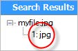

Regular Expressions
--------------------

### Objectives

This chapter takes you on an organized tour of the regular expressions syntax, showing you
how to recognize complex string patterns and extract the portions you need. Then you'll
see how the RegExp object consumes regular expressions in JavaScript code.

### Regular Expressions Primer

The indexOf() method can find a substring within a string, no issue. Its analogous to asking
someone, "who's that guy over there?". Now if you ask "who is the guy walking north
wearing a yellow or orange hat, ahead of a woman with a red dress, but only if she doesn't
wear a watch", simple matching won't do. You need a bigger hammer.
Enter regular expressions. Regular expressions describe patterns in text for the purpose of
searching, parsing and validating. Regular expressions are implemented in most modern
languages including JavaScript, C#, Java and PHP.
The simplest, and least useful, regular expression is a hard-coded string. Given the text:

```
Yeti, Sasquatch, and Yowie are all names for the mythical Bigfoot
```

...the regular expression "bigfoot" will match the last word in this string. The regular
expression engine starts from the left, moving character-by-character through the string
until it finds "B". Once there's a match, the next character in the regular expression is tested
against the string, matching the "i", and so on until all the characters are matched. The
Expresso Regex Analyzer shows the character-by-character breakdown of the match.


The meta characters, [ \ ^ $ . | ? * + ( ), have special meaning in regular expressions. For
example, the dot "." can be used in place of any character. The star "*" is a quantifier that
allows "any number of repetitions" of a character. Used together, the regular expression "b.
*t" matches "Bigfoot". The Regex Analyzer shows the new breakdown where "b" is
followed by any number of any characters and finally ending in "t".


### Quantifiers

The quantifier meta-characters follow the character or expression they describe. The
quantifiers are listed here:
| Symbol | Description|
|---|---|
| * | The star matches zero or more characters in the preceding expression."bi*gfoot" matches strings "Bgfoot", "Bigfoot", "Biigfoot", etc.
| + | The plus matches one or more characters in the preceding expression. "bi+gfoot" matches strings "Bigfoot", "Biigfoot", etc., but doesn't match "Bgfoot".|
| {n} | Allow exactly n repetitions of the preceding expression. "bi{2}gfoot" only matches "Biigfoot".|
| {n,m} | Allow between n and m repetitions of the preceding expression. "bi{1,2} gfoot" matches "Bigfoot" and "Biigfoot".|
| {n,} | Allow at least n repetitions of the preceding expression. "bi{1,}gfoot" |matches "Bigfoot", "Biigfoot", "Biiigfoot", Biiiigfoot", and so on.
| ? | Used by itself means "optional", i.e. zero or one repetition. "bi?gfoot" matches "Bgfoot" and "Bigfoot".|
| ? | Following a quantifier indicates a non-greedy match. See "Greed", following.|

### Greed

Let's challenge the strength of the expression "b.*t" against a new string:
```
The mythical Bigfoot makes a bit of a blot on the landscape.
```

You might expect the expression "b.*t" to match "Bigfoot", "bit" and "blot. The expression
actually returns "Bigfoot makes a bit of a blot on t". Not what we expected, but entirely
correct. We're matching "B", any number of characters and ending in "t". This is because
regular expressions are "greedy" by default and match as many characters as possible.

To make the expression "non-greedy", append "?" so that the expression reads "b.*?t".
Now the analyzer shows that we're looking for as few characters as possible so that
"Bigfoot", "bit" and "blot" are returned.


### Character Classes

Up til now we've populated expressions with literal characters or a dot "." to allow any
character. To restrict input to a subset of characters, use brackets "[ ]" to define a character
class.

Character classes are particularly handy for validation. If the user enters a manufacturer
number that should have two alpha characters followed by four numbers, e.g. "AF1234", a
regular expression can describe these requirements exactly. We could roll with the
character class "\[abcdefghijklmnopqrstuvwxyz0123456789\]" to allow any alpha and any
numeric characters. To shorten the expression, we could also define ranges using a dash "-
" character to separate the minimum and maximum values, i.e. "[a-z,0-9]".

Although the expression "[a-z,0-9]" matches the string "AF1234", unfortunately, that can
also match a string of all digits, all alpha, digits and alpha characters that are out of
position and strings longer than six characters. Quantifiers solve the problem by defining
the expression more exactly. In the example expression, two alpha characters are followed
by four numeric characters.
| Expression | Matches | Does Not Match|
|---|---|---|
| \[a-z\]{2}\[0-9\]{4} | "AF1234" | "AFABCD", "123456", "12ABCD"|

### Anchors

The pattern "[a-z]{2}[0-9]{4}" was satisfied with "AF1234", but will also match
"junkAF1234other garbage". The expression should exclude everything but the
manufacturer number. Anchors verify that nothing comes before or after a particular
pattern.

The carat "^" is an "anchor" to the beginning of the string. The expression will not match if
it finds anything before the string. The dollar sign "$" anchors to the end of the string. The
expression will not match if it finds anything after the string. Enclosing the expression with
a pair of anchors guarantees that input is not buried inside of other data. The expression
matches the pattern of interest and nothing else.
| Expression | Matches | Does Not Match|
|---|---|---|
| ^\[a-z\]{2}\[0-9\]{4}$ | "AF1234", "ZD7654", "AA1111" | "AFABCD", "123456", "12ABCD", "junkAF1234other garbage"|

You can also anchor the start and end of a word using "\b" to perform "whole word"
matches. Looking for Bigfoot again with the literal expression "Bigfoot", returns an
unwanted match if the search target is embedded in other text. Surround the expression
with "\b" to restrict matches where "Bigfoot" stands on its own.
| Expression | Matches|
|---|---|
|Bigfoot | "The mythicalBigfootlives in the forest."|
| \bBigfoot\b |"The mythical Bigfoot lives in the forest."|

### Negation

The "^" character is an anchor when used outside a character set. Inside a character set, "^
" is used to negate the set of characters. For example "[^0-9]" means "any character that
is not a digit". The example below uses "^" to anchor the expression to the start of the
line, then uses "^" inside the character sets to negate the set. Now the expression matches
two non-alpha characters followed by four non-numeric characters.

|Expression |Matches |Does Not Match|
|---|---|---|
|^\[^a-z\]{2}\[^0-9\]{4}$ |"12ABCD", "11AAAA", "12 BCD", "9%#A!!"|"AF1234", "AA1111", "A%#9!!"|

### Character Set Shorthand

The characters \d, \w, \s are shorthand for digit, word and whitespace, respectively. The
negated versions are \D, \W, \S. For example, the expression "\w*\s*\d*,\s*\w*\s*\d*\.\d*"
matches these two strings:
```
"Quantity 1, Price 23.21",
"Quantity 77, Price 99.0"
```

Here is a breakdown of of the example expression using the Regex Analyzer from
Expresso.


More examples:

|Expression |Matches |Does Not Match|
|---|---|---|
|\D |Matches "AF " in "AF 1234"| "1234"|
|\W |Matches the space in "AF 1234"|"AF1234"
|\S |Matches everything but the space in "AF 1234"| " ", i.e. a space|

### Escape Characters

The characters \n, \r, \t, \a, \e, \f and \v match line feed, carriage return, tab, bell, escape,
form feed, vertical tab, respectively. The backslash "\" also escapes any meta-character to
make a literal. For example, an IP address has digits separated by a literal dot "." character:
The expression ".*\n.*" matches a new line surrounded by any number of any characters:

```
"This is line one.
This is line two."
```

. . .but does not match text that appears all on one line.

```
"This is line one.This is line two."
```

Here's another example expression that escapes a dot "." used to separate four sets of
digits:

```
^[0-9]{3}\.[0-9]{3}\.[0-9]{3}\.[0-9]{3}$
```

The expression matches valid IP addresses "000.000.000.000" or "127.000.000.001", but does
not match "123-234-345-456" or "123456789789".

### Choices

Now that you can describe some chunk of text with regular expressions, you may have
more complex scenarios that require choosing between multiple options. The pipe "|"
symbol separates alternatives.

|Expression |Matches |Does Not Match|
|---|---|---|
|^Visa$ | ^Amex$ | ^Mastercard$ |"Visa", "Amex" or "Mastercard"| "American Express", "MastrCard"|

### Groups and Captures

Surrounding parts of an expression with parenthesis "( )" creates a group. Groups are
treated as complete entities that can be quantified, referenced in other parts of the
expression and results captured.
The expression below accepts any number of characters followed by a literal dot "." and
finally the group that happens to contain a set of choices.

|Expression |Matches|
|---|---|
|.*\.(jpg|png|gif) |"myfile.jpg"|

By default, group results are captured. The example expression brings back the match
"myfile.jpg" as a whole and the group with just the file extension "jpg". The capture is
numbered and can be referred to by position.



Groups can be nested so that "(.*\.(jpg|png|gif))" returns a capture group for the entire
file name in position #1 and just the file extension in position #2.


Use characters \1 through \9 to reference numbered groups. The diagrammed expression
below shows three numbered groups where "\1" refers back to the first group. The first two
groups define an image file name and a file extension. The third group looks for a comma,
allows any amount of whitespace and finally reuses group #1. The star following group #3
allows the expression to match any number of comma delimited file names..


The expression analysis shows the three numbered capture groups and the backreference
to the capture #1.


Groups can be named for better readability and easier maintenance. The syntax is ``` "(?<myname>)" ```. Refer to a named capture group using ``` "\k<myname>" ```. The examples
below use numbered and named capture groups respectively and produce the same
results.

|Expression|
|---|
```|^[^\/*?"<>|]+\.(jpg|png|gif)\s*(,\s*\1)*$|```
``` |^(?<Filename>[^\/*?"<>|]+\.(?<Extension>jpg|png|gif))\s*(,\s*\k<Filename>)*$|```

Both of these examples match "myfile.jpg" or "myfile.jpg, myfile2.png, myfile3.gif",
capturing both the file names and file extensions. The same expressions do not match
"myfilepng,myfile2jpg" and "myfile.doc, myfile.xls".

### Regular Expressions in JavaScript

In JavaScript, you can use the RegExp object test() method to determine if a pattern exists
in a particular text string. The example below creates the simplest type of regular
expression that matches the literal "Bigfoot" against a string that is also "Bigfoot".

```javascript
var myString = "Bigfoot",
expression = new RegExp("Bigfoot"),
foundBigfoot = expression.test(myString); // true
```

The preferred declaration syntax is to use literal notation, bounded by forward slashes "/".
You can assign the regular expression literal to a variable or call the test() method directly
from it.

```javascript
var myString = "Bigfoot",
expression = /Bigfoot/,
foundBigfoot;
foundBigfoot = expression.test(myString); // true
//... or
foundBigfoot = /Bigfoot/.test(myString); // true
```

### Summary

This chapter took you on an organized tour of the regular expressions syntax, showing you
how to recognize complex string patterns and extract the portions you need. Then the
RegExp object consumed these expressions in JavaScript code.